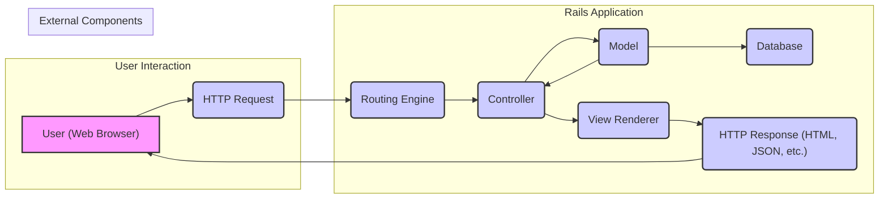
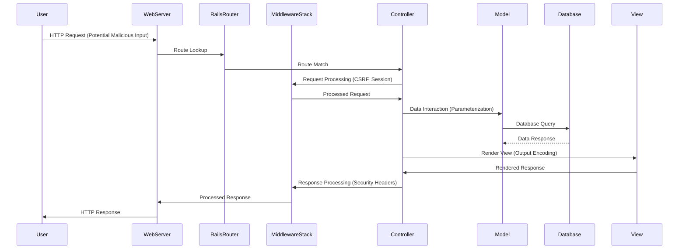

# Project Design Document: Ruby on Rails Framework

**Version:** 2.0
**Date:** October 26, 2023
**Author:** AI Software Architect

## 1. Introduction

This document provides an enhanced high-level architectural design of the Ruby on Rails framework, building upon the previous version. It aims to provide a more detailed understanding of the framework's structure, key components, and data flow, explicitly focusing on aspects relevant to threat modeling activities. This document continues to focus on the core framework aspects as represented in the `rails/rails` GitHub repository.

## 2. Goals

*   Clearly outline the major components and their interactions within the Rails framework, with a greater emphasis on security boundaries and data handling.
*   Describe the typical data flow within a Rails application in more detail, highlighting potential points of vulnerability.
*   Identify key areas and components that are particularly relevant for security considerations, providing more specific examples.
*   Provide visual representations of the architecture and data flow with enhanced clarity.

## 3. Scope

This document covers the core architectural components of the Ruby on Rails framework with a focus on security implications. It includes:

*   The Model-View-Controller (MVC) architectural pattern and its security ramifications.
*   Key subsystems like Action Pack (with emphasis on routing and middleware), Active Record (focusing on data access), Active Support, Action Mailer, Action Cable, and Active Job.
*   A detailed breakdown of the request lifecycle and the role of middleware.
*   The routing mechanism and its potential for misuse.
*   The asset pipeline and its security considerations.
*   Interaction with web servers, databases, and external services.

This document does not cover:

*   Specific application code built using Rails, except where it illustrates framework behavior.
*   Detailed implementation of individual gems within the broader Rails ecosystem (unless they are core Rails components with significant security implications).
*   In-depth deployment strategies, but will touch upon deployment-related security concerns.

## 4. Architectural Overview

The Ruby on Rails framework adheres to the Model-View-Controller (MVC) architectural pattern, which inherently creates separation of concerns but also introduces specific areas for security focus.

*   **Model:** Manages data and business logic, interacting with the database. Security concerns include data integrity, access control, and preventing injection vulnerabilities.
*   **View:** Presents data to the user. The primary security concern here is preventing Cross-Site Scripting (XSS) attacks by ensuring proper output encoding.
*   **Controller:** Handles user requests and orchestrates interactions between Models and Views. Controllers are crucial for authorization, input validation, and preventing mass assignment vulnerabilities.

## 5. Key Components

The Rails framework's security posture is influenced by the design and implementation of its core subsystems:

*   **Action Pack:** The heart of request handling, presenting several areas for security consideration:
    *   **Routing Engine:** Maps URLs to controllers. Misconfigurations can lead to unintended access or denial of service. Security concerns include route constraints, wildcard routes, and the order of routes.
    *   **Controllers:** Handle application logic. They are responsible for:
        *   **Authentication and Authorization:** Ensuring only authorized users can access specific actions.
        *   **Input Validation:** Sanitizing and validating user input to prevent injection attacks.
        *   **Parameter Handling:** Protecting against mass assignment vulnerabilities by carefully controlling which attributes can be updated.
    *   **Middleware Stack:** A series of interceptors that process requests and responses. Crucial for security features like:
        *   **Session Management:** Securely managing user sessions (e.g., using secure cookies, preventing session fixation).
        *   **CSRF Protection:** Protecting against Cross-Site Request Forgery attacks.
        *   **Content Security Policy (CSP):**  Controlling the resources the browser is allowed to load.
        *   **HTTP Strict Transport Security (HSTS):** Enforcing secure connections over HTTPS.
    *   **View Rendering:** Responsible for generating the user interface. Key security considerations include:
        *   **Output Encoding:** Properly escaping user-provided data to prevent XSS attacks. Rails provides helpers for this.

*   **Active Record:** The ORM layer, critical for data security:
    *   **Models:** Represent database tables. Security concerns revolve around:
        *   **SQL Injection:**  Preventing the execution of malicious SQL queries through parameterized queries and avoiding raw SQL where possible.
        *   **Mass Assignment Protection:**  Controlling which model attributes can be set during object creation or update.
        *   **Data Validation:** Enforcing data integrity rules at the model level.
    *   **Database Migrations:** While primarily for schema management, migrations should be reviewed for potential security implications (e.g., default values, data types).

*   **Active Support:** Provides utilities, some with security relevance:
    *   **Cryptographic Features:**  Used for secure password hashing (e.g., `has_secure_password`) and message signing/encryption. Proper key management is crucial.
    *   **Time Zone Handling:** While not directly a vulnerability, incorrect time zone handling can sometimes lead to subtle security issues in scheduling or logging.

*   **Action Mailer:** For sending emails. Security considerations include:
    *   **Preventing Email Injection:**  Sanitizing email headers and bodies to avoid malicious content.
    *   **Secure Delivery:** Configuring secure SMTP settings (e.g., TLS).

*   **Action Cable:** Enables real-time features. Security considerations include:
    *   **Authentication and Authorization:** Ensuring only authorized users can subscribe to channels and broadcast messages.
    *   **Data Sanitization:**  Sanitizing data broadcasted through WebSockets to prevent XSS in real-time updates.

*   **Active Job:** For background tasks. Security considerations include:
    *   **Secure Job Processing:** Ensuring background jobs do not inadvertently expose sensitive data or perform unauthorized actions.
    *   **Input Validation:** Validating data passed to background jobs.

*   **Asset Pipeline:** Manages static assets. Security considerations include:
    *   **Serving Static Files Securely:** Ensuring proper permissions and preventing access to sensitive files.
    *   **Dependency Vulnerabilities:**  Vulnerabilities in asset preprocessors or libraries used by the asset pipeline.

## 6. Data Flow with Security Focus

A detailed look at the data flow highlights potential interception points and areas where security controls are essential:

1. **User Initiates Request:** A user action triggers an HTTP request. This is the first point where malicious input can be introduced.
2. **Web Server Receives Request:** The web server (e.g., Puma, Nginx) receives the request. Web server configuration (e.g., TLS, header settings) plays a crucial role in initial security.
3. **Routing Engine:** The Rails router matches the URL to a controller action. Incorrect routing can bypass security checks.
4. **Middleware Stack Processing:** The request passes through the middleware stack. This is where many built-in Rails security features are applied (e.g., CSRF token verification, session handling). Custom middleware can also be added for specific security needs.
5. **Controller Action Invoked:** The appropriate controller action is executed. This is where authentication, authorization, and input validation should occur.
6. **Model Interaction:** The controller interacts with the Model. Secure data access practices (parameterized queries) are vital here to prevent SQL injection.
7. **Database Query:** The Model queries the database. Database security (access controls, encryption) is also a critical factor.
8. **View Rendering:** The controller passes data to the View. Proper output encoding in the View prevents XSS.
9. **Middleware Stack (Response):** The response passes back through the middleware stack, allowing for final modifications (e.g., setting security headers).
10. **Web Server Sends Response:** The web server sends the response back to the user.
11. **User Receives Response:** The user's browser renders the response. Browser security mechanisms (e.g., CSP enforcement) also play a role.

## 7. Security Considerations for Threat Modeling

When threat modeling a Rails application, consider the following areas in detail:

*   **Input Validation and Sanitization:** Where does user input enter the system? Are there adequate validation and sanitization mechanisms in place at each entry point (controllers, models)?
*   **Authentication and Authorization:** How are users authenticated? How is access to resources controlled? Are there vulnerabilities in the authentication or authorization logic?
*   **Cross-Site Scripting (XSS):** Are all user-provided data points properly encoded in the views to prevent XSS attacks? Are appropriate CSP headers in place?
*   **Cross-Site Request Forgery (CSRF):** Is CSRF protection enabled and correctly implemented?
*   **SQL Injection:** Are parameterized queries consistently used when interacting with the database? Are there any instances of raw SQL queries using user input?
*   **Mass Assignment:** Are strong parameter filters in place to prevent users from modifying unintended model attributes?
*   **Session Management:** Are sessions handled securely? Are session cookies secure and HTTP-only? Is there protection against session fixation and hijacking?
*   **Dependency Vulnerabilities:** Are all gems up-to-date and free from known vulnerabilities? Is there a process for monitoring and updating dependencies?
*   **Secrets Management:** How are API keys, database credentials, and other secrets stored and managed? Are they exposed in the codebase or configuration files?
*   **File Uploads:** If the application handles file uploads, are there proper checks to prevent malicious file uploads?
*   **Error Handling and Logging:** Does the application expose sensitive information in error messages or logs? Is logging sufficient for security auditing?
*   **Insecure Deserialization:** If the application uses deserialization, is it protected against insecure deserialization vulnerabilities?
*   **Denial of Service (DoS):** Are there potential points where an attacker could overwhelm the application with requests? Are there rate limiting or other protective measures in place?

## 8. Deployment Security Considerations

The security of a Rails application is also heavily influenced by its deployment environment:

*   **Web Server Configuration:** Ensure the web server (e.g., Nginx, Apache) is configured securely, including TLS/SSL configuration, header settings (e.g., HSTS), and access controls.
*   **Operating System Security:** Keep the underlying operating system and its components updated with security patches.
*   **Container Security (if using Docker):** Secure the Docker images and containers. Follow best practices for container security.
*   **Platform-as-a-Service (PaaS) Security:** Understand the security responsibilities shared with the PaaS provider. Configure the PaaS environment securely.
*   **Network Security:** Implement appropriate network security measures (firewalls, intrusion detection/prevention systems).
*   **Database Security:** Secure the database server, including access controls, encryption at rest and in transit, and regular backups.

## 9. Assumptions and Constraints

*   This document assumes a foundational understanding of web application security principles.
*   The primary focus remains on the core Rails framework as found in the `rails/rails` repository.
*   The security considerations are general and may need to be tailored based on the specific application built using Rails.

## 10. Future Considerations

Future enhancements to this document could include:

*   More granular diagrams illustrating the internal workings of specific subsystems like the middleware stack or the routing engine.
*   Detailed examples of common attack vectors against Rails applications and how the framework mitigates them (or fails to).
*   Integration with specific threat modeling methodologies (e.g., STRIDE, PASTA).
*   Guidance on using security scanning tools and their relevance to the Rails architecture.
*   A section on security testing practices for Rails applications.

This enhanced design document provides a more detailed and security-focused view of the Ruby on Rails framework, making it a more effective resource for threat modeling activities.
