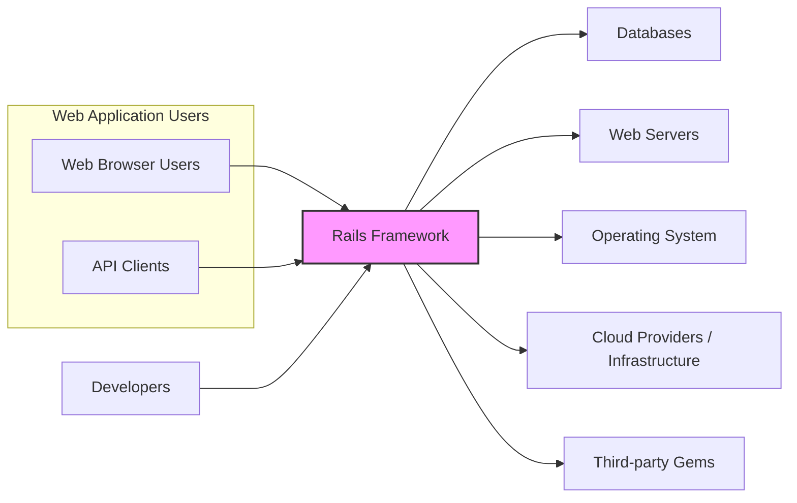
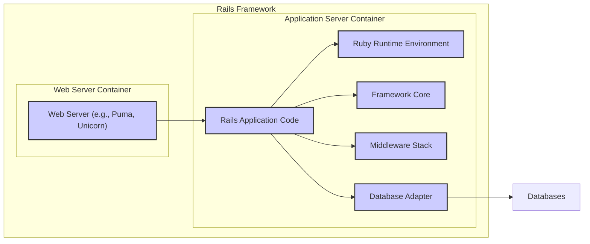
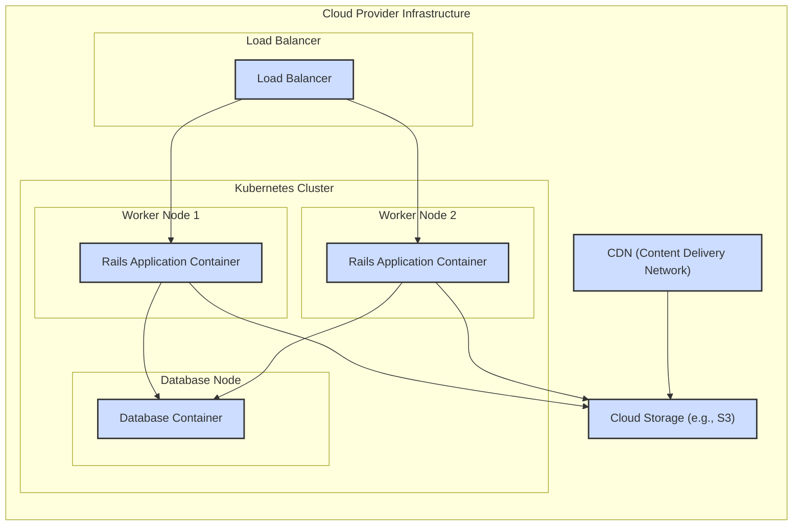

# BUSINESS POSTURE

The Rails framework is an open-source web application framework written in Ruby. Its primary business goal is to enable developers to build web applications quickly and efficiently by providing conventions and tools that simplify common web development tasks.

- Business Priorities:
  - Developer productivity and efficiency.
  - Rapid application development and prototyping.
  - Maintainability and scalability of web applications.
  - A large and active community for support and contributions.
  - Stability and reliability of the framework.
  - Broad applicability across various web application domains.

- Business Risks:
  - Security vulnerabilities in the framework could lead to widespread application security issues.
  - Lack of community support or decline in activity could hinder adoption and maintenance.
  - Performance bottlenecks in the framework could limit scalability for high-traffic applications.
  - Compatibility issues with evolving web technologies and standards.
  - Competition from other web frameworks could reduce market share and adoption.

# SECURITY POSTURE

- Security Controls:
  - security control: Regular security audits and vulnerability scanning of the Rails framework (described in Rails security policy and release notes).
  - security control: Active community and dedicated security team for reporting and patching vulnerabilities (described in Rails security policy).
  - security control: Built-in security features like CSRF protection, SQL injection prevention, and protection against mass assignment vulnerabilities (documented in Rails security guide).
  - security control: Secure defaults for common configurations (e.g., cookie security settings, session management).
  - security control: Encouragement of secure coding practices through documentation and community guidelines (Rails documentation and best practices guides).
  - security control: Dependency management using Bundler to track and manage gem dependencies, including security updates (Bundler documentation).
  - security control: Automated testing framework to ensure code quality and identify potential vulnerabilities (Rails testing framework documentation).

- Accepted Risks:
  - accepted risk: Reliance on third-party gems introduces potential supply chain vulnerabilities.
  - accepted risk: Misconfiguration or misuse of Rails features by developers can lead to security weaknesses in applications.
  - accepted risk: Open-source nature means vulnerabilities are publicly disclosed, potentially increasing the window for exploitation before patches are widely applied.
  - accepted risk: Rapid development cycles and feature additions may introduce new, unforeseen security vulnerabilities.

- Recommended Security Controls:
  - security control: Implement static application security testing (SAST) tools in the Rails development and CI/CD pipeline to automatically detect potential vulnerabilities in the framework code.
  - security control: Integrate dependency vulnerability scanning tools to proactively identify and manage vulnerabilities in third-party gems used by Rails.
  - security control: Enhance security awareness training for Rails developers and contributors, focusing on common web application vulnerabilities and secure coding practices specific to Rails.
  - security control: Establish a bug bounty program to incentivize external security researchers to find and report vulnerabilities in Rails.

- Security Requirements:
  - Authentication:
    - Requirement: Rails applications should provide mechanisms for secure user authentication.
    - Requirement: Rails framework should not impose specific authentication methods but provide flexibility for developers to integrate various authentication strategies (e.g., username/password, OAuth, SAML).
    - Requirement: Rails should offer secure session management to maintain user authentication state.
  - Authorization:
    - Requirement: Rails applications should implement robust authorization mechanisms to control access to resources and functionalities based on user roles and permissions.
    - Requirement: Rails framework should provide tools and patterns for defining and enforcing authorization rules (e.g., policy objects, role-based access control).
    - Requirement: Authorization decisions should be consistently applied across the application.
  - Input Validation:
    - Requirement: Rails applications must validate all user inputs to prevent injection attacks (e.g., SQL injection, cross-site scripting).
    - Requirement: Rails framework should provide built-in validation helpers and mechanisms to simplify input validation.
    - Requirement: Input validation should be performed on both client-side and server-side.
  - Cryptography:
    - Requirement: Rails applications should use cryptography appropriately to protect sensitive data in transit and at rest.
    - Requirement: Rails framework should provide secure cryptographic libraries and helpers for common tasks like password hashing, encryption, and digital signatures.
    - Requirement: Cryptographic keys should be managed securely and protected from unauthorized access.

# DESIGN

## C4 CONTEXT

- Context Diagram Elements:
  - - Name: Web Browser Users
    - Type: Person
    - Description: End-users accessing web applications built with Rails through web browsers.
    - Responsibilities: Interacting with the web application's user interface to perform tasks and access information.
    - Security controls: Browser-based security features (e.g., Content Security Policy, Same-Origin Policy), user authentication (handled by the Rails application).
  - - Name: API Clients
    - Type: System
    - Description: External systems or applications that interact with Rails applications through APIs (e.g., mobile apps, other web services).
    - Responsibilities: Consuming APIs provided by Rails applications to exchange data and trigger actions.
    - Security controls: API authentication and authorization mechanisms (e.g., API keys, OAuth), input validation, rate limiting.
  - - Name: Rails Framework
    - Type: Software System
    - Description: The Ruby on Rails web application framework, providing the foundation for building web applications.
    - Responsibilities: Handling HTTP requests, routing, business logic execution, database interaction, rendering views, and providing security features.
    - Security controls: Built-in security features (CSRF protection, SQL injection prevention), secure defaults, security vulnerability patching process, SAST and dependency scanning in development.
  - - Name: Databases
    - Type: External System
    - Description: Database systems (e.g., PostgreSQL, MySQL, SQLite) used by Rails applications to store and retrieve data.
    - Responsibilities: Persisting application data, ensuring data integrity and availability.
    - Security controls: Database access controls, encryption at rest and in transit, database auditing, regular security updates.
  - - Name: Web Servers
    - Type: External System
    - Description: Web servers (e.g., Nginx, Apache) that serve Rails applications and handle HTTP requests.
    - Responsibilities: Accepting HTTP requests, routing requests to the Rails application server, serving static assets, handling SSL/TLS termination.
    - Security controls: Web server configuration security (e.g., disabling unnecessary modules, setting appropriate permissions), SSL/TLS configuration, DDoS protection.
  - - Name: Operating System
    - Type: External System
    - Description: Operating system (e.g., Linux, macOS, Windows) on which the Rails framework and applications are deployed.
    - Responsibilities: Providing the runtime environment for Rails and its dependencies, managing system resources.
    - Security controls: Operating system hardening, access controls, security patching, intrusion detection systems.
  - - Name: Cloud Providers / Infrastructure
    - Type: External System
    - Description: Cloud platforms (e.g., AWS, Azure, GCP) or on-premise infrastructure that host the Rails application and its dependencies.
    - Responsibilities: Providing infrastructure resources (servers, networking, storage), managing infrastructure security.
    - Security controls: Cloud provider security controls (e.g., firewalls, IAM, security groups), infrastructure security hardening, vulnerability management.
  - - Name: Third-party Gems
    - Type: External System
    - Description: Ruby Gems (libraries) used by Rails applications to extend functionality and simplify development.
    - Responsibilities: Providing reusable code and functionalities to Rails applications.
    - Security controls: Dependency vulnerability scanning, security audits of commonly used gems, community review and reporting of gem vulnerabilities.
  - - Name: Developers
    - Type: Person
    - Description: Software developers who build and maintain Rails applications and contribute to the Rails framework itself.
    - Responsibilities: Writing code, designing application architecture, testing, deploying, and maintaining Rails applications and the framework.
    - Security controls: Secure coding practices, code reviews, access control to code repositories, security training.

## C4 CONTAINER

- Container Diagram Elements:
  - - Name: Web Server (e.g., Puma, Unicorn)
    - Type: Container
    - Description: Application server responsible for handling incoming HTTP requests and managing Rails application processes.
    - Responsibilities: Accepting HTTP requests, routing requests to Rails application code, managing application processes, serving static assets.
    - Security controls: Web server configuration security, process isolation, resource limits, logging and monitoring.
  - - Name: Rails Application Code
    - Type: Container
    - Description: The codebase of a specific web application built using the Rails framework, including models, views, controllers, and application-specific logic.
    - Responsibilities: Implementing application business logic, handling user requests, interacting with databases, rendering views.
    - Security controls: Secure coding practices, input validation, authorization logic, output encoding, vulnerability scanning (SAST), code reviews.
  - - Name: Ruby Runtime Environment
    - Type: Container
    - Description: The Ruby interpreter and runtime environment required to execute Rails application code.
    - Responsibilities: Executing Ruby code, managing memory, providing core Ruby libraries.
    - Security controls: Ruby runtime security updates, secure configuration, process isolation.
  - - Name: Framework Core
    - Type: Container
    - Description: The core components of the Rails framework itself, providing fundamental functionalities and abstractions.
    - Responsibilities: Routing, request handling, ORM (Active Record), templating (Action View), controller framework (Action Controller), and other core features.
    - Security controls: Built-in security features, secure defaults, regular security audits and patching, SAST and dependency scanning in framework development.
  - - Name: Middleware Stack
    - Type: Container
    - Description: A series of middleware components that process HTTP requests before they reach the Rails application and after they are processed.
    - Responsibilities: Handling cross-cutting concerns like logging, authentication, session management, request parsing, and security features (e.g., CSRF protection).
    - Security controls: Secure configuration of middleware components, vulnerability scanning of middleware dependencies, custom security middleware implementation.
  - - Name: Database Adapter
    - Type: Container
    - Description: A library that provides an interface between the Rails application and a specific database system.
    - Responsibilities: Translating database-agnostic queries from Active Record into database-specific SQL, managing database connections.
    - Security controls: Secure database connection configuration, input sanitization to prevent SQL injection, database adapter security updates.
  - - Name: Databases
    - Type: Container
    - Description: Database systems used by the Rails application to store and retrieve data.
    - Responsibilities: Persisting application data, ensuring data integrity and availability.
    - Security controls: Database access controls, encryption at rest and in transit, database auditing, regular security updates.

## DEPLOYMENT

Deployment Solution: Cloud-based Deployment using Containerization (e.g., Docker, Kubernetes) on a Cloud Provider (e.g., AWS, GCP, Azure).

- Deployment Diagram Elements:
  - - Name: Load Balancer
    - Type: Infrastructure
    - Description: Distributes incoming traffic across multiple instances of the Rails application containers for scalability and high availability.
    - Responsibilities: Traffic distribution, health checks, SSL/TLS termination, DDoS protection.
    - Security controls: Load balancer security configuration, SSL/TLS certificate management, rate limiting, WAF (Web Application Firewall) integration.
  - - Name: Rails Application Container
    - Type: Container
    - Description: Docker container packaging the Rails application code, Ruby runtime, and necessary dependencies.
    - Responsibilities: Running the Rails application, handling HTTP requests, processing business logic.
    - Security controls: Container image security scanning, least privilege container execution, resource limits, network policies, application-level security controls.
  - - Name: Database Container
    - Type: Container
    - Description: Docker container running a database system (e.g., PostgreSQL, MySQL) used by the Rails application.
    - Responsibilities: Persisting application data, managing database connections, ensuring data integrity and availability.
    - Security controls: Database container image security scanning, database access controls, encryption at rest and in transit, database container hardening, regular security updates.
  - - Name: Cloud Storage (e.g., S3)
    - Type: Infrastructure
    - Description: Cloud-based object storage service for storing static assets, user uploads, and other files.
    - Responsibilities: Storing and serving static files, providing scalable and durable storage.
    - Security controls: Access control policies (IAM), encryption at rest, bucket policies, CDN integration for secure content delivery.
  - - Name: CDN (Content Delivery Network)
    - Type: Infrastructure
    - Description: Content Delivery Network to cache and serve static assets closer to users, improving performance and reducing load on the application servers.
    - Responsibilities: Caching and delivering static content, improving website performance, providing DDoS protection for static assets.
    - Security controls: CDN security configuration, SSL/TLS for content delivery, access controls, origin protection.

## BUILD

```mermaid
graph LR
    A["Developer"] --> B["Code Repository (e.g., GitHub)"]
    B --> C["CI/CD Pipeline (e.g., GitHub Actions)"]
    C --> D["Build Environment"]
    D --> E["Security Scanners (SAST, Dependency)"]
    E --> F["Build Artifacts (Docker Image, Gems)"]
    F --> G["Container Registry / Gem Server"]

    style B fill:#efe,stroke:#333,stroke-width:2px
    style C fill:#efe,stroke:#333,stroke-width:2px
    style D fill:#efe,stroke:#333,stroke-width:2px
    style E fill:#efe,stroke:#333,stroke-width:2px
    style F fill:#efe,stroke:#333,stroke-width:2px
    style G fill:#efe,stroke:#333,stroke-width:2px
```

- Build Process Elements:
  - - Name: Developer
    - Type: Person
    - Description: Software developer writing and committing code changes to the Rails framework or applications.
    - Responsibilities: Writing code, performing local testing, committing code changes.
    - Security controls: Secure development environment, code signing (optional), access control to code repository.
  - - Name: Code Repository (e.g., GitHub)
    - Type: System
    - Description: Version control system used to store and manage the source code of the Rails framework and applications.
    - Responsibilities: Source code management, version control, collaboration, code review.
    - Security controls: Access control (authentication and authorization), branch protection, audit logging, vulnerability scanning of repository settings.
  - - Name: CI/CD Pipeline (e.g., GitHub Actions)
    - Type: System
    - Description: Automated CI/CD pipeline that builds, tests, and deploys the Rails framework and applications.
    - Responsibilities: Automated build process, running tests, performing security scans, creating build artifacts, deploying to environments.
    - Security controls: Secure CI/CD pipeline configuration, access control to pipeline configuration, secret management, audit logging, pipeline integrity checks.
  - - Name: Build Environment
    - Type: System
    - Description: Environment where the build process is executed, including build tools, dependencies, and configurations.
    - Responsibilities: Compiling code, packaging artifacts, running tests, executing security scans.
    - Security controls: Secure build environment hardening, access control, isolated build environment, dependency management, build process integrity checks.
  - - Name: Security Scanners (SAST, Dependency)
    - Type: System
    - Description: Automated security scanning tools integrated into the CI/CD pipeline to detect vulnerabilities in the code and dependencies.
    - Responsibilities: Static Application Security Testing (SAST), dependency vulnerability scanning, reporting security findings.
    - Security controls: Regularly updated scanner rules and databases, secure scanner configuration, vulnerability reporting and tracking.
  - - Name: Build Artifacts (Docker Image, Gems)
    - Type: Data
    - Description: Output of the build process, including deployable artifacts like Docker images and Ruby Gems.
    - Responsibilities: Packaging application code and dependencies for deployment.
    - Security controls: Artifact signing, artifact integrity checks, vulnerability scanning of artifacts before publishing.
  - - Name: Container Registry / Gem Server
    - Type: System
    - Description: Repository for storing and distributing build artifacts like Docker images and Ruby Gems.
    - Responsibilities: Storing and serving build artifacts, managing artifact versions, access control to artifacts.
    - Security controls: Access control (authentication and authorization), artifact signing verification, vulnerability scanning of stored artifacts, secure registry configuration.

# RISK ASSESSMENT

- Critical Business Processes:
  - Serving web application content and functionalities to users.
  - Processing user requests and data.
  - Managing user sessions and authentication.
  - Interacting with databases to store and retrieve data.
  - Providing APIs for external systems to interact with applications.

- Data to Protect and Sensitivity:
  - User data (e.g., personal information, credentials, session data): High sensitivity - requires confidentiality, integrity, and availability.
  - Application data (e.g., business data, transactional data): Sensitivity depends on the application domain - may require confidentiality, integrity, and availability.
  - Source code: Medium sensitivity - requires integrity and confidentiality to prevent unauthorized modifications and disclosure.
  - Configuration data: Medium to High sensitivity - requires confidentiality and integrity to prevent unauthorized access and modifications.
  - Logs: Low to Medium sensitivity - requires integrity and availability for auditing and incident response.

# QUESTIONS & ASSUMPTIONS

- Questions:
  - What is the specific type of application being built with Rails? (e.g., e-commerce, social media, SaaS) - This would help to refine the risk assessment and security requirements.
  - What are the specific compliance requirements for applications built with Rails? (e.g., GDPR, PCI DSS, HIPAA) - This would influence the required security controls.
  - What is the organization's risk appetite regarding security vulnerabilities in the Rails framework and applications? - This would help prioritize security controls and risk mitigation strategies.

- Assumptions:
  - Rails framework is used to build general-purpose web applications.
  - Security is a high priority for applications built with Rails.
  - Applications built with Rails handle sensitive user and application data.
  - Deployment environment is assumed to be a cloud-based infrastructure for scalability and availability.
  - A modern CI/CD pipeline is used for building and deploying Rails applications, incorporating security checks.