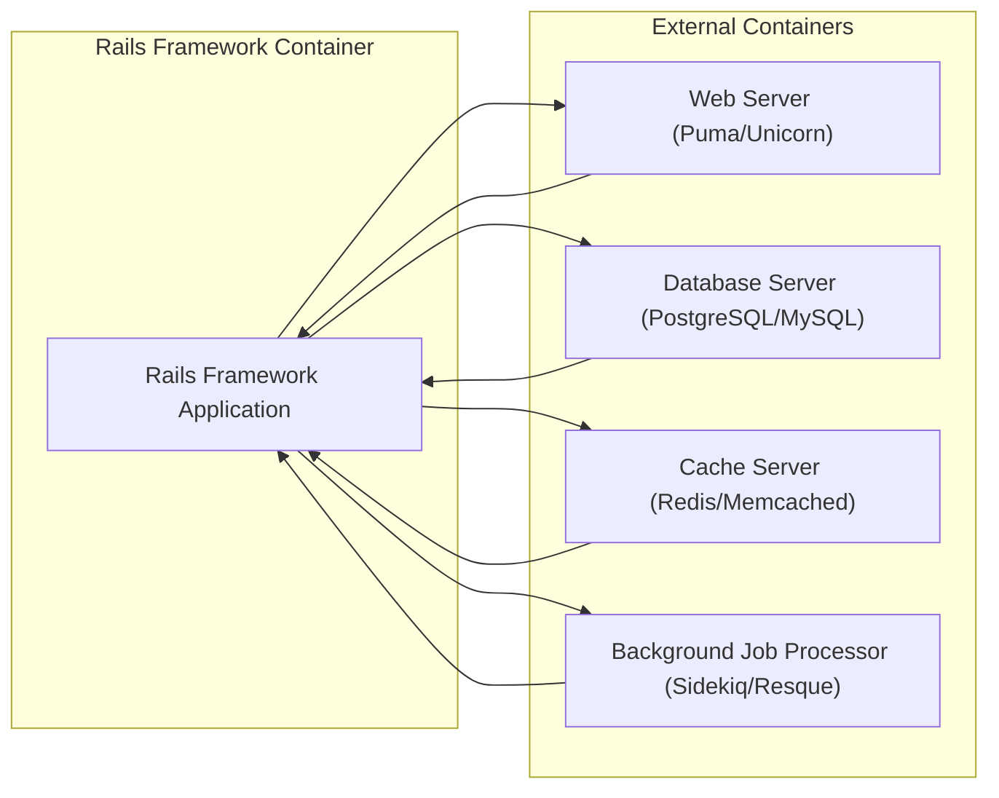
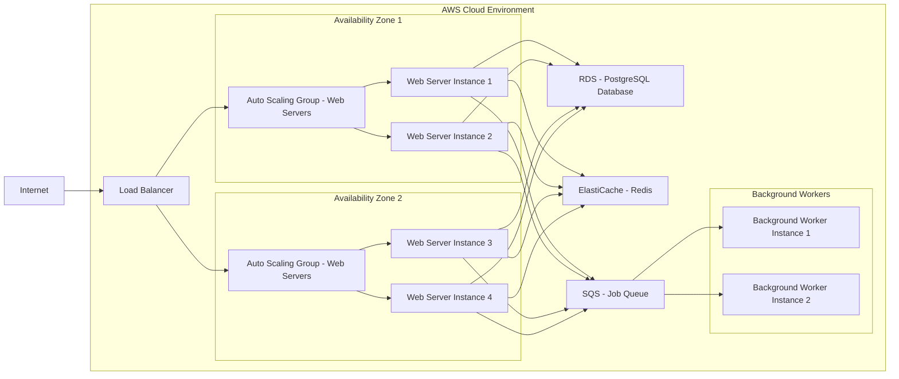

# BUSINESS POSTURE

- Business Priorities and Goals:
 - Goal: To provide a robust, flexible, and productive web application framework for developers to build and deploy web applications efficiently.
 - Priority: Developer productivity and ease of use.
 - Priority: Stability and reliability of the framework.
 - Priority: Security and maintainability of applications built with the framework.
 - Priority: Community support and extensibility.
- Business Risks:
 - Business Risk: Security vulnerabilities in the framework could lead to widespread security issues in applications built using Rails, damaging reputation and trust.
 - Business Risk: Performance bottlenecks in the framework could limit the scalability and responsiveness of applications.
 - Business Risk: Lack of adoption or developer dissatisfaction could lead to decline in the framework's relevance and community support.
 - Business Risk: Breaking changes in new versions could cause significant upgrade challenges for existing applications.

# SECURITY POSTURE

- Existing Security Controls:
 - security control: Rails framework incorporates security best practices by default, such as protection against common web vulnerabilities (e.g., CSRF, SQL injection, XSS). Described in Rails Security Guide and framework code.
 - security control: Regular security releases and patches are provided by the Rails core team. Communicated through Rails blog, security mailing lists, and GitHub release notes.
 - security control: A vulnerability reporting process is in place to allow security researchers and users to report potential issues privately. Described in Rails Security Guide and GitHub repository.
 - security control: Strong emphasis on secure defaults, encouraging developers to adopt secure coding practices. Documented in Rails guides and best practices.
- Accepted Risks:
 - accepted risk: As an open-source project, the codebase is publicly accessible, potentially allowing malicious actors to identify vulnerabilities before they are publicly disclosed and patched. Mitigation is through active community and core team security reviews and rapid patching.
 - accepted risk: Security of applications built with Rails ultimately depends on the developers using the framework securely. Rails provides tools and defaults, but misuse or misconfiguration can still lead to vulnerabilities. Mitigation is through comprehensive documentation, security guides, and community education.
- Recommended Security Controls:
 - security control: Implement automated security scanning tools (SAST, DAST, dependency scanning) in the Rails framework CI pipeline to proactively identify potential vulnerabilities.
 - security control: Consider establishing a bug bounty program to incentivize external security researchers to find and report vulnerabilities.
 - security control: Enhance security awareness training for core contributors and maintainers, focusing on secure coding practices and vulnerability management.
 - security control: Implement and enforce stricter code review processes with a security focus for all contributions to the framework.
- Security Requirements:
 - Authentication:
  - Requirement: Rails applications require robust authentication mechanisms to verify user identities. Rails provides built-in helpers and libraries (e.g., `has_secure_password`) to facilitate secure password management and session handling.
  - Requirement: Support for various authentication strategies, including username/password, multi-factor authentication, and integration with external identity providers (e.g., OAuth, SAML).
 - Authorization:
  - Requirement: Rails applications need fine-grained authorization controls to manage user access to resources and actions. Framework provides tools and patterns for implementing role-based access control (RBAC) and attribute-based access control (ABAC).
  - Requirement: Ensure consistent authorization checks are applied across the application to prevent unauthorized access to sensitive data and functionality.
 - Input Validation:
  - Requirement: All user inputs must be thoroughly validated to prevent injection attacks (e.g., SQL injection, XSS, command injection). Rails provides built-in validation helpers and encourages strong parameter filtering.
  - Requirement: Implement both client-side and server-side validation to enhance security and user experience. Server-side validation is mandatory for security.
 - Cryptography:
  - Requirement: Sensitive data at rest and in transit must be encrypted using strong cryptographic algorithms. Rails provides libraries and helpers for encryption, hashing, and secure random number generation.
  - Requirement: Proper key management practices must be implemented to protect cryptographic keys from unauthorized access.

# DESIGN

## C4 CONTEXT

```mermaid
graph LR
    subgraph "Web Application Ecosystem"
        center "Rails Framework"
        U[Web Developers]
        D[Databases]
        W[Web Servers]
        C[Cloud Providers]
        G[Gems (Dependencies)]
        B[Browsers (End Users)]
    end

    U --> center
    center --> D
    center --> W
    center --> C
    center --> G
    W --> B
```

- Context Diagram Elements:
 - Element:
  - Name: "Rails Framework"
  - Type: Software System
  - Description: Ruby on Rails is a web application framework written in Ruby. It is designed to make programming web applications easier by making assumptions about what every developer needs to get started.
  - Responsibilities: Provides the core structure, libraries, and tools for building web applications. Manages routing, database interactions, templating, and other essential web application functionalities. Enforces security best practices by default.
  - Security controls: Security controls are embedded within the framework itself, including CSRF protection, SQL injection prevention, parameter filtering, and secure session management. Security guidelines are documented in the Rails Security Guide.
 - Element:
  - Name: "Web Developers"
  - Type: Person
  - Description: Software engineers who use the Rails framework to build, deploy, and maintain web applications.
  - Responsibilities: Develop web applications using Rails, configure and deploy applications, ensure application security by following Rails security guidelines and best practices.
  - Security controls: Responsible for secure coding practices within their applications, proper configuration of Rails security features, and applying security updates. Security training and secure development lifecycle practices are relevant here.
 - Element:
  - Name: "Databases"
  - Type: External System
  - Description: Relational database management systems (e.g., PostgreSQL, MySQL, SQLite) used by Rails applications to store and retrieve data.
  - Responsibilities: Persistently store application data, ensure data integrity and availability, provide efficient data access for Rails applications.
  - Security controls: Database security controls include access control lists, encryption at rest and in transit, regular security patching, and database auditing. Managed and configured by database administrators and application deployment infrastructure.
 - Element:
  - Name: "Web Servers"
  - Type: External System
  - Description: Web servers (e.g., Nginx, Apache, Puma, Unicorn) that host and serve Rails applications to end users.
  - Responsibilities: Handle HTTP requests, serve static assets, proxy requests to Rails application servers, manage SSL/TLS termination.
  - Security controls: Web server security controls include access controls, SSL/TLS configuration, security hardening, and protection against DDoS attacks. Configured and managed by system administrators and deployment infrastructure.
 - Element:
  - Name: "Cloud Providers"
  - Type: External System
  - Description: Cloud platforms (e.g., AWS, Azure, GCP, Heroku) that provide infrastructure and services for deploying and running Rails applications.
  - Responsibilities: Provide compute resources, storage, networking, and managed services for Rails applications. Offer security services and infrastructure components.
  - Security controls: Cloud provider security controls are inherited by Rails applications deployed on these platforms. These include physical security, network security, identity and access management (IAM), and various managed security services.
 - Element:
  - Name: "Gems (Dependencies)"
  - Type: External System
  - Description: Ruby Gems are libraries and packages that extend the functionality of Rails applications. Rails ecosystem relies heavily on Gems.
  - Responsibilities: Provide reusable components and functionalities for Rails applications. Managed by the RubyGems package manager.
  - Security controls: Dependency security is crucial. Security controls include dependency scanning to identify vulnerable Gems, using trusted Gem sources, and regularly updating Gems to address security vulnerabilities. Supply chain security considerations are important.
 - Element:
  - Name: "Browsers (End Users)"
  - Type: Person
  - Description: End users who access web applications built with Rails through web browsers.
  - Responsibilities: Interact with web applications, provide input, consume content.
  - Security controls: Browser security controls are managed by end users and browser vendors. Rails applications need to implement security measures to protect users from attacks originating from or targeting browsers (e.g., XSS prevention, secure cookies).

## C4 CONTAINER



- Container Diagram Elements:
 - Element:
  - Name: "Rails Framework Application"
  - Type: Container
  - Description: Represents the core Rails application runtime environment. This is where the Ruby code of the Rails framework and the application logic reside and execute. It handles incoming web requests, processes data, and interacts with other containers.
  - Responsibilities: Executes application code, manages request-response cycle, interacts with database, cache, and background job processor. Implements application-level security logic and business rules.
  - Security controls: Application-level security controls are implemented within the Rails application code, including authentication, authorization, input validation, and secure data handling. Rails framework provides security features and helpers.
 - Element:
  - Name: "Web Server (Puma/Unicorn)"
  - Type: Container
  - Description: Application servers like Puma or Unicorn are used to run the Rails application. They handle concurrent requests and provide a stable environment for the Rails application to execute.
  - Responsibilities: Serve as the entry point for web requests, manage application processes, handle concurrency, and potentially serve static assets.
  - Security controls: Web server security controls include configuration hardening, SSL/TLS termination, request filtering, and protection against common web server vulnerabilities.
 - Element:
  - Name: "Database Server (PostgreSQL/MySQL)"
  - Type: Container
  - Description: Database server (e.g., PostgreSQL, MySQL) is used for persistent data storage. Rails applications interact with the database to store and retrieve information.
  - Responsibilities: Store application data, manage data integrity, provide data access to the Rails application.
  - Security controls: Database security controls include access control lists, encryption at rest and in transit, database auditing, and regular security patching.
 - Element:
  - Name: "Cache Server (Redis/Memcached)"
  - Type: Container
  - Description: In-memory cache servers like Redis or Memcached are used to improve application performance by caching frequently accessed data.
  - Responsibilities: Provide fast data caching, reduce database load, improve application response times.
  - Security controls: Cache server security controls include access controls, network segmentation, and potentially encryption for sensitive cached data.
 - Element:
  - Name: "Background Job Processor (Sidekiq/Resque)"
  - Type: Container
  - Description: Background job processors like Sidekiq or Resque are used to handle asynchronous tasks, such as sending emails, processing large datasets, or performing scheduled operations.
  - Responsibilities: Process background jobs asynchronously, improve application responsiveness, handle long-running tasks outside of the main request-response cycle.
  - Security controls: Background job processor security controls include access controls to job queues, secure job processing logic, and monitoring for job failures and security incidents.

## DEPLOYMENT

- Deployment Architecture:
 - Deployment Solution: Cloud-based deployment on a platform like AWS, using a combination of managed services and infrastructure as code. This is a common and scalable deployment pattern for Rails applications.



- Deployment Diagram Elements:
 - Element:
  - Name: "Internet"
  - Type: Environment
  - Description: Represents the public internet from where users access the Rails application.
  - Responsibilities: Provides network connectivity for users to reach the application.
  - Security controls: External network security controls, such as firewalls and DDoS protection, are relevant at the internet edge.
 - Element:
  - Name: "Load Balancer"
  - Type: Infrastructure
  - Description: Distributes incoming traffic across multiple web server instances for high availability and scalability.
  - Responsibilities: Load balancing, SSL/TLS termination, health checks for web servers.
  - Security controls: Load balancer security controls include SSL/TLS configuration, access control lists, and protection against common web attacks.
 - Element:
  - Name: "Auto Scaling Group - Web Servers"
  - Type: Infrastructure
  - Description: Manages a group of web server instances, automatically scaling the number of instances based on traffic demand.
  - Responsibilities: Hosting web server instances, auto-scaling, ensuring high availability of web servers.
  - Security controls: Instance-level security controls, such as security groups, IAM roles, and OS hardening, are applied to web server instances.
 - Element:
  - Name: "Web Server Instance (WS1, WS2, WS3, WS4)"
  - Type: Infrastructure
  - Description: Virtual machines or containers running the web server (Puma/Unicorn) and Rails application code. Deployed across multiple availability zones for redundancy.
  - Responsibilities: Running the Rails application, serving web requests, interacting with database and cache.
  - Security controls: Web server instance security controls include OS hardening, application security configuration, intrusion detection systems (IDS), and regular security patching.
 - Element:
  - Name: "RDS - PostgreSQL Database"
  - Type: Managed Service
  - Description: Managed relational database service (e.g., AWS RDS for PostgreSQL) for persistent data storage.
  - Responsibilities: Managed database service, providing database functionality, backups, and high availability.
  - Security controls: RDS security controls are managed by the cloud provider and include encryption at rest and in transit, access control lists, database auditing, and automated backups.
 - Element:
  - Name: "ElastiCache - Redis"
  - Type: Managed Service
  - Description: Managed in-memory cache service (e.g., AWS ElastiCache for Redis) for caching frequently accessed data.
  - Responsibilities: Managed cache service, providing fast data caching for improved application performance.
  - Security controls: ElastiCache security controls are managed by the cloud provider and include access control lists, encryption in transit, and network isolation.
 - Element:
  - Name: "SQS - Job Queue"
  - Type: Managed Service
  - Description: Managed message queue service (e.g., AWS SQS) for queuing background jobs.
  - Responsibilities: Managed message queue service, providing reliable message queuing for asynchronous task processing.
  - Security controls: SQS security controls are managed by the cloud provider and include access control policies and encryption in transit.
 - Element:
  - Name: "Background Worker Instance (BGW1, BGW2)"
  - Type: Infrastructure
  - Description: Virtual machines or containers running background job processing workers (e.g., Sidekiq/Resque).
  - Responsibilities: Processing background jobs from the job queue, performing asynchronous tasks.
  - Security controls: Background worker instance security controls include OS hardening, application security configuration, and monitoring for job failures and security incidents.

## BUILD

- Build Process:
 - Build Solution: Automated build and deployment pipeline using GitHub Actions for CI/CD. This ensures consistent and repeatable builds, automated testing, and secure artifact generation.

```mermaid
graph LR
    subgraph "Developer Environment"
        DEV["Developer"]
    end
    subgraph "GitHub"
        VCS["Version Control System (GitHub)"]
        GA["GitHub Actions CI/CD"]
    end
    subgraph "Artifact Repository"
        AR["Artifact Repository (e.g., RubyGems, Container Registry)"]
    end

    DEV --> VCS
    VCS --> GA
    GA --> AR
    subgraph "Build Process Steps"
        direction TB
        BC[Code Commit] --> VC[Version Control]
        VC --> BA[Build Automation (GitHub Actions)]
        BA --> UT[Unit Tests]
        UT --> SAST[SAST Scanners]
        SAST --> DA[Dependency Analysis]
        DA --> LA[Linters & Formatters]
        LA --> BA2[Build Artifacts]
        BA2 --> AR2[Artifact Repository]
    end
    GA --> BC
    GA --> BA
    GA --> BA2
    AR --> AR2
```

- Build Diagram Elements:
 - Element:
  - Name: "Developer"
  - Type: Person
  - Description: Software developer writing and committing code changes to the Rails framework repository.
  - Responsibilities: Writing code, running local tests, committing code changes, and participating in code reviews.
  - Security controls: Developer workstation security, secure coding practices, and code review processes.
 - Element:
  - Name: "Version Control System (GitHub)"
  - Type: Tool
  - Description: GitHub repository hosting the Rails framework source code and managing version control.
  - Responsibilities: Source code management, version tracking, collaboration platform for development.
  - Security controls: Access control to the repository, branch protection rules, audit logging, and security scanning of the repository.
 - Element:
  - Name: "GitHub Actions CI/CD"
  - Type: Tool
  - Description: GitHub Actions used for automating the build, test, and deployment pipeline for the Rails framework.
  - Responsibilities: Automated build process, running tests, performing security checks, and publishing build artifacts.
  - Security controls: Secure configuration of CI/CD pipelines, secret management for credentials, access control to workflows, and audit logging of CI/CD activities.
 - Element:
  - Name: "Artifact Repository (e.g., RubyGems, Container Registry)"
  - Type: Tool
  - Description: Repository for storing and distributing build artifacts, such as RubyGems packages or container images.
  - Responsibilities: Storing and managing build artifacts, providing access to artifacts for distribution and deployment.
  - Security controls: Access control to the artifact repository, integrity checks for artifacts, and vulnerability scanning of published artifacts.
 - Element:
  - Name: "Code Commit"
  - Type: Build Step
  - Description: Developer commits code changes to the version control system.
  - Responsibilities: Triggering the build process.
  - Security controls: Code review before commit, commit signing.
 - Element:
  - Name: "Version Control"
  - Type: Build Step
  - Description: Code changes are stored and managed in the version control system.
  - Responsibilities: Tracking code changes, managing branches and versions.
  - Security controls: Branch protection, access control.
 - Element:
  - Name: "Build Automation (GitHub Actions)"
  - Type: Build Step
  - Description: Automated build process triggered by code commits, managed by GitHub Actions.
  - Responsibilities: Compiling code, running tests, performing security checks.
  - Security controls: Secure pipeline configuration, secret management.
 - Element:
  - Name: "Unit Tests"
  - Type: Build Step
  - Description: Automated unit tests are executed to verify code functionality.
  - Responsibilities: Ensuring code quality and functionality.
  - Security controls: Test coverage, secure test data management.
 - Element:
  - Name: "SAST Scanners"
  - Type: Build Step
  - Description: Static Application Security Testing (SAST) tools are used to scan the code for potential security vulnerabilities.
  - Responsibilities: Identifying potential security flaws in the code.
  - Security controls: Regularly updated SAST tools, vulnerability reporting and remediation process.
 - Element:
  - Name: "Dependency Analysis"
  - Type: Build Step
  - Description: Analyzing project dependencies to identify known vulnerabilities in third-party libraries (Gems).
  - Responsibilities: Managing dependency security, identifying vulnerable dependencies.
  - Security controls: Dependency scanning tools, vulnerability database updates, dependency update process.
 - Element:
  - Name: "Linters & Formatters"
  - Type: Build Step
  - Description: Code linters and formatters are used to enforce code style and identify potential code quality issues.
  - Responsibilities: Maintaining code quality and consistency.
  - Security controls: Secure linter configurations, custom security rules in linters.
 - Element:
  - Name: "Build Artifacts"
  - Type: Build Step
  - Description: Compiled code, packages, or container images generated during the build process.
  - Responsibilities: Packaging and preparing artifacts for distribution.
  - Security controls: Artifact signing, integrity checks, secure artifact storage.
 - Element:
  - Name: "Artifact Repository"
  - Type: Build Step
  - Description: Artifacts are published to an artifact repository for distribution.
  - Responsibilities: Storing and distributing build artifacts.
  - Security controls: Access control, artifact integrity verification.

# RISK ASSESSMENT

- Critical Business Processes:
 - Critical Business Process: Development and maintenance of the Rails framework itself. This ensures the continued availability, stability, and security of the framework for its user base.
 - Critical Business Process: Distribution of the Rails framework to developers. Ensuring that the framework is accessible, and that distributed versions are authentic and untampered.
- Data to Protect and Sensitivity:
 - Data: Rails framework source code.
  - Sensitivity: Publicly available, but integrity and availability are crucial. Unauthorized modifications or unavailability could severely impact the Rails ecosystem.
 - Data: Security vulnerability reports.
  - Sensitivity: Highly sensitive. Confidentiality is paramount to prevent exploitation before patches are released. Integrity is also critical to ensure accurate vulnerability information.
 - Data: Build artifacts (RubyGems, etc.).
  - Sensitivity: Integrity is crucial. Tampered artifacts could introduce malicious code into applications using Rails. Availability is important for developers to access and use the framework.
 - Data: Developer and contributor identities and access credentials.
  - Sensitivity: Confidential. Compromise could lead to unauthorized code changes or access to sensitive systems.

# QUESTIONS & ASSUMPTIONS

- Questions:
 - Question: What is the intended audience for this design document? Is it primarily for security engineers, developers, or business stakeholders? (Assumption: Primarily for security engineers and developers for threat modeling purposes).
 - Question: Are there any specific regulatory compliance requirements that the Rails framework needs to adhere to? (Assumption: General security best practices are the primary focus, rather than specific regulations, unless applications built with Rails are subject to specific regulations).
 - Question: What is the acceptable level of risk for security vulnerabilities in the Rails framework? (Assumption: Low risk tolerance due to the widespread use of Rails and potential impact of vulnerabilities).
- Assumptions:
 - Assumption: Security is a high priority for the Rails project and community.
 - Assumption: The Rails project follows a secure software development lifecycle, including security reviews, testing, and vulnerability management.
 - Assumption: The target deployment environment is a cloud-based infrastructure, which is a common pattern for modern web applications.
 - Assumption: The build and release process is automated and incorporates security checks to ensure the integrity and security of distributed artifacts.