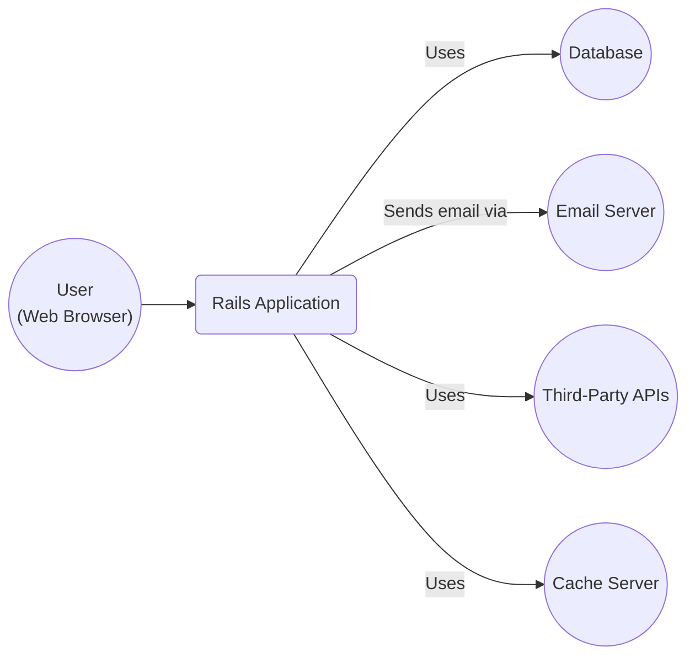
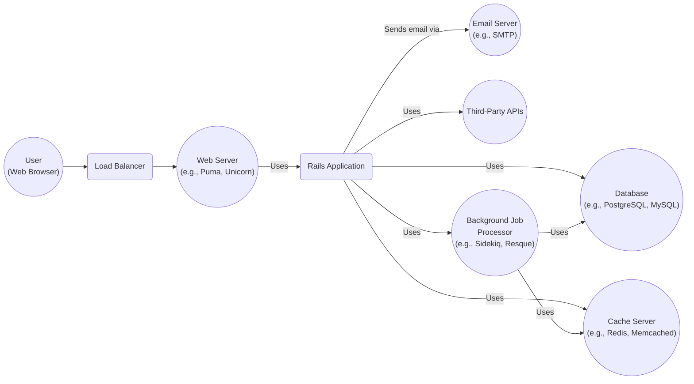
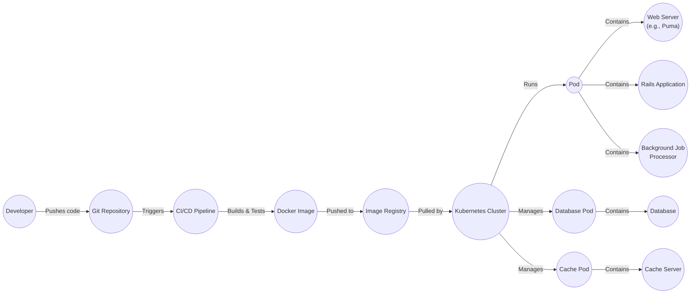

# BUSINESS POSTURE

Rails is a mature, widely-used open-source web application framework. It powers a vast number of web applications, from small startups to large enterprises.  The primary business goal of the Rails project itself is to provide a stable, productive, and secure framework for developers to build web applications.  The project's reputation and continued adoption depend on maintaining these qualities.

Business priorities:

*   Maintainability:  The framework must be maintainable and evolvable over time.  This includes clear code, good documentation, and a well-defined release process.
*   Productivity:  Rails is known for its "convention over configuration" approach, enabling rapid development.  This productivity must be preserved.
*   Security:  As a web framework, security is paramount.  Rails must provide built-in mechanisms to protect against common web vulnerabilities and provide guidance to developers on secure coding practices.
*   Community:  A strong and active community is crucial for the long-term health of the project.  This includes attracting and retaining contributors, providing support to users, and fostering a welcoming environment.
*   Compatibility: Rails needs to maintain a reasonable level of backward compatibility while also adapting to changes in the web development landscape (e.g., new Ruby versions, evolving web standards).

Most important business risks:

*   Security vulnerabilities in the framework that could be exploited in applications built with Rails, leading to data breaches, reputational damage, and legal liabilities.
*   Loss of developer mindshare due to competing frameworks that offer better performance, features, or developer experience.
*   Inability to adapt to new web development trends and technologies, leading to obsolescence.
*   A decline in community participation, leading to slower development, fewer bug fixes, and reduced support for users.
*   Major breaking changes that disrupt existing applications and discourage upgrades.

# SECURITY POSTURE

Existing security controls:

*   security control: Protection against Cross-Site Scripting (XSS). Rails provides helpers (like `sanitize`) and escaping mechanisms to prevent XSS vulnerabilities. Implemented in Action View helpers and documented extensively.
*   security control: Protection against Cross-Site Request Forgery (CSRF). Rails includes built-in CSRF protection using authenticity tokens. Implemented in Action Controller and documented.
*   security control: Secure handling of user input. Rails encourages the use of strong parameters to prevent mass-assignment vulnerabilities. Implemented in Action Controller and documented.
*   security control: SQL injection prevention. ActiveRecord provides safe ways to interact with databases, mitigating SQL injection risks. Implemented in ActiveRecord and documented.
*   security control: Session management. Rails provides secure session management using signed cookies or other secure storage mechanisms. Implemented in Action Controller and documented.
*   security control: Regular security audits and updates. The Rails core team and community actively address security vulnerabilities and release patches. Documented in security advisories and release notes.
*   security control: Secure defaults. Rails aims to provide secure defaults for common configurations, reducing the risk of misconfiguration.
*   security control: Gem signing. While not strictly enforced, RubyGems supports signed gems, and the Rails project signs its releases.

Accepted risks:

*   accepted risk: Reliance on third-party gems. While the Rails framework itself is secure, applications built with Rails often depend on numerous third-party gems, which may introduce vulnerabilities. Developers are responsible for vetting and updating these dependencies.
*   accepted risk: Developer error. Even with built-in security features, developers can still introduce vulnerabilities through insecure coding practices. Rails provides guidance, but ultimately, security depends on developer diligence.
*   accepted risk: Configuration errors. Misconfiguration of the Rails application or its environment (e.g., database credentials, secret keys) can lead to security breaches.
*   accepted risk: Zero-day vulnerabilities. Like all software, Rails is susceptible to zero-day vulnerabilities that are unknown and unpatched.

Recommended security controls:

*   security control: Implement a robust Content Security Policy (CSP) to mitigate XSS and other code injection attacks.
*   security control: Enforce the use of HTTPS with HTTP Strict Transport Security (HSTS).
*   security control: Regularly conduct penetration testing and vulnerability scanning of applications built with Rails.
*   security control: Implement robust logging and monitoring to detect and respond to security incidents.
*   security control: Use a dependency management tool (like Bundler) with vulnerability checking (like bundler-audit).

Security Requirements:

*   Authentication:
    *   Rails does not provide built-in user authentication. Developers typically use gems like Devise or implement custom authentication solutions.
    *   Requirement: Any authentication system used with Rails must follow secure password storage practices (e.g., using strong hashing algorithms like bcrypt).
    *   Requirement: Implement multi-factor authentication (MFA) where appropriate.
*   Authorization:
    *   Rails does not provide built-in authorization mechanisms. Developers typically use gems like Pundit or CanCanCan or implement custom authorization logic.
    *   Requirement: Authorization checks must be enforced consistently across the application.
    *   Requirement: Follow the principle of least privilege, granting users only the necessary permissions.
*   Input Validation:
    *   Requirement: All user input must be validated on the server-side, regardless of any client-side validation.
    *   Requirement: Use strong parameters to prevent mass-assignment vulnerabilities.
    *   Requirement: Sanitize user input to prevent XSS attacks.
    *   Requirement: Validate data types, lengths, and formats.
*   Cryptography:
    *   Requirement: Use strong, industry-standard cryptographic algorithms for all sensitive data (e.g., passwords, API keys, encryption keys).
    *   Requirement: Store cryptographic keys securely, outside of the application's codebase.
    *   Requirement: Use HTTPS for all communication between the client and the server.
    *   Requirement: Regularly rotate cryptographic keys.

# DESIGN

## C4 CONTEXT

*   Element List:
    *   1. Name: User
        *   Type: Person
        *   Description: A user interacting with the Rails application through a web browser.
        *   Responsibilities: Accessing the application's features, providing input, and receiving output.
        *   Security controls: Browser-based security controls (e.g., same-origin policy, cookie security).
    *   2. Name: Rails Application
        *   Type: Software System
        *   Description: The web application built using the Rails framework.
        *   Responsibilities: Handling user requests, processing data, interacting with other systems, and rendering responses.
        *   Security controls: XSS protection, CSRF protection, strong parameters, secure session management, SQL injection prevention.
    *   3. Name: Database
        *   Type: Software System
        *   Description: The database used by the Rails application to store persistent data.
        *   Responsibilities: Storing and retrieving data.
        *   Security controls: Access controls, encryption at rest, regular backups.
    *   4. Name: Email Server
        *   Type: Software System
        *   Description: An external email server used by the Rails application to send emails.
        *   Responsibilities: Sending emails.
        *   Security controls: Authentication, encryption in transit (TLS).
    *   5. Name: Third-Party APIs
        *   Type: Software System
        *   Description: External APIs used by the Rails application for various purposes (e.g., payment processing, social media integration).
        *   Responsibilities: Providing specific functionalities.
        *   Security controls: API keys, OAuth, rate limiting.
    *   6. Name: Cache Server
        *   Type: Software System
        *   Description: Cache server used by Rails application to store temporary data.
        *   Responsibilities: Store and serve temporary data.
        *   Security controls: Access controls.

## C4 CONTAINER

*   Element List:

    *   1. Name: User
        *   Type: Person
        *   Description: A user interacting with the Rails application through a web browser.
        *   Responsibilities: Accessing the application's features, providing input, and receiving output.
        *   Security controls: Browser-based security controls (e.g., same-origin policy, cookie security).
    *   2. Name: Load Balancer
        *   Type: Container
        *   Description: Distributes incoming traffic across multiple web server instances.
        *   Responsibilities: Distributing traffic, health checks.
        *   Security controls: SSL/TLS termination, DDoS protection.
    *   3. Name: Web Server
        *   Type: Container (e.g., Puma, Unicorn)
        *   Description: Serves the Rails application.
        *   Responsibilities: Handling HTTP requests, serving static assets, running the Rails application.
        *   Security controls: Web server security configurations (e.g., disabling unnecessary modules, configuring secure headers).
    *   4. Name: Rails Application
        *   Type: Container
        *   Description: The core Rails application code.
        *   Responsibilities: Handling business logic, interacting with other components, rendering views.
        *   Security controls: XSS protection, CSRF protection, strong parameters, secure session management, SQL injection prevention.
    *   5. Name: Database
        *   Type: Container (e.g., PostgreSQL, MySQL)
        *   Description: The database used by the Rails application.
        *   Responsibilities: Storing and retrieving persistent data.
        *   Security controls: Access controls, encryption at rest, regular backups, database firewall.
    *   6. Name: Email Server
        *   Type: Container (e.g., SMTP server)
        *   Description: An external email server.
        *   Responsibilities: Sending emails.
        *   Security controls: Authentication, encryption in transit (TLS).
    *   7. Name: Third-Party APIs
        *   Type: Container
        *   Description: External APIs used by the Rails application.
        *   Responsibilities: Providing specific functionalities.
        *   Security controls: API keys, OAuth, rate limiting.
    *   8. Name: Cache Server
        *   Type: Container (e.g., Redis, Memcached)
        *   Description: Stores temporary data to improve performance.
        *   Responsibilities: Storing and retrieving cached data.
        *   Security controls: Access controls, data expiration policies.
    *   9. Name: Background Job Processor
        *   Type: Container (e.g., Sidekiq, Resque)
        *   Description: Handles asynchronous tasks.
        *   Responsibilities: Executing background jobs (e.g., sending emails, processing images).
        *   Security controls: Input validation for job parameters, secure queuing mechanisms.

## DEPLOYMENT

Possible deployment solutions:

1.  Traditional deployment to a virtual machine (e.g., using Capistrano).
2.  Containerized deployment using Docker and Kubernetes.
3.  Platform-as-a-Service (PaaS) deployment (e.g., Heroku, AWS Elastic Beanstalk).

Chosen solution: Containerized deployment using Docker and Kubernetes.

*   Element List:

    *   1. Name: Developer
        *   Type: Person
        *   Description: A developer working on the Rails application.
        *   Responsibilities: Writing code, committing changes, pushing to the repository.
        *   Security controls: Code review, secure coding practices.
    *   2. Name: Git Repository
        *   Type: Infrastructure Node
        *   Description: The source code repository (e.g., GitHub, GitLab).
        *   Responsibilities: Storing code, version control.
        *   Security controls: Access controls, branch protection rules.
    *   3. Name: CI/CD Pipeline
        *   Type: Infrastructure Node
        *   Description: The continuous integration and continuous deployment pipeline (e.g., Jenkins, GitLab CI, GitHub Actions).
        *   Responsibilities: Building, testing, and deploying the application.
        *   Security controls: Secure configuration, access controls, vulnerability scanning.
    *   4. Name: Docker Image
        *   Type: Infrastructure Node
        *   Description: The container image containing the Rails application and its dependencies.
        *   Responsibilities: Packaging the application for deployment.
        *   Security controls: Image scanning for vulnerabilities.
    *   5. Name: Image Registry
        *   Type: Infrastructure Node
        *   Description: The container image registry (e.g., Docker Hub, Amazon ECR).
        *   Responsibilities: Storing and distributing container images.
        *   Security controls: Access controls, image signing.
    *   6. Name: Kubernetes Cluster
        *   Type: Infrastructure Node
        *   Description: The Kubernetes cluster where the application is deployed.
        *   Responsibilities: Orchestrating containers, managing resources.
        *   Security controls: Network policies, role-based access control (RBAC), pod security policies.
    *   7. Name: Pod
        *   Type: Infrastructure Node
        *   Description: A Kubernetes pod running the Rails application and its associated containers.
        *   Responsibilities: Running the application components.
        *   Security controls: Resource limits, security contexts.
    *   8. Name: Web Server
        *   Type: Container
        *   Description: The web server (e.g., Puma) running inside the pod.
        *   Responsibilities: Serving the Rails application.
        *   Security controls: Web server security configurations.
    *   9. Name: Rails Application
        *   Type: Container
        *   Description: The Rails application code running inside the pod.
        *   Responsibilities: Handling business logic.
        *   Security controls: Application-level security controls (XSS, CSRF, etc.).
    *   10. Name: Background Job Processor
        *   Type: Container
        *   Description: The background job processor (e.g., Sidekiq) running inside the pod.
        *   Responsibilities: Handling asynchronous tasks.
        *   Security controls: Secure queuing mechanisms, input validation.
    *   11. Name: Database Pod
        *   Type: Infrastructure Node
        *   Description: A Kubernetes pod running the database.
        *   Responsibilities: Running the database instance.
        *   Security controls: Database security configurations, access controls.
    *   12. Name: Database
        *   Type: Container
        *   Description: The database instance running inside the pod.
        *   Responsibilities: Storing and retrieving data.
        *   Security controls: Database-level security controls (encryption, access controls).
    *   13. Name: Cache Pod
        *   Type: Infrastructure Node
        *   Description: A Kubernetes pod running the cache server.
        *   Responsibilities: Running the cache server instance.
        *   Security controls: Cache server security configurations, access controls.
    *   14. Name: Cache Server
        *   Type: Container
        *   Description: The cache server instance (e.g., Redis) running inside the pod.
        *   Responsibilities: Storing and retrieving cached data.
        *   Security controls: Cache-level security controls (access controls, data expiration).

## BUILD

```mermaid
graph LR
    Developer(("Developer")) -- "Commits code" --> GitRepo(("Git Repository"))
    GitRepo -- "Webhook trigger" --> CI(("CI Server<br/>(e.g., GitHub Actions, Jenkins)"))
    CI -- "Clone repository" --> Step1("Step 1: Checkout Code")
    Step1 -- "Install dependencies" --> Step2("Step 2: Bundle Install")
    Step2 -- "Run linters" --> Step3("Step 3: Run Linters<br/>(e.g., RuboCop)")
    Step3 -- "Run security checks" --> Step4("Step 4: Security Checks<br/>(e.g., Brakeman, bundler-audit)")
    Step4 -- "Run tests" --> Step5("Step 5: Run Tests<br/>(e.g., RSpec, Minitest)")
    Step5 -- "Build assets" --> Step6("Step 6: Asset Compilation<br/>(e.g., Webpacker)")
    Step6 -- "Create Docker image" --> Step7("Step 7: Build Docker Image")
    Step7 -- "Push image" --> ImageRegistry(("Image Registry<br/>(e.g., Docker Hub, ECR)"))

```

Build process description:

1.  A developer commits code to the Git repository.
2.  A webhook triggers the CI server (e.g., GitHub Actions, Jenkins).
3.  The CI server clones the repository.
4.  Dependencies are installed using Bundler (`bundle install`).
5.  Linters (e.g., RuboCop) are run to enforce code style and identify potential issues.
6.  Security checks are performed:
    *   Static analysis security testing (SAST) using tools like Brakeman to identify potential vulnerabilities in the Rails code.
    *   Dependency vulnerability checking using tools like bundler-audit to identify known vulnerabilities in third-party gems.
7.  Automated tests (e.g., RSpec, Minitest) are run to ensure code quality and functionality.
8.  Assets (e.g., JavaScript, CSS) are compiled using a tool like Webpacker.
9.  A Docker image is built, containing the Rails application, its dependencies, and the compiled assets.
10. The Docker image is pushed to an image registry (e.g., Docker Hub, Amazon ECR).

Security controls in the build process:

*   security control: Code review: Manual review of code changes before merging to the main branch.
*   security control: Linting: Automated code style and quality checks using tools like RuboCop.
*   security control: SAST: Static analysis security testing using tools like Brakeman.
*   security control: Dependency vulnerability checking: Using tools like bundler-audit to identify known vulnerabilities in dependencies.
*   security control: Automated testing: Running unit, integration, and system tests to ensure code quality and prevent regressions.
*   security control: Secure build environment: Running the build process in a secure and isolated environment.
*   security control: Image signing: Signing the Docker image to ensure its integrity and authenticity.

# RISK ASSESSMENT

*   What are critical business processes we are trying to protect?
    *   The ability for developers to build and deploy web applications rapidly and securely.
    *   The stability and reliability of the Rails framework.
    *   The reputation of the Rails project and its community.
    *   The security of applications built using Rails.

*   What data we are trying to protect and what is their sensitivity?
    *   Source code of the Rails framework: Sensitivity is medium. While the code is open source, unauthorized modifications could introduce vulnerabilities.
    *   User data within applications built *using* Rails: Sensitivity varies greatly depending on the specific application. This can range from non-sensitive public data to highly sensitive personal, financial, or health information. Rails itself does not store this data, but it provides the framework within which this data is handled. The responsibility for protecting this data lies with the developers building applications on Rails.
    *   Configuration data (e.g., database credentials, API keys): Sensitivity is high. This data must be protected to prevent unauthorized access to systems and data.
    *   Session data: Sensitivity is medium to high, depending on what is stored in the session.

# QUESTIONS & ASSUMPTIONS

*   Questions:
    *   What specific third-party APIs are commonly used with Rails applications in this context?  Knowing this helps assess the risk associated with those integrations.
    *   What is the expected scale and load of applications built with Rails? This informs the deployment architecture and performance considerations.
    *   What are the specific compliance requirements (e.g., GDPR, HIPAA, PCI DSS) that applications built with Rails must adhere to?
    *   What level of support and maintenance is expected for the Rails framework itself?

*   Assumptions:
    *   BUSINESS POSTURE: The organization using Rails values security and is willing to invest in secure development practices.
    *   SECURITY POSTURE: Developers building applications with Rails have a basic understanding of web security principles.
    *   DESIGN: The deployment environment will be a modern, cloud-based infrastructure (e.g., AWS, GCP, Azure).
    *   DESIGN: The application will use a relational database (e.g., PostgreSQL, MySQL).
    *   DESIGN: The application will require background job processing.
    *   DESIGN: The build process will be automated using a CI/CD pipeline.