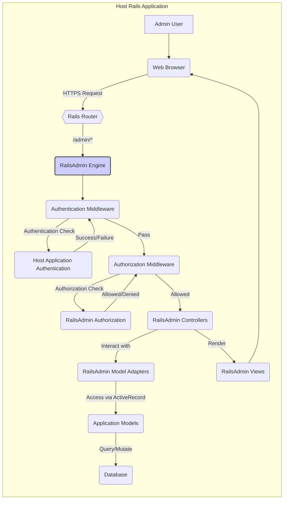

# Project Design Document: RailsAdmin Administration Interface

**Version:** 1.1
**Date:** October 26, 2023
**Author:** AI Software Architect

## 1. Introduction

This document provides an enhanced design overview of the RailsAdmin project, a Ruby on Rails engine that delivers an administrative interface for managing application data. This detailed design serves as a crucial foundation for subsequent threat modeling activities, enabling a comprehensive assessment of potential security vulnerabilities.

## 2. Goals

*   Provide a comprehensive and unambiguous description of the RailsAdmin architecture.
*   Clearly identify and explain the roles and interactions of key components.
*   Detail the flow of data within the system for various user actions.
*   Thoroughly outline security considerations relevant to the architecture and functionality.

## 3. Scope

This document encompasses the core architecture and functionalities of the RailsAdmin engine as it operates within a host Ruby on Rails application. The focus is on the interactions between RailsAdmin and the host application's components, including its models, database, and authentication mechanisms. It also considers the user interactions with the administrative interface.

## 4. High-Level Overview

RailsAdmin is engineered as a mountable Ruby on Rails engine, designed to seamlessly integrate into an existing Rails application. Upon mounting, it dynamically generates an administrative user interface by introspecting the host application's defined models. This interface empowers authorized administrators to perform standard CRUD operations (Create, Read, Update, and Delete) on the application's data. RailsAdmin inherently leverages the host application's established models and database connections, minimizing the need for redundant configurations.

## 5. System Architecture

The following diagram provides a more detailed illustration of the architecture of RailsAdmin within a host Rails application, highlighting key interactions:

### 5.1. Components

*   **Admin User:** An authenticated individual possessing administrative privileges who interacts with the RailsAdmin interface through a web browser to manage application data.
*   **Web Browser:** The client-side application used by the administrator to access and interact with the RailsAdmin interface via HTTP/HTTPS requests.
*   **Rails Router:** The central routing mechanism within the host Rails application responsible for interpreting incoming HTTP requests and directing them to the appropriate controllers, including those within the mounted RailsAdmin engine.
*   **RailsAdmin Engine:** The self-contained core of the RailsAdmin functionality. It encapsulates controllers, models (or adapters), views, assets, and its own authorization logic. It is mounted at a designated route within the host application (conventionally `/admin`).
*   **Authentication Middleware:**  A component, often within the host application's middleware stack, that intercepts incoming requests to the `/admin` path. It verifies the identity of the user, typically by checking for valid session cookies or other authentication tokens. RailsAdmin relies on the host application's authentication setup.
*   **Host Application Authentication:** The specific authentication mechanism implemented within the host Rails application (e.g., Devise, Clearance, or a custom solution). RailsAdmin delegates authentication responsibilities to the host application.
*   **Authorization Middleware:**  A component within the RailsAdmin engine that intercepts requests after successful authentication. It determines if the authenticated user has the necessary permissions to access the requested resource or perform the intended action within the RailsAdmin interface.
*   **RailsAdmin Authorization:** The authorization framework implemented within RailsAdmin. This framework defines rules and policies for controlling access to different models, actions (e.g., create, edit, delete), and fields within the administrative interface. It can be configured to integrate with gems like Pundit or CanCanCan, or use its own internal mechanism.
*   **RailsAdmin Controllers:**  These controllers handle specific user requests within the RailsAdmin interface. They interpret user actions (e.g., listing users, creating a new product), interact with the model adapters, and prepare data for rendering in the views.
*   **RailsAdmin Model Adapters:**  These act as an abstraction layer between the RailsAdmin controllers and the host application's ActiveRecord models. They provide a consistent interface for RailsAdmin to interact with different types of data models and ORMs, although the primary focus is ActiveRecord.
*   **Application Models (ActiveRecord):** The data models defined within the host Rails application, typically inheriting from `ActiveRecord::Base`. These models represent the application's data structure and contain the business logic for interacting with the database. RailsAdmin introspects these models to generate the administrative interface.
*   **Database:** The persistent data store for the application, typically a relational database (e.g., PostgreSQL, MySQL, SQLite), accessed and managed through ActiveRecord.
*   **RailsAdmin Views:**  The templates (commonly ERB or similar templating languages) responsible for generating the HTML that is rendered in the administrator's web browser. These views display data retrieved from the models and provide interactive forms for data manipulation.

### 5.2. Detailed Interactions and Data Flow

The following outlines the detailed data flow for common user interactions within RailsAdmin:

**Scenario 1: Viewing a List of Records (e.g., `/admin/users`)**

1. The Admin User initiates a request by navigating to a specific RailsAdmin URL in their Web Browser (e.g., `/admin/users`).
2. The Web Browser sends an HTTPS request to the Host Rails Application.
3. The Rails Router in the host application matches the `/admin/users` path and directs the request to the RailsAdmin Engine.
4. The Authentication Middleware intercepts the request and verifies the user's identity against the Host Application Authentication system. If authentication fails, the request is typically redirected to a login page.
5. Upon successful authentication, the Authorization Middleware within RailsAdmin checks if the authenticated user has the necessary permissions to view the `User` model.
6. If authorized, the request is passed to the appropriate RailsAdmin Controller (e.g., the `UsersController` within RailsAdmin).
7. The RailsAdmin Controller utilizes the RailsAdmin Model Adapters to interact with the `User` Application Model.
8. The Application Model (via ActiveRecord) queries the Database to retrieve the list of user records.
9. The Database returns the requested data to the Application Model.
10. The RailsAdmin Model Adapter formats the data as needed.
11. The RailsAdmin Controller prepares the data and selects the appropriate RailsAdmin View to render the list of users.
12. The RailsAdmin View generates the HTML representation of the user list.
13. The Host Rails Application sends the HTML response back to the Admin User's Web Browser.
14. The Web Browser renders the administrative interface displaying the list of users.

**Scenario 2: Creating a New Record (e.g., submitting a new user form)**

1. The Admin User fills out a form in the Web Browser to create a new record and submits it.
2. The Web Browser sends an HTTPS request (typically a POST request) to the Host Rails Application.
3. The Rails Router directs the request to the appropriate RailsAdmin Controller.
4. Authentication and Authorization Middleware steps are performed as described in Scenario 1.
5. The RailsAdmin Controller receives the submitted data.
6. The Controller may perform initial validation of the input data.
7. The RailsAdmin Controller uses the RailsAdmin Model Adapters to interact with the relevant Application Model.
8. The Application Model (via ActiveRecord) inserts the new record into the Database.
9. The Database confirms the successful creation of the record.
10. The RailsAdmin Controller typically redirects the Admin User to a success page (e.g., the list of users) or displays a confirmation message.
11. The Host Rails Application sends the redirect response back to the Web Browser.
12. The Web Browser navigates to the new URL.

## 6. Security Considerations

This section expands on the initial security considerations, providing more detail on potential risks and vulnerabilities.

*   **Authentication and Authorization Vulnerabilities:**
    *   **Weak Authentication in Host Application:** If the host application uses weak or flawed authentication mechanisms, RailsAdmin inherits this vulnerability, potentially allowing unauthorized access to the administrative interface.
    *   **Bypass of RailsAdmin Authorization:** Misconfigured or vulnerable RailsAdmin authorization rules could allow unauthorized administrators to access or modify data they shouldn't. This includes granular permissions for models, actions, and even specific fields.
    *   **Session Hijacking/Fixation:** If the host application's session management is insecure, attackers could potentially hijack administrator sessions and gain unauthorized access to RailsAdmin.
*   **Input Validation and Data Sanitization Issues:**
    *   **SQL Injection:** If user-provided input is not properly sanitized before being used in database queries, attackers could inject malicious SQL code, potentially leading to data breaches or manipulation.
    *   **Cross-Site Scripting (XSS):**  If user input is not properly escaped when rendered in RailsAdmin views, attackers could inject malicious scripts that are executed in other administrators' browsers, potentially stealing session cookies or performing unauthorized actions.
    *   **Cross-Site Request Forgery (CSRF):** Without proper CSRF protection, attackers could trick authenticated administrators into making unintended requests to the RailsAdmin interface, leading to unauthorized data modification.
    *   **Mass Assignment Exploits:** If RailsAdmin doesn't properly restrict which attributes can be set during record creation or updates, attackers could potentially modify sensitive fields they shouldn't have access to.
*   **Information Disclosure:**
    *   **Exposure of Sensitive Data in Logs or Error Messages:**  Detailed error messages or overly verbose logs might inadvertently expose sensitive information about the application's data or internal workings.
    *   **Insecure Direct Object References (IDOR):** If RailsAdmin relies on predictable or easily guessable IDs to access resources, attackers could potentially access or modify resources they are not authorized to.
*   **Dependency Vulnerabilities:**
    *   RailsAdmin relies on various Ruby gems. Vulnerabilities in these dependencies could be exploited to compromise the security of the application. Regular security audits and updates of dependencies are crucial.
*   **Code Injection Risks:**
    *   Features that allow administrators to input or execute code (e.g., custom actions or import/export functionalities) must be carefully designed and implemented to prevent code injection vulnerabilities.
*   **Insecure File Handling:**
    *   If RailsAdmin allows file uploads, improper validation and handling of these files could lead to vulnerabilities like path traversal or the execution of malicious code.

## 7. Configuration Considerations

Secure configuration of RailsAdmin and the host application is paramount. Key areas include:

*   **Strong Authentication Configuration:** Ensuring the host application utilizes strong and secure authentication mechanisms (e.g., strong password policies, multi-factor authentication).
*   **Robust Authorization Rules:**  Carefully defining and implementing granular authorization rules within RailsAdmin to restrict access based on roles and permissions. Regularly reviewing and updating these rules is essential.
*   **CSRF Protection:**  Verifying that the host application's CSRF protection is enabled and correctly integrated with RailsAdmin.
*   **Content Security Policy (CSP):** Implementing a strong CSP to mitigate the risk of XSS attacks.
*   **Secure Defaults:**  Leveraging RailsAdmin's security-related configuration options to enforce secure defaults.
*   **Regular Updates:** Keeping RailsAdmin and its dependencies up-to-date with the latest security patches.

## 8. Error Handling and Logging

Proper error handling and logging are crucial for both security and debugging:

*   **Secure Error Handling:**  Avoiding the display of overly detailed error messages to end-users, as these can reveal sensitive information to potential attackers. Instead, provide generic error messages and log detailed errors securely.
*   **Comprehensive Logging:** Implementing robust logging mechanisms to record administrative actions, authentication attempts, authorization failures, and other security-relevant events. These logs should be securely stored and regularly reviewed for suspicious activity.

## 9. Deployment Considerations

Deployment practices significantly impact the security of RailsAdmin:

*   **HTTPS Enforcement:**  Ensuring that all communication with the RailsAdmin interface is encrypted using HTTPS to protect sensitive data in transit.
*   **Network Segmentation:**  Restricting network access to the administrative interface to authorized networks or IP addresses.
*   **Regular Security Audits:**  Conducting periodic security audits and penetration testing of the deployed application, including the RailsAdmin interface.

## 10. Future Considerations

*   **Integration with Security Auditing Tools:** Exploring potential integrations with security auditing tools to automate vulnerability detection.
*   **Fine-grained Access Control:**  Investigating options for even more granular access control within RailsAdmin, potentially down to the level of individual data fields.

This enhanced design document provides a more comprehensive understanding of the RailsAdmin architecture and its security considerations, serving as a solid foundation for a thorough threat modeling exercise.