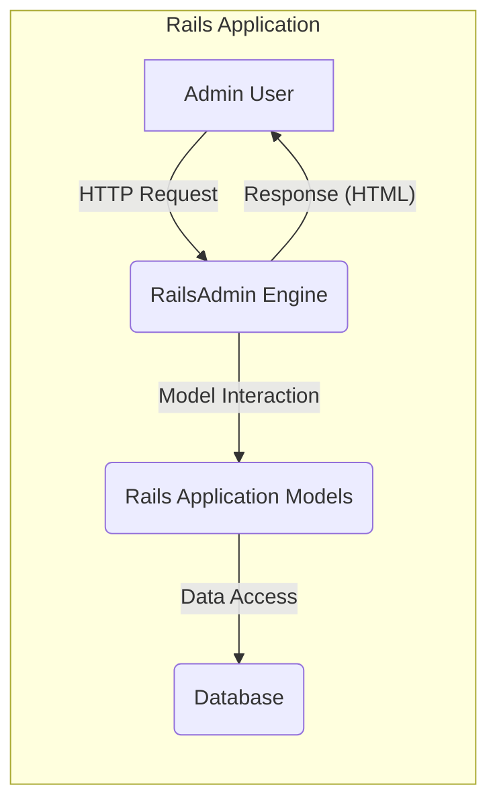
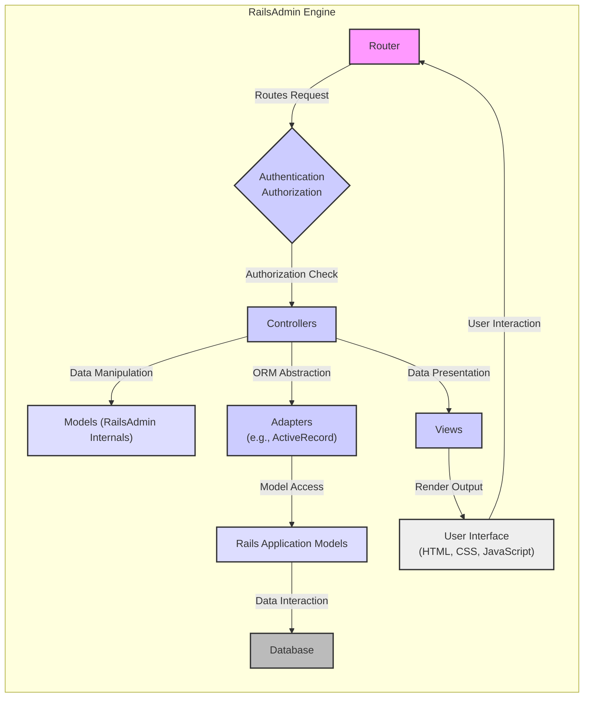

# Project Design Document: RailsAdmin

**Version:** 1.1
**Date:** October 26, 2023
**Author:** Gemini (AI Language Model)

## 1. Introduction

This document provides an enhanced and more detailed design overview of the RailsAdmin project, a Ruby on Rails engine designed to rapidly generate a sophisticated administrative interface for managing application data. This document is intended to serve as a robust foundation for subsequent threat modeling activities by offering a clear and comprehensive understanding of the system's architecture, core components, and data flow.

## 2. Goals and Objectives

*   To furnish a user-friendly, web-based interface enabling efficient management of application data.
*   To provide comprehensive CRUD (Create, Read, Update, Delete) operations for application models, reflecting their relationships and validations.
*   To facilitate extensive customization of the administrative interface, including branding, field display, and action availability.
*   To ensure seamless integration with existing Ruby on Rails applications with minimal configuration overhead.
*   To offer foundational authentication and authorization mechanisms, recognizing the need for extension in production environments.
*   To abstract the complexities of database interactions, providing a high-level interface for data manipulation.

## 3. System Architecture

RailsAdmin is architected as a mountable Ruby on Rails engine, encapsulating its functionality within a self-contained unit that integrates into a host Rails application. It leverages the established conventions and infrastructure of the Rails framework.

### 3.1. High-Level Architecture

*   **Admin User:** The human actor who interacts with the RailsAdmin interface through a web browser, initiating actions to manage application data.
*   **RailsAdmin Engine:** The central component providing the administrative functionality. It receives HTTP requests, handles authentication and authorization, interacts with application models, processes data, and renders HTML responses.
*   **Rails Application Models:** The ActiveRecord models defined within the encompassing Rails application, representing the core data entities that RailsAdmin is designed to manage.
*   **Database:** The persistent data store where the application's information is housed, accessed and manipulated through the Rails Application Models.

### 3.2. Detailed Architecture

*   **Router:**  The entry point for incoming HTTP requests directed to the RailsAdmin engine, typically under the `/admin` namespace. It maps URLs to specific controller actions.
*   **Authentication/Authorization:**  A crucial component responsible for verifying the identity of the admin user and ensuring they possess the necessary permissions to access specific resources and perform actions. RailsAdmin provides basic mechanisms, often intended to be augmented by the host application's security setup.
*   **Controllers:**  Handle specific user requests, orchestrate the interaction between models and views, and manage the application logic for administrative tasks. Key controllers manage actions like listing, viewing, creating, updating, and deleting records.
*   **Models (RailsAdmin Internals):**  Internal data structures and classes used by RailsAdmin to manage its own configuration, user interface elements, and operational state.
*   **Adapters:**  Provide an abstraction layer, decoupling RailsAdmin from the specific Object-Relational Mapper (ORM) used by the host application (e.g., ActiveRecord, Mongoid). This allows RailsAdmin to be compatible with various data stores.
*   **Rails Application Models:** The core domain models of the host application that RailsAdmin provides an interface for managing. These models encapsulate business logic and data relationships.
*   **Database:** The persistent storage system where the application's data resides. RailsAdmin interacts with the database indirectly through the Rails Application Models and the ORM adapter.
*   **Views:**  Responsible for generating the HTML markup that is rendered in the admin user's web browser. These views utilize form helpers, display data fetched from models, and provide the interactive elements of the admin interface.
*   **User Interface (HTML, CSS, JavaScript):** The front-end layer that the admin user directly interacts with. This encompasses HTML structure, CSS styling for presentation, and JavaScript for enhancing user experience through dynamic interactions.

## 4. Data Flow

A typical user interaction within the RailsAdmin interface involves the following sequence of steps:

1. **Request Initiation:** The Admin User initiates an action by interacting with the user interface (e.g., clicking a link, submitting a form). This generates an HTTP request targeted at a specific RailsAdmin URL (e.g., `/admin/posts`, `/admin/posts/new`).
2. **Routing:** The Rails Application Router intercepts the incoming request and, based on the URL, routes it to the mounted RailsAdmin Engine.
3. **RailsAdmin Routing:** Within the RailsAdmin Engine, its internal Router maps the request to the appropriate Controller and action (e.g., `Admin::PostsController#index` for listing posts).
4. **Authentication and Authorization:** The designated Controller action often begins by invoking authentication and authorization checks to verify the user's identity and permissions to perform the requested action.
5. **Data Retrieval/Manipulation:** Depending on the action, the Controller interacts with the relevant Rails Application Model(s) through the configured Adapter. This might involve:
    *   Fetching a list of records from the database.
    *   Retrieving a specific record based on its ID.
    *   Creating a new record with data submitted by the user.
    *   Updating an existing record with modified data.
    *   Deleting a record from the database.
6. **Data Preparation:** The Controller prepares the data retrieved from the models, potentially formatting it or structuring it for optimal presentation in the view.
7. **View Rendering:** The Controller selects the appropriate View template and passes the prepared data to it. The View then renders the HTML markup, incorporating the data to display information or present interactive forms.
8. **Response Delivery:** The rendered HTML is sent back to the Admin User's web browser as the response to the initial HTTP request.
9. **User Interaction:** The Admin User interacts with the rendered page, potentially initiating further actions, which restarts the data flow cycle.

## 5. Key Components

*   **Configuration DSL:** RailsAdmin provides a Domain-Specific Language (DSL) for configuring various aspects of the admin interface within the host application. This includes:
    *   Defining which models should be managed through the admin interface.
    *   Customizing the fields displayed for each model in lists and forms.
    *   Specifying the form field types and associated options (e.g., dropdowns, text areas).
    *   Enabling or disabling specific CRUD actions for individual models.
    *   Structuring the navigation menu within the admin interface.
*   **Authentication and Authorization Middleware:** Offers basic mechanisms for securing access to the admin interface. This often involves checking for an authenticated user and potentially verifying their roles or permissions. Best practice dictates extending this with more robust solutions provided by gems like Devise or CanCanCan within the encompassing application.
*   **CRUD Controllers and Actions:** The core functionality of RailsAdmin, providing controller actions for performing Create, Read, Update, and Delete operations on managed models. These controllers handle request processing, data validation, and interaction with the underlying models.
*   **Search and Filtering Capabilities:** Implements features allowing users to search and filter records within the admin interface based on various criteria. This typically involves generating database queries based on user input.
*   **Data Import/Export Functionality:** Provides mechanisms for importing data into the application through the admin interface (e.g., uploading CSV files) and exporting data from the application in various formats.
*   **History and Auditing (Optional):**  RailsAdmin can be configured to track changes made to data through the admin interface, providing an audit trail of modifications. This often requires additional configuration and potentially integration with auditing gems.
*   **Dashboard Feature:** A customizable landing page for the admin interface, providing an overview of key data or application metrics.
*   **Custom Actions:**  Allows developers to define custom actions that can be performed on specific models, extending the default CRUD functionality.

## 6. Security Considerations (For Threat Modeling)

This section outlines potential security considerations that will be further explored during threat modeling activities.

*   **Authentication and Session Management:**
    *   Weak or default authentication credentials.
    *   Vulnerabilities in session management leading to session hijacking or fixation.
    *   Lack of multi-factor authentication.
*   **Authorization and Access Control:**
    *   Bypass vulnerabilities allowing unauthorized access to administrative functions.
    *   Insufficiently granular permissions leading to privilege escalation.
    *   Exposure of sensitive data due to inadequate access controls.
*   **Input Validation and Output Encoding:**
    *   Cross-Site Scripting (XSS) vulnerabilities due to improper sanitization of user input.
    *   SQL Injection vulnerabilities if raw SQL queries are constructed based on user input (less likely with ActiveRecord but still a concern in custom queries).
    *   Command Injection vulnerabilities if user input is used in system commands.
    *   Cross-Site Request Forgery (CSRF) vulnerabilities allowing attackers to perform actions on behalf of authenticated users.
    *   Mass Assignment vulnerabilities allowing modification of unintended model attributes.
*   **Data Handling and Storage:**
    *   Insecure storage of sensitive data.
    *   Exposure of sensitive information in logs or error messages.
*   **Dependency Management:**
    *   Vulnerabilities in third-party gems used by RailsAdmin.
    *   Outdated dependencies with known security flaws.
*   **Information Disclosure:**
    *   Exposure of sensitive configuration details.
    *   Verbose error messages revealing internal application structure.
*   **Security Headers:**
    *   Lack of appropriate security headers (e.g., Content Security Policy, HTTP Strict Transport Security).
*   **Denial of Service (DoS):**
    *   Potential for resource exhaustion through excessive requests or malicious input.
*   **Insecure Direct Object References (IDOR):**
    *   Vulnerability allowing access to resources by manipulating IDs in URLs.

## 7. Deployment

RailsAdmin is deployed as an integral part of the host Ruby on Rails application. The deployment process typically involves:

*   **Gem Inclusion:** Adding the `rails_admin` gem to the host application's `Gemfile` and running `bundle install`.
*   **Mounting the Engine:**  Mounting the RailsAdmin engine within the host application's `config/routes.rb` file, typically under the `/admin` namespace. This makes the admin interface accessible through a specific URL path.
*   **Configuration (Optional):**  Customizing RailsAdmin's behavior through initializer files (e.g., `config/initializers/rails_admin.rb`). This includes configuring model visibility, field display, and other options.
*   **Database Migrations:** Running any necessary database migrations if RailsAdmin introduces its own models (though this is less common).
*   **Standard Rails Deployment:**  Following the standard deployment procedures for the host Rails application, which might involve using tools like Capistrano, Heroku, or containerization technologies like Docker. No separate deployment process is typically required specifically for RailsAdmin.

## 8. Technologies Used

*   **Ruby on Rails:** The foundational web application framework.
*   **Ruby Programming Language:** The language in which RailsAdmin is developed.
*   **HTML (ERB), CSS (likely Sass or similar), JavaScript:** For the user interface presentation and interaction.
*   **ActiveRecord (or other ORM):** For interacting with the application's database.
*   **Various Ruby Gems:** Dependencies providing additional functionality, such as form builders, UI components, and potentially authentication/authorization support.

This revised document provides a more comprehensive and detailed design overview of the RailsAdmin project, offering a stronger foundation for conducting thorough threat modeling and identifying potential security vulnerabilities.
