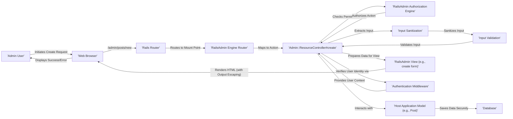

# Project Design Document: RailsAdmin (Improved)

**Version:** 1.1
**Date:** October 26, 2023
**Author:** AI Software Architect

## 1. Introduction

This document provides an enhanced design overview of the RailsAdmin project, a Ruby on Rails engine designed to generate dynamic administration interfaces for application models. This improved version aims to provide a more detailed and security-focused perspective, specifically tailored for effective threat modeling. It builds upon the previous version by adding more granular detail and emphasizing potential security implications within the system's architecture and data flow.

## 2. Goals and Objectives

The primary goal remains to provide a comprehensive architectural description of RailsAdmin to facilitate effective threat modeling. Improved objectives include:

*   Providing a more granular breakdown of system components and their interactions, with a focus on security boundaries.
*   Detailing data flow with specific attention to data sanitization, validation, and authorization points.
*   Explicitly highlighting potential security vulnerabilities associated with each component and data flow stage.
*   Offering enhanced visual representations of the system architecture and data flow, emphasizing security-relevant interactions.

## 3. Target Audience

The target audience remains the same, but with an increased emphasis on security practitioners:

*   Security engineers responsible for in-depth threat modeling, penetration testing, and security assessments.
*   Developers involved in maintaining, extending, or integrating with RailsAdmin, requiring a strong understanding of its security architecture.
*   Operations teams responsible for secure deployment and configuration of applications utilizing RailsAdmin.

## 4. Scope

The scope remains focused on the RailsAdmin engine itself, but with a deeper dive into its security-relevant aspects:

*   Detailed examination of the core components of the RailsAdmin engine and their security responsibilities.
*   In-depth analysis of the interaction between RailsAdmin and the host Rails application, particularly concerning security boundaries and data exchange.
*   Granular description of data flow within the RailsAdmin engine, highlighting potential vulnerability points.
*   Comprehensive discussion of inherent security considerations within the design, with specific examples.

The exclusions remain the same:

*   Specific implementation details of the host Rails application beyond its interaction with RailsAdmin.
*   Fine-grained code-level implementation within the RailsAdmin engine.
*   Specific deployment environments or infrastructure configurations, although general deployment security considerations are included.

## 5. System Architecture

RailsAdmin, as a Rails engine, operates within the context of a host Rails application. Its architecture is designed to provide administrative functionalities by interacting with the host application's models and data.

### 5.1. High-Level Architecture Diagram (Security Focused)

```mermaid
graph LR
    subgraph "Web Browser"
        A["'Admin User'"]
    end
    B["'Rails Application'"]
    subgraph "RailsAdmin Engine"
        C["'Router'"]
        D["'Controllers'"]
        E["'Views'"]
        F["'Model Proxies & Configuration'"]
        G["'Authorization Engine'"]
        H["'Configuration Store'"]
        I["'Input Sanitization & Validation'"]
    end
    J["'Host Application Models'"]
    K["'Database'"]
    L["'Authentication Middleware (Host App)'"]

    A --> B
    B -- Mount Point "/admin" --> C
    C --> D
    D -- Renders HTML --> E
    D -- Interacts with Model Layer --> F
    F -- Accesses Data via --> J
    J -- Interacts with --> K
    D -- Enforces Access Control via --> G
    B -- Reads Configuration from --> H
    H --> F
    D -- Applies --> I
    B -- Authenticates User via --> L
    L -- Provides User Context to --> D
```

### 5.2. Key Components (Security Perspective)

*   **Router:**  Directs incoming requests to the appropriate RailsAdmin controllers. Security considerations include ensuring proper routing configurations to prevent unintended access to admin functionalities.
*   **Controllers:** Handle admin actions. Security is paramount here, with responsibilities including:
    *   **Authorization Enforcement:** Verifying user permissions before executing actions.
    *   **Input Sanitization and Validation:**  Protecting against injection attacks by sanitizing and validating user inputs.
    *   **Parameter Handling:**  Safely handling request parameters to prevent mass assignment vulnerabilities.
*   **Views:** Generate the HTML interface. Security concerns involve preventing Cross-Site Scripting (XSS) vulnerabilities by properly escaping output data.
*   **Model Proxies & Configuration:**  Provide an interface to interact with the host application's models. Security considerations include:
    *   **Respecting Model-Level Validations:** Ensuring RailsAdmin respects validations defined in the host application's models.
    *   **Controlling Access to Model Attributes:**  Configuration determines which model attributes are accessible and modifiable through the admin interface.
*   **Authorization Engine:**  The core of RailsAdmin's access control. It determines if a user is authorized to perform a specific action on a resource. Vulnerabilities here can lead to unauthorized data access or manipulation.
*   **Configuration Store:** Holds the configuration for RailsAdmin, including which models are managed and how they are displayed. Secure storage and access control for this configuration are important.
*   **Input Sanitization & Validation:** (Logical Component) Represents the mechanisms within controllers and models to sanitize and validate user input. This is a critical line of defense against various injection attacks.
*   **Host Application Models:**  The data managed by RailsAdmin resides in the host application's models. Security of these models (including validations and database interactions) directly impacts RailsAdmin's security.
*   **Authentication Middleware (Host App):** RailsAdmin relies on the host application for authentication. The strength and security of the host application's authentication mechanism are crucial.

## 6. Data Flow (Security Analysis)

The data flow within RailsAdmin involves several stages where security checks and transformations should occur.

1. **User Request:** An admin user initiates a request. This is the entry point for potential attacks.
2. **Authentication:** The host application's authentication middleware verifies the user's identity. A weak authentication mechanism here compromises the entire admin interface.
3. **Routing:** The request is routed to the appropriate RailsAdmin controller. Misconfigurations can expose unintended endpoints.
4. **Authorization Check:** Before executing any action, RailsAdmin's authorization engine verifies if the authenticated user has the necessary permissions. This is a critical security gate.
5. **Input Handling:**
    *   **Parameter Extraction:** Request parameters are extracted. Malicious parameters can be injected here.
    *   **Sanitization:** Input data should be sanitized to remove potentially harmful characters or code.
    *   **Validation:** Input data should be validated against expected formats and constraints to prevent invalid data from being processed.
6. **Data Access/Manipulation:**
    *   **Model Interaction:** Controllers interact with the host application's models to retrieve or modify data. Secure data access practices (e.g., parameterized queries to prevent SQL injection) are essential in the underlying model layer.
    *   **Mass Assignment Protection:**  RailsAdmin's configuration and controller logic should prevent unintended modification of model attributes.
7. **View Rendering:** Data is prepared for display in the views. Proper output escaping is crucial to prevent XSS vulnerabilities.
8. **Response:** The HTML response is sent back to the user. Ensure sensitive information is not inadvertently included in the response.

### 6.1. Data Flow Diagram (Create Operation with Security Checks)



## 7. Components in Detail (Security Focus)

*   **Engine:**  The entry point for requests to the admin interface. Security considerations involve proper isolation and preventing unintended access to engine internals.
*   **Controllers:**
    *   `Admin::MainController`: Handles general admin tasks. Security focus on authorization for accessing dashboard information and performing administrative actions.
    *   `Admin::ResourceController`: Manages CRUD operations on resources. Critical for enforcing authorization, sanitizing input, and preventing mass assignment.
    *   Specialized Controllers:  Require careful security review based on their specific functionalities (e.g., import/export might handle sensitive data).
*   **Views:**  Must implement proper output escaping to prevent XSS. Care should be taken when displaying user-generated content or data from the database.
*   **Model Proxies/Configurations:**  The configuration defines the attack surface by determining which models and attributes are exposed through the admin interface. Secure configuration is crucial.
*   **Authorization Adapters:**  The implementation of the authorization logic. Vulnerabilities in the adapter can lead to bypasses. Using well-vetted and maintained authorization gems is recommended.
*   **Configuration DSL:**  The code used to configure RailsAdmin. Care should be taken to prevent accidental exposure of sensitive configuration data.
*   **Assets:**  Can be a target for attacks (e.g., serving malicious JavaScript). Ensure assets are served securely and follow security best practices (e.g., Content Security Policy).

## 8. Security Considerations (Expanded)

This section expands on the previous security considerations, providing more context and examples:

*   **Authentication:**  RailsAdmin's security is fundamentally tied to the host application's authentication. Weak passwords, lack of multi-factor authentication, or session fixation vulnerabilities in the host application directly impact RailsAdmin's security.
*   **Authorization:**  A robust and correctly implemented authorization scheme is paramount. Common vulnerabilities include:
    *   **Broken Object Level Authorization:**  Users can access or modify resources they shouldn't have access to (e.g., accessing another user's profile).
    *   **Broken Function Level Authorization:** Users can access administrative functions they are not authorized for.
    *   **Bypassable Authorization Logic:** Flaws in the authorization implementation allow users to circumvent access controls.
*   **Input Validation:**  Failure to properly validate input can lead to:
    *   **SQL Injection:** Malicious SQL code is injected into database queries.
    *   **Cross-Site Scripting (XSS):** Malicious scripts are injected into web pages viewed by other users.
    *   **Command Injection:**  Malicious commands are executed on the server.
    *   **Path Traversal:** Attackers can access files and directories outside the intended scope.
*   **Cross-Site Scripting (XSS):**  Can occur in various forms:
    *   **Stored XSS:** Malicious scripts are stored in the database and displayed to other users.
    *   **Reflected XSS:** Malicious scripts are injected through URL parameters and reflected back to the user.
*   **Cross-Site Request Forgery (CSRF):**  Attackers can trick authenticated users into performing unintended actions. Rails' built-in CSRF protection should be enabled and correctly implemented.
*   **Mass Assignment:**  Allows attackers to modify unintended model attributes by manipulating request parameters. Use `strong_parameters` in controllers to control which attributes can be set.
*   **Information Disclosure:**  Ensure sensitive information is not exposed in error messages, logs, or the user interface to unauthorized users.
*   **Dependency Vulnerabilities:** Regularly audit and update dependencies to patch known security vulnerabilities. Tools like `bundler-audit` can help with this.
*   **Session Management:**  Secure session management practices in the host application are critical. Use secure session cookies, implement timeouts, and prevent session fixation.

## 9. Deployment Considerations (Security Best Practices)

Securing the deployment environment is crucial for protecting RailsAdmin:

*   **HTTPS Enforcement:**  Always use HTTPS to encrypt communication between the browser and the server.
*   **Network Segmentation:**  Isolate the admin interface on a separate network or subnet if possible.
*   **Access Control Lists (ACLs):**  Restrict access to the `/admin` path based on IP address or other network controls.
*   **Regular Security Audits:**  Perform regular security assessments and penetration testing of the application.
*   **Web Application Firewall (WAF):**  Consider using a WAF to protect against common web attacks.
*   **Secure Configuration Management:**  Store and manage configuration securely, avoiding hardcoding sensitive information.

## 10. Future Considerations (Security Enhancements)

*   **Content Security Policy (CSP):**  Implement a strict CSP to mitigate XSS attacks.
*   **Rate Limiting:**  Implement rate limiting on administrative actions to prevent brute-force attacks.
*   **Security Headers:**  Configure security headers (e.g., `Strict-Transport-Security`, `X-Frame-Options`) to enhance browser security.
*   **Integration with Security Scanning Tools:**  Facilitate integration with static and dynamic application security testing (SAST/DAST) tools.

This improved design document provides a more detailed and security-focused view of the RailsAdmin project, enhancing its value for threat modeling and security analysis. By explicitly highlighting potential vulnerabilities and security considerations within each component and data flow stage, it enables a more comprehensive and effective security assessment.