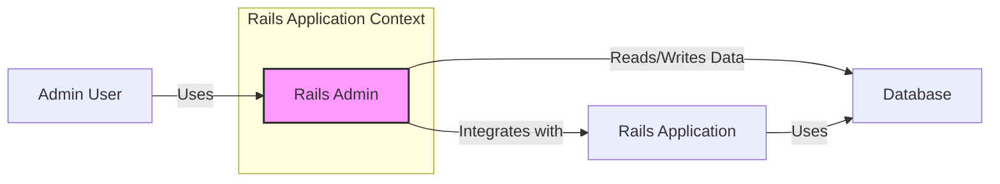
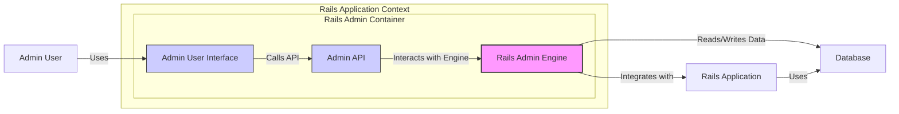
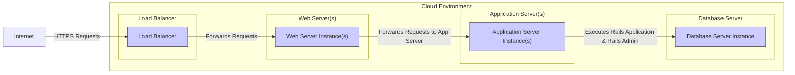
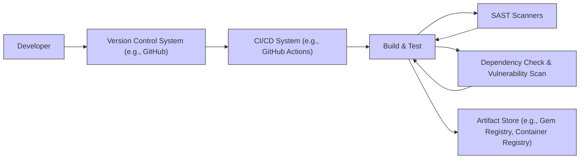

# BUSINESS POSTURE

This project, rails_admin, provides a Ruby on Rails engine that automatically generates an administration interface for Rails applications.

Business Priorities and Goals:
- To provide a user-friendly interface for managing application data and models.
- To reduce development time for building administration panels.
- To empower non-technical users to manage application content and settings.
- To simplify common administrative tasks such as CRUD operations on database records.

Business Risks:
- Data breaches due to unauthorized access to the administration interface.
- Data integrity issues resulting from accidental or malicious data modification through the admin panel.
- Operational disruptions caused by misconfiguration or misuse of the admin interface.
- Availability issues if the admin interface becomes a performance bottleneck or point of failure.
- Compliance risks if the admin interface does not adequately support audit logging and access controls required by regulations.

# SECURITY POSTURE

Existing Security Controls:
- security control: Rails framework security features (e.g., CSRF protection, strong parameters, session management) - Implemented by the underlying Rails application framework.
- security control: Authentication and authorization mechanisms provided by the Rails application - Implemented by the application that integrates rails_admin.
- security control: Input validation provided by Rails and application code - Implemented by Rails framework and application code.

Accepted Risks:
- accepted risk: Reliance on the integrating Rails application for primary authentication and authorization.
- accepted risk: Potential vulnerabilities in gems and dependencies used by rails_admin.
- accepted risk: Security misconfigurations in the deployment environment of the Rails application.

Recommended Security Controls:
- security control: Implement multi-factor authentication (MFA) for access to the rails_admin interface.
- security control: Implement robust role-based access control (RBAC) within rails_admin to restrict access to sensitive data and actions based on user roles.
- security control: Implement comprehensive audit logging of all actions performed within rails_admin, including data access, modifications, and configuration changes.
- security control: Regularly perform security vulnerability scanning and penetration testing of the Rails application and rails_admin integration.
- security control: Implement rate limiting and brute-force protection mechanisms for the rails_admin login interface.
- security control: Implement Content Security Policy (CSP) to mitigate cross-site scripting (XSS) attacks.
- security control: Implement regular dependency updates and vulnerability scanning for rails_admin and its dependencies.

Security Requirements:
- Authentication:
    - requirement: Secure authentication mechanism to verify the identity of users accessing rails_admin.
    - requirement: Integration with existing application authentication or a dedicated authentication system.
    - requirement: Support for strong password policies and password management.
    - requirement: Consider multi-factor authentication for enhanced security.
- Authorization:
    - requirement: Role-based access control to restrict access to specific features and data within rails_admin based on user roles.
    - requirement: Granular permissions to control access to models, actions (create, read, update, delete), and fields.
    - requirement: Clear definition and enforcement of authorization policies.
- Input Validation:
    - requirement: Robust input validation for all user inputs to prevent injection attacks (e.g., SQL injection, XSS).
    - requirement: Server-side validation to ensure data integrity and security.
    - requirement: Proper handling of file uploads and sanitization of uploaded content.
- Cryptography:
    - requirement: Secure storage of sensitive data, including passwords and API keys, using appropriate encryption methods.
    - requirement: Use of HTTPS for all communication between the user's browser and the rails_admin interface to protect data in transit.
    - requirement: Secure handling of sensitive data in logs and during processing.

# DESIGN

## C4 CONTEXT

Context Diagram Elements:

- Element:
    - Name: Admin User
    - Type: Person
    - Description: A human user who manages the Rails application's data and configuration through the rails_admin interface. Typically an administrator, content manager, or support staff.
    - Responsibilities: Managing application data, configuring application settings, performing administrative tasks.
    - Security controls: User authentication, role-based access control, audit logging of actions.

- Element:
    - Name: Rails Admin
    - Type: Software System
    - Description: A Ruby on Rails engine that provides a web-based administration interface for managing the data and models of a Rails application.
    - Responsibilities: Providing a user interface for CRUD operations, data visualization, search, and other administrative functionalities. Handling user requests and interacting with the underlying Rails application and database.
    - Security controls: Input validation, authorization checks, session management, protection against common web vulnerabilities (XSS, CSRF, etc.).

- Element:
    - Name: Rails Application
    - Type: Software System
    - Description: The main Ruby on Rails application that integrates rails_admin. It contains the business logic, models, and controllers for the application.
    - Responsibilities: Serving the primary application functionality, managing data models, handling business logic, integrating with rails_admin for administrative tasks.
    - Security controls: Authentication, authorization, data validation, security configurations of the Rails application itself.

- Element:
    - Name: Database
    - Type: Data Store
    - Description: The database system used by the Rails application to store application data. Could be PostgreSQL, MySQL, SQLite, or other supported databases.
    - Responsibilities: Persisting application data, providing data access to the Rails application and rails_admin.
    - Security controls: Database access controls, encryption at rest, regular backups, database security hardening.

## C4 CONTAINER

Container Diagram Elements:

- Element:
    - Name: Rails Admin Engine
    - Type: Web Application Engine
    - Description: The core Rails engine of rails_admin, containing the business logic for the admin interface, data access components, and integration with the Rails application.
    - Responsibilities: Handling admin requests, managing data interactions, enforcing authorization policies, providing core admin functionalities.
    - Security controls: Input validation, authorization logic, secure data handling, protection against injection attacks.

- Element:
    - Name: Admin User Interface
    - Type: Web User Interface
    - Description: The front-end web interface of rails_admin, providing the visual elements and user interactions for administrators. Built using HTML, CSS, and JavaScript, likely leveraging Rails view templates.
    - Responsibilities: Presenting data to users, handling user input, making API calls to the Admin API, providing a user-friendly admin experience.
    - Security controls: Output encoding, Content Security Policy (CSP), protection against XSS attacks, secure handling of user sessions.

- Element:
    - Name: Admin API
    - Type: API
    - Description: The backend API of rails_admin, providing endpoints for the Admin User Interface to interact with the Rails Admin Engine. Likely implemented as Rails controllers and actions.
    - Responsibilities: Receiving requests from the Admin User Interface, processing admin actions, interacting with the Rails Admin Engine, returning data to the UI.
    - Security controls: Authentication and authorization for API endpoints, input validation, rate limiting, secure API design.

- Element:
    - Name: Admin User, Rails Application, Database
    - Type: Person, Software System, Data Store
    - Description: Same as described in the C4 Context Diagram.
    - Responsibilities: Same as described in the C4 Context Diagram.
    - Security controls: Same as described in the C4 Context Diagram.

## DEPLOYMENT

Deployment Scenario: Cloud-based deployment using a typical Rails application stack on a cloud provider like AWS, Azure, or GCP.

Deployment Diagram Elements:

- Element:
    - Name: Load Balancer
    - Type: Infrastructure
    - Description: Distributes incoming HTTPS requests across multiple Web Server instances for high availability and scalability.
    - Responsibilities: Load balancing, SSL termination, routing requests.
    - Security controls: SSL/TLS configuration, DDoS protection, access control lists.

- Element:
    - Name: Web Server Instance(s)
    - Type: Infrastructure
    - Description: Web servers (e.g., Nginx, Apache) that receive requests from the load balancer and forward them to the Application Server instances. May also serve static assets.
    - Responsibilities: Serving static content, forwarding requests to application servers, basic request filtering.
    - Security controls: Web server hardening, access controls, security configurations.

- Element:
    - Name: Application Server Instance(s)
    - Type: Infrastructure
    - Description: Application servers (e.g., Puma, Unicorn) that run the Rails application and the rails_admin engine. Processes requests and interacts with the database.
    - Responsibilities: Running the Rails application, executing application code, handling business logic, interacting with the database.
    - Security controls: Application server hardening, secure application configurations, resource limits.

- Element:
    - Name: Database Server Instance
    - Type: Infrastructure
    - Description: The database server (e.g., PostgreSQL, MySQL) that stores the application data.
    - Responsibilities: Data persistence, data management, providing data access.
    - Security controls: Database access controls, encryption at rest, regular backups, database security hardening, network isolation.

- Element:
    - Name: Internet
    - Type: External Environment
    - Description: The public internet from which Admin Users access the rails_admin interface.
    - Responsibilities: Providing network connectivity for users.
    - Security controls: N/A - external environment. Security is focused on protecting the deployed infrastructure from internet-based threats.

## BUILD

Build Process Description:

1. Developer: Developers write code for the Rails application and rails_admin integration.
2. Version Control System (VCS): Code is committed and pushed to a VCS like GitHub.
3. CI/CD System: A CI/CD system (e.g., GitHub Actions, Jenkins) is triggered by code changes in the VCS.
4. Build & Test: The CI/CD system builds the Rails application and runs automated tests (unit, integration, etc.). This includes building the rails_admin engine as part of the application.
5. SAST Scanners: Static Application Security Testing (SAST) scanners are integrated into the build process to analyze the codebase for potential security vulnerabilities.
6. Dependency Check & Vulnerability Scan: Tools are used to check dependencies (gems) for known vulnerabilities. This ensures that rails_admin and its dependencies are not introducing known security issues.
7. Artifact Store: Build artifacts, such as packaged gems or container images, are stored in an artifact store (e.g., Gem Registry, Container Registry). These artifacts are then used for deployment.

Security Controls in Build Process:
- security control: Secure coding practices are followed by developers.
- security control: Code reviews are conducted to identify potential security flaws.
- security control: Automated SAST scanners are used to detect vulnerabilities in the code.
- security control: Dependency vulnerability scanning is performed to identify vulnerable dependencies.
- security control: Build artifacts are securely stored and accessed.
- security control: CI/CD pipeline is secured to prevent unauthorized modifications and access.
- security control: Immutable build process to ensure reproducibility and prevent tampering.

# RISK ASSESSMENT

Critical Business Processes:
- Management of application data: rails_admin is used to create, read, update, and delete critical application data, impacting all business processes that rely on this data.
- Application configuration management: rails_admin might be used to manage application settings and configurations, which can directly affect application behavior and security.
- User management (potentially): Depending on the application, rails_admin could be used to manage user accounts and permissions, impacting access control and security.

Data Sensitivity:
- Application data: The sensitivity of data managed through rails_admin depends on the specific application. It can range from publicly available information to highly sensitive personal data, financial records, or confidential business information.
- Configuration data: Application configuration data can be sensitive as it may include database credentials, API keys, and other security-related settings.
- User credentials (if managed): Usernames and password hashes are highly sensitive data that must be protected.

# QUESTIONS & ASSUMPTIONS

Questions:
- What is the sensitivity level of the data managed through rails_admin in the target application?
- What are the specific compliance requirements for the application and its data?
- What authentication and authorization mechanisms are currently in place in the integrating Rails application?
- What is the expected user base for the rails_admin interface and their roles?
- What is the organization's risk appetite regarding security vulnerabilities in the admin interface?
- What existing security monitoring and incident response processes are in place?

Assumptions:
- Assumption: The integrating Rails application provides a baseline level of security.
- Assumption: Access to the rails_admin interface is intended for a limited number of trusted administrative users.
- Assumption: The deployment environment is reasonably secure and follows security best practices.
- Assumption: The organization is concerned about protecting the confidentiality, integrity, and availability of the data managed through rails_admin.
- Assumption: The target deployment environment is a cloud-based infrastructure.