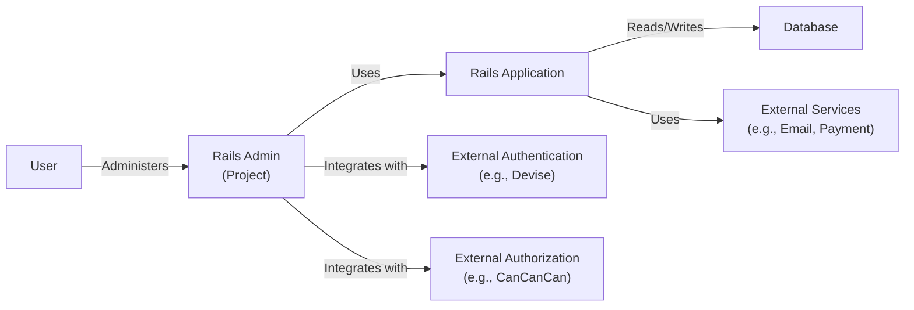
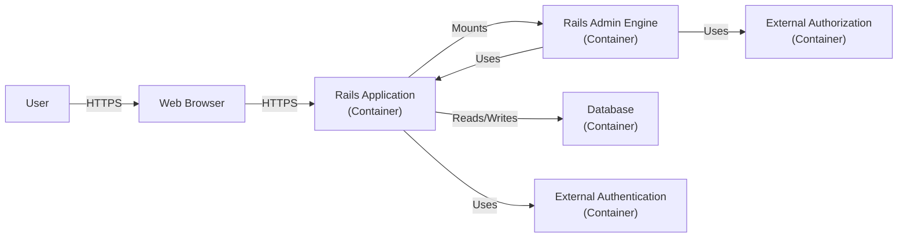
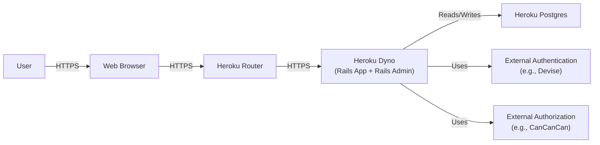
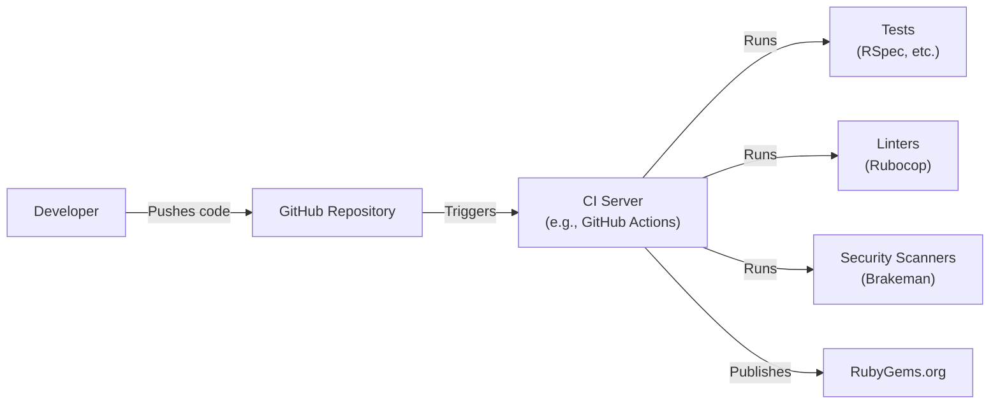

Okay, let's create a design document for the `rails_admin` project.

# BUSINESS POSTURE

Business Priorities and Goals:

*   Provide a user-friendly interface for managing data in Ruby on Rails applications.
*   Reduce development time and effort required for building administrative backends.
*   Offer a customizable and extensible solution to adapt to various application needs.
*   Maintain a secure and reliable admin interface to protect application data.
*   Provide a well-maintained and supported open-source project.

Business Risks:

*   Unauthorized access to sensitive data through the admin interface.
*   Data breaches or modification due to vulnerabilities in the gem or its dependencies.
*   Disruption of service due to misconfiguration or improper use of the admin interface.
*   Exposure of internal application details through the admin interface.
*   Reputational damage due to security incidents related to the admin interface.
*   Compliance violations if the admin interface is not used in accordance with relevant regulations (e.g., GDPR, HIPAA).

# SECURITY POSTURE

Existing Security Controls:

*   security control: Authentication: Rails Admin relies on existing authentication solutions in the Rails application (e.g., Devise, Clearance). It does not provide its own authentication mechanism. Described in: README, Wiki.
*   security control: Authorization: Rails Admin supports authorization through integration with gems like CanCanCan and Pundit. Described in: README, Wiki.
*   security control: Input Validation: Rails Admin leverages Rails' built-in model validations and sanitization mechanisms. Described in: Rails documentation.
*   security control: CSRF Protection: Rails Admin benefits from Rails' built-in CSRF protection. Described in: Rails documentation.
*   security control: Dependency Management: The project uses Bundler to manage dependencies and keep them up-to-date. Described in: Gemfile, Gemfile.lock.
*   security control: Security Audits: The project's community and maintainers perform security audits and address reported vulnerabilities. Described in: GitHub Issues, Security Advisories.

Accepted Risks:

*   accepted risk: Reliance on external authentication and authorization solutions. The security of Rails Admin depends on the proper configuration and security of these external gems.
*   accepted risk: Potential for misconfiguration. Incorrect configuration of Rails Admin or its associated security gems can lead to vulnerabilities.
*   accepted risk: Dependence on the security of underlying Rails framework and its components.

Recommended Security Controls:

*   security control: Implement robust logging and monitoring of all admin actions.
*   security control: Enforce strong password policies and multi-factor authentication (MFA) for admin users.
*   security control: Regularly review and update dependencies to address known vulnerabilities.
*   security control: Conduct penetration testing and security assessments of the application, including the Rails Admin interface.
*   security control: Implement Content Security Policy (CSP) to mitigate XSS attacks.
*   security control: Implement Subresource Integrity (SRI) to ensure that fetched resources haven't been tampered with.

Security Requirements:

*   Authentication:
    *   All admin users must be authenticated before accessing any Rails Admin functionality.
    *   Support integration with existing authentication systems (e.g., Devise, Clearance).
    *   Enforce strong password policies.
    *   Provide support for multi-factor authentication (MFA).

*   Authorization:
    *   Implement role-based access control (RBAC) to restrict access to specific resources and actions based on user roles.
    *   Support integration with authorization gems like CanCanCan and Pundit.
    *   Ensure that users can only access data and perform actions that they are authorized to.

*   Input Validation:
    *   Validate all user inputs to prevent common vulnerabilities like SQL injection, cross-site scripting (XSS), and command injection.
    *   Leverage Rails' built-in model validations and sanitization mechanisms.
    *   Sanitize all output to prevent XSS attacks.

*   Cryptography:
    *   Use strong encryption algorithms to protect sensitive data at rest and in transit.
    *   Store passwords securely using strong hashing algorithms (e.g., bcrypt).
    *   Use HTTPS for all communication between the client and the server.

# DESIGN

## C4 CONTEXT

Element Descriptions:

*   Element:
    *   Name: User
    *   Type: Person
    *   Description: A person who interacts with the Rails Admin interface to manage the application's data.
    *   Responsibilities: Authenticates, views data, modifies data, performs administrative tasks.
    *   Security controls: Authentication, Authorization, Session Management.

*   Element:
    *   Name: Rails Admin (Project)
    *   Type: Software System
    *   Description: The Rails Admin gem, providing a web-based interface for managing data.
    *   Responsibilities: Provides UI, handles user requests, interacts with the Rails application, enforces authorization.
    *   Security controls: Input Validation, Output Encoding, CSRF Protection, Integration with External Authentication and Authorization.

*   Element:
    *   Name: Rails Application
    *   Type: Software System
    *   Description: The main Ruby on Rails application that Rails Admin is integrated with.
    *   Responsibilities: Business logic, data access, interacts with external services.
    *   Security controls: Application-specific security controls, Data Validation, Secure Configuration.

*   Element:
    *   Name: Database
    *   Type: Database
    *   Description: The database used by the Rails application to store data.
    *   Responsibilities: Stores data, provides data access to the Rails application.
    *   Security controls: Database security controls (e.g., access control, encryption).

*   Element:
    *   Name: External Authentication (e.g., Devise)
    *   Type: Software System
    *   Description: An external gem or service used for user authentication.
    *   Responsibilities: Authenticates users, manages user accounts, provides authentication tokens.
    *   Security controls: Authentication mechanisms, Password Management, Session Management.

*   Element:
    *   Name: External Authorization (e.g., CanCanCan)
    *   Type: Software System
    *   Description: An external gem or service used for user authorization.
    *   Responsibilities: Defines user roles and permissions, enforces access control rules.
    *   Security controls: Authorization mechanisms, Role-Based Access Control (RBAC).

*   Element:
    *   Name: External Services (e.g., Email, Payment)
    *   Type: Software System
    *   Description: External services used by the Rails application.
    *   Responsibilities: Provides specific functionalities (e.g., sending emails, processing payments).
    *   Security controls: Service-specific security controls, Secure Communication.

## C4 CONTAINER

Element Descriptions:

*   Element:
    *   Name: User
    *   Type: Person
    *   Description: A person who interacts with the Rails Admin interface.
    *   Responsibilities: Authenticates, views data, modifies data, performs administrative tasks.
    *   Security controls: Authentication, Authorization, Session Management.

*   Element:
    *   Name: Web Browser
    *   Type: Software System
    *   Description: The user's web browser.
    *   Responsibilities: Renders the Rails Admin interface, sends user requests to the server.
    *   Security controls: Browser security features (e.g., XSS protection, CSP).

*   Element:
    *   Name: Rails Application (Container)
    *   Type: Container: Web Application
    *   Description: The main Ruby on Rails application.
    *   Responsibilities: Business logic, data access, interacts with external services, serves the Rails Admin engine.
    *   Security controls: Application-specific security controls, Data Validation, Secure Configuration.

*   Element:
    *   Name: Rails Admin Engine (Container)
    *   Type: Container: Rails Engine
    *   Description: The Rails Admin gem, packaged as a Rails Engine.
    *   Responsibilities: Provides the admin interface, handles admin requests, interacts with the Rails application models.
    *   Security controls: Input Validation, Output Encoding, CSRF Protection, Integration with External Authentication and Authorization.

*   Element:
    *   Name: Database (Container)
    *   Type: Container: Database
    *   Description: The database used by the Rails application.
    *   Responsibilities: Stores data, provides data access to the Rails application.
    *   Security controls: Database security controls (e.g., access control, encryption).

*   Element:
    *   Name: External Authentication (Container)
    *   Type: Container: Web Application/Service
    *   Description: An external gem or service used for user authentication (e.g., Devise).
    *   Responsibilities: Authenticates users, manages user accounts, provides authentication tokens.
    *   Security controls: Authentication mechanisms, Password Management, Session Management.

*   Element:
    *   Name: External Authorization (Container)
    *   Type: Container: Web Application/Service
    *   Description: An external gem or service used for user authorization (e.g., CanCanCan).
    *   Responsibilities: Defines user roles and permissions, enforces access control rules.
    *   Security controls: Authorization mechanisms, Role-Based Access Control (RBAC).

## DEPLOYMENT

Possible Deployment Solutions:

1.  Heroku: Deploy the Rails application (including Rails Admin) to Heroku.
2.  AWS Elastic Beanstalk: Deploy the Rails application to AWS Elastic Beanstalk.
3.  Docker/Kubernetes: Containerize the Rails application and deploy it using Docker and Kubernetes.
4.  Traditional Server (e.g., Nginx/Apache + Passenger): Deploy the Rails application to a traditional server using a web server like Nginx or Apache and an application server like Passenger.

Chosen Solution (Example: Heroku):

Element Descriptions:

*   Element:
    *   Name: User
    *   Type: Person
    *   Description: A person who interacts with the Rails Admin interface.
    *   Responsibilities: Authenticates, views data, modifies data, performs administrative tasks.
    *   Security controls: Authentication, Authorization, Session Management.

*   Element:
    *   Name: Web Browser
    *   Type: Software System
    *   Description: The user's web browser.
    *   Responsibilities: Renders the Rails Admin interface, sends user requests to the server.
    *   Security controls: Browser security features (e.g., XSS protection, CSP).

*   Element:
    *   Name: Heroku Router
    *   Type: Infrastructure Node
    *   Description: Heroku's routing layer.
    *   Responsibilities: Routes incoming requests to the appropriate Heroku Dyno.
    *   Security controls: Heroku platform security controls, DDoS protection.

*   Element:
    *   Name: Heroku Dyno (Rails App + Rails Admin)
    *   Type: Infrastructure Node
    *   Description: A Heroku Dyno running the Rails application and Rails Admin.
    *   Responsibilities: Executes the application code, handles requests, interacts with the database and external services.
    *   Security controls: Application-specific security controls, Rails Admin security controls, Heroku Dyno isolation.

*   Element:
    *   Name: Heroku Postgres
    *   Type: Infrastructure Node
    *   Description: A Heroku Postgres database instance.
    *   Responsibilities: Stores data, provides data access to the Rails application.
    *   Security controls: Heroku Postgres security controls (e.g., access control, encryption).

*   Element:
    *   Name: External Authentication (e.g., Devise)
    *   Type: Software System/Container
    *   Description: An external gem or service used for user authentication.
    *   Responsibilities: Authenticates users, manages user accounts, provides authentication tokens.
    *   Security controls: Authentication mechanisms, Password Management, Session Management.

*   Element:
    *   Name: External Authorization (e.g., CanCanCan)
    *   Type: Software System/Container
    *   Description: An external gem or service used for user authorization.
    *   Responsibilities: Defines user roles and permissions, enforces access control rules.
    *   Security controls: Authorization mechanisms, Role-Based Access Control (RBAC).

## BUILD

The build process for Rails Admin is primarily focused on gem development and testing. It does not involve a traditional "build" in the sense of creating a deployable artifact like a Docker image. However, there are steps to ensure code quality and security.

Build Process Description:

1.  Developer: A developer writes code and pushes it to the GitHub repository.
2.  GitHub: The GitHub repository hosts the source code and triggers the CI/CD pipeline.
3.  CI Server (GitHub Actions): A CI server (e.g., GitHub Actions) is triggered by events in the GitHub repository (e.g., push, pull request).
4.  Tests: The CI server runs the test suite (e.g., RSpec) to ensure code functionality and prevent regressions.
5.  Linters: The CI server runs linters (e.g., Rubocop) to enforce code style and identify potential code quality issues.
6.  Security Scanners: The CI server runs security scanners (e.g., Brakeman) to detect potential security vulnerabilities in the code.
7.  Rubygems: If all tests and checks pass, the CI server can be configured to publish a new version of the gem to RubyGems.org.

Security Controls in Build Process:

*   security control: Code Review: All code changes are reviewed by other developers before being merged into the main branch.
*   security control: Automated Testing: The test suite helps prevent regressions and ensures code functionality.
*   security control: Static Analysis: Linters and security scanners help identify potential code quality and security issues.
*   security control: Dependency Management: Bundler ensures that dependencies are managed and updated regularly.
*   security control: Secure Configuration: CI/CD configuration files are reviewed to ensure they do not expose sensitive information.

# RISK ASSESSMENT

Critical Business Processes:

*   Data Management: The primary business process is managing data within the Rails application. Rails Admin provides the interface for this process.
*   User Authentication and Authorization: Ensuring that only authorized users can access and modify data.
*   Application Administration: Performing administrative tasks related to the application.

Data Sensitivity:

*   The data sensitivity depends on the specific Rails application that Rails Admin is used with. It can range from non-sensitive data to highly sensitive data (e.g., PII, financial data, health data).
*   Rails Admin itself does not store any data; it interacts with the application's database.

# QUESTIONS & ASSUMPTIONS

Questions:

*   What specific types of data will be managed through Rails Admin in a typical installation? (This helps assess data sensitivity.)
*   What are the most common authentication and authorization solutions used with Rails Admin in practice?
*   Are there any specific compliance requirements (e.g., GDPR, HIPAA) that need to be considered for typical Rails Admin deployments?

Assumptions:

*   BUSINESS POSTURE: The primary goal is to provide a convenient and secure way to manage data in Rails applications.
*   SECURITY POSTURE: The security of Rails Admin relies heavily on the security of the underlying Rails application and the chosen authentication/authorization solutions.
*   DESIGN: The deployment environment will be a typical Rails deployment (e.g., Heroku, AWS, Docker). The build process will follow standard Ruby gem development practices.