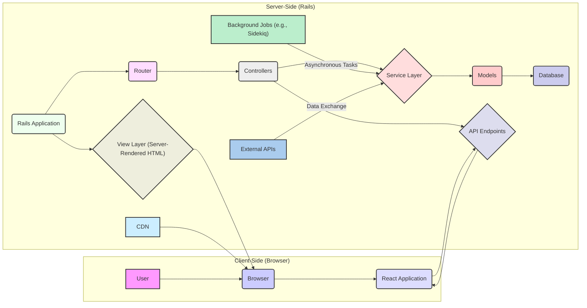
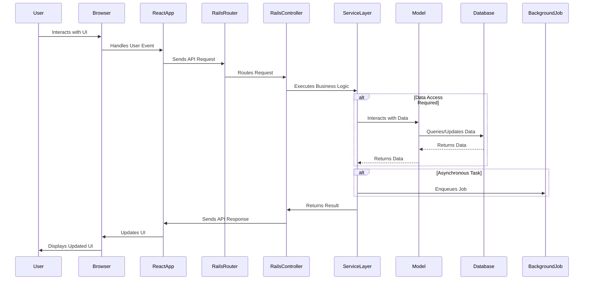

## Project Design Document: React on Rails Application (Improved)

**1. Introduction**

This document provides an enhanced architectural overview and detailed component breakdown of a web application built using the `react_on_rails` gem. This design serves as a robust foundation for subsequent threat modeling activities, offering a clear understanding of the system's structure, data flow, key interactions, and potential attack surfaces. The focus is on elements relevant to security analysis.

**2. Project Overview**

The `react_on_rails` project enables a powerful combination of the React JavaScript library for building rich user interfaces and the Ruby on Rails framework for a reliable backend. This architecture leverages Rails for server-side logic, routing, data management, and API development, while React handles dynamic UI rendering and user interactions on the client-side.

**3. Architectural Overview**

The application adheres to a client-server architecture with a distinct separation between the frontend (React) and backend (Rails). The interaction is primarily driven by API calls initiated from the client.

**4. Component Design**

This section provides a detailed breakdown of the application's key components, emphasizing their roles and potential security considerations.

*   **Client-Side (Browser):**
    *   **User:** The individual interacting with the application through a web browser. Their actions are the initial point of interaction.
    *   **Browser:** The user's web browser, responsible for rendering the UI and executing JavaScript code. Security features of the browser itself are relevant.
    *   **React Application:** The frontend application built with React. It manages the user interface, handles user interactions, and communicates with the backend via API calls. Key aspects include:
        *   **Components:** Reusable UI elements. Potential for XSS vulnerabilities if not handled carefully.
        *   **State Management (e.g., Redux, Zustand):** Stores application data on the client-side. Sensitive data requires careful handling.
        *   **Routing (e.g., React Router):** Manages navigation within the React application. Incorrect configuration can lead to unintended access.
        *   **API Client (e.g., Fetch API, Axios):** Responsible for making HTTP requests to the Rails backend. Configuration and handling of responses are crucial for security.

*   **Server-Side (Rails):**
    *   **Rails Application:** The core backend application built using the Ruby on Rails framework. It handles business logic, data persistence, and API endpoints.
    *   **Router:** Directs incoming HTTP requests to the appropriate controller action. Misconfigured routes can expose unintended functionality.
    *   **Controllers:** Handle incoming requests, authenticate and authorize users, interact with the service layer, and return responses. Vulnerable to injection attacks if input is not sanitized.
    *   **Service Layer (Interactors, Services):** Encapsulates business logic, promoting code reusability and maintainability. A key area for enforcing security rules and data validation.
    *   **Models:** Represent data structures and interact with the database using an ORM (e.g., ActiveRecord). Vulnerable to mass assignment and SQL injection if not properly secured.
    *   **Database (e.g., PostgreSQL, MySQL):** The persistent data store. Requires robust access controls and encryption.
    *   **API Endpoints:** Provide a programmatic interface for the React frontend to interact with the backend. Must be secured with authentication and authorization mechanisms.
    *   **View Layer (Server-Rendered HTML):** While primarily client-rendered, Rails might handle initial rendering or specific pages. Susceptible to XSS if dynamic content is not escaped.
    *   **CDN (Content Delivery Network):** Serves static assets. Compromise of the CDN can lead to serving malicious content.
    *   **Background Jobs (e.g., Sidekiq, Delayed Job):**  Handle asynchronous tasks. Security implications if jobs process sensitive data or interact with external systems without proper authorization.
    *   **External APIs:** Integrations with third-party services. Authentication, authorization, and secure data exchange are critical.

**5. Data Flow**

This section details the typical flow of data within the application, highlighting potential points of interception or manipulation.

*   **User Interaction:** The user interacts with the React application in their browser, initiating an action.
*   **Frontend Event Handling:** The React application captures the user event and updates its internal state or prepares an API request.
*   **API Request Initiation:** The React application's API client sends an HTTP request (e.g., GET, POST, PUT, DELETE) to a specific API endpoint on the Rails backend. This request may include data in the request body, headers, or query parameters.
*   **Rails Routing and Middleware:** The Rails router receives the request and, after passing through middleware (which can handle authentication, logging, etc.), directs it to the appropriate controller action.
*   **Controller Processing:** The controller action receives the request, potentially validates input, authenticates and authorizes the user, and interacts with the service layer.
*   **Service Layer Execution:** The service layer performs the core business logic, potentially interacting with models to access or modify data. This is where data validation and business rule enforcement should occur.
*   **Database Interaction:** Models use the ORM to query or update data in the database. The ORM helps prevent some SQL injection vulnerabilities, but careful use is still required.
*   **Background Job Enqueue (Optional):** If the operation is asynchronous, the controller or service layer might enqueue a background job.
*   **External API Interaction (Optional):** The service layer might interact with external APIs to retrieve or send data.
*   **API Response Generation:** The controller action prepares an HTTP response, typically in JSON format, containing the requested data or the result of the operation.
*   **Response Transmission:** The Rails backend sends the API response back to the React application.
*   **Frontend Response Handling:** The React application's API client receives the response and updates the application's state accordingly.
*   **UI Update:** The React application re-renders the user interface based on the updated state, reflecting the result of the user's action.
*   **Static Asset Delivery:** For initial page load and subsequent asset requests, the browser might retrieve static assets (JavaScript bundles, CSS, images) from the Rails server or a CDN.

**6. Security Considerations (Detailed)**

This section expands on potential security vulnerabilities, providing more specific examples relevant to threat modeling.

*   **Frontend Security:**
    *   **Cross-Site Scripting (XSS):**
        *   **Stored XSS:** Malicious scripts injected into the database and displayed to other users.
        *   **Reflected XSS:** Malicious scripts injected through URL parameters or form inputs and immediately reflected back to the user.
        *   **DOM-based XSS:** Vulnerabilities in client-side JavaScript code that manipulate the DOM based on attacker-controlled input.
    *   **Cross-Site Request Forgery (CSRF):** Exploiting the browser's automatic inclusion of cookies to make unauthorized requests to the application on behalf of an authenticated user.
    *   **Dependency Vulnerabilities:** Using outdated or vulnerable JavaScript libraries with known security flaws. Regular dependency updates and security scanning are crucial.
    *   **Client-Side Data Storage:** Storing sensitive information (e.g., API keys, session tokens) in `localStorage` or `sessionStorage` without proper encryption, making it accessible to malicious scripts.
    *   **Insecure Third-Party Libraries:** Using untrusted or poorly vetted third-party libraries that might introduce vulnerabilities.
    *   **Source Code Exposure:**  Accidental exposure of sensitive information or API keys within the client-side JavaScript code.

*   **Backend Security:**
    *   **SQL Injection:**  Exploiting vulnerabilities in database queries by injecting malicious SQL code through user inputs. Proper use of ORM features and parameterized queries is essential.
    *   **Authentication and Authorization:**
        *   **Weak Password Policies:** Allowing easily guessable passwords.
        *   **Insecure Session Management:**  Vulnerabilities in how user sessions are created, stored, and invalidated.
        *   **Missing or Weak Authorization Checks:** Allowing users to access resources or perform actions they are not authorized for.
    *   **Insecure API Endpoints:**
        *   **Lack of Input Validation:** Not properly validating and sanitizing user input, leading to injection attacks.
        *   **Mass Assignment Vulnerabilities:** Allowing users to modify unintended model attributes through API requests.
        *   **Lack of Rate Limiting:** Allowing excessive requests, leading to denial of service.
        *   **Missing Authentication/Authorization:** Exposing sensitive data or functionality without proper access controls.
    *   **Dependency Vulnerabilities:** Using outdated or vulnerable Ruby gems. Regular dependency updates and security audits are necessary.
    *   **Server-Side Request Forgery (SSRF):**  Allowing an attacker to make requests from the server to internal or external resources, potentially accessing sensitive information or performing unauthorized actions.
    *   **Insecure File Uploads:** Allowing users to upload malicious files that could be executed on the server or used for phishing attacks.
    *   **Exposure of Sensitive Information:**  Accidental disclosure of sensitive data in logs, error messages, or configuration files.
    *   **Insecure Deserialization:**  Vulnerabilities arising from deserializing untrusted data, potentially leading to remote code execution.

*   **Communication Security:**
    *   **Man-in-the-Middle (MITM) Attacks:**  Eavesdropping or tampering with communication between the client and server. Enforcing HTTPS is crucial.
    *   **Insecure WebSockets (if used):**  Lack of proper authentication and authorization on WebSocket connections.

*   **General Security:**
    *   **Insufficient Logging and Monitoring:**  Lack of adequate logging and monitoring makes it difficult to detect and respond to security incidents.
    *   **Insecure Configuration:**  Misconfigured servers or applications can introduce vulnerabilities.
    *   **Lack of Security Headers:**  Missing or misconfigured security headers (e.g., Content-Security-Policy, Strict-Transport-Security) can leave the application vulnerable to various attacks.

**7. Operational Considerations (Security Implications)**

While not strictly architectural, operational aspects have security implications:

*   **Deployment Process:**  Insecure deployment pipelines can introduce vulnerabilities.
*   **Server Security:**  Compromised servers can lead to full application compromise.
*   **Monitoring and Alerting:**  Lack of proper monitoring can delay detection of attacks.
*   **Backup and Recovery:**  Essential for recovering from security incidents.

**8. Future Considerations**

Potential future enhancements and their security implications:

*   **Real-time Features (WebSockets):** Introduces new attack surfaces related to WebSocket security.
*   **Microservices Architecture:** Increases complexity and the number of potential attack vectors between services. Requires careful inter-service authentication and authorization.
*   **Third-Party Integrations:** Introduces dependencies on external systems and their security posture.

**9. Conclusion**

This improved design document provides a more detailed and security-focused overview of the `react_on_rails` application architecture. It serves as a valuable and comprehensive resource for conducting thorough threat modeling, enabling the identification and mitigation of potential security risks across all layers of the application. The detailed component descriptions and data flow diagrams, along with the expanded security considerations, provide a solid foundation for proactive security measures.
