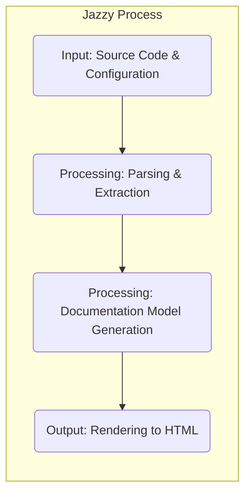
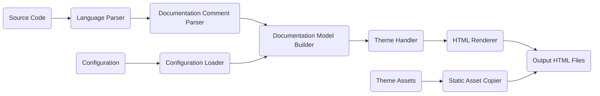

# Project Design Document: Jazzy - Swift and Objective-C Documentation Generator

**Version:** 1.1
**Date:** October 26, 2023
**Author:** Gemini (AI Language Model)

## 1. Introduction

This document provides an enhanced design overview of Jazzy, a command-line utility for generating documentation for Swift and Objective-C projects. This detailed description of the system's architecture, components, and data flow is crucial for effective threat modeling.

## 2. Project Overview

Jazzy is a tool that generates structured API documentation from Swift and Objective-C source code. It leverages compiler information and Markdown comments to produce developer-friendly HTML output.

## 3. Goals

*   Generate accurate and comprehensive API documentation for Swift and Objective-C codebases.
*   Support standard documentation comment syntax, including Markdown and potentially other formats.
*   Offer customizable output formats and theming capabilities for tailored documentation presentation.
*   Integrate smoothly into existing software development workflows and build processes.
*   Maintain efficient performance during documentation generation, even for large projects.

## 4. Non-Goals

*   Hosting or serving the generated documentation; this is the responsibility of separate infrastructure.
*   Directly managing the source code repository; Jazzy operates on a local copy of the codebase.
*   Providing a live, interactive documentation preview within an Integrated Development Environment (IDE).
*   Functioning as a full Content Management System (CMS) for documentation content.

## 5. Architecture Overview

Jazzy's operation can be broken down into three primary stages:

*   **Input:**  Acquiring and interpreting source code and configuration settings.
*   **Processing:** Analyzing the input, extracting relevant information, and constructing the documentation data model.
*   **Output:**  Transforming the documentation model into the desired output format, typically HTML.

## 6. Component Details

This section provides a more in-depth look at the key components within Jazzy's architecture.

### 6.1. Input Stage

*   **Source Code Reader:**
    *   Functionality: Reads Swift and Objective-C source files from the specified project directories.
    *   Details: Jazzy recursively traverses directories based on user-provided paths or configuration. It requires read permissions for all relevant source files. Potential security concerns include path traversal vulnerabilities if input isn't properly sanitized.
*   **Configuration Loader:**
    *   Functionality: Loads configuration parameters from a `.jazzy.yaml` file or command-line arguments.
    *   Details: This component parses the YAML file, which can contain settings for project name, output directory, theme selection, and other customizations. Security considerations include vulnerabilities in the YAML parsing library and the potential for malicious configuration values to cause unexpected behavior.

### 6.2. Processing Stage

*   **Language Parser (Swift & Objective-C):**
    *   Functionality:  Utilizes the respective language compilers or libraries providing similar functionality (like libSyntax for Swift) to parse the source code.
    *   Details: This involves lexical, syntactic, and semantic analysis to understand the code's structure and meaning. It extracts information about types, functions, properties, and their associated documentation comments. Potential threats include vulnerabilities in the parsing libraries that could be triggered by maliciously crafted source code, leading to crashes or unexpected behavior.
*   **Documentation Comment Parser:**
    *   Functionality: Identifies and parses documentation comments written in Markdown (or other supported formats) from the parsed source code.
    *   Details: This component needs to correctly identify comment delimiters (e.g., `///`, `/**`) and parse the Markdown content according to the specified rules. Security concerns involve the potential for malicious Markdown to be interpreted in unintended ways, potentially leading to cross-site scripting (XSS) vulnerabilities in the generated documentation.
*   **Documentation Model Builder:**
    *   Functionality: Constructs an internal, structured representation (data model) of the documentation.
    *   Details: This model organizes the extracted code structure and documentation comments into a hierarchical format suitable for rendering. It might involve creating objects or data structures representing modules, classes, methods, and their properties, along with their associated documentation.
*   **Theme Handler:**
    *   Functionality:  Applies the selected theme to the documentation model to determine the visual presentation of the output.
    *   Details: Themes typically consist of templates (e.g., using templating engines like Handlebars or Liquid), stylesheets (CSS), and potentially JavaScript files. The theme handler processes the documentation model using these templates to generate the final output structure. Security risks include template injection vulnerabilities if user-provided data is not properly sanitized before being used in template rendering.

### 6.3. Output Stage

*   **HTML Renderer:**
    *   Functionality:  Generates HTML files based on the processed documentation model and the active theme.
    *   Details: This component takes the structured data and uses the theme's templates to produce the final HTML output. It handles the layout, formatting, and linking of different documentation pages. Security considerations involve ensuring that the templating engine is used securely to prevent injection attacks and that generated HTML is free from XSS vulnerabilities.
*   **Static Asset Copier:**
    *   Functionality: Copies static assets (e.g., CSS files, JavaScript files, images, fonts) from the selected theme to the output directory.
    *   Details: This ensures that the generated HTML has the necessary styling and interactive elements. Security risks include the possibility of malicious files being included in themes, which could then be served alongside the generated documentation.

## 7. Data Flow

The data flows through Jazzy in a defined sequence of transformations:

1. **Source code files and configuration files are read** from the specified input locations by the Source Code Reader and Configuration Loader, respectively.
2. The **Language Parser analyzes the source code**, extracting its structural and semantic information.
3. The **Documentation Comment Parser identifies and extracts** the documentation comments associated with code elements.
4. The **Documentation Model Builder creates an internal, structured representation** of the documentation by combining the parsed code structure and documentation comments.
5. The **Theme Handler applies the selected theme** to the documentation model, preparing it for rendering.
6. The **HTML Renderer generates HTML files** based on the themed documentation model.
7. **Static assets from the theme are copied** to the output directory by the Static Asset Copier.
8. The **final HTML documentation files are written** to the designated output directory.

## 8. Security Considerations (Detailed for Threat Modeling)

This section expands on potential security considerations to facilitate thorough threat modeling.

*   **Input Validation Vulnerabilities:**
    *   Threat: Maliciously crafted source code could exploit vulnerabilities in the Language Parser, leading to denial-of-service (DoS) or even remote code execution (RCE). For example, deeply nested structures or excessively long identifiers could crash the parser.
    *   Mitigation: Implement robust input validation and sanitization for source code. Utilize secure parsing libraries and keep them updated. Consider sandboxing the parsing process.
    *   Threat: Maliciously crafted `.jazzy.yaml` files could exploit vulnerabilities in the Configuration Loader, potentially leading to arbitrary file reads or writes if the configuration allows specifying file paths without proper validation.
    *   Mitigation:  Strictly validate all configuration parameters. Avoid allowing configuration options that directly manipulate file system paths without thorough sanitization. Use a secure YAML parsing library.
*   **Output Sanitization (XSS) Vulnerabilities:**
    *   Threat: If user-provided documentation comments contain malicious scripts, the HTML Renderer might inject these scripts into the generated HTML, leading to cross-site scripting (XSS) attacks when the documentation is viewed in a browser. For example, including `<script>` tags in Markdown comments.
    *   Mitigation:  Thoroughly sanitize all user-provided content before rendering it to HTML. Use a well-vetted Markdown processing library that escapes potentially harmful HTML tags. Employ Content Security Policy (CSP) in the generated HTML.
*   **Dependency Vulnerabilities:**
    *   Threat: Jazzy relies on various third-party libraries (e.g., for YAML parsing, Markdown processing, templating). Vulnerabilities in these dependencies could be exploited if not properly managed.
    *   Mitigation: Implement a robust dependency management strategy. Regularly scan dependencies for known vulnerabilities using tools like `bundler-audit` (for Ruby). Keep dependencies updated to their latest secure versions.
*   **Theme Security Risks:**
    *   Threat: If Jazzy allows users to specify arbitrary themes from untrusted sources, malicious themes could contain scripts or other harmful content that could be executed when the generated documentation is viewed. This could lead to XSS or other client-side attacks.
    *   Mitigation:  Provide a set of curated and vetted themes. If allowing custom themes, implement strict validation and sandboxing of theme code. Avoid executing arbitrary code within the theme rendering process.
*   **File System Access Control Issues:**
    *   Threat: If Jazzy runs with excessive file system permissions, vulnerabilities could be exploited to read or modify sensitive files outside the intended project directory.
    *   Mitigation:  Operate Jazzy with the least necessary privileges. Clearly define the required file system permissions and avoid granting broader access.
*   **Command Injection Vulnerabilities:**
    *   Threat: If Jazzy executes external commands based on user input or configuration (though less likely in this specific tool), there's a risk of command injection vulnerabilities if input is not properly sanitized.
    *   Mitigation: Avoid executing external commands based on user-controlled input. If necessary, implement strict input validation and use safe methods for executing commands.
*   **Information Disclosure:**
    *   Threat:  Error messages or verbose logging could inadvertently disclose sensitive information about the project structure or internal workings of Jazzy.
    *   Mitigation: Implement proper error handling and logging practices. Avoid exposing sensitive information in error messages or logs.

## 9. Technologies Used

*   **Primary Programming Languages:** Swift, Ruby (primarily for the command-line interface and potentially some internal logic).
*   **Swift Parsing:** Likely utilizes `libSyntax` or compiler APIs for parsing Swift code.
*   **Objective-C Parsing:**  Potentially uses `clang` libraries or related tools for parsing Objective-C code.
*   **Templating Engine:**  Commonly uses templating engines like Handlebars or Liquid for generating HTML from templates and data.
*   **Markdown Processing:**  Likely employs a Markdown parsing library such as `kramdown` (in the Ruby ecosystem) or a similar library.
*   **YAML Parsing:**  Uses a YAML parsing library like `Psych` (standard library in Ruby) for processing the `.jazzy.yaml` configuration file.

## 10. Future Considerations

*   Enhanced support for newer Swift language features and documentation syntax (e.g., DocC).
*   Improved error handling, reporting, and debugging capabilities.
*   More granular customization options for output formatting and content.
*   Performance optimizations for handling extremely large codebases.
*   Potential integration with CI/CD pipelines for automated documentation generation.

This improved design document provides a more detailed and security-focused overview of Jazzy's architecture and components, serving as a stronger foundation for subsequent threat modeling activities.