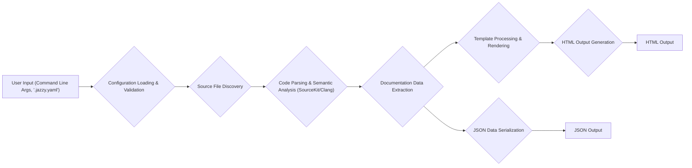

# Project Design Document: Jazzy - Swift and Objective-C Documentation Generator

**Version:** 1.1
**Date:** October 26, 2023
**Author:** AI Software Architect

## 1. Introduction

This document provides an enhanced design overview of Jazzy, a command-line tool designed for generating comprehensive documentation for Swift and Objective-C projects. This document serves as a foundational resource for subsequent threat modeling and further development efforts.

### 1.1. Project Overview

Jazzy automates the creation of developer-friendly documentation in both HTML and JSON formats directly from Swift and Objective-C source code. It leverages the power of Clang and SourceKit to deeply understand code structure and extract information from specially formatted comments. The primary aim of Jazzy is to offer a robust, customizable, and visually appealing documentation solution for software projects.

### 1.2. Goals

* **Accuracy and Completeness:** Generate documentation that faithfully represents the structure and functionality of Swift and Objective-C codebases.
* **Standard Output Formats:** Produce documentation in widely adopted formats (HTML for browsing, JSON for programmatic access and integration).
* **Extensibility and Customization:** Offer flexible options for tailoring the appearance and content of the generated documentation.
* **Modern Language Compatibility:** Maintain up-to-date support for the latest features and syntax of both Swift and Objective-C.
* **Performance and Efficiency:** Process large codebases effectively and within reasonable timeframes.

### 1.3. Scope

This design document encompasses the core operational aspects of Jazzy, including:

* Parsing and analysis of Swift and Objective-C source files.
* Extraction of documentation from code comments and structural elements.
* Generation of documentation output in HTML and JSON formats.
* Mechanisms for configuring and customizing the documentation process.
* Interactions with external dependencies such as SourceKit and Clang.

The scope of this document explicitly excludes:

* Specific details of the user interface and user experience (UI/UX) of the generated documentation.
* In-depth implementation details of the underlying libraries (SourceKit, Clang) themselves.
* The processes for packaging, distributing, and installing Jazzy.

## 2. System Architecture

Jazzy operates as a command-line utility, taking project source code as input and producing formatted documentation as output. The architectural flow involves several distinct stages of processing.

### 2.1. High-Level Architecture

### 2.2. Key Components

* **Command Line Interface (CLI) Handler:**
    *  Responsible for receiving and interpreting user commands and arguments passed to the `jazzy` executable.
    *  Handles the initial invocation of the documentation generation process.

* **Configuration Manager:**
    *  Loads and validates configuration settings from both command-line arguments and the optional `.jazzy.yaml` configuration file.
    *  Provides a unified interface for accessing configuration parameters throughout the application.

* **Source Code Locator:**
    *  Identifies all relevant Swift and Objective-C source files within the specified project directories based on configuration settings.
    *  May employ filtering and exclusion rules defined in the configuration.

* **Code Parser & Analyzer (SourceKit/Clang Interface):**
    *  The core component responsible for understanding the structure and semantics of the source code.
    *  Leverages Apple's SourceKit framework for Swift code and potentially interacts with Clang libraries for Objective-C.
    *  Extracts information about classes, structures, functions, properties, and comments.

* **Documentation Extractor:**
    *  Processes the structured code representation provided by the parser.
    *  Identifies and extracts documentation comments (e.g., `///` for Swift, `/** */` for Objective-C).
    *  Associates documentation comments with the corresponding code elements.

* **Template Processor:**
    *  Utilizes a templating engine (likely Liquid) to generate the final HTML output.
    *  Takes the extracted documentation data and applies it to predefined HTML templates.
    *  Allows for customization of the documentation's visual appearance and structure.

* **HTML Output Generator:**
    *  Renders the processed templates with the extracted documentation data to produce the final HTML files.
    *  Organizes the generated HTML into a navigable structure.

* **JSON Output Generator:**
    *  Serializes the extracted documentation data into a structured JSON format.
    *  Provides a machine-readable representation of the documentation.

### 2.3. Data Flow

1. **User Invocation:** The user executes the `jazzy` command, providing project paths and configuration options.
2. **Configuration Loading:** The CLI Handler passes control to the Configuration Manager, which loads and validates settings from command-line arguments and the `.jazzy.yaml` file.
3. **Source Discovery:** The Source Code Locator uses the configured paths and filters to identify the Swift and Objective-C source files to be documented.
4. **Code Parsing and Analysis:** For each identified source file, the Code Parser & Analyzer interacts with SourceKit (for Swift) or potentially Clang (for Objective-C) to parse the code and obtain a structured representation of its syntax and semantics.
5. **Documentation Extraction:** The Documentation Extractor analyzes the parsed code structure and extracts documentation comments associated with code elements.
6. **Template Processing (HTML):** The extracted documentation data is passed to the Template Processor, which applies it to HTML templates to generate the documentation content.
7. **HTML Output Generation:** The HTML Output Generator renders the processed templates into static HTML files, organizing them into a browsable documentation structure.
8. **JSON Serialization:** Simultaneously, the extracted documentation data is passed to the JSON Output Generator, which serializes it into a JSON file.
9. **Output Generation:** The generated HTML files and the JSON file are written to the specified output directory.

## 3. Key Technologies

* **Primary Programming Language:** Ruby (for the core logic and CLI).
* **Swift Interaction:** Utilizes the Swift programming language and potentially Swift Package Manager (SPM) for interacting with SourceKit.
* **Objective-C Interaction:** May involve interaction with Objective-C and potentially Clang libraries for parsing and analysis.
* **Templating Engine:** Likely Liquid (a common and flexible Ruby templating language).
* **Output Formats:** HTML (for web-based documentation), JSON (for structured data).
* **Configuration Format:** YAML (typically used for the `.jazzy.yaml` configuration file).
* **Command Line Interface Handling:**  Likely uses a Ruby gem for simplifying command-line argument parsing and handling.

## 4. Deployment

Jazzy is primarily intended as a command-line tool for developers and CI/CD environments.

* **Installation:** Typically installed as a Ruby gem using the command `gem install jazzy`.
* **Local Execution:** Developers run Jazzy from their terminal within the root directory of their Swift or Objective-C project.
* **CI/CD Integration:** Jazzy can be integrated into Continuous Integration and Continuous Delivery pipelines to automatically generate documentation as part of the build process. This often involves adding a step to the CI/CD configuration to execute the `jazzy` command.
* **Configuration:** Configuration is managed through command-line arguments passed to the `jazzy` executable or via a `.jazzy.yaml` file placed in the project's root directory.

## 5. Security Considerations (Detailed)

This section outlines potential security considerations relevant to Jazzy's design and operation. A more comprehensive threat model will build upon these points.

* **Input Validation Vulnerabilities:**
    * **Malicious Configuration Files:**  Improper validation of the `.jazzy.yaml` file could allow an attacker to inject malicious code or manipulate Jazzy's behavior.
    * **Command Injection:**  Insufficient sanitization of command-line arguments could lead to command injection vulnerabilities if Jazzy executes external commands based on user input.

* **Dependency Vulnerabilities:**
    * **Third-Party Gems:** Jazzy relies on various Ruby gems. Vulnerabilities in these dependencies could be exploited if not regularly updated.
    * **SourceKit/Clang Issues:**  While less direct, vulnerabilities within the underlying SourceKit or Clang libraries could potentially be leveraged if Jazzy doesn't handle their output or interactions securely.

* **Output Security Risks:**
    * **Cross-Site Scripting (XSS):** If user-provided content within documentation comments is not properly sanitized before being included in the generated HTML, it could lead to XSS vulnerabilities in the documentation.
    * **Information Disclosure:**  Care must be taken to ensure that sensitive information is not inadvertently included in the generated documentation output.

* **Access Control and Permissions:**
    * **Source Code Access:** Jazzy requires read access to the project's source code. Ensuring appropriate file system permissions is crucial to prevent unauthorized access.
    * **Configuration File Security:** The `.jazzy.yaml` file can contain sensitive configuration information. Protecting this file from unauthorized modification is important.

* **Denial of Service (DoS):**
    * **Resource Exhaustion:** Processing extremely large or complex codebases could potentially lead to resource exhaustion and denial of service if Jazzy is not designed to handle such scenarios efficiently.

## 6. Future Considerations

* **Enhanced Language Feature Support:** Continuously update Jazzy to support new language features and syntax additions in Swift and Objective-C.
* **Improved Customization Options:**
    *  Provide more granular control over the styling and layout of the generated HTML documentation.
    *  Allow users to create custom themes or templates more easily.
* **Integration with Documentation Hosting Platforms:**  Streamline the process of deploying generated documentation to popular platforms.
* **Interactive Documentation Features:** Explore the possibility of adding interactive elements to the generated documentation.
* **Performance Optimizations:**  Investigate and implement optimizations to improve the speed and efficiency of documentation generation, especially for large projects.
* **Plugin Architecture:**  Consider developing a plugin architecture to allow for extending Jazzy's functionality and integrating with other tools.