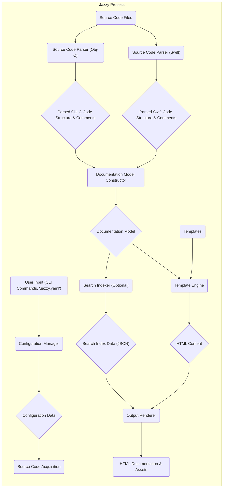

# Project Design Document: Jazzy - Swift and Objective-C Documentation Generator

**Version:** 1.1
**Date:** October 26, 2023
**Author:** AI Software Architect

## 1. Introduction

This document provides a detailed design overview of Jazzy, a command-line utility for generating Apple-style documentation from Swift and Objective-C source code. This document serves as a foundation for subsequent threat modeling activities. It outlines the system's architecture, components, data flow, and interactions, highlighting key areas of potential security concern with more specific examples.

## 2. Goals

The primary goals of Jazzy are:

*   To generate high-quality, developer-friendly documentation for Swift and Objective-C projects, mirroring the style of Apple's official documentation.
*   To parse source code comments (using conventions like `///` for Swift and `/** */` for Objective-C) and extract relevant information such as parameter descriptions, return values, and author information for documentation.
*   To produce output primarily in HTML format, with considerations for accessibility and modern web standards.
*   To be configurable through a YAML file (`.jazzy.yaml`) and command-line options, allowing users to customize the documentation generation process.
*   To be extensible through theming and potentially plugins, enabling adaptation to different project needs and styles.

## 3. Architecture Overview

Jazzy operates as a command-line tool that takes source code files and configuration settings as input and produces a directory of static HTML documentation files and associated assets as output. The core architecture can be broken down into the following distinct stages:

*   **Configuration Loading and Validation:**  Reading the `.jazzy.yaml` configuration file and command-line arguments, validating the provided settings, and establishing the parameters for the documentation generation process.
*   **Source Code Acquisition:** Identifying and locating the Swift and Objective-C source files that need to be processed, based on the configured input paths.
*   **Source Code Parsing and Semantic Analysis:** Analyzing the identified source files using language-specific parsers (potentially leveraging tools like SourceKit for Swift) to extract the structure of the code, including classes, functions, properties, and associated comments.
*   **Documentation Model Construction:** Building an internal representation (a data model) of the documentation content based on the parsed source code information. This model organizes the extracted data in a structured manner suitable for template processing.
*   **Template Application and Content Generation:** Applying pre-defined or custom templates (likely using a templating engine) to the documentation model to generate the raw documentation content in a markup language (e.g., HTML).
*   **Output Rendering and Asset Generation:** Rendering the generated documentation content into final HTML files, and generating associated static assets such as CSS stylesheets, JavaScript files for search functionality, and image assets.

## 4. Component Details

This section provides more detailed information about the key components within the Jazzy system:

*   **Command-Line Interface (CLI) (`bin/jazzy`):**
    *   Entry point for user interaction. Accepts commands like `jazzy` with various options (e.g., `--config`, `--output`).
    *   Uses a library for argument parsing (e.g., `OptionParser` in Ruby) to process command-line inputs.
    *   Dispatches execution to the appropriate internal modules based on the provided commands and options.
    *   Provides feedback to the user through standard output and error streams, indicating progress and potential issues.
*   **Configuration Manager (`lib/jazzy/config.rb`):**
    *   Responsible for loading configuration settings from the `.jazzy.yaml` file and command-line arguments.
    *   Performs validation of configuration parameters (e.g., checking for valid file paths, ensuring required options are present).
    *   Merges configuration from different sources (command-line overrides file settings).
    *   Provides a centralized access point for other components to retrieve configuration values.
*   **Source Code Parser (Swift) (`lib/jazzy/parser/swift.rb`):**
    *   Utilizes external tools like `SourceKit` (via command-line invocation or library bindings) to parse Swift source code.
    *   Extracts structured information about Swift declarations, including names, types, access modifiers, and documentation comments.
    *   Handles different Swift language features and syntax.
*   **Source Code Parser (Objective-C) (`lib/jazzy/parser/objc.rb`):**
    *   Employs techniques for parsing Objective-C header files (`.h` and `.m` files).
    *   May use regular expressions or dedicated parsing libraries to extract information about classes, protocols, methods, and properties.
    *   Handles Objective-C specific syntax and documentation comment conventions.
*   **Documentation Generator (`lib/jazzy/doc_builder.rb`):**
    *   Takes the parsed source code information (represented in an internal data structure) as input.
    *   Organizes the documentation content into logical units (e.g., modules, classes, functions).
    *   Resolves cross-references between different parts of the documentation.
    *   Prepares the data for rendering using the template engine.
*   **Template Engine (`lib/jazzy/templates/**/*.erb`):**
    *   Uses a templating language (likely Embedded Ruby - ERB) to generate HTML markup.
    *   Templates define the structure and layout of the documentation pages.
    *   Receives data from the Documentation Generator and dynamically inserts it into the HTML templates.
    *   May include custom helper functions or logic to format and present the documentation content.
*   **Output Renderer (`lib/jazzy/writer.rb`):**
    *   Takes the generated HTML content from the Template Engine.
    *   Writes the HTML content to individual files in the output directory.
    *   Copies static assets (CSS, JavaScript, images) from the template or predefined locations to the output directory.
    *   Organizes the output files into a logical directory structure (e.g., separating class documentation into individual files).
*   **Search Indexer (`lib/jazzy/search_index.rb` - Optional):**
    *   Generates an index of the documentation content to enable client-side search functionality.
    *   Typically creates a JSON file containing the indexed data (e.g., titles, descriptions, URLs of documented elements).
    *   This JSON file is then used by JavaScript code in the generated HTML to perform search queries.

## 5. Data Flow Diagram

## 6. Interactions

Jazzy interacts with the following external entities and systems:

*   **File System:**
    *   Reads the `.jazzy.yaml` configuration file.
    *   Reads Swift and Objective-C source code files from specified directories.
    *   Reads template files used for generating the documentation.
    *   Writes the generated HTML documentation files and associated assets (CSS, JavaScript, images) to the output directory.
*   **Command Line:**
    *   Receives user commands and arguments when Jazzy is executed.
    *   Outputs status messages, warnings, and errors to the console.
    *   May invoke external commands (e.g., interacting with `SourceKit`).
*   **External Libraries/Dependencies (Ruby Gems):**
    *   Relies on various Ruby gems for functionalities such as:
        *   YAML parsing (e.g., `psych`).
        *   Command-line argument parsing (e.g., `optparse`).
        *   Templating (e.g., `erb`).
        *   Markdown processing (if used for comment rendering).
        *   Potentially HTTP libraries for fetching remote resources (though less common in core Jazzy).
*   **SourceKit (for Swift parsing):**
    *   Interacts with Apple's `SourceKit` framework, typically by invoking the `sourcekitd` daemon or using language bindings.
    *   Sends requests to `SourceKit` to obtain detailed information about Swift code structure and semantics.
*   **Web Browsers:**
    *   The generated HTML documentation is intended to be viewed in web browsers.
    *   The documentation may include client-side JavaScript for features like search.

## 7. Security Considerations (Preliminary)

This section outlines potential security considerations that will be further explored during threat modeling, providing more specific examples:

*   **Input Validation Vulnerabilities:**
    *   **Malicious Configuration Files:** A crafted `.jazzy.yaml` file could attempt to specify arbitrary file paths for input or output, potentially leading to information disclosure or file manipulation outside the intended project directory. For example, specifying `/etc/passwd` as a source file.
    *   **Exploiting Parser Weaknesses:**  Specially crafted Swift or Objective-C source code with unusual or malformed comments could potentially crash the parsing logic or lead to unexpected behavior if the parsers are not robust against such inputs. This could be a denial-of-service vector.
    *   **Template Injection:** If Jazzy were to allow users to provide arbitrary templates without proper sanitization, malicious template code could be injected, leading to arbitrary code execution on the server or client-side when the documentation is generated or viewed.
*   **Output Sanitization Issues (Cross-Site Scripting - XSS):**
    *   **Unescaped User Comments:** If user-provided content within source code comments (e.g., using Markdown or HTML tags) is not properly escaped when generating HTML, it could lead to XSS vulnerabilities in the generated documentation. An attacker could inject malicious JavaScript that executes when other users view the documentation.
    *   **Vulnerabilities in Template Logic:**  Errors or oversights in the template code itself could introduce XSS vulnerabilities if data is not handled securely before being inserted into the HTML.
*   **Dependency Vulnerabilities:**
    *   **Outdated Gems:** Jazzy relies on various Ruby gems. If these gems have known security vulnerabilities and are not updated, the system could be susceptible to exploits. For example, a vulnerable version of a Markdown parsing gem could be exploited through crafted comments.
    *   **Supply Chain Attacks:**  Compromised dependencies could introduce malicious code into the Jazzy tool itself.
*   **File System Access Control Issues:**
    *   **Path Traversal:** If Jazzy does not properly sanitize file paths provided in the configuration or command line, an attacker could potentially read or write files outside the intended project directory.
    *   **Overly Permissive Output Directory:** If the output directory for the generated documentation has overly permissive permissions, unauthorized users could modify or delete the generated files.
*   **Command Injection Vulnerabilities:**
    *   **Unsafe Use of External Commands:** If Jazzy constructs commands to execute external tools (like `SourceKit`) based on user-provided input without proper sanitization, it could be vulnerable to command injection attacks. An attacker could inject malicious commands into the input that are then executed by the system.
*   **Information Disclosure:**
    *   **Verbose Error Messages:**  Detailed error messages or debug output could inadvertently reveal sensitive information about the project structure, file paths, or internal workings of Jazzy.
    *   **Exposure of Internal Data:** If the generated documentation includes internal data structures or debugging information, it could provide attackers with insights into the system.

## 8. Deployment Considerations

Jazzy is typically deployed as a command-line tool executed within a development environment or a CI/CD pipeline. Key deployment considerations include:

*   **Ruby Environment:** Requires a compatible Ruby environment (including the Ruby interpreter and necessary development headers if compiling native extensions).
*   **Gem Dependencies:**  Dependencies are managed through Bundler, requiring a `Gemfile` and `Gemfile.lock` in the project.
*   **Installation:** Typically installed using `gem install jazzy` or by including it in a project's `Gemfile`.
*   **Execution Context:**  Needs appropriate permissions to read source files and write to the output directory.
*   **CI/CD Integration:** Commonly integrated into CI/CD workflows to automatically generate documentation on code changes, often triggered by Git hooks or build processes.
*   **Containerization (Optional):** Can be containerized using Docker to ensure a consistent and reproducible environment for documentation generation.

## 9. Future Considerations

*   Enhanced support for different documentation markup languages within comments.
*   More flexible theming options and a wider range of built-in themes.
*   Plugin architecture to allow for extending Jazzy's functionality.
*   Improved error reporting and debugging capabilities.
*   Integration with online documentation hosting platforms.

This improved document provides a more detailed and nuanced understanding of the Jazzy project's design, offering a stronger foundation for identifying and mitigating potential security threats during the threat modeling process. The added specifics and examples within the security considerations section aim to highlight concrete areas of concern.