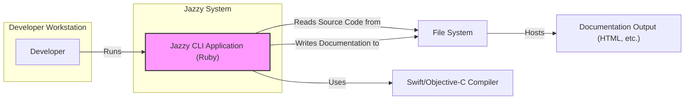
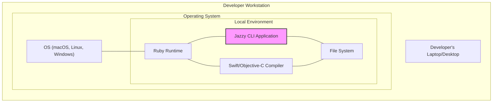
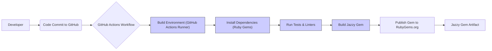

# BUSINESS POSTURE

This project, Jazzy, is a documentation generator for Swift and Objective-C.

- Business Priorities:
  - To provide a tool that automatically generates developer documentation from source code.
  - To improve developer productivity by reducing the manual effort required to create and maintain documentation.
  - To enhance code understanding and maintainability through clear and accessible documentation.
  - To potentially enable sharing of documentation with external users or customers.

- Business Goals:
  - To create comprehensive and well-formatted documentation for Swift and Objective-C projects.
  - To ensure documentation is up-to-date with the latest code changes.
  - To make documentation easily accessible to developers and other stakeholders.
  - To support various documentation formats and output options.

- Business Risks:
  - Risk of inaccurate or incomplete documentation if the tool fails to correctly parse source code.
  - Risk of exposing sensitive information if documentation generation process is not secure or if documentation is publicly accessible without proper authorization.
  - Risk of reduced developer productivity if the tool is unreliable, difficult to use, or generates poor quality documentation.
  - Risk of supply chain vulnerabilities if dependencies used by Jazzy are compromised.
  - Risk of availability issues if the documentation generation process or hosting infrastructure is not resilient.

# SECURITY POSTURE

- Security Controls:
  - security control: Access to the Jazzy GitHub repository is controlled by GitHub's authentication and authorization mechanisms. Implemented by: GitHub.
  - security control: Code review process for contributions to the Jazzy project. Implemented by: Jazzy project maintainers (process).
  - security control: Usage of GitHub's issue tracking and pull request system for managing changes. Implemented by: GitHub.

- Accepted Risks:
  - accepted risk: Vulnerabilities in dependencies used by Jazzy, as dependency management is inherent to software projects.
  - accepted risk: Potential for community contributions to introduce security issues, mitigated by code review.
  - accepted risk: Reliance on the security of the underlying Ruby runtime environment.

- Recommended Security Controls:
  - security control: Implement automated dependency scanning to identify and address vulnerabilities in Jazzy's dependencies.
  - security control: Integrate static analysis security testing (SAST) tools into the Jazzy build process to detect potential security flaws in the code.
  - security control: Implement input validation and sanitization for source code parsing to prevent code injection or other vulnerabilities.
  - security control: Secure the process of publishing and distributing Jazzy as a gem to prevent supply chain attacks.
  - security control: If Jazzy is used in a CI/CD pipeline, ensure the pipeline itself is secure and access controlled.

- Security Requirements:
  - Authentication:
    - Not directly applicable to Jazzy itself as a command-line tool. Authentication might be relevant if Jazzy is integrated into a web-based documentation platform or CI/CD pipeline, but this is outside the scope of Jazzy itself.
  - Authorization:
    - Authorization is relevant for access to the Jazzy GitHub repository and potentially for access to any systems where Jazzy is deployed or used in a CI/CD pipeline. GitHub handles authorization for the repository. For deployment environments, authorization should be configured based on the specific context.
  - Input Validation:
    - Robust input validation is crucial for Jazzy to prevent vulnerabilities when parsing Swift and Objective-C source code. Jazzy must validate input file paths, command-line arguments, and the content of source code files to prevent malicious code injection or other attacks.
  - Cryptography:
    - Cryptography is not a primary security requirement for Jazzy itself. However, if Jazzy is used to handle or process sensitive data during documentation generation (e.g., API keys, secrets in code comments), then appropriate cryptographic measures might be needed in the projects that use Jazzy, but not within Jazzy itself. Secure communication (HTTPS) should be used if documentation is hosted on a web server.

# DESIGN

## C4 CONTEXT

```mermaid
flowchart LR
    subgraph "Organization Context"
    A["Developer"]
    B["Swift/Objective-C Project Source Code"]
    C["Documentation Hosting Platform"]
    end

    D("Jazzy")

    A -- "Uses" --> D
    B -- "Provides Input to" --> D
    D -- "Generates Documentation" --> C
    D -- "Uses" --> "Swift/Objective-C Compiler"

    style D fill:#f9f,stroke:#333,stroke-width:2px
```

- Context Diagram Elements:
  - - Name: Developer
    - Type: Person
    - Description: Software developers who use Jazzy to generate documentation for their Swift and Objective-C projects.
    - Responsibilities: Uses Jazzy to create and maintain project documentation. Configures Jazzy and integrates it into their development workflow.
    - Security controls: Authentication to developer workstations, authorization to access source code repositories and documentation hosting platforms.

  - - Name: Swift/Objective-C Project Source Code
    - Type: System
    - Description: The codebase of Swift or Objective-C projects for which documentation needs to be generated.
    - Responsibilities: Contains the source code that Jazzy parses to generate documentation.
    - Security controls: Access control to source code repositories, code review processes, secure coding practices.

  - - Name: Documentation Hosting Platform
    - Type: System
    - Description: A platform where the generated documentation is hosted and made accessible. This could be a web server, a static site hosting service, or a documentation-specific platform.
    - Responsibilities: Hosts and serves the generated documentation to users. Provides access control and availability for the documentation.
    - Security controls: Authentication and authorization for access to the platform, security hardening of the hosting infrastructure, protection against DDoS attacks.

  - - Name: Jazzy
    - Type: Software System
    - Description: The documentation generation tool itself, written in Ruby, that parses Swift and Objective-C source code and generates documentation in various formats.
    - Responsibilities: Parses source code, generates documentation, and provides configuration options for documentation generation.
    - Security controls: Input validation, dependency management, secure build process, access control to the Jazzy codebase and distribution mechanisms.

  - - Name: Swift/Objective-C Compiler
    - Type: System
    - Description: Compilers used by Jazzy to understand and parse Swift and Objective-C code.
    - Responsibilities: Compiles and provides information about the source code structure to Jazzy.
    - Security controls: Assumed to be trusted components in the development environment. Security of compilers is generally managed by the operating system and development toolchain.

## C4 CONTAINER



- Container Diagram Elements:
  - - Name: Jazzy CLI Application (Ruby)
    - Type: Container
    - Description: The core Jazzy application, implemented as a command-line interface tool written in Ruby. It's responsible for parsing source code, generating documentation, and handling user configurations.
    - Responsibilities: Source code parsing, documentation generation, configuration management, command-line interface.
    - Security controls: Input validation, dependency management, secure coding practices in Ruby, secure distribution as a gem.

  - - Name: File System
    - Type: Container
    - Description: The local file system on the developer's workstation or build server where Jazzy reads source code from and writes generated documentation to.
    - Responsibilities: Storage of source code, temporary files, and generated documentation.
    - Security controls: File system permissions, access control to the workstation or server, data loss prevention measures.

  - - Name: Swift/Objective-C Compiler
    - Type: External System
    - Description:  The Swift and Objective-C compilers (like `swiftc` and `clang`) that Jazzy utilizes to understand the syntax and structure of the source code.
    - Responsibilities: Compiling and providing semantic information about the source code to Jazzy.
    - Security controls: Assumed to be trusted components. Security is managed at the OS and toolchain level.

  - - Name: Documentation Output (HTML, etc.)
    - Type: Container
    - Description: The generated documentation files in formats like HTML, Markdown, or others, produced by Jazzy.
    - Responsibilities: Represents the final documentation artifacts ready for deployment or hosting.
    - Security controls: Integrity checks of generated files, secure transfer to hosting platforms, access control on hosting platforms.

## DEPLOYMENT

Deployment scenario: Developer's Local Machine



- Deployment Diagram Elements (Developer's Local Machine):
  - - Name: Developer's Laptop/Desktop
    - Type: Infrastructure Node
    - Description: The physical or virtual machine used by a developer to run Jazzy and generate documentation locally.
    - Responsibilities: Provides the environment for running Jazzy, including operating system, runtime, and file system.
    - Security controls: Workstation security policies, operating system security hardening, endpoint protection software, physical security of the device.

  - - Name: OS (macOS, Linux, Windows)
    - Type: Software
    - Description: The operating system running on the developer's machine, providing core services and isolation.
    - Responsibilities: Resource management, process isolation, security features provided by the OS.
    - Security controls: OS security updates and patching, user account management, access control lists, firewall.

  - - Name: Ruby Runtime
    - Type: Software
    - Description: The Ruby runtime environment required to execute the Jazzy application.
    - Responsibilities: Execution environment for Jazzy, dependency management for Ruby gems.
    - Security controls: Keeping Ruby runtime updated with security patches, using trusted Ruby distributions.

  - - Name: Jazzy CLI Application
    - Type: Software
    - Description: The Jazzy application itself, deployed as a Ruby gem and executed within the Ruby runtime.
    - Responsibilities: Documentation generation logic, command-line interface.
    - Security controls: Gem integrity verification, running with least privilege, input validation.

  - - Name: Swift/Objective-C Compiler
    - Type: Software
    - Description: The Swift and Objective-C compilers installed on the developer's machine, used by Jazzy.
    - Responsibilities: Code compilation and parsing for Jazzy.
    - Security controls: Compiler integrity, using trusted compiler sources.

  - - Name: File System
    - Type: Infrastructure Node
    - Description: The local file system on the developer's machine where source code and documentation are stored.
    - Responsibilities: Storage of files, access control to files.
    - Security controls: File system permissions, disk encryption, backup and recovery.

## BUILD



- Build Process Elements:
  - - Name: Developer
    - Type: Person
    - Description: A developer who writes code and contributes to the Jazzy project.
    - Responsibilities: Writes code, commits changes to the Git repository.
    - Security controls: Developer workstation security, secure coding practices, code review.

  - - Name: Code Commit to GitHub
    - Type: Process
    - Description: The action of committing code changes to the Jazzy GitHub repository.
    - Responsibilities: Version control, code change tracking.
    - Security controls: GitHub repository access controls, branch protection rules, commit signing.

  - - Name: GitHub Actions Workflow
    - Type: System
    - Description: Automated workflows defined in GitHub Actions to build, test, and publish Jazzy.
    - Responsibilities: Automation of the build and release process, running tests and linters.
    - Security controls: Secure configuration of GitHub Actions workflows, secret management, access control to workflow definitions.

  - - Name: Build Environment (GitHub Actions Runner)
    - Type: Infrastructure
    - Description: The environment provided by GitHub Actions runners where the build process is executed.
    - Responsibilities: Execution of build steps, providing necessary tools and dependencies.
    - Security controls: GitHub's security measures for Actions runners, isolated build environments.

  - - Name: Install Dependencies (Ruby Gems)
    - Type: Process
    - Description: Step in the build process to install Ruby gem dependencies required for Jazzy.
    - Responsibilities: Dependency resolution and installation.
    - Security controls: Dependency scanning, using `Gemfile.lock` for dependency pinning, verifying gem signatures.

  - - Name: Run Tests & Linters
    - Type: Process
    - Description: Automated testing and linting of the Jazzy codebase to ensure code quality and identify potential issues.
    - Responsibilities: Code quality assurance, bug detection, security vulnerability detection (via linters and static analysis).
    - Security controls: Comprehensive test suite, integration of SAST tools, code linting rules.

  - - Name: Build Jazzy Gem
    - Type: Process
    - Description: Packaging the Jazzy application and its dependencies into a Ruby gem.
    - Responsibilities: Gem creation, versioning, packaging.
    - Security controls: Secure gem building process, signing of gems (if applicable).

  - - Name: Publish Gem to RubyGems.org
    - Type: Process
    - Description: Publishing the built Jazzy gem to the public RubyGems.org registry.
    - Responsibilities: Distribution of Jazzy to users.
    - Security controls: Secure credentials management for publishing, gem signing, vulnerability scanning of published gem.

  - - Name: Jazzy Gem Artifact
    - Type: Software Artifact
    - Description: The final Jazzy gem package that is distributed to users.
    - Responsibilities: Installable package for Jazzy.
    - Security controls: Gem integrity verification (signatures), vulnerability scanning of the gem.

# RISK ASSESSMENT

- Critical Business Processes:
  - Software development lifecycle.
  - Documentation generation and maintenance.
  - Developer productivity and efficiency.
  - Code understanding and maintainability.
  - Potential external sharing of documentation.

- Data to Protect:
  - Source code (indirectly, as input to Jazzy). Sensitivity depends on the project being documented. Could range from public open-source code to proprietary and confidential code.
  - Generated documentation. Sensitivity depends on the content of the source code and the intended audience for the documentation. Could contain API keys, internal architecture details, or other sensitive information if not carefully reviewed.
  - Jazzy codebase itself. Integrity and availability of the Jazzy tool are important for its users.

- Data Sensitivity:
  - Source code: Low to High, depending on the project.
  - Generated documentation: Low to Medium, depending on the project and review process.
  - Jazzy codebase: Medium, as it's a development tool used by many.

# QUESTIONS & ASSUMPTIONS

- Questions:
  - Where will the generated documentation be hosted? Publicly accessible or internally?
  - What is the intended audience for the documentation? Internal developers, external users, or both?
  - Are there any specific compliance requirements related to the documentation or the projects using Jazzy?
  - What is the process for reviewing and approving generated documentation before it is published?
  - Are there any specific security concerns related to the source code being documented?

- Assumptions:
  - BUSINESS POSTURE:
    - The primary goal is to improve developer productivity and code understanding through automated documentation generation.
    - Documentation is intended to be accurate, up-to-date, and easily accessible.
    - The organization values developer experience and code quality.

  - SECURITY POSTURE:
    - Security is important but not the absolute highest priority compared to functionality and ease of use for a developer tool.
    - Basic security controls are in place, such as code review and dependency management.
    - There is a willingness to implement recommended security controls to improve the security posture of Jazzy and its usage.

  - DESIGN:
    - Jazzy is primarily used as a command-line tool by developers on their local machines or in CI/CD pipelines.
    - The deployment scenario described is focused on developer's local machine usage.
    - The build process is automated using GitHub Actions and publishes to RubyGems.org.