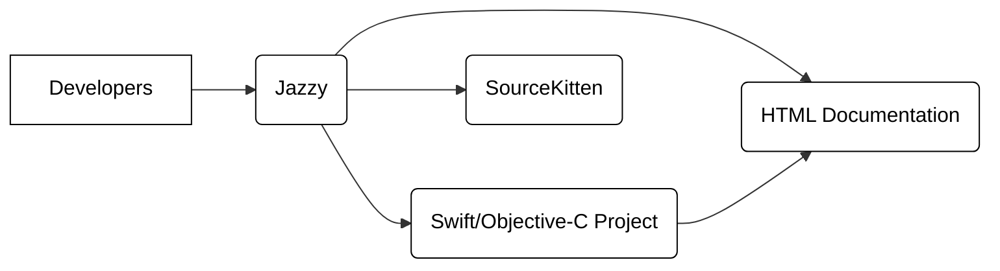
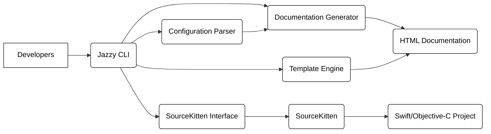
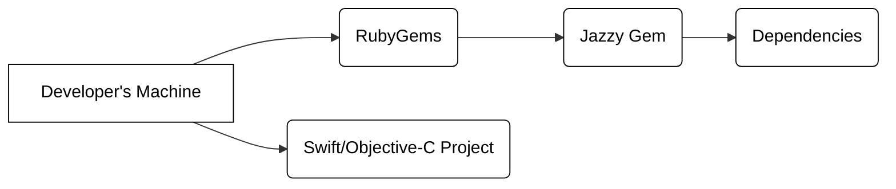
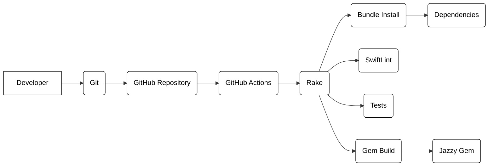

Okay, let's create a design document for the Jazzy project.

# BUSINESS POSTURE

Jazzy is a command-line tool that generates documentation for Swift and Objective-C projects. It focuses on creating accurate and visually appealing documentation that is easy to navigate and understand.

Business Priorities:

*   Provide a reliable and accurate documentation generation tool for Swift and Objective-C developers.
*   Improve the quality and accessibility of documentation for Swift and Objective-C projects.
*   Reduce the time and effort required to create and maintain project documentation.
*   Support a wide range of Swift and Objective-C projects and features.
*   Maintain an active and supportive open-source community.

Business Goals:

*   Become the standard documentation generation tool for Swift and Objective-C.
*   Increase adoption and usage by developers.
*   Maintain a high level of user satisfaction.
*   Continuously improve the tool based on user feedback and evolving language features.

Most Important Business Risks:

*   Inaccurate or incomplete documentation generation, leading to developer confusion and errors.
*   Lack of support for new Swift or Objective-C language features, rendering the tool obsolete.
*   Poor performance or usability issues, discouraging adoption and usage.
*   Security vulnerabilities in the tool or its dependencies, potentially exposing user projects to risks.
*   Failure to maintain an active open-source community, leading to stagnation and decline.

# SECURITY POSTURE

Existing Security Controls:

*   security control: Code quality checks: The project uses linters (SwiftLint) and formatters to maintain code quality and consistency. (Implemented in the build process and CI workflows).
*   security control: Dependency management: The project uses a package manager (RubyGems) to manage dependencies and keep them up to date. (Described in the Gemfile and Gemfile.lock).
*   security control: Static analysis: The project may use static analysis tools as part of its CI process, although this is not explicitly mentioned. (Potentially integrated into GitHub Actions workflows).
*   security control: Open source: Being open source allows for community review and contributions, potentially identifying and fixing security issues faster.

Accepted Risks:

*   accepted risk: The tool processes potentially untrusted code (the user's Swift/Objective-C project), which could contain vulnerabilities that might be exploited during documentation generation.
*   accepted risk: Dependencies may have vulnerabilities, although the project aims to keep them updated.
*   accepted risk: The generated documentation might expose sensitive information if the source code itself contains such information (e.g., API keys, credentials). This is primarily the responsibility of the user, but Jazzy could potentially offer features to help mitigate this.

Recommended Security Controls:

*   security control: Implement regular security audits and penetration testing to identify and address potential vulnerabilities.
*   security control: Integrate SAST (Static Application Security Testing) tools into the CI/CD pipeline to automatically scan for vulnerabilities in the Jazzy codebase.
*   security control: Integrate DAST (Dynamic Application Security Testing) tools, if applicable, to test the running application for vulnerabilities. Since Jazzy is a command-line tool, DAST might be less relevant.
*   security control: Implement a Software Bill of Materials (SBOM) to track all dependencies and their versions, making it easier to identify and address vulnerabilities.
*   security control: Provide clear documentation and guidance on how to use Jazzy securely, including recommendations for protecting sensitive information in source code.
*   security control: Consider sandboxing or isolating the code processing environment to limit the impact of potential vulnerabilities in the user's code.

Security Requirements:

*   Authentication: Not directly applicable, as Jazzy is a command-line tool that operates on local files.
*   Authorization: Not directly applicable, as Jazzy operates with the privileges of the user running the tool.
*   Input Validation: Jazzy must properly handle various inputs, including potentially malformed or malicious Swift/Objective-C code. It should validate input to prevent code injection or other attacks.
*   Cryptography: Not directly applicable, unless Jazzy is used to generate documentation for cryptographic libraries, in which case it should accurately reflect the cryptographic functionality.
*   Output Encoding: Jazzy generates HTML output. It should properly encode output to prevent cross-site scripting (XSS) vulnerabilities in the generated documentation.

# DESIGN

## C4 CONTEXT

Element Descriptions:

*   Element 1:
    *   Name: Developers
    *   Type: User
    *   Description: Software developers who write Swift and Objective-C code and need to generate documentation for their projects.
    *   Responsibilities: Run Jazzy, configure it, and use the generated documentation.
    *   Security controls: N/A (external entity)

*   Element 2:
    *   Name: Jazzy
    *   Type: System
    *   Description: The command-line tool that generates documentation.
    *   Responsibilities: Parse Swift/Objective-C code, extract documentation information, and generate HTML output.
    *   Security controls: Input validation, dependency management, code quality checks, potential sandboxing.

*   Element 3:
    *   Name: Swift/Objective-C Project
    *   Type: System
    *   Description: The user's code that needs to be documented.
    *   Responsibilities: Provide the source code for Jazzy to process.
    *   Security controls: Responsibility of the developer, but Jazzy should handle potentially malicious code gracefully.

*   Element 4:
    *   Name: SourceKitten
    *   Type: Library/Dependency
    *   Description: A Swift library used by Jazzy to interact with the Swift compiler and extract information about the source code.
    *   Responsibilities: Provide an interface to the Swift compiler's SourceKit framework.
    *   Security controls: Relies on the security of SourceKit and its own codebase. Jazzy should keep SourceKitten updated.

*   Element 5:
    *   Name: HTML Documentation
    *   Type: Output
    *   Description: The generated HTML documentation.
    *   Responsibilities: Present the documentation in a user-friendly format.
    *   Security controls: Output encoding to prevent XSS.

## C4 CONTAINER

Element Descriptions:

*   Element 1:
    *   Name: Developers
    *   Type: User
    *   Description: Software developers.
    *   Responsibilities: Run Jazzy CLI.
    *   Security controls: N/A

*   Element 2:
    *   Name: Jazzy CLI
    *   Type: Container (Command-line interface)
    *   Description: The entry point for developers to interact with Jazzy.
    *   Responsibilities: Parse command-line arguments, initiate the documentation generation process.
    *   Security controls: Input validation of command-line arguments.

*   Element 3:
    *   Name: Configuration Parser
    *   Type: Component
    *   Description: Parses the Jazzy configuration file (e.g., .jazzy.yaml).
    *   Responsibilities: Read and validate the configuration settings.
    *   Security controls: Input validation of configuration file.

*   Element 4:
    *   Name: SourceKitten Interface
    *   Type: Component
    *   Description: Interacts with the SourceKitten library.
    *   Responsibilities: Use SourceKitten to extract information from the Swift/Objective-C project.
    *   Security controls: Secure communication with SourceKitten.

*   Element 5:
    *   Name: Documentation Generator
    *   Type: Component
    *   Description: Generates the documentation data structure.
    *   Responsibilities: Process the information extracted by SourceKitten and organize it for presentation.
    *   Security controls: Internal data validation.

*   Element 6:
    *   Name: Template Engine
    *   Type: Component
    *   Description: Generates the HTML output using templates.
    *   Responsibilities: Combine the documentation data with templates to create the final HTML files.
    *   Security controls: Output encoding to prevent XSS.

*   Element 7:
    *   Name: SourceKitten
    *   Type: Library/Dependency
    *   Description: External Swift library.
    *   Responsibilities: Provide an interface to the Swift compiler.
    *   Security controls: Relies on the security of SourceKit and its own codebase.

*   Element 8:
    *   Name: Swift/Objective-C Project
    *   Type: System
    *   Description: The user's code.
    *   Responsibilities: Provide source code.
    *   Security controls: Responsibility of the developer.

*   Element 9:
    *   Name: HTML Documentation
    *   Type: Output
    *   Description: Generated HTML files.
    *   Responsibilities: Present documentation.
    *   Security controls: Output encoding.

## DEPLOYMENT

Jazzy is a command-line tool typically installed via RubyGems.

Possible Deployment Solutions:

1.  Installation via RubyGems (gem install jazzy).
2.  Installation via Homebrew (brew install jazzy).
3.  Building from source (cloning the repository and running make).
4.  Using a Docker container.

Chosen Solution (RubyGems):

Element Descriptions:

*   Element 1:
    *   Name: Developer's Machine
    *   Type: Environment
    *   Description: The local machine where the developer runs Jazzy.
    *   Responsibilities: Provide the execution environment for Jazzy.
    *   Security controls: Operating system security, user account privileges.

*   Element 2:
    *   Name: RubyGems
    *   Type: Package Manager
    *   Description: The package manager for Ruby.
    *   Responsibilities: Download and install Jazzy and its dependencies.
    *   Security controls: Package signing and verification (if enabled in RubyGems).

*   Element 3:
    *   Name: Jazzy Gem
    *   Type: Package
    *   Description: The Jazzy package distributed via RubyGems.
    *   Responsibilities: Contain the Jazzy code and metadata.
    *   Security controls: Relies on the security of RubyGems and the integrity of the package.

*   Element 4:
    *   Name: Dependencies
    *   Type: Package
    *   Description: The libraries that Jazzy depends on (e.g., SourceKitten, Redcarpet).
    *   Responsibilities: Provide necessary functionality for Jazzy.
    *   Security controls: Relies on the security of RubyGems and the integrity of each dependency.

*   Element 5:
    *   Name: Swift/Objective-C Project
    *   Type: System
    *   Description: The user's code to be documented, residing on the developer's machine.
    *   Responsibilities: Provide the source code.
    *   Security controls: Responsibility of the developer.

## BUILD

Jazzy's build process involves multiple steps, including dependency management, compilation (for tests), and packaging. It uses Rake as a build tool and GitHub Actions for continuous integration.

Element Descriptions:

*    Element 1:
    *    Name: Developer
    *    Type: User
    *    Description: Contributor to the Jazzy project.
    *    Responsibilities: Write code, submit pull requests.
    *    Security controls: N/A

*    Element 2:
    *    Name: Git
    *    Type: Version Control System
    *    Description: Local Git repository.
    *    Responsibilities: Track code changes.
    *    Security controls: Local repository security.

*    Element 3:
    *    Name: GitHub Repository
    *    Type: Remote Repository
    *    Description: The central repository for the Jazzy project.
    *    Responsibilities: Store the codebase, manage pull requests, trigger CI workflows.
    *    Security controls: GitHub's security features, branch protection rules.

*    Element 4:
    *    Name: GitHub Actions
    *    Type: CI/CD Platform
    *    Description: Automates the build, test, and packaging process.
    *    Responsibilities: Run Rake tasks, execute tests, build the gem.
    *    Security controls: GitHub Actions security features, workflow permissions.

*    Element 5:
    *    Name: Rake
    *    Type: Build Tool
    *    Description: Ruby's build tool, used to define and execute build tasks.
    *    Responsibilities: Orchestrate the build process.
    *    Security controls: Relies on the security of the Rakefile and the tasks it defines.

*    Element 6:
    *    Name: Bundle Install
    *    Type: Task
    *    Description: Installs Ruby dependencies using Bundler.
    *    Responsibilities: Download and install the required gems.
    *    Security controls: Relies on the security of RubyGems and the integrity of the dependencies.

*    Element 7:
    *    Name: Dependencies
    *    Type: Package
    *    Description: Ruby gems required for building and testing Jazzy.
    *    Responsibilities: Provide necessary functionality.
    *    Security controls: Relies on the security of RubyGems and each dependency.

*    Element 8:
    *    Name: SwiftLint
    *    Type: Task/Tool
    *    Description: A linter for Swift code.
    *    Responsibilities: Enforce code style and identify potential issues.
    *    Security controls: Relies on the security of SwiftLint itself.

*    Element 9:
    *    Name: Tests
    *    Type: Task
    *    Description: Runs the test suite.
    *    Responsibilities: Verify the correctness of the code.
    *    Security controls: Test code should be reviewed for security vulnerabilities.

*    Element 10:
    *    Name: Gem Build
    *    Type: Task
    *    Description: Builds the Jazzy gem package.
    *    Responsibilities: Create the distributable gem file.
    *    Security controls: Relies on the security of the gemspec file and the build process.

*    Element 11:
    *    Name: Jazzy Gem
    *    Type: Artifact
    *    Description: The final build artifact, ready for distribution.
    *    Responsibilities: Package the Jazzy code for installation.
    *    Security controls: Integrity of the gem file.

# RISK ASSESSMENT

Critical Business Processes to Protect:

*   Documentation Generation: The core functionality of Jazzy must be reliable and secure.
*   Dependency Management: Ensuring that dependencies are up-to-date and free of known vulnerabilities is crucial.
*   Community Trust: Maintaining the trust of the open-source community is essential for the project's success.

Data to Protect and Sensitivity:

*   User's Source Code (Input): Sensitivity varies greatly depending on the project. Jazzy should handle all code as potentially sensitive and avoid unnecessary storage or transmission.
*   Generated Documentation (Output): May contain sensitive information extracted from the source code. The sensitivity depends on the user's project.
*   Configuration Files: May contain user-specific settings, but generally not highly sensitive.
*   Jazzy's Own Codebase: Protecting the integrity of Jazzy's code is crucial to prevent the introduction of vulnerabilities.

# QUESTIONS & ASSUMPTIONS

Questions:

*   Are there any specific compliance requirements (e.g., GDPR, HIPAA) that Jazzy needs to consider, given that it processes user code?
*   What level of assurance is required for the accuracy and completeness of the generated documentation?
*   What is the expected threat model for Jazzy users? Are they primarily concerned with accidental disclosure of information, or are they also concerned with targeted attacks?
*   What are the specific security requirements for integrating with other tools or services (if any)?

Assumptions:

*   BUSINESS POSTURE: Jazzy is primarily used by individual developers or small teams, and not by large enterprises with strict security policies. This assumption may need to be revisited if Jazzy aims to target enterprise users.
*   SECURITY POSTURE: Users are responsible for the security of their own source code and the environment in which they run Jazzy.
*   DESIGN: The primary deployment method is via RubyGems, and users have a working Ruby environment.
*   DESIGN: The build process relies on GitHub Actions and Rake, and contributors have access to these tools.
*   DESIGN: SourceKitten is a trusted dependency and its security is maintained by its developers.