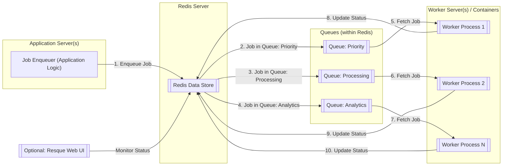

# Project Design Document: Resque

**Version:** 1.1
**Date:** October 26, 2023
**Author:** AI Software Architect

## 1. Introduction

This document provides an enhanced and detailed design overview of the Resque project, a robust Redis-backed library for creating and managing background jobs within Ruby applications. This document aims to provide a comprehensive understanding of Resque's architecture, core components, and the intricate flow of data, serving as a solid foundation for subsequent threat modeling and security analysis.

## 2. Goals and Objectives

The primary goal of Resque is to facilitate the efficient offloading of time-consuming or resource-intensive tasks from the main application's request-response cycle. Key objectives include:

*   **Reliable and At-Least-Once Job Processing:** Ensuring jobs are processed even in the face of failures.
*   **Horizontal Scalability:** Enabling the system to handle increasing workloads by adding more worker processes.
*   **Transparent Job Status and Monitoring:** Providing clear visibility into the state of jobs, including successes and failures.
*   **Seamless Integration with Ruby Applications:** Offering a straightforward API for enqueuing and processing jobs within Ruby environments.
*   **Prioritization of Workloads:** Allowing for the management of different types of jobs through separate queues.

## 3. System Overview

Resque employs a producer-consumer pattern, leveraging Redis as its central nervous system for message queuing and persistent data storage. The fundamental components that constitute the Resque ecosystem are:

*   **Job Enqueuer (Integrated Application):** The portion of the main application responsible for creating and submitting jobs to the Resque system.
*   **Redis Data Store:** The in-memory data store acting as the central hub, holding job queues, worker status information, and job-related metadata.
*   **Independent Worker Processes:** Standalone processes that actively listen to Redis queues, retrieve jobs, and execute the associated tasks.
*   **Named Job Queues:** Distinct lists within Redis, each representing a category of background jobs awaiting processing.
*   **Optional Resque Web UI:** A supplementary web-based interface offering real-time monitoring and management capabilities for queues, workers, and job statuses.

The typical operational flow involves the application enqueuing a specific job into a designated queue within Redis. Available worker processes continuously monitor these queues and atomically retrieve jobs for execution. Upon completion or failure, the worker updates the job's status and related information back in Redis.

## 4. Component Details

### 4.1. Job Enqueuer (Integrated Application)

*   **Functionality:**  The enqueuer is responsible for the creation of job instances and their placement onto specific Resque queues within Redis. This is typically triggered by events within the main application.
*   **Implementation:**  Implemented directly within the application's codebase, utilizing the Resque client library to interact with the Redis instance.
*   **Key Actions:**
    *   **Job Instantiation:** Creates an instance of a defined Resque job class, passing in the necessary arguments for execution.
    *   **Queue Selection:** Determines the appropriate Resque queue for the job based on its type or priority.
    *   **Job Enqueueing:**  Invokes the `Resque.enqueue` method (or similar), which serializes the job's class name and arguments and pushes this data onto the selected Redis queue.
*   **Data Interaction:**  Writes serialized job data (including the job class name and its arguments) to the designated queue within Redis.

### 4.2. Redis Data Store

*   **Functionality:** Serves as the central, persistent data store and message broker for the entire Resque system. Its in-memory nature provides speed, while persistence ensures data durability.
*   **Implementation:** An external, dedicated Redis server instance. Configuration details (host, port, authentication) are provided to both the application and worker processes.
*   **Key Data Structures Used:**
    *   **Redis Lists:**  Fundamental to Resque, lists are used to represent the individual job queues, storing serialized job payloads in a FIFO (First-In, First-Out) manner.
    *   **Redis Sets:** Employed to maintain a record of currently active workers and the queues they are monitoring.
    *   **Redis Hashes:** Utilized for storing detailed information about individual workers (e.g., their current status, the job they are processing) and for tracking overall Resque statistics.
*   **Key Interactions:**
    *   **Receives Enqueued Jobs:** Accepts serialized job data pushed by the application's enqueuer.
    *   **Provides Jobs to Workers:**  Allows workers to atomically retrieve jobs from the queues they are monitoring.
    *   **Stores Worker Status:**  Persists updates on the status of individual worker processes.
    *   **Tracks Job Status:** Stores information about the progress and outcome (success or failure) of processed jobs.
    *   **Manages Failed Jobs:**  Often used to store details of failed jobs for later inspection or retry.

### 4.3. Independent Worker Processes

*   **Functionality:**  These are the workhorses of the Resque system, responsible for fetching jobs from Redis queues and executing the tasks defined within those jobs.
*   **Implementation:** Typically implemented as separate, long-running Ruby processes. They utilize the Resque worker library to interact with Redis and manage job execution. Workers can be configured to monitor specific queues or all queues.
*   **Key Actions:**
    *   **Connection to Redis:** Establishes a connection to the configured Redis server.
    *   **Queue Monitoring:**  Continuously monitors one or more specified queues for the arrival of new jobs.
    *   **Atomic Job Retrieval:** Uses the `BRPOP` command (or similar) to atomically retrieve and lock a job from a monitored queue, preventing other workers from processing the same job.
    *   **Job Deserialization:**  Deserializes the job payload retrieved from Redis to obtain the job class name and its arguments.
    *   **Job Instantiation and Execution:**  Instantiates the corresponding job class with the provided arguments and executes its `perform` method (or a designated method).
    *   **Status Updates:**  Updates the worker's status and the job's status in Redis (e.g., "working", "completed", "failed").
    *   **Failure Handling and Retries:** Implements logic for handling job failures, potentially including retry mechanisms based on configuration.
*   **Data Interaction:**
    *   **Reads from Redis Queues:** Retrieves serialized job data from the monitored queues.
    *   **Writes Worker Status to Redis:**  Updates information about the worker's current state and activity.
    *   **Writes Job Status to Redis:**  Records the outcome of job processing (success or failure) and any relevant details.

### 4.4. Named Job Queues

*   **Functionality:**  Represent logical groupings of pending jobs within Redis. Queues allow for the prioritization and management of different types of background tasks.
*   **Implementation:** Implemented as Redis list data structures. Each queue is identified by a unique string name.
*   **Key Characteristics:**
    *   **FIFO Behavior:** By default, jobs are added to the end of the queue and processed in the order they were received (First-In, First-Out).
    *   **Atomic Operations:** Redis ensures that when a worker retrieves a job from a queue, it is done atomically, preventing race conditions.
    *   **Queue Names:**  Queues are identified by descriptive names, allowing for targeted processing by specific workers.
*   **Data Interaction:** Stores the serialized payloads of jobs awaiting processing.

### 4.5. Optional Resque Web UI

*   **Functionality:** Provides a web-based interface for real-time monitoring and management of the Resque system. It offers insights into queue status, worker activity, and job outcomes.
*   **Implementation:** A separate Ruby application (often a Rack application) that connects to the same Redis instance used by the Resque system.
*   **Key Features:**
    *   **Queue Overview:** Displays a list of all active queues and the number of jobs currently in each queue.
    *   **Worker Monitoring:** Shows a list of active workers, their current status (idle, working), and the job they are currently processing.
    *   **Failed Job Management:** Provides a view of failed jobs, including error messages and backtraces, often allowing for retries.
    *   **Basic Statistics:**  Displays overall statistics about job processing.
*   **Data Interaction:**  Primarily reads data from Redis to display the current state of queues, workers, and jobs. It may also have limited write capabilities for actions like retrying failed jobs.

## 5. Data Flow

The typical sequence of actions involved in processing a Resque job is as follows:

1. An event within the main application triggers the need for a background task.
2. The application's code instantiates a specific Resque job class, providing the necessary arguments for the task.
3. The Resque client library serializes the job's class name and its arguments into a format suitable for storage in Redis (often JSON).
4. The serialized job data is pushed onto the designated queue in Redis using the `LPUSH` command, adding it to the end of the queue.
5. One or more Resque worker processes are actively monitoring the specified queue (or a set of queues that includes it).
6. When a worker is available and the queue has jobs, the worker uses the `BRPOP` command to atomically retrieve a job from the beginning of the queue. This operation also removes the job from the queue.
7. The worker deserializes the retrieved job data to reconstruct the job's class name and arguments.
8. The worker instantiates an instance of the identified job class, passing in the deserialized arguments.
9. The worker executes the core logic of the job, typically within a method named `perform`.
10. Throughout the job's execution, the worker may update its status in Redis (e.g., indicating progress or potential issues).
11. Upon successful completion of the job, the worker may perform cleanup tasks or update related data.
12. If the job encounters an error, the worker typically catches the exception and records the failure details (including the error message and backtrace) in a designated "failed" queue or a similar structure within Redis. This allows for later inspection and potential retries.

## 6. Security Considerations (Detailed for Threat Modeling)

This section expands upon the initial security considerations, providing more specific examples of potential threats and vulnerabilities relevant to each component.

*   **Redis Security:**
    *   **Unauthorized Access (Data Breach, Manipulation, DoS):** If Redis is not properly secured, attackers could gain unauthorized access to job data, manipulate queues, or cause a denial of service by flooding the server.
        *   **Mitigation:** Implement strong authentication (requirepass), restrict network access using firewalls, and consider using TLS for encrypted communication.
    *   **Command Injection:** If the application or workers construct Redis commands based on untrusted input, attackers could inject malicious commands.
        *   **Mitigation:**  Avoid dynamic command construction and use parameterized queries or the Resque client library's built-in methods.
    *   **Data Exfiltration:** Sensitive data within job payloads stored in Redis could be compromised if access is not controlled.
        *   **Mitigation:** Encrypt sensitive data at rest within Redis and in transit between components.
*   **Job Payload Security:**
    *   **Deserialization of Untrusted Data (Remote Code Execution):** If job arguments contain serialized objects from untrusted sources, vulnerabilities in deserialization libraries could allow attackers to execute arbitrary code on the worker.
        *   **Mitigation:**  Avoid deserializing data from untrusted sources. If necessary, use secure serialization formats and carefully vet deserialization libraries. Implement input validation and sanitization.
    *   **Code Injection via Job Arguments:**  Malicious actors could craft job payloads with arguments designed to exploit vulnerabilities in the job's execution logic.
        *   **Mitigation:**  Thoroughly validate and sanitize all job arguments before processing. Implement secure coding practices within job classes.
*   **Worker Security:**
    *   **Resource Exhaustion (Denial of Service):**  Maliciously crafted jobs could be designed to consume excessive CPU, memory, or other resources, potentially crashing workers or impacting overall system performance.
        *   **Mitigation:** Implement resource limits for worker processes. Monitor worker resource usage and implement circuit breakers or rate limiting for job processing.
    *   **Dependency Vulnerabilities (Compromise of Worker Environment):** Workers rely on external libraries and dependencies. Vulnerabilities in these dependencies could be exploited to compromise the worker environment.
        *   **Mitigation:** Regularly update dependencies and scan for known vulnerabilities. Isolate worker environments using containers or virtual machines.
*   **Resque Web UI Security:**
    *   **Authentication and Authorization Bypass (Unauthorized Access):** If the web UI lacks proper authentication and authorization, unauthorized users could gain access to sensitive information or perform administrative actions.
        *   **Mitigation:** Implement robust authentication mechanisms (e.g., username/password, OAuth) and enforce authorization to restrict access based on user roles.
    *   **Cross-Site Scripting (XSS) (Information Disclosure, Session Hijacking):** Vulnerabilities in the web UI could allow attackers to inject malicious scripts that are executed in the browsers of other users.
        *   **Mitigation:**  Sanitize all user-supplied input before rendering it in the web UI. Use a Content Security Policy (CSP) to mitigate XSS attacks.
    *   **Cross-Site Request Forgery (CSRF) (Unauthorized Actions):** Attackers could trick authenticated users into making unintended requests to the web UI.
        *   **Mitigation:** Implement CSRF protection mechanisms, such as anti-CSRF tokens.
*   **Queue Security:**
    *   **Queue Poisoning (Disruption of Service, Execution of Malicious Jobs):** Attackers could inject malicious or malformed jobs into queues, potentially disrupting processing or causing workers to execute unintended code.
        *   **Mitigation:** Implement input validation and sanitization at the point of job enqueueing. Consider using message signing or encryption to verify the integrity and authenticity of jobs.
    *   **Queue Tampering (Data Integrity Issues, DoS):** Unauthorized modification or deletion of jobs in queues could lead to data integrity issues or denial of service.
        *   **Mitigation:** Secure access to the Redis instance to prevent unauthorized manipulation of queues.
*   **Communication Security:**
    *   **Man-in-the-Middle Attacks (Data Interception, Manipulation):** If communication between components (application to Redis, workers to Redis) is not encrypted, attackers could intercept and potentially modify data in transit.
        *   **Mitigation:** Use TLS/SSL to encrypt communication between all components and the Redis server.

## 7. Deployment Considerations

Resque deployments can vary significantly based on application scale and requirements. Common deployment scenarios include:

*   **Single Server Deployment (Development/Low Traffic):** All components (application, Redis, workers, optional web UI) reside on a single server. This is suitable for development or applications with minimal background processing needs.
*   **Dedicated Redis Server:** The Redis instance is hosted on a dedicated server for improved performance and isolation. Application and worker processes run on separate servers.
*   **Distributed Worker Deployment:** Multiple worker processes are deployed across several servers or containers to handle a higher volume of background jobs and provide redundancy. Workers can be configured to monitor specific queues for workload distribution.
*   **Containerized Deployment (Docker, Kubernetes):** Resque components (workers, optional web UI) are containerized using Docker and orchestrated using platforms like Kubernetes. This provides scalability, isolation, and easier management.
*   **Cloud-Based Deployments:** Leveraging cloud services for Redis (e.g., AWS ElastiCache, Azure Cache for Redis, Google Cloud Memorystore) and container orchestration (e.g., AWS ECS/EKS, Azure Kubernetes Service, Google Kubernetes Engine).

Considerations for deployment include:

*   **Redis Instance Sizing and Configuration:**  Properly sizing the Redis instance based on expected job volume and data size is crucial. Persistence settings (RDB, AOF) should be configured according to data durability requirements.
*   **Worker Process Management:**  Utilizing process managers (e.g., systemd, Supervisor) or container orchestration tools to ensure worker processes are running and automatically restarted in case of failures.
*   **Monitoring and Logging:** Implementing comprehensive monitoring of Redis performance, worker activity, and job outcomes. Centralized logging is essential for troubleshooting.
*   **Security Hardening:**  Following security best practices for the underlying infrastructure, including operating system hardening, network security, and access control.

## 8. Diagrams

### 8.1. System Architecture

### 8.2. Job Processing Flow

```mermaid
flowchart LR
    subgraph "Application"
        AS["Start: Application Initiates Background Task"]
    end
    subgraph "Resque Enqueuer"
        EQ["Enqueue Job (Resque.enqueue)"]
        SER["Serialize Job Data (Class, Args)"]
        ARQ["Add to Redis Queue (LPUSH)"]
    end
    subgraph "Redis"
        RQ["Job Resides in Redis Queue"]
    end
    subgraph "Resque Worker"
        MWQ["Idle Worker Monitors Queue (BRPOP)"]
        FJ["Fetch Job from Queue (Atomic)"]
        DES["Deserialize Job Data"]
        IJ["Instantiate Job Class"]
        PL["Perform Job Logic"]
        USQ["Update Job Status in Redis"]
    end
    subgraph "End State"
        ES["End: Job Processed (Success or Failure)"]
    end

    AS --> EQ
    EQ --> SER
    SER --> ARQ
    ARQ --> RQ
    RQ --> MWQ
    MWQ --> FJ
    FJ --> DES
    DES --> IJ
    IJ --> PL
    PL --> USQ
    USQ --> ES
```

## 9. Conclusion

This revised document provides a more in-depth and comprehensive design overview of the Resque project. By elaborating on component functionalities, clarifying data flows, and expanding on security considerations, this document serves as a valuable resource for understanding Resque's architecture and identifying potential security vulnerabilities during threat modeling activities. The included diagrams offer a clear visual representation of the system's structure and operational processes.