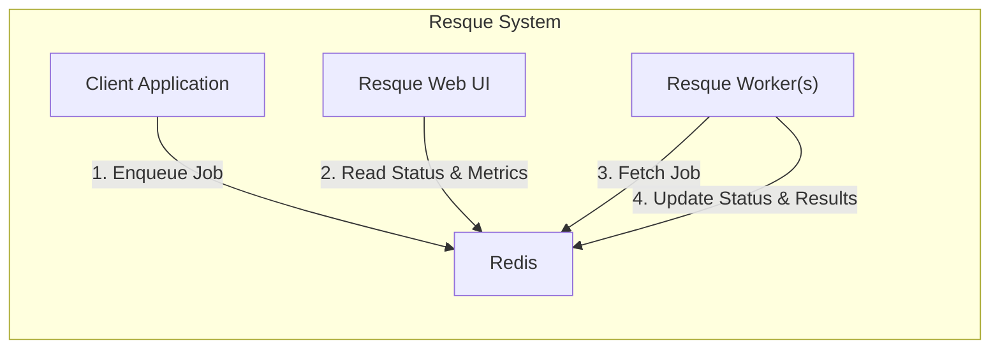
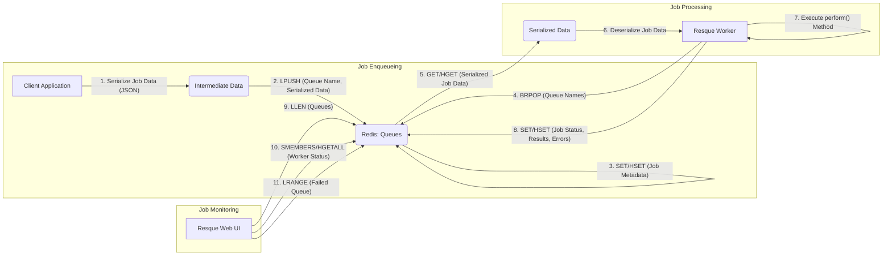

# Project Design Document: Resque

**Version:** 1.1
**Date:** October 26, 2023
**Author:** Gemini (AI Language Model)
**Project:** Resque - Background Job Processing Library

## 1. Introduction

This document provides a detailed architectural design of the Resque background job processing library. It outlines the key components, their interactions, data flow, and deployment considerations. This document is specifically designed to serve as a foundational resource for subsequent threat modeling activities, providing the necessary context and detail for identifying potential security vulnerabilities.

## 2. Goals

* Clearly and comprehensively define the architecture and components of Resque.
* Accurately illustrate the data flow within the Resque system, highlighting key data transformation points.
* Precisely identify key interaction points, trust boundaries, and data storage locations.
* Provide sufficient technical detail and context to enable effective threat identification, risk assessment, and the development of appropriate security mitigations.

## 3. Non-Goals

* This document does not delve into the specific internal implementation details of the Resque library code at a code level.
* It does not specify particular programming languages or frameworks used to interact with Resque, focusing on the general interaction patterns.
* This document is not a threat model itself. It provides the necessary architectural information for creating a separate, dedicated threat model.
* It does not aim to compare or contrast Resque with alternative background job processing libraries.

## 4. System Architecture

Resque is a Redis-backed library facilitating the creation and management of background jobs. It allows applications to offload time-consuming or resource-intensive tasks for asynchronous processing. The core components of the system are:

* **Client Application:** The application responsible for creating and enqueuing jobs into the Resque system.
* **Resque Web UI:** A web-based interface, typically built with Sinatra, providing monitoring and management capabilities for the Resque system.
* **Resque Worker(s):** Independent processes that consume and execute jobs from the defined queues.
* **Redis:** The central in-memory data store that serves as the message broker and persistent storage for job queues, metadata, and worker status.

### 4.1. Component Diagram

### 4.2. Component Descriptions

* **Client Application:** This represents any application (e.g., a web server, a command-line utility, a scheduled task) that needs to execute tasks asynchronously. It interacts with Resque by utilizing the Resque client library to define job classes and enqueue instances of these jobs, along with their necessary arguments, onto specific named queues within Redis. The client is responsible for determining the appropriate queue for each job based on its characteristics or priority.

* **Resque Web UI:** This is a separate web application, commonly implemented using the Sinatra framework in Ruby, that offers a visual dashboard for monitoring the state of the Resque system. It connects to the Redis instance to retrieve and display real-time information about:
    * **Queues and their lengths:** Showing the number of jobs waiting in each queue.
    * **Active workers and their current jobs:** Displaying which workers are running and the details of the jobs they are currently processing.
    * **Failed jobs and their error details:** Providing information about jobs that encountered errors during execution, including error messages and stack traces.
    * **Overall system statistics:** Presenting metrics like processed job counts and worker activity. This UI often allows for basic administrative actions like pausing/restarting workers or clearing failed queues.

* **Resque Worker(s):** These are independent background processes, typically long-running, that are responsible for the actual execution of the enqueued jobs. Each worker is configured to monitor one or more specific queues within Redis. When a new job arrives on a monitored queue:
    * A worker retrieves the job data from Redis.
    * It instantiates the corresponding job class as defined by the enqueued data.
    * It executes the `perform` method of the job class, passing the provided arguments.
    * The worker updates the job's status in Redis throughout the processing lifecycle (e.g., pending, running, completed, failed).
    * Workers can be configured with concurrency settings to process multiple jobs simultaneously within a single worker process.

* **Redis:** Redis serves as the central, persistent data store and message broker for Resque. It is crucial for the functionality of the system and stores various types of data:
    * **Queues:**  Represented as Redis lists, holding serialized job data (typically as JSON strings). Each queue has a unique name. Jobs are added to the end of the list and removed from the beginning by workers.
    * **Job Metadata:**  Information about individual jobs, including the job class name, arguments, creation timestamp, status, and any results or error details. This can be stored as Redis hashes or embedded within the serialized job data in the queues.
    * **Worker Status:**  Details about currently active workers, such as their unique identifiers, the queues they are monitoring, and the job they are currently processing (if any). This information is often stored in Redis sets or hashes, allowing for tracking and management of the worker pool.
    * **Failed Jobs:** Information about jobs that failed during processing, including the original job data, the error message, and the backtrace. This is typically stored in a dedicated "failed" queue or list for later inspection and potential retry.

## 5. Data Flow

The following describes the typical flow of data within the Resque system during its operation:

1. **Job Enqueueing:**
    * The "Client Application" constructs a new job by specifying the job class and the arguments required for its execution.
    * The client utilizes the Resque library to serialize the job data (including the class name and arguments) into a format suitable for storage (commonly JSON).
    * The serialized job data is then pushed onto a specific queue within "Redis". This is typically achieved using the `LPUSH` command on a Redis list identified by the queue name. Simultaneously, or shortly after, metadata about the job might be stored separately using `SET` or `HSET` for easier querying or tracking.

2. **Job Processing:**
    * A "Resque Worker" process, configured to monitor one or more queues, is actively listening for new jobs in "Redis".
    * The worker uses a blocking pop operation (e.g., `BRPOP` with a timeout) to efficiently wait for a job to become available on its designated queues. This prevents the worker from constantly polling Redis.
    * Once a job is available on a monitored queue, the worker retrieves the serialized job data from "Redis".
    * The worker deserializes the job data to reconstruct the job class and its arguments.
    * The worker instantiates the job class and executes its `perform` method, passing the deserialized arguments.

3. **Job Status Updates:**
    * During the execution of the `perform` method, the "Resque Worker" may periodically update the job's status in "Redis". This can involve setting a status flag (e.g., "processing") or updating a progress indicator associated with the job's metadata.
    * Upon successful completion of the job, the worker updates the job's final status (e.g., "completed") in "Redis" and may store any results generated by the job.
    * If the job encounters an error during processing, the worker updates the job's status to "failed" in "Redis" and stores relevant error information, such as the error message and stack trace, often in a dedicated failed queue.

4. **Job Monitoring:**
    * The "Resque Web UI" periodically connects to the "Redis" instance.
    * It retrieves information about the queues, such as their current lengths (using commands like `LLEN`).
    * It retrieves information about active workers, potentially by querying a dedicated set or list of active worker IDs and then fetching details about each worker (e.g., using `HGETALL` on worker-specific keys).
    * It retrieves information about failed jobs, typically by inspecting the dedicated "failed" queue or list.
    * The Web UI processes this data and displays it in a user-friendly format.

### 5.1. Data Flow Diagram

## 6. Security Considerations

This section details specific security considerations relevant to the Resque architecture, providing examples of potential threats:

* **Redis Access Control:**  As Redis holds all job data and system state, securing access is paramount. Lack of proper access control can lead to:
    * **Data Breach:** Unauthorized access could expose sensitive information contained within job arguments (e.g., API keys, personal data).
    * **Job Queue Manipulation:** Attackers could inject malicious jobs into queues, potentially leading to code execution on worker nodes, or delete legitimate jobs, causing denial of service. They could also manipulate job metadata to alter processing behavior.
    * **System State Tampering:**  Malicious actors could modify worker status information or other Redis data to disrupt the system's operation or gain unauthorized insights.

* **Resque Web UI Authentication and Authorization:** The Web UI offers visibility and control over the Resque system. Without robust authentication and authorization mechanisms:
    * **Information Disclosure:** Unauthorized users could monitor queue activity, worker status, and even the details of specific jobs, potentially revealing sensitive business logic or data.
    * **Administrative Abuse:** Attackers could gain access to administrative functions, allowing them to kill workers, clear queues, or manipulate the system's configuration, leading to disruption or data loss.

* **Resque Worker Security:** The worker processes execute arbitrary code defined by the job classes. This presents several security risks:
    * **Code Injection via Job Arguments:** If job arguments are not properly validated and sanitized, malicious input could be crafted to execute arbitrary code on the worker nodes when the job is processed. This is particularly concerning if arguments are directly used in system calls or interpreted languages.
    * **Dependency Vulnerabilities:** Workers rely on various libraries and dependencies. Vulnerabilities in these dependencies could be exploited if not regularly updated and patched.
    * **Resource Exhaustion:**  Maliciously crafted jobs could be designed to consume excessive resources (CPU, memory, network), potentially causing denial of service for other jobs or even crashing the worker nodes.

* **Data Serialization and Deserialization:** The process of converting job data to and from a storable format (typically JSON) can introduce vulnerabilities:
    * **Insecure Deserialization:** If vulnerable deserialization libraries are used, attackers could craft malicious serialized payloads that, when deserialized by the worker, lead to arbitrary code execution.

* **Queue Security (Namespace Collision and Intentional Interference):** When multiple applications or environments share the same Redis instance:
    * **Namespace Collision:**  Accidental or intentional use of the same queue names could lead to jobs from one application being processed by workers intended for another, potentially causing errors or data corruption.
    * **Intentional Interference:**  Malicious actors could intentionally enqueue jobs onto queues belonging to other applications to disrupt their operations.

* **Transport Security (Redis Connection):** While communication within a single server might be considered less risky, if Redis is accessed over a network (especially an untrusted network):
    * **Eavesdropping:**  Job data transmitted between components and Redis could be intercepted if the connection is not encrypted (e.g., using TLS/SSL for Redis connections).
    * **Man-in-the-Middle Attacks:** Attackers could intercept and modify job data in transit.

## 7. Deployment Considerations

The deployment environment significantly impacts the security posture of the Resque system. Common deployment scenarios and their security implications include:

* **Single Server Deployment:** All components reside on the same server. While simplifying deployment, this creates a single point of failure and increases the impact of a successful compromise. Security measures must focus on hardening the single server.
* **Dedicated Redis Server:** Redis runs on a separate server. This improves performance and isolation but necessitates securing network communication between the application/workers and the Redis server (e.g., using firewalls, VPNs, and TLS for Redis connections).
* **Multiple Worker Servers:** Workers are distributed across multiple servers for scalability and resilience. This requires careful management of worker configurations, secure communication channels, and potentially the use of orchestration tools.
* **Containerized Deployment (Docker, Kubernetes):**  Components are deployed as containers. Security considerations include securing container images, managing container runtime security, and implementing appropriate network policies within the container orchestration platform.
* **Cloud-Based Deployment (AWS, Azure, GCP):** Utilizing cloud services for Redis and worker execution introduces cloud-specific security controls and considerations, such as Identity and Access Management (IAM) roles, security groups, network access control lists (NACLs), and managed security services.

## 8. Future Considerations

These are potential enhancements or areas for future development that could impact the architecture and security of Resque:

* **Job Prioritization Mechanisms:** Implementing more sophisticated methods for prioritizing certain jobs over others could introduce new complexities in queue management and potential for priority manipulation.
* **Job Scheduling Features:** Adding built-in job scheduling capabilities might require new components or modifications to existing ones, potentially introducing new attack surfaces.
* **Enhanced Monitoring and Alerting Integrations:** Integrating with external monitoring and alerting systems could expose sensitive operational data if not properly secured.
* **Encryption of Job Data at Rest and in Transit:** Implementing encryption for job data stored in Redis and during transmission would significantly enhance data confidentiality. This would require careful key management and consideration of performance implications.
* **Improved Worker Isolation and Sandboxing:** Exploring techniques to further isolate worker processes could mitigate the impact of code injection vulnerabilities.

This document provides a detailed architectural design of the Resque background job processing system, specifically tailored for use in threat modeling. By understanding the components, data flows, interaction points, and potential vulnerabilities outlined here, security professionals can effectively analyze and mitigate risks associated with its deployment and operation.