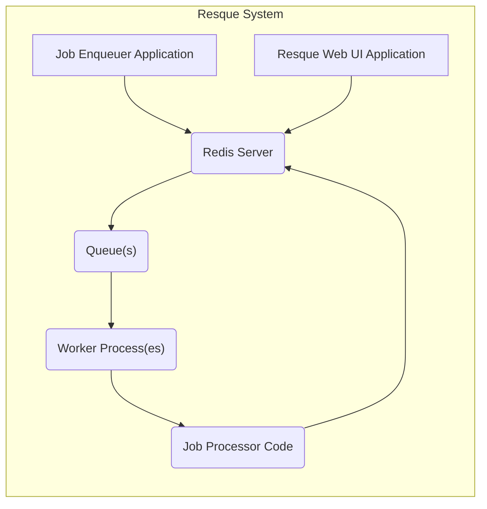

# Project Design Document: Resque

**Version:** 1.1
**Date:** October 26, 2023
**Author:** Gemini (AI Language Model)

## 1. Introduction

This document provides a detailed design overview of the Resque project, a robust Redis-backed library for creating and managing background jobs. This document aims to clearly articulate the architecture, components, and data flow of Resque to facilitate subsequent threat modeling activities. A thorough understanding of this design is crucial for identifying potential security vulnerabilities and designing appropriate mitigations.

## 2. Goals and Non-Goals

**Goals:**

*   Clearly define the architecture and components of Resque, including their responsibilities and interactions.
*   Describe the complete lifecycle of a job within the Resque system, detailing the data flow at each stage.
*   Identify key interactions and dependencies between components, highlighting potential trust boundaries.
*   Provide sufficient detail and context for effective and targeted threat modeling.

**Non-Goals:**

*   Serve as a user manual or comprehensive guide to using the Resque library.
*   Detail the intricate internal implementation of every function or code module.
*   Include performance benchmarks, optimization strategies, or scalability analysis.
*   Cover deployment, configuration, or operational aspects in significant detail.

## 3. Architectural Overview

Resque employs a straightforward yet powerful architecture for asynchronous job processing, leveraging Redis as its central nervous system. The core components collaborate to ensure reliable enqueueing, processing, and management of background tasks.

## 4. Detailed Design

### 4.1. Components

*   **Job Enqueuer Application:** This represents the application code (e.g., a web application, a service) that initiates background jobs. It utilizes the Resque client library to create and submit job specifications to Resque.
    *   **Responsibility:**  Defining and triggering background tasks.
    *   **Functionality:**
        *   Determines the appropriate queue for a given job based on its nature or priority.
        *   Serializes job data, including the job class name and its arguments, into a format suitable for storage in Redis (typically JSON).
        *   Uses the Resque client to push the serialized job data onto the designated Redis queue.
*   **Redis Server:** The central, persistent data store and message broker for Resque. It acts as the single source of truth for job queues, worker status, and job metadata.
    *   **Responsibility:**  Storing and managing job queues, worker information, and job status.
    *   **Functionality:**
        *   Hosts multiple named queues, implemented as Redis lists, holding pending job payloads.
        *   Stores metadata about active workers, such as their current status, the queues they are monitoring, and the job they are currently processing.
        *   Persists information about failed jobs, including the job payload and error details.
        *   May store statistics and other operational data related to Resque's activity.
*   **Queue(s):** Logical channels within Redis that hold jobs awaiting processing. Each queue is a Redis list, ensuring First-In, First-Out (FIFO) processing order within that queue.
    *   **Responsibility:**  Organizing and ordering pending jobs.
    *   **Functionality:**
        *   Accept new jobs pushed by the Job Enqueuer.
        *   Provide jobs to available Workers based on their queue subscriptions.
*   **Worker Process(es):** Independent background processes responsible for fetching and executing jobs from the queues. Multiple workers can run concurrently to increase processing throughput.
    *   **Responsibility:**  Retrieving and executing background jobs.
    *   **Functionality:**
        *   Connect to the Redis server and subscribe to one or more specific queues.
        *   Use blocking Redis commands (e.g., `BRPOP`) to efficiently wait for new jobs to arrive on their subscribed queues.
        *   Retrieve job payloads from the queue.
        *   Deserialize the job data to extract the job class and arguments.
        *   Instantiate the specified job class.
        *   Invoke the designated method (typically `perform`) on the job instance, passing the deserialized arguments to the Job Processor Code.
        *   Handle job completion or failure, updating Redis with the job's status.
*   **Job Processor Code:** The application-defined code that contains the actual logic to be executed for a specific type of background job.
    *   **Responsibility:**  Performing the business logic of a background task.
    *   **Functionality:**
        *   Receives deserialized job arguments from the Worker.
        *   Executes the intended background operation (e.g., sending emails, processing data, generating reports).
        *   May interact with other services or databases as needed.
        *   May raise exceptions in case of errors, which are caught and handled by the Worker.
*   **Resque Web UI Application:** An optional web-based interface for monitoring and managing the Resque system. It provides insights into queue status, worker activity, and failed jobs.
    *   **Responsibility:**  Providing a visual interface for monitoring and managing Resque.
    *   **Functionality:**
        *   Connects to the Redis server to retrieve real-time data about queues, workers, and failed jobs.
        *   Displays information such as queue lengths, active workers and their current jobs, and details of failed jobs.
        *   May offer administrative actions like retrying failed jobs, clearing queues, or killing rogue workers.

### 4.2. Data Flow

1. **Job Creation and Enqueueing:**
    *   The "Job Enqueuer Application" initiates a background task.
    *   It uses the Resque client library to create a job object, specifying the job class (e.g., `ProcessOrderJob`) and its necessary arguments (e.g., `order_id: 123`).
    *   The Resque client serializes this job information (e.g., `{"class": "ProcessOrderJob", "args": [123]}`) into JSON format.
    *   The client then uses the Redis `LPUSH` command to push this serialized job payload onto the designated queue in Redis (e.g., a queue named "order_processing").

2. **Job Acquisition and Processing:**
    *   One or more "Worker Processes" are running and listening to the "order_processing" queue in Redis.
    *   A Worker uses the blocking Redis command `BRPOP` on the subscribed queue(s). This command makes the worker wait efficiently until a new job arrives.
    *   Once a job is available, `BRPOP` returns the queue name and the serialized job payload.
    *   The Worker deserializes the JSON payload to retrieve the job class name (`ProcessOrderJob`) and arguments (`[123]`).
    *   The Worker instantiates an object of the `ProcessOrderJob` class.
    *   The Worker then calls the `perform` method (or a similarly designated method) on the instantiated job object, passing the deserialized arguments (e.g., `ProcessOrderJob.perform(123)`).
    *   The code within the `perform` method (the "Job Processor Code") executes the logic to process the order with ID 123.

3. **Job Completion and Failure Handling:**
    *   Upon successful completion of the `perform` method, the Worker may update Redis with job completion statistics or metrics using commands like `INCR`.
    *   If an exception occurs during the execution of the `perform` method, the Worker catches the exception.
    *   The Worker then moves the failed job to a designated "failed" queue in Redis using `LPUSH`.
    *   Along with the job payload, the Worker also stores error information, such as the exception class, error message, and stack trace, typically as additional fields in a JSON structure pushed to the failed queue.

4. **Monitoring and Management via Web UI:**
    *   The "Resque Web UI Application" connects to the Redis server.
    *   It uses various Redis commands to retrieve information:
        *   `LLEN` to get the length of queues.
        *   `SMEMBERS` to list active workers.
        *   `GET` and `HGETALL` to retrieve worker status and information about the job they are currently processing.
        *   `LRANGE` to view failed jobs.
    *   The Web UI presents this data in a user-friendly format.
    *   Administrative actions, such as retrying a failed job, might involve the Web UI pushing the failed job back onto its original queue using `LPUSH`. Killing a worker might involve setting a flag in Redis that the worker periodically checks.

### 4.3. Key Interactions and Dependencies

*   **Job Enqueuer Application <-> Redis:**  Uses `LPUSH` to add jobs to queues.
*   **Worker Process <-> Redis:** Uses `BRPOP` to retrieve jobs, `GET` and `SET` to manage worker status, `LPUSH` to move failed jobs, and potentially `INCR` for statistics.
*   **Resque Web UI Application <-> Redis:** Uses commands like `LLEN`, `SMEMBERS`, `GET`, `HGETALL`, and `LRANGE` to fetch data, and potentially `LPUSH` for administrative actions.
*   **Worker Process <-> Job Processor Code:**  Directly invokes the `perform` method (or similar) of the job class.

## 5. Data Storage

Resque's persistent data storage is entirely managed by Redis. Key data elements stored include:

*   **Active Queues:** Stored as Redis lists. Each list represents a queue, and its elements are serialized JSON strings representing individual jobs.
*   **Job Payloads:** Serialized JSON objects containing the job's class name (as a string) and an array of arguments.
*   **Worker Metadata:** Information about active workers, often stored as Redis hashes or sets. This includes:
    *   The worker's unique identifier.
    *   The queues the worker is currently monitoring.
    *   The payload of the job the worker is currently processing (if any).
    *   The time the worker started processing the current job.
    *   The worker's current state (e.g., 'idle', 'working').
*   **Failed Jobs Queue:** A dedicated Redis list (or potentially multiple lists, e.g., per queue) storing information about failed jobs. Each element is typically a JSON object containing:
    *   The original job payload.
    *   The exception class.
    *   The error message.
    *   The backtrace.
    *   A timestamp of when the failure occurred.
*   **Statistics:** Various counters and metrics related to Resque's operation, such as the number of processed jobs, failed jobs, and queue lengths. These are typically stored as simple Redis keys with integer values.
*   **Delayed Jobs (if using a scheduler):**  If an extension like `resque-scheduler` is used, Redis sorted sets are often employed to store jobs scheduled for future execution, with the score representing the timestamp for execution.

## 6. Security Considerations (Preliminary)

This section outlines potential security considerations that will be crucial for subsequent threat modeling.

*   **Redis Server Security:** The security of the entire Resque system hinges on the security of the underlying Redis instance.
    *   **Authentication:**  Is Redis configured with a strong password (`requirepass`) to prevent unauthorized access?
    *   **Network Security:** Are appropriate firewall rules in place to restrict network access to the Redis port (default 6379) to only trusted hosts? Is `bind` configured correctly?
    *   **Command Restriction:**  Consider using Redis ACLs (Access Control Lists) to restrict the set of Redis commands that can be executed by the Resque client and workers, limiting potential damage from compromised components.
    *   **TLS Encryption:** Is communication with Redis encrypted using TLS to protect sensitive job data in transit?
*   **Job Payload Security:**
    *   **Deserialization Vulnerabilities:** If using insecure deserialization libraries (e.g., `pickle` in Python), malicious actors could craft payloads that, when deserialized by workers, lead to arbitrary code execution. Favor secure serialization formats like JSON.
    *   **Sensitive Data Exposure:** Avoid storing highly sensitive data directly within job payloads. If necessary, encrypt sensitive data before enqueueing and decrypt it within the worker in a secure manner. Consider using secrets management solutions.
*   **Worker Process Security:**
    *   **Execution Environment:** Ensure worker processes run in a secure environment with appropriate user privileges (least privilege principle). Implement resource limits (CPU, memory) to prevent denial-of-service attacks.
    *   **Dependency Management:** Regularly audit and update worker dependencies to patch known security vulnerabilities. Use dependency scanning tools.
    *   **Code Injection:**  Carefully sanitize any external input used within job processing logic to prevent code injection vulnerabilities.
*   **Resque Web UI Security:**
    *   **Authentication and Authorization:** Implement robust authentication mechanisms to verify the identity of users accessing the Web UI. Use authorization to control access to sensitive actions (e.g., retrying failed jobs, killing workers).
    *   **Cross-Site Scripting (XSS):**  Sanitize all user-provided input displayed in the Web UI to prevent XSS attacks. Use appropriate templating engines and security headers.
    *   **Cross-Site Request Forgery (CSRF):** Implement CSRF protection mechanisms (e.g., anti-CSRF tokens) to prevent unauthorized actions performed on behalf of authenticated users.
    *   **Information Disclosure:**  Ensure the Web UI does not inadvertently expose sensitive information about the Resque system or job data to unauthorized users.
*   **Queue Security:**
    *   **Unauthorized Enqueueing:**  Implement measures to prevent unauthorized entities from pushing jobs onto queues. This might involve network segmentation or authentication at the application level.
    *   **Queue Poisoning:**  Validate job data before processing to mitigate the risk of malicious or malformed jobs causing errors or security issues. Implement error handling and retry mechanisms carefully.

## 7. Future Considerations (Out of Scope for this Document)

*   Detailed strategies for scaling Resque to handle high volumes of jobs.
*   Advanced job scheduling features, such as cron-like scheduling or recurring jobs.
*   Integration with centralized logging and monitoring systems for improved observability.
*   Exploring alternative data stores or message brokers beyond Redis.

This improved design document provides a more comprehensive and detailed understanding of the Resque project, crucial for effective threat modeling. The enhanced descriptions of components, data flow, and security considerations will enable a more thorough analysis of potential vulnerabilities and the development of appropriate security mitigations.