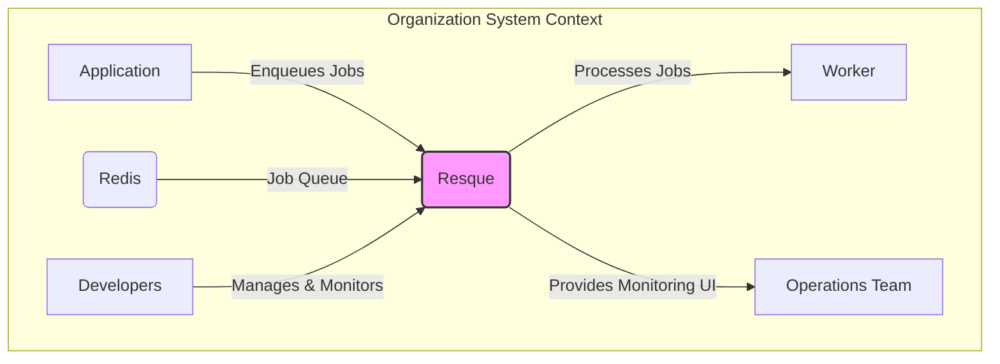
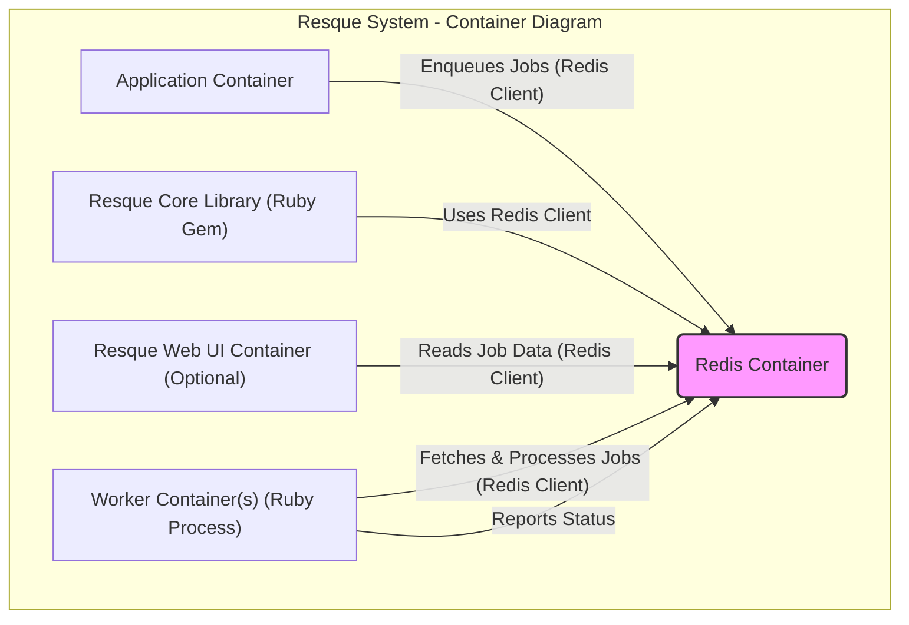
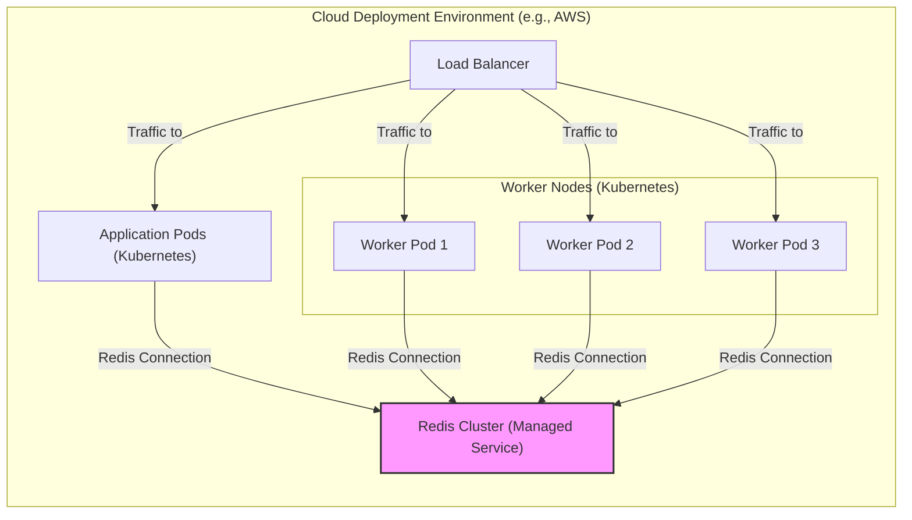

# BUSINESS POSTURE

This project is centered around the Resque Ruby library, a background job processing system. The primary business priority for adopting Resque is to enhance application responsiveness and reliability by offloading time-consuming or non-interactive tasks to background processes. This improves user experience by ensuring the main application remains fast and available, even under heavy load or when dealing with complex operations.

Key business goals addressed by Resque include:

*   Improved application performance and responsiveness.
*   Enhanced application reliability through asynchronous task processing.
*   Scalability to handle increasing workloads by adding more worker processes.
*   Simplified management of background tasks.

The most important business risks associated with using Resque are:

*   Job processing failures leading to data inconsistencies or incomplete operations.
*   Loss of jobs due to system failures or misconfigurations, resulting in missed business processes.
*   Performance bottlenecks in job processing impacting overall application performance.
*   Security vulnerabilities in Resque or its dependencies leading to data breaches or system compromise.
*   Operational complexity in managing and monitoring Resque infrastructure.

# SECURITY POSTURE

Existing security controls for the Resque project, based on common practices for similar open-source projects and the nature of background job processing systems, include:

*   security control: Code review process on GitHub for contributions to the Resque library itself, described in GitHub repository contribution guidelines.
*   security control: Dependency management using Bundler, helping to manage and potentially audit Ruby gem dependencies, described in Gemfile and Gemfile.lock.
*   security control: Reliance on Redis security mechanisms for data storage and access control, as Resque uses Redis as its backend. Security of Redis is typically configured and managed separately.
*   security control: Basic authentication for the Resque Web UI (if enabled), configurable via application settings, providing a minimal level of access control to the monitoring interface.

Accepted risks for the Resque project:

*   accepted risk: Vulnerabilities in third-party Ruby gems and Redis, which are dependencies of Resque and the applications using it. Mitigation relies on regular updates and vulnerability scanning.
*   accepted risk: Misconfiguration of Redis leading to unauthorized access or data exposure. This is mitigated by following Redis security best practices.
*   accepted risk: Lack of built-in encryption for job data within Redis. Sensitive data in jobs needs to be encrypted at the application level before being enqueued.

Recommended security controls to enhance the security posture of projects using Resque:

*   recommended security control: Input validation and sanitization for job arguments to prevent injection attacks. This should be implemented at the application level when enqueuing jobs.
*   recommended security control: Encryption of sensitive job data before enqueuing and decryption within worker processes. This protects sensitive information stored in Redis.
*   recommended security control: Role-Based Access Control (RBAC) for Resque Web UI and management interfaces to provide granular control over who can manage and monitor jobs.
*   recommended security control: Regular security audits and vulnerability scanning of Resque, its dependencies, and the applications using it.
*   recommended security control: Secure logging and monitoring practices to detect and respond to security incidents.

Security requirements for projects utilizing Resque:

*   Authentication:
    *   Requirement: Secure authentication mechanism for accessing Resque Web UI and any management interfaces.
    *   Requirement: If Resque Web UI is exposed, consider multi-factor authentication for enhanced security.
*   Authorization:
    *   Requirement: Implement role-based authorization to control access to Resque Web UI features and job management operations.
    *   Requirement: Ensure that only authorized applications and services can enqueue jobs.
*   Input Validation:
    *   Requirement: Rigorously validate and sanitize all job arguments to prevent injection vulnerabilities (e.g., command injection, SQL injection if job arguments are used in database queries).
    *   Requirement: Define and enforce data type and format validation for job arguments.
*   Cryptography:
    *   Requirement: Encrypt sensitive data within job payloads before enqueuing to protect data at rest in Redis and during processing.
    *   Requirement: Use secure key management practices for encryption keys.
    *   Requirement: Consider encrypting communication channels if sensitive job data is transmitted over a network (though typically communication with Redis is within a trusted network).

# DESIGN

## C4 CONTEXT



Elements of the context diagram:

*   Name: Application
    *   Type: Software System
    *   Description: The main application that utilizes Resque to offload background tasks. This could be a web application, API, or any other software system that needs asynchronous job processing.
    *   Responsibilities:
        *   Enqueues jobs into Resque with necessary data and job type.
        *   Handles user interactions and foreground tasks.
    *   Security controls:
        *   security control: Application-level authentication and authorization to control who can trigger actions that lead to job enqueueing.
        *   security control: Input validation to ensure data enqueued into jobs is safe and valid.

*   Name: Resque
    *   Type: Software System
    *   Description: The Resque background job processing system. It acts as the central component for managing job queues, scheduling, processing, and monitoring.
    *   Responsibilities:
        *   Receives jobs from applications.
        *   Stores job data in Redis.
        *   Distributes jobs to available workers.
        *   Provides a web UI for monitoring job status and queue health (optional).
        *   Manages job retries and failures.
    *   Security controls:
        *   security control: Basic authentication for Resque Web UI (if enabled).
        *   security control: Relies on Redis security for data storage and access.
        *   security control: Configuration options for limiting access and managing job processing.

*   Name: Redis
    *   Type: Data Store
    *   Description: Redis is used as the persistent data store for Resque. It holds the job queues, job metadata, worker status, and other operational data for Resque.
    *   Responsibilities:
        *   Persistently store job queues and job data.
        *   Provide fast data access for job enqueueing and dequeueing.
        *   Ensure data durability and availability for job processing.
    *   Security controls:
        *   security control: Redis authentication (e.g., requirepass directive).
        *   security control: Network security to restrict access to Redis (e.g., firewalls, network segmentation).
        *   security control: Redis ACLs (Access Control Lists) for more granular access control (if using Redis 6.0 or later).

*   Name: Worker
    *   Type: Software System
    *   Description: Worker processes are instances of the Resque worker application that execute the background jobs. They connect to Redis to fetch jobs from the queues and process them.
    *   Responsibilities:
        *   Connect to Redis and listen for jobs in assigned queues.
        *   Execute job logic based on job type and arguments.
        *   Report job status and results back to Resque/Redis.
        *   Handle job failures and retries according to Resque configuration.
    *   Security controls:
        *   security control: Principle of least privilege for worker processes, limiting access to only necessary resources.
        *   security control: Secure configuration of worker environments to prevent unauthorized access or modifications.
        *   security control: Logging and monitoring of worker activity for security auditing and incident response.

*   Name: Operations Team
    *   Type: Person
    *   Description: The operations team is responsible for managing, monitoring, and maintaining the Resque infrastructure and the applications using it.
    *   Responsibilities:
        *   Monitor Resque queues and worker performance.
        *   Manage Resque infrastructure (e.g., scaling workers, Redis maintenance).
        *   Respond to alerts and incidents related to Resque and job processing.
        *   Ensure the availability and reliability of the Resque system.
    *   Security controls:
        *   security control: Role-based access control to Resque monitoring tools and infrastructure management systems.
        *   security control: Secure access to servers and systems hosting Resque components.
        *   security control: Training on secure operational practices for managing Resque.

*   Name: Developers
    *   Type: Person
    *   Description: Developers are responsible for developing applications that use Resque, defining jobs, and potentially contributing to the Resque library itself.
    *   Responsibilities:
        *   Develop and define background jobs to be processed by Resque.
        *   Integrate Resque into applications.
        *   Monitor job performance and troubleshoot issues.
        *   Potentially contribute to the Resque open-source project.
    *   Security controls:
        *   security control: Secure coding practices when developing jobs and integrating with Resque, especially around input validation and data handling.
        *   security control: Access control to code repositories and development environments.
        *   security control: Code review processes to identify and mitigate security vulnerabilities in job implementations.

## C4 CONTAINER



Elements of the container diagram:

*   Name: Application Container
    *   Type: Application Runtime Container
    *   Description: Represents the runtime environment of the application that uses Resque. This container hosts the application code and includes the Resque client library for interacting with Resque.
    *   Responsibilities:
        *   Run the main application code.
        *   Utilize the Resque client library to enqueue jobs into Redis.
        *   Handle application-level logic and user interactions.
    *   Security controls:
        *   security control: Standard application container security practices (e.g., base image security, vulnerability scanning).
        *   security control: Secure configuration of the Resque client library and Redis connection details.
        *   security control: Input validation and sanitization at the application level before enqueuing jobs.

*   Name: Redis Container
    *   Type: Database Container
    *   Description: Represents the containerized instance of the Redis database. This container is responsible for storing and managing Resque's job queues and related data.
    *   Responsibilities:
        *   Persistently store job queues, job data, and Resque metadata.
        *   Provide efficient data access for Resque components.
        *   Manage data persistence and replication (if configured).
    *   Security controls:
        *   security control: Redis container security hardening (e.g., secure configuration, disabling unnecessary features).
        *   security control: Network policies to restrict access to the Redis container.
        *   security control: Redis authentication and potentially ACLs for access control.
        *   security control: Regular security updates and patching of the Redis container image.

*   Name: Resque Core Library (Ruby Gem)
    *   Type: Library
    *   Description: The Resque Ruby gem is the core library that provides the functionality for job processing, queue management, and worker coordination. It's integrated into both the application container and worker containers.
    *   Responsibilities:
        *   Provide APIs for enqueuing, processing, and managing jobs.
        *   Handle communication with Redis.
        *   Implement job scheduling, retry, and failure mechanisms.
    *   Security controls:
        *   security control: Dependency scanning of the Resque gem and its dependencies for vulnerabilities.
        *   security control: Code review and security audits of the Resque library itself (as part of the open-source project).
        *   security control: Using a specific and managed version of the Resque gem to control updates and potential regressions.

*   Name: Resque Web UI Container (Optional)
    *   Type: Web Application Container
    *   Description: An optional container hosting the Resque Web UI. This provides a web-based interface for monitoring job queues, workers, and job status.
    *   Responsibilities:
        *   Provide a user interface for monitoring Resque.
        *   Display job queue statistics, worker status, and job details.
        *   Allow for basic job management operations (e.g., retrying failed jobs).
    *   Security controls:
        *   security control: Basic authentication for accessing the Web UI.
        *   security control: Network policies to restrict access to the Web UI container.
        *   security control: Security hardening of the Web UI container and application.
        *   security control: Consider RBAC for more granular access control to Web UI features.

*   Name: Worker Container(s) (Ruby Process)
    *   Type: Application Runtime Container
    *   Description: One or more containers running Resque worker processes. These containers are responsible for fetching jobs from Redis and executing them. Multiple worker containers can be deployed for scalability and concurrency.
    *   Responsibilities:
        *   Run Resque worker processes.
        *   Connect to Redis to fetch and process jobs.
        *   Execute job logic defined in the application.
        *   Report job status and results back to Resque/Redis.
    *   Security controls:
        *   security control: Worker container security hardening.
        *   security control: Principle of least privilege for worker processes.
        *   security control: Secure configuration of worker environments.
        *   security control: Logging and monitoring of worker activity.
        *   security control: Resource limits for worker containers to prevent resource exhaustion or denial of service.

## DEPLOYMENT

Deployment Architecture Option: Cloud-Based Containerized Deployment (e.g., Kubernetes on AWS, GCP, Azure)



Elements of the deployment diagram (Cloud-Based Containerized Deployment):

*   Name: Load Balancer
    *   Type: Network Load Balancer
    *   Description: A cloud-managed load balancer distributes incoming traffic to application pods and potentially to Resque Web UI if exposed externally. It ensures high availability and scalability by distributing load across multiple instances.
    *   Responsibilities:
        *   Distribute incoming traffic to application pods.
        *   Potentially route traffic to Resque Web UI (if exposed).
        *   Perform health checks on backend instances.
        *   Provide SSL/TLS termination (optional).
    *   Security controls:
        *   security control: SSL/TLS encryption for traffic termination at the load balancer.
        *   security control: Web Application Firewall (WAF) integration for protecting against common web attacks.
        *   security control: Access control lists (ACLs) or security groups to restrict access to the load balancer.
        *   security control: DDoS protection provided by the cloud provider.

*   Name: Worker Nodes (Kubernetes)
    *   Type: Compute Instances (Virtual Machines or Containers)
    *   Description: A cluster of worker nodes in a Kubernetes environment. These nodes host the worker pods responsible for processing Resque jobs. Kubernetes manages the deployment, scaling, and orchestration of worker pods.
    *   Responsibilities:
        *   Provide compute resources for running worker pods.
        *   Ensure high availability and scalability of worker pods through Kubernetes orchestration.
        *   Manage container runtime environment.
    *   Security controls:
        *   security control: Node-level security hardening (OS hardening, patching).
        *   security control: Network segmentation and firewall rules to isolate worker nodes.
        *   security control: Kubernetes Role-Based Access Control (RBAC) to manage access to Kubernetes resources.
        *   security control: Container security scanning and vulnerability management on worker nodes.

*   Name: Worker Pods (Kubernetes)
    *   Type: Containerized Application Instances
    *   Description: Kubernetes pods running Resque worker processes. Each pod contains one or more worker containers that connect to Redis and process jobs. Kubernetes manages the lifecycle, scaling, and health of these pods.
    *   Responsibilities:
        *   Run Resque worker processes.
        *   Connect to Redis to fetch and process jobs.
        *   Report job status and metrics.
    *   Security controls:
        *   security control: Container image security scanning and vulnerability management.
        *   security control: Principle of least privilege for worker containers (minimal required permissions).
        *   security control: Resource limits and quotas for worker pods to prevent resource exhaustion.
        *   security control: Network policies within Kubernetes to restrict network access for worker pods.

*   Name: Redis Cluster (Managed Service)
    *   Type: Managed Database Service
    *   Description: A managed Redis cluster provided by the cloud provider (e.g., AWS ElastiCache, GCP Memorystore, Azure Cache for Redis). Using a managed service simplifies operations, ensures high availability, and often includes built-in security features.
    *   Responsibilities:
        *   Provide a highly available and scalable Redis data store.
        *   Manage Redis cluster operations (e.g., backups, scaling, patching).
        *   Ensure data persistence and durability.
    *   Security controls:
        *   security control: Network isolation using VPCs and security groups.
        *   security control: Redis authentication and access control provided by the managed service.
        *   security control: Encryption in transit and at rest (depending on the managed service features).
        *   security control: Regular security patching and updates managed by the cloud provider.
        *   security control: Compliance certifications of the managed service provider.

*   Name: Application Pods (Kubernetes)
    *   Type: Containerized Application Instances
    *   Description: Kubernetes pods running the main application. These pods enqueue jobs to Resque and handle user requests.
    *   Responsibilities:
        *   Run the main application logic.
        *   Enqueue jobs to Resque using the Resque client library.
        *   Serve user requests and handle foreground tasks.
    *   Security controls:
        *   security control: Standard application container security practices.
        *   security control: Input validation and sanitization at the application level.
        *   security control: Authentication and authorization within the application.
        *   security control: Network policies to restrict network access for application pods.

## BUILD

```mermaid
flowchart TB
    A[Developer] -- Code Commit --> B(GitHub Repository)
    B -- Trigger --> C{CI/CD Pipeline (e.g., GitHub Actions)}
    C -- Checkout Code --> D[Build Environment]
    D -- Run Linters & SAST --> E{Security Checks}
    E -- Build & Test --> F[Build Artifacts (e.g., Gem)]
    F -- Publish --> G[Artifact Repository (e.g., RubyGems.org)]
```

Elements of the build diagram:

*   Name: Developer
    *   Type: Person
    *   Description: Software developers who write and commit code for applications using Resque or contribute to the Resque library itself.
    *   Responsibilities:
        *   Write application code and Resque jobs.
        *   Commit code changes to the source code repository.
        *   Adhere to secure coding practices.
    *   Security controls:
        *   security control: Developer workstations security (endpoint security, access controls).
        *   security control: Secure coding training for developers.
        *   security control: Code review process before code is merged.
        *   security control: Access control to code repositories.

*   Name: GitHub Repository
    *   Type: Source Code Repository
    *   Description: The central repository for storing and managing the source code of the application or the Resque library. GitHub provides version control, collaboration features, and triggers for CI/CD pipelines.
    *   Responsibilities:
        *   Store and manage source code.
        *   Track code changes and versions.
        *   Trigger CI/CD pipelines on code commits or pull requests.
        *   Control access to the codebase.
    *   Security controls:
        *   security control: Access control and authentication for repository access (e.g., GitHub Organizations, permissions).
        *   security control: Branch protection rules to enforce code review and prevent direct commits to protected branches.
        *   security control: Audit logging of repository activities.
        *   security control: Vulnerability scanning of dependencies declared in the repository (e.g., using GitHub Dependabot).

*   Name: CI/CD Pipeline (e.g., GitHub Actions)
    *   Type: Automation System
    *   Description: An automated CI/CD pipeline (e.g., using GitHub Actions, Jenkins, GitLab CI) that builds, tests, and potentially deploys the application or library. It automates the build process and integrates security checks.
    *   Responsibilities:
        *   Automate the build, test, and packaging process.
        *   Run security checks (linters, SAST scanners).
        *   Publish build artifacts to artifact repositories.
        *   Potentially automate deployment to target environments.
    *   Security controls:
        *   security control: Secure configuration of CI/CD pipeline definitions and workflows.
        *   security control: Secret management for storing and accessing credentials and API keys within the pipeline.
        *   security control: Isolation of build environments to prevent contamination.
        *   security control: Integration of security scanning tools (SAST, linters, dependency checkers) into the pipeline.
        *   security control: Audit logging of CI/CD pipeline activities.

*   Name: Build Environment
    *   Type: Isolated Build Server/Container
    *   Description: A dedicated and isolated environment where the build process takes place. This environment should be clean and reproducible to ensure build integrity and prevent supply chain attacks.
    *   Responsibilities:
        *   Provide a secure and isolated environment for building software.
        *   Execute build scripts and commands.
        *   Run security checks and tests.
        *   Generate build artifacts.
    *   Security controls:
        *   security control: Hardened build environment (minimal software installed, secure OS configuration).
        *   security control: Access control to the build environment.
        *   security control: Regular patching and updates of the build environment.
        *   security control: Immutable build environment configurations (Infrastructure as Code).

*   Name: Security Checks
    *   Type: Security Tooling
    *   Description: A suite of security tools integrated into the CI/CD pipeline to automatically identify security vulnerabilities in the code and dependencies. This includes linters, Static Application Security Testing (SAST) scanners, and dependency vulnerability scanners.
    *   Responsibilities:
        *   Perform static code analysis to identify potential vulnerabilities.
        *   Check code style and enforce coding standards (linters).
        *   Scan dependencies for known vulnerabilities.
        *   Fail the build if critical security issues are found (policy enforcement).
    *   Security controls:
        *   security control: Regularly updated security scanning tools and vulnerability databases.
        *   security control: Configuration of security scanning tools to match security policies and requirements.
        *   security control: Review and remediation process for security findings from scanning tools.

*   Name: Build Artifacts (e.g., Gem)
    *   Type: Software Package
    *   Description: The packaged output of the build process, ready for deployment or distribution. For Ruby projects, this is typically a Gem package.
    *   Responsibilities:
        *   Contain the compiled or packaged application code and dependencies.
        *   Be verifiable and tamper-proof.
        *   Be ready for deployment or distribution.
    *   Security controls:
        *   security control: Signing of build artifacts to ensure integrity and authenticity.
        *   security control: Secure storage of build artifacts before publishing.
        *   security control: Versioning and provenance tracking of build artifacts.

*   Name: Artifact Repository (e.g., RubyGems.org)
    *   Type: Package Registry
    *   Description: A repository for storing and distributing build artifacts. For Ruby Gems, this is typically RubyGems.org or a private Gem repository.
    *   Responsibilities:
        *   Store and manage build artifacts.
        *   Provide access to build artifacts for deployment or consumption.
        *   Ensure the availability and integrity of artifacts.
    *   Security controls:
        *   security control: Access control and authentication for publishing and downloading artifacts.
        *   security control: Secure storage of artifacts.
        *   security control: Vulnerability scanning of published artifacts (if supported by the repository).
        *   security control: Audit logging of artifact repository access and modifications.

# RISK ASSESSMENT

Critical business processes protected by Resque are background job processing, which may include:

*   Asynchronous email sending and notifications.
*   Data processing and batch updates.
*   Report generation.
*   Image and video processing.
*   Payment processing and transaction handling.
*   Integration with external systems.

The data being protected by Resque includes:

*   Job arguments: Data passed to jobs for processing. Sensitivity depends on the application and job type. This data can range from non-sensitive operational parameters to highly sensitive Personally Identifiable Information (PII), financial data, or confidential business information.
*   Job results: Output and results of job processing. Sensitivity also varies depending on the job and can include processed data, reports, or status updates, potentially containing sensitive information derived from job arguments or external sources.
*   Job metadata: Information about job status, queues, workers, and processing history. While less sensitive than job arguments or results, this metadata can still reveal operational details and potentially indirect information about business processes.

Sensitivity of data processed by Resque is highly context-dependent and determined by the applications using Resque. It is crucial to classify the data processed by jobs based on the application's data sensitivity policy and implement appropriate security controls accordingly, especially regarding encryption and access control.

# QUESTIONS & ASSUMPTIONS

Questions:

*   What is the specific use case for Resque in the target environment? What types of jobs will be processed?
*   What is the sensitivity level of the data that will be processed by Resque jobs? Are there any compliance requirements (e.g., GDPR, HIPAA, PCI DSS)?
*   Is the Resque Web UI going to be exposed and used for monitoring? If so, what is the intended user base and access control requirements?
*   What is the expected scale of Resque usage (number of jobs, workers, data volume)?
*   What are the existing monitoring and logging systems in place for the target environment?
*   What is the organization's risk appetite regarding security vulnerabilities and operational disruptions?
*   Are there any specific security policies or standards that need to be adhered to?

Assumptions:

*   Resque is being used to process background jobs that are important for business operations.
*   Job data may contain sensitive information that needs to be protected.
*   The deployment environment is a typical cloud or on-premise infrastructure capable of running containers and Redis.
*   Standard security practices are desired for protecting the Resque system and the data it processes.
*   The organization has a need for a well-documented and secure design for threat modeling and security assessments.
*   The latest stable version of Resque and Redis will be used.