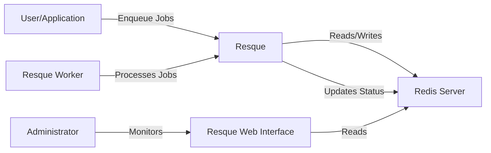
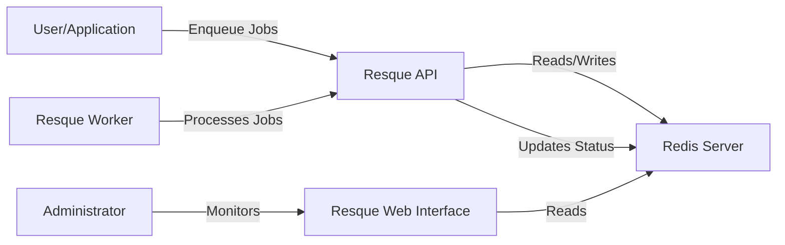
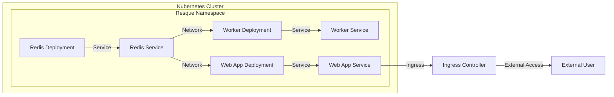
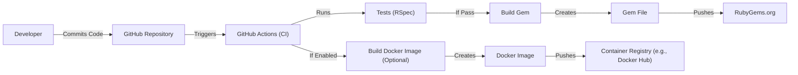

# BUSINESS POSTURE

Resque is a Redis-backed Ruby library for creating background jobs, placing them on multiple queues, and processing them later. The primary business goal is to provide a robust and reliable system for asynchronous job processing, enabling applications to offload time-consuming tasks and improve responsiveness.

Business priorities:

- Reliability: Ensure jobs are processed reliably, even in the face of failures.
- Scalability: Handle a large volume of jobs and workers.
- Maintainability: Provide a clear and easy-to-use API for developers.
- Visibility: Offer tools for monitoring job status and queue health.
- Performance: Minimize overhead and latency in job processing.

Business risks:

- Job loss: If jobs are lost due to system failures, it could lead to data inconsistencies or incomplete operations.
- Worker failures: If workers crash or become unresponsive, jobs may not be processed in a timely manner.
- Redis outage: Since Resque relies on Redis, an outage of the Redis server could halt job processing.
- Security vulnerabilities: Vulnerabilities in Resque or its dependencies could be exploited to compromise the system.
- Inefficient job processing: Poorly designed jobs or inefficient worker configurations could lead to performance bottlenecks.

# SECURITY POSTURE

Existing security controls:

- security control: Resque itself does not provide built-in authentication or authorization mechanisms. It relies on the security of the underlying Redis instance and the application using it. (Resque documentation, source code)
- security control: Resque uses a simple string-based queue system. (Resque documentation, source code)
- security control: The project uses GitHub for version control and issue tracking, which provides some level of access control and auditability. (GitHub repository)

Accepted risks:

- accepted risk: Resque does not encrypt data stored in Redis. Sensitive data should be encrypted by the application before being passed to Resque.
- accepted risk: Resque does not implement any specific defenses against common web application vulnerabilities (e.g., XSS, CSRF). It is the responsibility of the application using Resque to implement these defenses.
- accepted risk: Resque workers run with the privileges of the user that started them. It is important to run workers with the least necessary privileges.

Recommended security controls:

- security control: Implement network-level security controls to restrict access to the Redis instance.
- security control: Use a strong, unique password for the Redis instance.
- security control: Regularly update Resque and its dependencies to patch security vulnerabilities.
- security control: Monitor Resque queues and workers for unusual activity.
- security control: Consider using a dedicated Redis instance for Resque to isolate it from other applications.
- security control: Implement a robust error handling and retry mechanism within the application to handle job failures gracefully.

Security requirements:

- Authentication: Not directly applicable to Resque itself. The application using Resque should handle authentication.
- Authorization: Not directly applicable to Resque itself. The application using Resque should handle authorization to control which users can enqueue or manage jobs.
- Input validation: The application using Resque should validate all data passed to jobs to prevent injection attacks or other vulnerabilities.
- Cryptography: Sensitive data stored in Redis should be encrypted by the application before being passed to Resque.
- Session management: Not directly applicable to Resque itself. The application using Resque should handle session management.

# DESIGN

## C4 CONTEXT

Element descriptions:

- User/Application:
    - Name: User/Application
    - Type: External System/User
    - Description: The application or user that enqueues jobs into Resque.
    - Responsibilities: Creating and enqueuing jobs, handling job results.
    - Security controls: Authentication, authorization, input validation, encryption of sensitive data.

- Resque:
    - Name: Resque
    - Type: System
    - Description: The core Resque system for managing queues and jobs.
    - Responsibilities: Managing job queues, distributing jobs to workers.
    - Security controls: Relies on Redis security and network controls.

- Redis Server:
    - Name: Redis Server
    - Type: External System
    - Description: The Redis instance used by Resque to store job data and queue information.
    - Responsibilities: Storing job data, managing queue state.
    - Security controls: Redis authentication, network access control, data encryption (if configured).

- Resque Worker:
    - Name: Resque Worker
    - Type: System Component
    - Description: Processes that execute jobs from the Resque queues.
    - Responsibilities: Fetching jobs from queues, executing job logic, updating job status.
    - Security controls: Runs with the privileges of the user that started it.

- Administrator:
    - Name: Administrator
    - Type: External User
    - Description: A user who monitors the Resque system.
    - Responsibilities: Monitoring queue health, job status, and worker performance.
    - Security controls: Authentication and authorization for the Resque Web Interface.

- Resque Web Interface:
    - Name: Resque Web Interface
    - Type: System Component
    - Description: A web interface for monitoring Resque.
    - Responsibilities: Displaying queue information, job status, and worker details.
    - Security controls: Authentication and authorization, protection against web vulnerabilities (XSS, CSRF).

## C4 CONTAINER

Element descriptions:

- User/Application:
    - Name: User/Application
    - Type: External System/User
    - Description: The application or user that enqueues jobs into Resque.
    - Responsibilities: Creating and enqueuing jobs, handling job results.
    - Security controls: Authentication, authorization, input validation, encryption of sensitive data.

- Resque API:
    - Name: Resque API
    - Type: Container
    - Description: The API provided by the Resque library for interacting with the system.
    - Responsibilities: Enqueuing jobs, managing queues, retrieving job status.
    - Security controls: Relies on Redis security and network controls.

- Redis Server:
    - Name: Redis Server
    - Type: External System
    - Description: The Redis instance used by Resque to store job data and queue information.
    - Responsibilities: Storing job data, managing queue state.
    - Security controls: Redis authentication, network access control, data encryption (if configured).

- Resque Worker:
    - Name: Resque Worker
    - Type: Container
    - Description: Processes that execute jobs from the Resque queues.
    - Responsibilities: Fetching jobs from queues, executing job logic, updating job status.
    - Security controls: Runs with the privileges of the user that started it.

- Administrator:
    - Name: Administrator
    - Type: External User
    - Description: A user who monitors the Resque system.
    - Responsibilities: Monitoring queue health, job status, and worker performance.
    - Security controls: Authentication and authorization for the Resque Web Interface.

- Resque Web Interface:
    - Name: Resque Web Interface
    - Type: Container
    - Description: A web interface for monitoring Resque.
    - Responsibilities: Displaying queue information, job status, and worker details.
    - Security controls: Authentication and authorization, protection against web vulnerabilities (XSS, CSRF).

## DEPLOYMENT

Possible deployment solutions:

1.  Traditional server deployment (e.g., using Capistrano, Mina, or similar tools).
2.  Containerized deployment (e.g., using Docker and Kubernetes).
3.  Platform-as-a-Service (PaaS) deployment (e.g., Heroku, AWS Elastic Beanstalk).

Chosen solution: Containerized deployment using Docker and Kubernetes.

Element descriptions:

- Kubernetes Cluster:
    - Name: Kubernetes Cluster
    - Type: Infrastructure
    - Description: The Kubernetes cluster where Resque and its components are deployed.
    - Responsibilities: Orchestrating and managing the containers.
    - Security controls: Kubernetes RBAC, network policies, pod security policies.

- Resque Namespace:
    - Name: Resque Namespace
    - Type: Logical Grouping
    - Description: A Kubernetes namespace to isolate Resque components.
    - Responsibilities: Providing a logical boundary for Resque resources.
    - Security controls: Kubernetes namespace-level restrictions.

- Redis Deployment:
    - Name: Redis Deployment
    - Type: Deployment
    - Description: Manages the Redis pods.
    - Responsibilities: Ensuring the desired number of Redis replicas are running.
    - Security controls: Redis password, resource limits.

- Redis Service:
    - Name: Redis Service
    - Type: Service
    - Description: Provides a stable endpoint for accessing the Redis deployment.
    - Responsibilities: Exposing Redis to other components within the cluster.
    - Security controls: Kubernetes service-level access control.

- Worker Deployment:
    - Name: Worker Deployment
    - Type: Deployment
    - Description: Manages the Resque worker pods.
    - Responsibilities: Ensuring the desired number of worker replicas are running.
    - Security controls: Resource limits, least privilege principle for worker processes.

- Worker Service:
    - Name: Worker Service
    - Type: Service
    - Description: Provides a stable endpoint for accessing the worker deployment (optional, often workers connect directly to Redis).
    - Responsibilities: Exposing workers to other components within the cluster (if needed).
    - Security controls: Kubernetes service-level access control.

- Web App Deployment:
    - Name: Web App Deployment
    - Type: Deployment
    - Description: Manages the pods for the application using Resque and/or the Resque Web Interface.
    - Responsibilities: Ensuring the desired number of web application replicas are running.
    - Security controls: Resource limits, web application security best practices.

- Web App Service:
    - Name: Web App Service
    - Type: Service
    - Description: Provides a stable endpoint for accessing the web application.
    - Responsibilities: Exposing the web application to external traffic.
    - Security controls: Kubernetes service-level access control.

- Ingress Controller:
    - Name: Ingress Controller
    - Type: Infrastructure Component
    - Description: Manages external access to the web application.
    - Responsibilities: Routing external traffic to the Web App Service.
    - Security controls: TLS termination, ingress rules, web application firewall (WAF).

- External User:
    - Name: External User
    - Type: External User
    - Description: Users accessing the web application from outside the cluster.
    - Responsibilities: Interacting with the web application.
    - Security controls: Authentication, authorization.

## BUILD

The build process for Resque involves multiple stages, from development to the creation of releasable artifacts.  While Resque itself is a library and doesn't have a traditional "build" in the sense of compiled languages, the process includes testing, packaging (as a gem), and potentially creating Docker images for deployment.

Security controls in the build process:

- security control: Version control (GitHub): All code changes are tracked in a Git repository hosted on GitHub, providing auditability and access control.
- security control: Continuous Integration (GitHub Actions): Automated workflows are used to run tests and build the gem on every push to the repository.
- security control: Automated Testing (RSpec):  A comprehensive test suite (using RSpec) is executed to ensure code quality and prevent regressions.
- security control: Dependency Management (Bundler): Dependencies are managed using Bundler, and their versions are locked in `Gemfile.lock` to ensure consistent builds.
- security control: Gem Signing (Optional): The released gem can be digitally signed to verify its authenticity and integrity.
- security control: Docker Image Security (Optional): If Docker images are built, security best practices should be followed, such as using minimal base images, scanning for vulnerabilities, and regularly updating dependencies.
- security control: Supply Chain Security: Regularly audit dependencies for known vulnerabilities using tools like bundler-audit or Dependabot.

# RISK ASSESSMENT

Critical business processes to protect:

- Asynchronous job processing: The core functionality of Resque, ensuring that background tasks are executed reliably and efficiently.
- Application responsiveness:  Resque enables applications to remain responsive by offloading time-consuming tasks.

Data to protect and their sensitivity:

- Job data: This includes any data passed to Resque jobs. The sensitivity of this data depends on the specific application using Resque. It could range from non-sensitive (e.g., timestamps) to highly sensitive (e.g., PII, financial data).
- Queue metadata: Information about the queues, job status, and worker status. While not typically sensitive, it could be used to gain insights into the application's behavior.
- Redis connection details: Credentials used to connect to the Redis server. These are highly sensitive and must be protected.

# QUESTIONS & ASSUMPTIONS

Questions:

- What specific types of data will be processed by Resque jobs? This is crucial for determining the appropriate level of encryption and data handling procedures.
- What is the expected volume of jobs and the required throughput? This will influence the scaling and resource allocation for Resque workers and the Redis instance.
- Are there any specific compliance requirements (e.g., GDPR, HIPAA) that need to be considered?
- Will the Resque Web Interface be exposed publicly, or will it be restricted to internal access?
- What is the existing infrastructure for managing secrets (e.g., passwords, API keys)?
- What monitoring and alerting systems are in place?

Assumptions:

- BUSINESS POSTURE: The primary goal is to provide a reliable and scalable background job processing system. Cost optimization is a secondary concern.
- SECURITY POSTURE: The application using Resque is responsible for handling authentication, authorization, and input validation. Resque itself does not provide these features. The Redis instance will be secured with a strong password and network-level access controls.
- DESIGN: A containerized deployment using Docker and Kubernetes is the preferred approach. The Resque Web Interface will be used for monitoring and will require authentication.