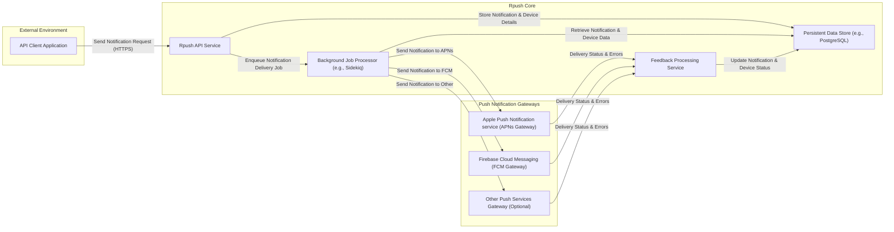

## Project Design Document: Rpush - Robust Push Notification Service

**Version:** 1.1
**Date:** October 26, 2023
**Author:** AI Software Architect

### 1. Introduction

This document provides an enhanced design overview of the Rpush project, an open-source push notification service. The primary purpose of this document is to provide a detailed understanding of the system's architecture, components, and data flow to facilitate comprehensive threat modeling and security analysis. It serves as a foundation for identifying potential vulnerabilities and designing appropriate security controls.

### 2. Goals and Objectives

The core goals of Rpush are to:

* Deliver push notifications reliably and at scale to various mobile platforms (iOS, Android, and potentially others).
* Offer a straightforward and well-documented API for external applications to initiate push notifications.
* Support multiple push notification providers (APNs, FCM, and potentially extensible to others).
* Manage the lifecycle of device registrations, including token management and invalidation.
* Provide mechanisms for monitoring, logging, and troubleshooting notification delivery issues.
* Ensure the security and integrity of the notification delivery process and stored data.

### 3. High-Level Architecture

Rpush employs a decoupled architecture with distinct components responsible for specific tasks. This design promotes scalability and maintainability.

### 4. Component Details

This section provides a detailed breakdown of each component, outlining its functionality, responsibilities, and potential security considerations.

* **API Client Application:**
    * Represents any external application or service that needs to send push notifications through Rpush.
    * Interacts with the **Rpush API Service** via HTTPS.
    * Responsible for authenticating with the **Rpush API Service** (mechanism to be defined, e.g., API keys, OAuth).
    * Provides the notification payload, target device tokens, and platform information.

* **Rpush API Service:**
    * The primary interface for external clients. Built using a framework like Ruby on Rails.
    * Exposes RESTful API endpoints for:
        * Creating and sending individual or bulk notifications.
        * Registering, updating, and querying device registrations.
        * Retrieving notification delivery status and history.
    * Performs request validation, authentication, and authorization.
    * Stores notification metadata and device information in the **Persistent Data Store**.
    * Enqueues notification delivery jobs for the **Background Job Processor**.

* **Persistent Data Store:**
    * Stores all persistent data for Rpush. Likely a relational database like PostgreSQL or MySQL.
    * Stores:
        * Notification details (payload, sender, timestamps, status, delivery attempts).
        * Device registration information (device tokens, platform, application identifiers, registration timestamps).
        * Application configurations (API keys, provider-specific settings, authentication credentials - securely stored).
        * Audit logs of API requests and significant system events.

* **Background Job Processor:**
    * Executes asynchronous tasks, primarily the delivery of push notifications. A system like Sidekiq (using Redis) is a likely candidate.
    * Consumes notification delivery jobs from a queue.
    * Retrieves necessary notification details and device tokens from the **Persistent Data Store**.
    * Interacts with the appropriate **Push Notification Gateways** to send notifications.
    * Handles retries and backoff strategies for failed delivery attempts.
    * Updates the notification status in the **Persistent Data Store**.

* **Feedback Processing Service:**
    * Periodically polls or receives webhook notifications from the **Push Notification Gateways**.
    * Processes feedback related to notification delivery, such as invalid device tokens or delivery failures.
    * Updates device registration statuses in the **Persistent Data Store** based on feedback (e.g., marking tokens as invalid).
    * Potentially triggers alerts or notifications for significant feedback events.

* **Apple Push Notification service (APNs Gateway):**
    * Responsible for communicating with Apple's APNs.
    * Implements the APNs protocol (likely using HTTP/2).
    * Manages APNs certificates and authentication tokens securely.
    * Handles connection management and error handling for APNs interactions.

* **Firebase Cloud Messaging (FCM Gateway):**
    * Responsible for communicating with Google's FCM.
    * Implements the FCM protocol (likely using HTTP v1).
    * Manages FCM server keys and project credentials securely.
    * Handles connection management and error handling for FCM interactions.

* **Other Push Services Gateway (Optional):**
    * Represents potential support for other push notification providers (e.g., Huawei Push Kit).
    * Would implement the specific protocol and authentication mechanisms for that provider.

### 5. Data Flow

The typical flow for sending a push notification involves these steps:

1. An **API Client Application** sends an HTTPS request to the **Rpush API Service** with the notification details and target device information.
2. The **Rpush API Service** authenticates and authorizes the request.
3. The **Rpush API Service** validates the input data.
4. The **Rpush API Service** stores the notification details and relevant device information in the **Persistent Data Store**.
5. The **Rpush API Service** enqueues a notification delivery job onto the **Background Job Processor's** queue.
6. A **Background Job Processor** worker picks up the job from the queue.
7. The worker retrieves the necessary notification details and device token from the **Persistent Data Store**.
8. Based on the device's platform, the worker selects the appropriate **Push Notification Gateway** (APNs or FCM).
9. The worker sends the notification payload to the selected **Push Notification Gateway**.
10. The **Push Notification Gateway** communicates with the respective push notification service (APNs or FCM).
11. The push notification service attempts to deliver the notification to the target device.
12. The **Push Notification Gateway** may receive delivery receipts or error messages from the push notification service.
13. The **Push Notification Gateway** forwards these delivery statuses and errors to the **Feedback Processing Service**.
14. The **Feedback Processing Service** updates the notification status and potentially the device registration status in the **Persistent Data Store**.

### 6. Security Considerations

This section outlines key security considerations for the Rpush project, categorized for clarity.

* **Authentication and Authorization:**
    * **API Client Authentication:** How are external applications authenticated when interacting with the **Rpush API Service**?
        * Potential mechanisms: API keys, OAuth 2.0 tokens.
        * Secure storage and management of API keys/credentials.
        * Rate limiting to prevent brute-force attacks.
    * **API Authorization:** How is access controlled to different API endpoints and resources?
        * Role-based access control (RBAC) or attribute-based access control (ABAC).
        * Ensuring only authorized clients can perform specific actions.
    * **Internal Component Authentication:** How do internal components authenticate to each other?
        * Database credentials managed securely (e.g., using environment variables, secrets management).
        * Secure communication channels between components (e.g., internal network, TLS).

* **Data Security:**
    * **Data at Rest:** How is sensitive data stored in the **Persistent Data Store** protected?
        * Encryption of sensitive fields (e.g., notification payloads, potentially device identifiers).
        * Database encryption features.
        * Access control lists (ACLs) on the database.
    * **Data in Transit:** How is data protected while being transmitted between components?
        * Enforce HTTPS for all external API communication.
        * Use TLS/SSL for communication between internal components where feasible.
    * **Device Token Security:** While Rpush doesn't directly control device token generation, consider the implications of compromised tokens.
        * Mechanisms for invalidating tokens if necessary.
        * Logging and monitoring of unusual token activity.

* **Input Validation:**
    * **API Request Validation:** Rigorous validation of all input data received by the **Rpush API Service**.
        * Preventing injection attacks (e.g., SQL injection, cross-site scripting if web interfaces exist).
        * Validating data types, formats, and lengths.
    * **Notification Payload Sanitization:**  Careful handling and potential sanitization of notification payloads to prevent malicious content.

* **Push Notification Provider Security:**
    * **Credential Management:** Secure storage and management of APNs certificates, FCM server keys, and other provider credentials.
        * Avoid storing credentials directly in code.
        * Utilize secure secrets management solutions (e.g., HashiCorp Vault, AWS Secrets Manager).
        * Implement proper rotation policies for credentials.
    * **Provider API Security:** Adhering to the security best practices recommended by each push notification provider.

* **Operational Security:**
    * **Logging and Monitoring:** Comprehensive logging of API requests, system events, and errors.
        * Monitoring for suspicious activity and security breaches.
        * Secure storage and access control for logs.
    * **Vulnerability Management:** Regularly updating dependencies and patching known vulnerabilities.
    * **Security Audits:** Periodic security audits and penetration testing to identify potential weaknesses.
    * **Rate Limiting and Abuse Prevention:** Implementing rate limiting on API endpoints to prevent abuse and denial-of-service attacks.

### 7. Deployment Considerations

Secure deployment practices are crucial for the overall security of Rpush.

* **Network Segmentation:** Isolating Rpush components within a secure network segment.
* **Firewall Configuration:** Implementing strict firewall rules to control network traffic to and from Rpush components.
* **Access Control:** Limiting access to servers and infrastructure hosting Rpush components.
* **Secure Configuration:** Following security hardening guidelines for operating systems and application servers.
* **Regular Security Updates:** Keeping the underlying operating systems, libraries, and frameworks up-to-date with security patches.
* **Container Security (if using containers):** Implementing security best practices for container images and orchestration platforms.

### 8. Future Considerations

Future development should continue to prioritize security.

* **Enhanced Security Auditing:** Implementing more detailed audit logging for security-related events.
* **Integration with Security Information and Event Management (SIEM) Systems:**  Enabling integration with SIEM systems for centralized security monitoring.
* **Consideration of End-to-End Encryption:** Exploring options for encrypting notification payloads end-to-end, although this adds complexity.

This improved design document provides a more detailed and security-focused overview of the Rpush project. It serves as a valuable resource for conducting thorough threat modeling and implementing robust security controls.