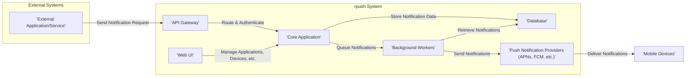
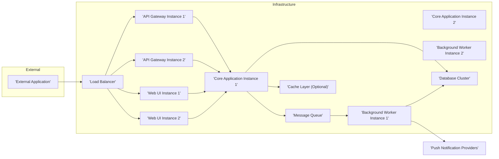

# Project Design Document: rpush - Robust Push Notification Service

**Version:** 1.1
**Date:** October 26, 2023
**Author:** AI Software Architect

## 1. Introduction

This document provides an enhanced design specification for the rpush project, a robust push notification service. Building upon the initial design, this version offers greater detail and clarity regarding the system's architecture, components, and data flow. This document will serve as a comprehensive blueprint for understanding the system and will be the foundation for subsequent threat modeling activities to identify potential security vulnerabilities. This design is based on the publicly available information from the rpush GitHub repository: [https://github.com/rpush/rpush](https://github.com/rpush/rpush).

## 2. Goals

The primary goals of the rpush project are to:

* Provide a highly reliable and scalable platform for sending push notifications to diverse mobile platforms (iOS, Android, and potentially others).
* Seamlessly support multiple push notification providers (e.g., APNs, FCM) with an abstraction layer.
* Offer a user-friendly administrative interface for managing applications, devices, and notifications, including detailed reporting.
* Provide a well-documented and secure API for external services to programmatically send push notifications.
* Ensure efficient and timely processing and delivery of notifications, with mechanisms for handling failures.
* Maintain a robust security posture for managing sensitive data, including device tokens and provider API credentials.
* Facilitate easy integration with existing systems and workflows.

## 3. High-Level Architecture

The rpush system is composed of several interacting components, as illustrated below:

## 4. Detailed Component Descriptions

This section elaborates on the functionality and responsibilities of each component within the rpush system.

* **External Application/Service:** Represents any external system or application that needs to send push notifications via rpush.
    * Functionality: Initiates requests to send push notifications, typically through the rpush API.
    * Interaction: Communicates with the rpush API Gateway using defined API endpoints.

* **API Gateway:** Serves as the single entry point for all external API requests to the rpush system.
    * Functionality:
        * Receives and routes incoming API requests to the appropriate internal services.
        * Handles authentication and authorization of external applications, potentially using API keys or OAuth 2.0.
        * Implements rate limiting and request validation to protect the system from abuse.
        * May provide API documentation and versioning.
    * Interaction: Receives requests from external applications and forwards them to the Core Application.

* **Web UI:** Provides a graphical user interface for administrators and potentially other authorized users to manage the rpush system.
    * Functionality:
        * Manage applications (register new applications, update settings, delete applications).
        * Manage devices (register new devices, unregister devices, view device details, potentially manage device groups/segments).
        * Compose and send notifications manually to specific devices or applications.
        * View comprehensive notification delivery status, logs, and analytics.
        * Configure system settings, including push provider credentials and notification templates.
    * Interaction: Communicates with the Core Application to perform management tasks, typically through a dedicated internal API.

* **Core Application:** The central component encompassing the core business logic and orchestration of the rpush system.
    * Functionality:
        * Handles API requests for sending notifications, including payload validation and recipient resolution.
        * Manages application and device registration and data.
        * Stores notification data, including payloads, delivery status, and timestamps, in the database.
        * Queues notifications for asynchronous processing by the Background Workers, potentially using a message queue.
        * Tracks notification status and manages delivery feedback from push providers.
        * Implements business rules, such as notification throttling and deduplication.
        * Manages API key generation and revocation.
    * Interaction: Interacts with the API Gateway, Web UI, Database, and Background Workers.

* **Background Workers:** Responsible for the asynchronous processing and delivery of push notifications.
    * Functionality:
        * Retrieves notifications from the queue.
        * Determines the appropriate push notification provider based on the target device's platform.
        * Formats notifications according to the specific provider's API requirements.
        * Communicates with the push notification providers (APNs, FCM, etc.) to send notifications.
        * Handles delivery feedback (success, failure, bounces, etc.) from the providers.
        * Updates notification status in the database.
        * Implements retry mechanisms and backoff strategies for failed deliveries.
        * May manage connections and authentication with push notification providers.
    * Interaction: Interacts with the Database and Push Notification Providers.

* **Database:** Stores persistent data required for the rpush system's operation.
    * Functionality:
        * Stores application information (name, description, API keys, provider credentials).
        * Stores device registration information (device tokens, platform, associated application, user identifiers).
        * Stores notification payloads, status (queued, sent, delivered, failed), timestamps, and error details.
        * Potentially stores logs, audit trails, and system configuration.
    * Interaction: Accessed by the Core Application and Background Workers.

* **Push Notification Providers (APNs, FCM, etc.):** External services provided by platform vendors responsible for delivering push notifications to mobile devices.
    * Functionality:
        * Receive push notification requests from rpush.
        * Deliver notifications to the targeted devices based on their device tokens.
        * Provide feedback on delivery status, including success, failure, and invalid tokens.
    * Interaction: Interacted with by the Background Workers.

## 5. Data Flow

The typical sequence of events for sending a push notification through rpush is as follows:

1. An **'External Application/Service'** sends a notification request to the **'API Gateway'**.
2. The **'API Gateway'** authenticates and authorizes the request.
3. The **'API Gateway'** routes the validated request to the **'Core Application'**.
4. The **'Core Application'** validates the request, enriches the notification data (if needed), and stores the notification details in the **'Database'**.
5. The **'Core Application'** queues the notification for processing by the **'Background Workers'**, typically using a message queue.
6. A **'Background Worker'** retrieves the next notification from the queue.
7. The **'Background Worker'** identifies the appropriate **'Push Notification Provider'** based on the target device's platform.
8. The **'Background Worker'** formats the notification payload according to the provider's specific API requirements.
9. The **'Background Worker'** sends the formatted notification to the **'Push Notification Provider'**.
10. The **'Push Notification Provider'** attempts to deliver the notification to the target **'Mobile Device'**.
11. The **'Push Notification Provider'** sends delivery feedback (success or failure) to the **'Background Worker'**.
12. The **'Background Worker'** updates the notification status in the **'Database'** based on the feedback.
13. The **'Web UI'** can query the **'Database'** to display notification status and analytics to administrators.

## 6. Deployment Architecture

A common deployment architecture for rpush involves the following elements, often deployed in a cloud environment:

* **Load Balancer:** Distributes incoming traffic across multiple instances of the API Gateway and Web UI for high availability and scalability.
* **API Gateway Instances:** Multiple instances of the API Gateway to handle incoming API requests concurrently, improving performance and resilience.
* **Web UI Instances:** Multiple instances of the Web UI to serve user requests, ensuring availability and responsiveness.
* **Core Application Instances:** Multiple instances of the Core Application to handle the processing of API requests and business logic. These instances are typically stateless and can be scaled horizontally.
* **Background Worker Instances:** Multiple instances of the Background Workers to process the notification queue concurrently. The number of workers can be dynamically scaled based on the notification volume.
* **Message Queue (e.g., Redis, RabbitMQ, Kafka):**  Provides asynchronous communication between the Core Application and Background Workers, decoupling components and improving resilience.
* **Database Cluster (e.g., PostgreSQL, MySQL, Cassandra):** A highly available and scalable database cluster to store persistent data. Replication and backups are crucial for data durability.
* **Cache Layer (e.g., Redis, Memcached):**  Optional caching layer to improve performance by caching frequently accessed data, such as application settings or device information.

## 7. Security Considerations (Pre-Threat Modeling)

Security is a paramount concern for rpush. The following considerations are crucial for a secure implementation:

* **Authentication and Authorization:**
    * **API Authentication:** Implement robust authentication mechanisms for external applications accessing the API, such as API keys with secure generation and storage, or OAuth 2.0 for more granular access control.
    * **Web UI Authentication:** Secure the Web UI with strong password policies, multi-factor authentication (MFA), and protection against brute-force attacks.
    * **Authorization:** Implement fine-grained authorization controls to restrict access to specific resources and functionalities based on user roles and permissions.
* **API Security:**
    * **HTTPS Enforcement:** Enforce HTTPS for all API communication to protect data in transit.
    * **Input Validation:** Rigorously validate all input data to prevent injection attacks (e.g., SQL injection, cross-site scripting). Follow OWASP guidelines.
    * **Rate Limiting:** Implement rate limiting on API endpoints to prevent denial-of-service attacks and abuse.
    * **Output Encoding:** Encode output data to prevent cross-site scripting (XSS) vulnerabilities.
    * **CORS Configuration:** Configure Cross-Origin Resource Sharing (CORS) appropriately to restrict access from unauthorized domains.
* **Data Security:**
    * **Encryption at Rest:** Encrypt sensitive data at rest in the database, including device tokens, API keys, and provider credentials. Use strong encryption algorithms.
    * **Encryption in Transit:** Ensure all internal communication between components is encrypted using TLS/SSL.
    * **Secure Credential Management:** Store and manage database credentials, push provider credentials, and other secrets securely, preferably using a dedicated secrets management service (e.g., HashiCorp Vault, AWS Secrets Manager). Avoid storing secrets in code or configuration files.
    * **Data Minimization:** Only store necessary data and implement data retention policies to minimize the impact of potential breaches.
* **Communication Security:**
    * **Secure Connections to Push Providers:** Ensure secure and authenticated connections to push notification providers.
* **Web UI Security:**
    * **Protection against Common Web Vulnerabilities:** Implement measures to protect against common web UI vulnerabilities such as cross-site scripting (XSS), cross-site request forgery (CSRF), and clickjacking.
    * **Secure Session Management:** Implement secure session management practices, including using secure and HTTP-only cookies.
* **Dependency Management:**
    * **Regularly Update Dependencies:** Keep all software dependencies up-to-date to patch known vulnerabilities. Implement a process for monitoring and updating dependencies.
* **Logging and Monitoring:**
    * **Comprehensive Logging:** Implement comprehensive logging of security-related events, API requests, and system activity for auditing and security monitoring.
    * **Security Monitoring:** Monitor system logs and metrics for suspicious activity and potential security breaches. Implement alerting mechanisms for critical events.
* **Secret Management:**
    * **Secure Storage of Secrets:** Utilize a dedicated secret management system to securely store and manage sensitive credentials.
* **Compliance:** Consider relevant compliance requirements (e.g., GDPR, CCPA) related to data privacy and security.

## 8. Future Considerations

* **Enhanced Analytics and Reporting:** Provide more detailed and customizable analytics dashboards for tracking notification delivery, user engagement, and error rates.
* **Support for Additional Push Notification Providers:** Expand the platform to support a wider range of push notification providers and potentially other messaging channels.
* **Personalization and Segmentation:** Implement advanced features for personalizing notifications and targeting specific user segments based on various criteria.
* **Enhanced Error Handling and Retries:** Implement more sophisticated error handling and retry mechanisms with exponential backoff and dead-letter queues for failed notifications.
* **Integration with Observability Tools:** Integrate with monitoring and observability platforms for enhanced system insights and troubleshooting.
* **Support for Rich Media Notifications:** Explore the possibility of supporting rich media content within notifications.
* **Scheduled Notifications:** Implement functionality for scheduling notifications to be sent at a specific time.

## 9. Glossary

* **APNs:** Apple Push Notification service.
* **FCM:** Firebase Cloud Messaging (formerly Google Cloud Messaging).
* **API:** Application Programming Interface.
* **UI:** User Interface.
* **TLS/SSL:** Transport Layer Security/Secure Sockets Layer - cryptographic protocols that provide communication security over a computer network.
* **OAuth 2.0:** An authorization framework that enables applications to obtain limited access to user accounts on an HTTP service.
* **OWASP:** Open Web Application Security Project - a non-profit foundation that works to improve the security of software.
* **CORS:** Cross-Origin Resource Sharing - a mechanism that uses HTTP headers to tell browsers to give a web application running at one origin, access to selected resources from a different origin.
* **GDPR:** General Data Protection Regulation - a regulation in EU law on data protection and privacy.
* **CCPA:** California Consumer Privacy Act - a state statute intended to enhance privacy rights and consumer protection for residents of California.

This improved design document provides a more detailed and comprehensive overview of the rpush project. The enhanced component descriptions, refined data flow, and expanded security considerations offer a stronger foundation for understanding the system and for conducting thorough threat modeling.