## Project Design Document: rpush - Push Notification Service

**1. Introduction**

This document provides a detailed design overview of the rpush project, an open-source push notification service. The purpose of this document is to clearly articulate the system's architecture, components, and data flow. This detailed description will serve as the foundation for subsequent threat modeling activities, enabling a comprehensive security analysis of the rpush system.

**2. Goals and Objectives**

The primary goals of the rpush project are to:

* **Reliable Push Notification Delivery:** Provide a dependable platform for delivering push notifications to a wide range of mobile platforms (iOS, Android, and potentially others).
* **Abstraction of Provider Complexity:**  Shield developers from the intricacies of interacting with different push notification providers (APNs, FCM, etc.) through a unified interface.
* **Simplified API:** Offer a straightforward and well-documented API for sending push notifications, making integration easy for application developers.
* **Device and Application Management:** Provide mechanisms for efficiently managing device registrations, application configurations, and notification delivery settings.
* **Scalable and Efficient Processing:** Ensure the system can handle a large volume of notifications with efficient processing and delivery mechanisms.

**3. High-Level Architecture**

The rpush system is composed of several key interacting components:

```mermaid
graph LR
    subgraph "External Entities"
        A["Application Server"]
    end
    B("rpush API") --> C("Notification Processor");
    C --> D("Delivery Dispatcher");
    D --> E("APNs Gateway");
    D --> F("FCM Gateway");
    D --> G("Other Gateways (Optional)");
    H("Database") --- C;
    H --- B;
    I("Feedback Processor") --> H;
    J("Admin Interface (Optional)") --> B;

    style A fill:#f9f,stroke:#333,stroke-width:2px
    style B fill:#ccf,stroke:#333,stroke-width:2px
    style C fill:#ccf,stroke:#333,stroke-width:2px
    style D fill:#ccf,stroke:#333,stroke-width:2px
    style E fill:#aaf,stroke:#333,stroke-width:2px
    style F fill:#aaf,stroke:#333,stroke-width:2px
    style G fill:#aaf,stroke:#333,stroke-width:2px
    style H fill:#eee,stroke:#333,stroke-width:2px
    style I fill:#ccf,stroke:#333,stroke-width:2px
    style J fill:#ccf,stroke:#333,stroke-width:2px

    linkStyle 0,1,2,3,4,5,6,7,8,9 stroke:#333, stroke-width:1px;
```

* **Application Server:**  The external application or service that initiates the sending of push notifications through the rpush API.
* **rpush API:**  The primary interface for external clients to interact with the rpush system. It manages authentication, authorization, and the processing of requests for sending notifications and managing related data.
* **Notification Processor:**  This component receives validated notification requests from the API, performs any necessary data enrichment or transformation, and prepares the notifications for delivery. It often incorporates queuing mechanisms for handling varying loads.
* **Delivery Dispatcher:**  Responsible for determining the appropriate push notification gateway to use based on the target device's platform and routing the notification to that specific gateway.
* **APNs Gateway:**  Handles all communication with Apple Push Notification service (APNs) for delivering notifications to devices running iOS, macOS, and other Apple operating systems.
* **FCM Gateway:**  Manages communication with Firebase Cloud Messaging (FCM) for delivering notifications to devices running Android and other platforms supported by FCM.
* **Other Gateways (Optional):** Represents potential future integrations with additional push notification providers beyond APNs and FCM, allowing for extensibility.
* **Database:**  The persistent storage layer for rpush, holding critical data such as:
    * Application-specific configurations (API keys, provider settings, etc.).
    * Registered device information (device tokens, platform identifiers).
    * Historical notification data and delivery statuses.
    * Potentially user-related information, depending on the specific implementation and requirements.
* **Feedback Processor:**  Handles asynchronous feedback received from push notification providers (e.g., information about invalid device tokens, delivery success/failure) and updates the database accordingly to maintain data accuracy.
* **Admin Interface (Optional):**  A user interface (or set of administrative APIs) for managing the rpush system, including applications, devices, and viewing notification statistics. This may be a separate application or integrated within the API.

**4. Detailed Component Descriptions**

* **rpush API:**
    * **Functionality:**
        * **Request Handling:** Receives and validates incoming notification requests, including payload, target device tokens, and application identifiers.
        * **Authentication and Authorization:** Secures the API by verifying the identity of the requester and ensuring they have the necessary permissions to perform the requested action.
        * **Endpoints:** Provides well-defined endpoints for:
            * Sending push notifications to individual devices or groups/topics.
            * Registering and unregistering devices for push notifications.
            * Managing application configurations and credentials.
            * Retrieving the status of previously sent notifications.
    * **Technology:** Typically implemented using a robust web framework (e.g., Ruby on Rails, Node.js with Express, Python with Django/Flask) exposing RESTful or GraphQL APIs.
    * **Security Considerations:**
        * **API Key Management:** Secure generation, storage, and rotation of API keys.
        * **Input Validation:** Rigorous validation of all input parameters to prevent injection vulnerabilities (e.g., SQL injection, cross-site scripting).
        * **Rate Limiting:** Implementation of rate limiting to mitigate abuse and denial-of-service attacks.
        * **HTTPS Enforcement:** Mandatory use of HTTPS for all API communication to ensure data confidentiality and integrity in transit.
        * **Authentication and Authorization Mechanisms:** Employing robust authentication (e.g., API keys, OAuth 2.0) and authorization mechanisms to control access to resources.

* **Notification Processor:**
    * **Functionality:**
        * **Request Reception:** Receives validated notification requests from the rpush API.
        * **Data Enrichment:** May enrich notification data with additional information (e.g., timestamps, internal identifiers).
        * **Queuing:** Often utilizes a message queue (e.g., Redis, RabbitMQ, Kafka) to handle asynchronous processing and manage high volumes of notifications.
        * **Retry Mechanisms:** Implements logic for retrying failed notification deliveries, potentially with exponential backoff.
    * **Technology:** Commonly built using background job processing libraries (e.g., Sidekiq for Ruby, Celery for Python) or directly interacts with message queue systems.
    * **Security Considerations:**
        * **Secure Queue Access:** Restricting access to the message queue to authorized components only.
        * **Data Sanitization:** Ensuring that notification data processed is sanitized to prevent any unintended consequences.
        * **Error Handling:** Robust error handling to prevent sensitive information from being exposed in logs or error messages.

* **Delivery Dispatcher:**
    * **Functionality:**
        * **Platform Determination:** Inspects the notification request and the target device information to determine the appropriate push notification platform (e.g., iOS for APNs, Android for FCM).
        * **Gateway Selection:** Selects the corresponding push notification gateway (APNs Gateway, FCM Gateway, etc.) based on the determined platform.
        * **Notification Routing:** Routes the notification data to the selected gateway for further processing and delivery.
    * **Technology:** Can be implemented as a distinct service or as a module within the Notification Processor.
    * **Security Considerations:**
        * **Configuration Management:** Securely managing the mapping between platforms and gateways.
        * **Preventing Misrouting:** Ensuring that notifications are always routed to the correct provider to avoid delivery failures or security issues.

* **APNs Gateway:**
    * **Functionality:**
        * **Connection Management:** Establishes and maintains secure, persistent connections with Apple's APNs servers.
        * **Notification Formatting:** Formats notifications according to the specific requirements and protocols of APNs (e.g., using the binary protocol or HTTP/2 based APNs protocol).
        * **Certificate Management:** Handles the secure loading and management of APNs certificates and private keys required for authentication.
        * **Feedback Handling:** Processes feedback received from APNs, such as delivery receipts, error messages, and information about invalid device tokens.
    * **Technology:** Utilizes libraries and SDKs specific to APNs communication.
    * **Security Considerations:**
        * **Secure Certificate Storage:**  Storing APNs certificates and private keys securely, potentially using hardware security modules (HSMs) or encrypted storage.
        * **TLS/SSL Encryption:** Ensuring all communication with APNs servers is encrypted using TLS/SSL.
        * **Proper Feedback Processing:**  Promptly processing APNs feedback to identify and deactivate invalid device tokens, preventing unnecessary delivery attempts and potential security issues.

* **FCM Gateway:**
    * **Functionality:**
        * **API Interaction:** Communicates with Google's FCM servers using the FCM HTTP protocol or the newer HTTP v1 API.
        * **Notification Formatting:** Formats notifications according to FCM's specifications, including data and notification payloads.
        * **API Key Management:** Manages FCM server keys or service account credentials required for authentication with FCM.
        * **Feedback Handling:** Processes feedback received from FCM, including delivery receipts, error messages, and information about unregistered or invalid registration tokens.
    * **Technology:** Utilizes libraries and SDKs specific to FCM communication.
    * **Security Considerations:**
        * **Secure Key Storage:** Securely storing FCM server keys or service account credentials, limiting access to authorized components.
        * **HTTPS Enforcement:** Ensuring all communication with FCM servers is encrypted using HTTPS.
        * **Proper Feedback Processing:**  Actively processing FCM feedback to identify and remove invalid registration tokens, optimizing delivery and preventing potential security risks.

* **Database:**
    * **Functionality:**
        * **Persistent Data Storage:** Stores all persistent data required for the rpush system to operate correctly.
        * **Data Retrieval:** Provides efficient mechanisms for other components to access and retrieve stored data.
    * **Technology:** Typically a relational database (e.g., PostgreSQL, MySQL) or a NoSQL database (e.g., MongoDB) depending on the specific data model and scalability requirements.
    * **Security Considerations:**
        * **Secure Configuration:** Implementing secure database configurations, including strong passwords and restricted network access.
        * **Access Control:**  Implementing strict access control policies to limit database access to only authorized components.
        * **Encryption at Rest and in Transit:** Encrypting sensitive data both when stored in the database and when transmitted between the database and other components.
        * **Regular Backups:** Implementing regular database backups and disaster recovery procedures.
        * **Protection Against Injection Attacks:**  Using parameterized queries or ORM features to prevent SQL injection or NoSQL injection vulnerabilities.

* **Feedback Processor:**
    * **Functionality:**
        * **Feedback Reception:** Receives asynchronous feedback from the APNs and FCM gateways regarding the delivery status of notifications.
        * **Data Update:** Updates the database with the received feedback information, including delivery success/failure and reasons for failures (e.g., invalid device tokens).
        * **Action Triggering:** May trigger other actions based on the feedback, such as deactivating invalid device tokens to prevent future delivery attempts.
    * **Technology:** Can be implemented as background jobs or as part of the gateway components.
    * **Security Considerations:**
        * **Authenticity Verification:** Ensuring the authenticity and integrity of feedback received from push notification providers to prevent malicious updates.

* **Admin Interface (Optional):**
    * **Functionality:**
        * **Application Management:** Allows administrators to manage applications registered with rpush, including configuring provider settings and API keys.
        * **Device Management:** Provides tools for viewing and managing registered devices.
        * **Notification Monitoring:** Enables administrators to view notification statistics, logs, and delivery statuses.
    * **Technology:** A web application built using a suitable framework, potentially with its own backend API.
    * **Security Considerations:**
        * **Strong Authentication and Authorization:** Implementing robust authentication (e.g., username/password with multi-factor authentication) and authorization mechanisms to protect administrative access.
        * **Protection Against Web Application Vulnerabilities:** Implementing security measures to prevent common web application vulnerabilities such as cross-site scripting (XSS), cross-site request forgery (CSRF), and injection attacks.

**5. Data Flow**

The typical data flow for sending a push notification through rpush is as follows:

```mermaid
graph LR
    A("Application Server") --> B("rpush API - /notifications");
    B --> C("Notification Processor");
    C --> D("Delivery Dispatcher");
    D -- "Target: iOS" --> E("APNs Gateway");
    D -- "Target: Android" --> F("FCM Gateway");
    E --> G("APNs");
    F --> H("FCM");
    G -- "Delivery Receipt/Failure" --> I("Feedback Processor");
    H -- "Delivery Receipt/Failure" --> I;
    I --> J("Database");

    style A fill:#f9f,stroke:#333,stroke-width:2px
    style B fill:#ccf,stroke:#333,stroke-width:2px
    style C fill:#ccf,stroke:#333,stroke-width:2px
    style D fill:#ccf,stroke:#333,stroke-width:2px
    style E fill:#aaf,stroke:#333,stroke-width:2px
    style F fill:#aaf,stroke:#333,stroke-width:2px
    style G fill:#eee,stroke:#333,stroke-width:2px
    style H fill:#eee,stroke:#333,stroke-width:2px
    style I fill:#ccf,stroke:#333,stroke-width:2px
    style J fill:#eee,stroke:#333,stroke-width:2px

    linkStyle 0,1,2,3,4,5,6,7,8 stroke:#333, stroke-width:1px;
```



1. The **Application Server** initiates the process by sending a notification request to the **rpush API** endpoint (e.g., `/notifications`).
2. The **rpush API** receives the request, performs authentication and authorization checks, and then forwards the validated request to the **Notification Processor**.
3. The **Notification Processor** receives the request, potentially enriches the data, and places it in a queue for asynchronous processing. The processor then passes the notification details to the **Delivery Dispatcher**.
4. The **Delivery Dispatcher** examines the target device information and determines the appropriate platform. Based on the platform, it routes the notification to either the **APNs Gateway** (for iOS devices) or the **FCM Gateway** (for Android devices).
5. The **APNs Gateway** or **FCM Gateway** establishes a connection with the respective push notification service (**APNs** or **FCM**) and transmits the formatted notification.
6. **APNs** or **FCM** attempts to deliver the notification to the intended target device.
7. After attempting delivery, **APNs** and **FCM** may send delivery receipts or failure notifications back to the **Feedback Processor**.
8. The **Feedback Processor** receives this feedback and updates the **Database** with the delivery status, including information about successful deliveries or reasons for failures (e.g., invalid device tokens).

**6. Security Considerations (Initial)**

This section provides an initial overview of security considerations for the rpush project. A more in-depth threat model will be developed based on this design document to identify specific vulnerabilities and mitigation strategies.

* **Authentication and Authorization:** Implement robust mechanisms to authenticate API requests and authorize actions based on the principle of least privilege.
* **Input Validation:** Implement comprehensive input validation on all data received by the API and other components to prevent injection attacks and data corruption.
* **Secure Storage of Secrets:** Securely store sensitive information such as API keys, provider credentials, database passwords, and encryption keys, potentially using encryption at rest and secrets management tools.
* **Communication Security:** Enforce the use of HTTPS for all external API communication and utilize secure protocols for communication with push notification providers (e.g., TLS for APNs and FCM).
* **Rate Limiting and Abuse Prevention:** Implement rate limiting and other mechanisms to prevent abuse, denial-of-service attacks, and unauthorized access.
* **Logging and Monitoring:** Implement comprehensive logging and monitoring of system activity to detect and respond to security incidents and anomalies.
* **Dependency Management:** Regularly update dependencies to patch known security vulnerabilities in third-party libraries.
* **Vulnerability Scanning and Penetration Testing:** Conduct regular vulnerability scanning and penetration testing to identify potential security weaknesses in the codebase and infrastructure.
* **Access Control and Network Segmentation:** Implement strict access control policies and network segmentation to limit the impact of potential security breaches.

**7. Deployment Considerations**

* **Deployment Environment:** rpush can be deployed in various environments, including cloud platforms (e.g., AWS, Google Cloud, Azure), containerized environments (e.g., Docker, Kubernetes), or on-premise infrastructure.
* **Containerization:** Utilizing containerization technologies like Docker can simplify deployment, ensure consistency across environments, and improve scalability.
* **Orchestration:** Employing orchestration platforms like Kubernetes can automate deployment, scaling, and management of rpush components.
* **Load Balancing:** Implementing load balancers to distribute traffic across multiple instances of the rpush API and worker components to ensure high availability and performance.
* **Database Configuration:** Configuring the database for high availability, fault tolerance, and scalability is crucial for a production environment.

**8. Assumptions and Constraints**

* It is assumed that the underlying network infrastructure is reliable, secure, and provides sufficient bandwidth.
* It is assumed that the push notification providers (APNs, FCM) are available and functioning according to their service level agreements.
* The design assumes that client applications are responsible for obtaining and managing device tokens and providing them to the rpush API.
* The specific implementation details of individual components (e.g., the choice of web framework, database system, message queue) may vary depending on specific requirements and preferences.

This improved design document provides a more detailed and comprehensive overview of the rpush project, offering a solid foundation for conducting a thorough and effective threat modeling exercise.