# IDENTITY and PURPOSE

You are an expert in software, cloud and cybersecurity architecture. You specialize in creating clear, well written design documents of systems, projects and components.

# GOAL

Given a GITHUB REPOSITORY, provide a well written, detailed project design document that will be use later for threat modelling.

# STEPS

- Think deeply about the input and what they are concerned with.

- Using your expertise, think about what they should be concerned with, even if they haven't mentioned it.

- Appreciate the fact that each company is different. Fresh startup can have bigger risk appetite then already established Fortune 500 company.

- Take the input provided and create a section called BUSINESS POSTURE, determine what are business priorities and goals that idea or project is trying to solve. Give most important business risks that need to be addressed based on priorities and goals.

- Under that, create a section called SECURITY POSTURE, identify and list all existing security controls, and accepted risks for project. Focus on secure software development lifecycle and deployment model. Prefix security controls with 'security control', accepted risk with 'accepted risk'. Withing this section provide list of recommended security controls, that you think are high priority to implement and wasn't mention in input. Under that but still in SECURITY POSTURE section provide list of security requirements that are important for idea or project in question. Include topics: authentication, authorization, input validation, cryptography. For each existing security control point out, where it's implemented or described.

- Under that, create a section called DESIGN. Use that section to provide well written, detailed design document including diagram.

- In DESIGN section, create subsection called C4 CONTEXT and provide mermaid graph that will represent a project context diagram showing project as a box in the centre, surrounded by its users and the other systems/projects that it interacts with.

- Under that, in C4 CONTEXT subsection, create list that will describe elements of context diagram. For each element include sublist with: 1. Name - name of element; 2. Type - type of element; 3. Description - description of element; 4. Responsibilities - responsibilities of element; 5. Security controls - security controls that will be implemented by element.

- Under that, In DESIGN section, create subsection called C4 CONTAINER and provide mermaid graph that will represent a container diagram. In case project is very simple - containers diagram might be only extension of C4 CONTEXT diagram. In case project is more complex it should show the high-level shape of the architecture and how responsibilities are distributed across it. It also shows the major technology choices and how the containers communicate with one another.

- Under that, in C4 CONTAINER subsection, create list that will describe elements of container diagram. For each element include sublist with: 1. Name - name of element; 2. Type - type of element; 3. Description - description of element; 4. Responsibilities - responsibilities of element; 5. Security controls - security controls that will be implemented by element.

- Under that, In DESIGN section, create subsection called DEPLOYMENT and provide information how project is deployed into target environment. Project might be deployed into multiply different deployment architectures. First list all possible solutions and pick one to descried in details. Include mermaid graph to visualize deployment. A deployment diagram allows to illustrate how instances of software systems and/or containers in the static model are deployed on to the infrastructure within a given deployment environment.

- Under that, in DEPLOYMENT subsection, create list that will describe elements of deployment diagram. For each element include sublist with: 1. Name - name of element; 2. Type - type of element; 3. Description - description of element; 4. Responsibilities - responsibilities of element; 5. Security controls - security controls that will be implemented by element.

- Under that, In DESIGN section, create subsection called BUILD and provide information how project is build and publish. Focus on security controls of build process, e.g. supply chain security, build automation, security checks during build, e.g. SAST scanners, linters, etc. Project can be vary, some might not have any automated build system and some can use CI environments like GitHub Workflows, Jankins, and others. Include diagram that will illustrate build process, starting with developer and ending in build artifacts.

- Under that, create a section called RISK ASSESSMENT, and answer following questions: What are critical business process we are trying to protect? What data we are trying to protect and what is their sensitivity?

- Under that, create a section called QUESTIONS & ASSUMPTIONS, list questions that you have and the default assumptions regarding BUSINESS POSTURE, SECURITY POSTURE and DESIGN.

# OUTPUT INSTRUCTIONS

- Output in the format above only using valid Markdown. Use valid markdown syntax. Don't use markdown tables at all, use markdown lists instead. Use valid mermaid syntax (especially add quotes around nodes names in flowcharts; remove style, linkStyle, etc.).

- Do not use bold or italic formatting in the Markdown (no asterisks).

- Do not complain about anything, just do what you're told.

# INPUT:

GITHUB REPOSITORY: https://github.com/rpush/rpush

# BUSINESS POSTURE

Business Priorities:
- Reliable and timely delivery of push notifications to mobile devices.
- Scalability to handle a large volume of push notifications.
- Support for multiple push notification providers (APNS, FCM, etc.).
- Ease of integration for application developers.
- Maintainability and extensibility of the service.

Business Goals:
- Provide a robust, open-source push notification service that simplifies the process of sending push notifications from backend applications to mobile devices.
- Enable developers to focus on application logic rather than the complexities of push notification delivery.
- Offer a flexible and configurable solution that can be adapted to various use cases and environments.

Business Risks:
- Failure to deliver notifications, leading to missed user engagement and potential business impact.
- Performance bottlenecks under high load, causing delays or service disruptions.
- Security vulnerabilities that could expose sensitive notification data or compromise the service.
- Operational complexity in managing and maintaining the push notification service.
- Compatibility issues with different push notification providers or mobile platforms.

# SECURITY POSTURE

Existing Security Controls:
- security control: HTTPS is enforced for API communication to protect data in transit. Implemented in application configuration and deployment.
- security control: Database access control is assumed to be in place, limiting access to the database to authorized components. Implemented at the database level.
- security control: Basic authentication for API access using application and access token. Implemented in the application code.
- security control: Logging of API requests and notification delivery attempts for auditing and monitoring. Implemented in the application code.

Accepted Risks:
- accepted risk: Reliance on the security of underlying infrastructure (e.g., cloud provider, operating system).
- accepted risk: Potential vulnerabilities in third-party libraries and dependencies.
- accepted risk: Risk of misconfiguration during deployment and operation.
- accepted risk: Lack of comprehensive input validation and sanitization in all areas of the application.

Recommended Security Controls:
- security control: Implement robust input validation and sanitization for all API endpoints and data processing components to prevent injection attacks.
- security control: Implement rate limiting and request throttling to protect against denial-of-service attacks and abuse.
- security control: Enhance authentication and authorization mechanisms, consider using more robust methods like OAuth 2.0 or JWT for API access.
- security control: Implement comprehensive logging and monitoring, including security-related events, and integrate with a security information and event management (SIEM) system.
- security control: Conduct regular security audits and penetration testing to identify and address potential vulnerabilities.
- security control: Implement dependency scanning and vulnerability management to ensure third-party libraries are up-to-date and secure.
- security control: Implement encryption at rest for sensitive data stored in the database, such as notification payloads and device tokens.

Security Requirements:
- Authentication:
  - All API requests must be authenticated to verify the identity of the calling application.
  - Consider using API keys, tokens, or OAuth 2.0 for authentication.
  - Securely manage and store API credentials.
- Authorization:
  - Access to API endpoints and resources should be authorized based on the application's roles and permissions.
  - Implement role-based access control (RBAC) if necessary to manage different levels of access.
  - Ensure that applications can only send notifications to devices they are authorized to target.
- Input Validation:
  - All input data from API requests, including notification payloads, device tokens, and application identifiers, must be thoroughly validated.
  - Validate data type, format, length, and allowed values.
  - Sanitize input data to prevent injection attacks (e.g., SQL injection, cross-site scripting).
- Cryptography:
  - Use HTTPS for all API communication to encrypt data in transit.
  - Consider encrypting sensitive data at rest in the database, such as notification payloads and device tokens.
  - Securely manage cryptographic keys and certificates.

# DESIGN

## C4 CONTEXT

```mermaid
flowchart LR
    subgraph "Push Notification System Context"
    center("rpush Push Notification Service")
    end

    mobile_app["Mobile Applications"]
    backend_app["Backend Applications"]
    apns["APNS (Apple Push Notification Service)"]
    fcm["FCM (Firebase Cloud Messaging)"]
    admin["System Administrators"]
    developer["Application Developers"]

    backend_app -->> center : "Send Push Notifications via API"
    center -->> apns : "Send Notifications to iOS Devices"
    center -->> fcm : "Send Notifications to Android Devices"
    center -->> mobile_app : "Push Notification Delivery"
    admin -->> center : "Monitor and Manage Service"
    developer -->> center : "Integrate and Configure"
    mobile_app --o apns : "Receive Notifications"
    mobile_app --o fcm : "Receive Notifications"

    style center fill:#f9f,stroke:#333,stroke-width:2px
```

Context Diagram Elements:

- Name: rpush Push Notification Service
  - Type: Software System
  - Description: An open-source push notification service that handles sending push notifications to mobile devices via various providers like APNS and FCM. It provides an API for backend applications to send notifications and manages the delivery process.
  - Responsibilities:
    - Receive push notification requests from backend applications.
    - Authenticate and authorize API requests.
    - Route notifications to the appropriate push notification providers (APNS, FCM, etc.).
    - Manage device tokens and application registrations.
    - Track notification delivery status and provide feedback.
    - Provide monitoring and management interfaces for administrators.
  - Security controls:
    - security control: API Authentication (API Keys, Tokens).
    - security control: HTTPS for API communication.
    - security control: Input validation on API requests.
    - security control: Logging and monitoring.

- Name: Mobile Applications
  - Type: Software System
  - Description: Mobile applications running on user devices (iOS and Android) that are the recipients of push notifications.
  - Responsibilities:
    - Register for push notifications with the operating system.
    - Receive and display push notifications sent via APNS or FCM.
    - Provide device tokens to backend applications for notification targeting.
  - Security controls:
    - security control: Operating system level security controls.
    - security control: Application level security controls (varies by application).

- Name: Backend Applications
  - Type: Software System
  - Description: Server-side applications that need to send push notifications to mobile application users. These applications integrate with the rpush API to send notification requests.
  - Responsibilities:
    - Generate push notification content.
    - Authenticate with the rpush API.
    - Send push notification requests to the rpush service.
    - Manage application API keys and credentials.
  - Security controls:
    - security control: Secure storage of rpush API credentials.
    - security control: Application level security controls (varies by application).

- Name: APNS (Apple Push Notification Service)
  - Type: External System
  - Description: Apple's push notification service for delivering notifications to iOS, macOS, watchOS, and tvOS devices.
  - Responsibilities:
    - Receive push notifications from rpush.
    - Deliver notifications to Apple devices based on device tokens.
    - Provide delivery feedback to rpush.
  - Security controls:
    - security control: Apple's security infrastructure and protocols.
    - security control: Certificate-based authentication for communication with APNS.

- Name: FCM (Firebase Cloud Messaging)
  - Type: External System
  - Description: Google's push notification service for delivering notifications to Android and iOS devices.
  - Responsibilities:
    - Receive push notifications from rpush.
    - Deliver notifications to Android and iOS devices based on device tokens.
    - Provide delivery feedback to rpush.
  - Security controls:
    - security control: Google's security infrastructure and protocols.
    - security control: API key-based authentication for communication with FCM.

- Name: System Administrators
  - Type: Person
  - Description: Individuals responsible for deploying, configuring, and maintaining the rpush service.
  - Responsibilities:
    - Deploy and configure rpush instances.
    - Monitor service health and performance.
    - Manage users and access control within rpush.
    - Troubleshoot issues and perform maintenance tasks.
  - Security controls:
    - security control: Access control to rpush infrastructure and configuration.
    - security control: Secure credentials management.

- Name: Application Developers
  - Type: Person
  - Description: Developers who integrate rpush into their backend applications to enable push notifications.
  - Responsibilities:
    - Integrate with the rpush API in their backend applications.
    - Obtain and manage API keys for rpush.
    - Configure notification settings and payloads.
    - Test and debug push notification integration.
  - Security controls:
    - security control: Secure handling of rpush API keys in application code.

## C4 CONTAINER

```mermaid
flowchart LR
    subgraph "rpush Push Notification Service Containers"
    api_server("API Server (Rails App)")
    worker_processes("Worker Processes (Background Jobs)")
    database("Database (PostgreSQL/MySQL)")
    redis("Redis (Cache/Queue)")
    end

    mobile_app["Mobile Applications"]
    backend_app["Backend Applications"]
    apns["APNS"]
    fcm["FCM"]

    backend_app -->> api_server : "API Requests (HTTPS)"
    api_server -->> database : "Read/Write Data"
    api_server -->> redis : "Enqueue Jobs"
    worker_processes -->> redis : "Dequeue Jobs"
    worker_processes -->> database : "Read/Write Data"
    worker_processes -->> apns : "Send Notifications"
    worker_processes -->> fcm : "Send Notifications"
    api_server -->> mobile_app : "Configuration Data (Infrequent)"

    style api_server fill:#f9f,stroke:#333,stroke-width:2px
    style worker_processes fill:#f9f,stroke:#333,stroke-width:2px
    style database fill:#f9f,stroke:#333,stroke-width:2px
    style redis fill:#f9f,stroke:#333,stroke-width:2px
```

Container Diagram Elements:

- Name: API Server (Rails App)
  - Type: Web Application
  - Description: A Ruby on Rails application that exposes the rpush API for backend applications to send push notification requests. It handles API authentication, request validation, and enqueues notification jobs.
  - Responsibilities:
    - Receive and process API requests from backend applications.
    - Authenticate and authorize API requests.
    - Validate input data and sanitize user inputs.
    - Interact with the database to manage applications, devices, and notifications.
    - Enqueue notification delivery jobs to Redis.
    - Provide API documentation and management interfaces.
  - Security controls:
    - security control: HTTPS enforcement.
    - security control: API Authentication (API Keys, Tokens).
    - security control: Input validation and sanitization.
    - security control: Rate limiting and request throttling.
    - security control: Logging and monitoring of API requests.
    - security control: Protection against common web application vulnerabilities (OWASP Top 10).

- Name: Worker Processes (Background Jobs)
  - Type: Background Process
  - Description: Background worker processes that dequeue notification jobs from Redis and handle the actual delivery of push notifications to APNS and FCM.
  - Responsibilities:
    - Dequeue notification jobs from Redis.
    - Retrieve notification details and device tokens from the database.
    - Communicate with APNS and FCM to send push notifications.
    - Handle delivery feedback and update notification status in the database.
    - Retry failed notification deliveries.
  - Security controls:
    - security control: Secure communication with APNS and FCM (certificate/key management).
    - security control: Error handling and logging of notification delivery attempts.
    - security control: Rate limiting to avoid overwhelming push notification providers.
    - security control: Secure handling of credentials for APNS and FCM.

- Name: Database (PostgreSQL/MySQL)
  - Type: Database
  - Description: A relational database (PostgreSQL or MySQL) used to store application data, device tokens, notification details, and delivery status.
  - Responsibilities:
    - Persist application configurations, API keys, and access tokens.
    - Store device tokens and application registrations.
    - Store notification payloads and delivery status.
    - Provide data persistence and retrieval for the API server and worker processes.
  - Security controls:
    - security control: Database access control and authentication.
    - security control: Encryption at rest for sensitive data (recommended).
    - security control: Regular database backups and disaster recovery.
    - security control: Database hardening and security configuration.

- Name: Redis (Cache/Queue)
  - Type: Data Cache / Message Queue
  - Description: An in-memory data store used as a message queue for asynchronous job processing and potentially as a cache for frequently accessed data.
  - Responsibilities:
    - Queue notification delivery jobs from the API server.
    - Provide a buffer for asynchronous processing of notifications.
    - Potentially cache application configuration or other frequently accessed data.
  - Security controls:
    - security control: Redis access control and authentication.
    - security control: Network segmentation to limit access to Redis.
    - security control: Secure Redis configuration.

## DEPLOYMENT

Deployment Architecture Options:
- Option 1: Cloud-based deployment (AWS, GCP, Azure) using containers (Docker) and orchestration (Kubernetes).
- Option 2: On-premise deployment on virtual machines or bare metal servers.
- Option 3: Platform-as-a-Service (PaaS) deployment (e.g., Heroku).

Detailed Deployment Architecture (Option 1 - Cloud-based with Kubernetes):

```mermaid
flowchart LR
    subgraph "Kubernetes Cluster"
    namespace["Namespace: rpush"]
        subgraph "Pods"
        api_server_pod["API Server Pod"]
        worker_pods["Worker Pods (xN)"]
        redis_pod["Redis Pod"]
        database_pod["Database Pod"]
        end
        service_api["Service: api-server"]
        service_redis["Service: redis"]
        service_database["Service: database"]
    end

    load_balancer["Load Balancer (Cloud Provider)"]
    external_dns["External DNS"]
    backend_app["Backend Applications"]

    load_balancer -->> service_api : "HTTPS (Port 443)"
    service_api -->> api_server_pod : "Port 3000"
    api_server_pod -->> service_redis : "Port 6379"
    api_server_pod -->> service_database : "Port 5432"
    worker_pods -->> service_redis : "Port 6379"
    worker_pods -->> service_database : "Port 5432"
    external_dns -->> load_balancer : "rpush.example.com"
    backend_app -->> external_dns : "API Requests"

    style namespace fill:#ccf,stroke:#333,stroke-width:1px
    style api_server_pod fill:#f9f,stroke:#333,stroke-width:2px
    style worker_pods fill:#f9f,stroke:#333,stroke-width:2px
    style database_pod fill:#f9f,stroke:#333,stroke-width:2px
    style redis_pod fill:#f9f,stroke:#333,stroke-width:2px
```

Deployment Diagram Elements (Cloud-based Kubernetes):

- Name: Kubernetes Cluster
  - Type: Infrastructure
  - Description: A Kubernetes cluster managed by a cloud provider (e.g., EKS, GKE, AKS) providing container orchestration and management.
  - Responsibilities:
    - Container orchestration and scheduling.
    - Service discovery and load balancing within the cluster.
    - Scalability and high availability of deployed applications.
    - Infrastructure management and monitoring.
  - Security controls:
    - security control: Kubernetes RBAC for access control within the cluster.
    - security control: Network policies to segment network traffic within the cluster.
    - security control: Security updates and patching of Kubernetes components.
    - security control: Cloud provider's security controls for the Kubernetes service.

- Name: Namespace: rpush
  - Type: Kubernetes Namespace
  - Description: A dedicated Kubernetes namespace to isolate rpush resources within the cluster.
  - Responsibilities:
    - Resource isolation and management for rpush components.
    - Logical grouping of rpush pods and services.
  - Security controls:
    - security control: Namespace-based resource quotas and limits.
    - security control: Namespace-based network policies.

- Name: Pods (API Server Pod, Worker Pods, Redis Pod, Database Pod)
  - Type: Kubernetes Pods
  - Description: Kubernetes pods are the smallest deployable units, each containing one or more containers running rpush components (API server, worker processes, Redis, Database).
  - Responsibilities:
    - Running containerized rpush application components.
    - Providing compute and network resources for containers.
  - Security controls:
    - security control: Container image security scanning and vulnerability management.
    - security control: Pod security policies or admission controllers to enforce security best practices.
    - security control: Resource limits and quotas for pods.

- Name: Services (api-server, redis, database)
  - Type: Kubernetes Services
  - Description: Kubernetes services provide stable network endpoints for accessing pods within the cluster.
  - Responsibilities:
    - Service discovery and load balancing for pods.
    - Exposing application components within the cluster.
  - Security controls:
    - security control: Network policies to control access to services.
    - security control: Service account-based access control.

- Name: Load Balancer (Cloud Provider)
  - Type: Cloud Load Balancer
  - Description: A cloud provider managed load balancer that distributes external traffic to the API server service.
  - Responsibilities:
    - Exposing the rpush API to the internet.
    - Load balancing incoming API requests across API server pods.
    - SSL termination for HTTPS traffic.
  - Security controls:
    - security control: Cloud provider's security controls for load balancer.
    - security control: SSL/TLS certificate management.
    - security control: Web Application Firewall (WAF) integration (optional).

- Name: External DNS
  - Type: DNS Service
  - Description: A DNS service that maps a domain name (e.g., rpush.example.com) to the load balancer's public IP address.
  - Responsibilities:
    - Resolving domain names to IP addresses.
    - Making the rpush API accessible via a user-friendly domain name.
  - Security controls:
    - security control: DNSSEC (Domain Name System Security Extensions) (optional).
    - security control: Secure DNS configuration.

## BUILD

```mermaid
flowchart LR
    developer["Developer"] --> code_repo["Code Repository (GitHub)"]
    code_repo --> ci_pipeline["CI/CD Pipeline (GitHub Actions)"]
    ci_pipeline --> build_env["Build Environment"]
    build_env --> build_artifacts["Build Artifacts (Docker Image, Gems)"]
    build_artifacts --> container_registry["Container Registry (e.g., Docker Hub, ECR)"]
    container_registry --> deployment_env["Deployment Environment (Kubernetes)"]

    subgraph "CI/CD Pipeline Steps"
    style ci_pipeline fill:#ccf,stroke:#333,stroke-width:1px
    code_checkout["Code Checkout"]
    dependency_install["Dependency Install"]
    unit_tests["Unit Tests"]
    linting["Linting & Code Analysis"]
    sast["SAST (Static Application Security Testing)"]
    container_build["Container Image Build"]
    container_scan["Container Image Scan"]
    push_registry["Push to Container Registry"]

    ci_pipeline --> code_checkout
    code_checkout --> dependency_install
    dependency_install --> unit_tests
    unit_tests --> linting
    linting --> sast
    sast --> container_build
    container_build --> container_scan
    container_scan --> push_registry
    end

    style build_artifacts fill:#f9f,stroke:#333,stroke-width:2px
```



Build Process Description:

1. Developer: Developers write code, commit changes, and push them to the code repository.
2. Code Repository (GitHub): GitHub hosts the source code of rpush and triggers the CI/CD pipeline on code changes.
3. CI/CD Pipeline (GitHub Actions): GitHub Actions is used for the CI/CD pipeline, automating the build, test, and deployment process.
    - Code Checkout: The pipeline starts by checking out the latest code from the repository.
    - Dependency Install: Install project dependencies (e.g., Ruby gems).
    - Unit Tests: Run unit tests to ensure code quality and functionality.
    - Linting & Code Analysis: Perform code linting and static analysis to identify code style issues and potential bugs.
    - SAST (Static Application Security Testing): Run SAST tools to scan the codebase for security vulnerabilities.
    - Container Image Build: Build Docker container images for rpush components (API server, worker processes).
    - Container Image Scan: Scan Docker images for vulnerabilities using container image scanning tools.
    - Push to Container Registry: Push the built and scanned Docker images to a container registry (e.g., Docker Hub, ECR).
4. Build Environment: A secure and isolated environment where the build process takes place, typically within the CI/CD pipeline infrastructure.
5. Build Artifacts (Docker Image, Gems): The output of the build process, including Docker container images and packaged gems.
6. Container Registry (e.g., Docker Hub, ECR): A registry to store and manage container images.
7. Deployment Environment (Kubernetes): The deployment environment (Kubernetes cluster) pulls container images from the container registry to deploy and run rpush.

Build Process Security Controls:
- security control: Secure CI/CD Pipeline: Secure configuration and access control for the CI/CD pipeline.
- security control: Code Repository Security: Access control and security features of the code repository (GitHub).
- security control: Dependency Management: Use dependency management tools and vulnerability scanning for dependencies.
- security control: Static Application Security Testing (SAST): Integrate SAST tools into the pipeline to detect vulnerabilities in the code.
- security control: Container Image Scanning: Scan container images for vulnerabilities before deployment.
- security control: Secure Build Environment: Use a secure and isolated build environment.
- security control: Artifact Signing: Sign build artifacts (e.g., container images) to ensure integrity and authenticity.
- security control: Access Control to Artifacts: Control access to build artifacts in the container registry.

# RISK ASSESSMENT

Critical Business Processes:
- Sending push notifications to mobile devices reliably and in a timely manner.
- Receiving and processing push notification requests from backend applications.
- Managing device tokens and application registrations securely.
- Ensuring the availability and performance of the push notification service.

Data Sensitivity:
- Notification Content: Sensitivity depends on the application and the content of the notifications. Notifications may contain sensitive personal information (SPI) or confidential business data. Sensitivity level: Low to High, depending on use case.
- Device Tokens: Device tokens are considered Personally Identifiable Information (PII) as they can be linked to specific devices and potentially users. Sensitivity level: Medium.
- Application API Keys and Access Tokens: These are secrets that grant access to the rpush API and must be protected. Sensitivity level: High.
- Application Configuration Data: May contain sensitive configuration details. Sensitivity level: Medium.
- Logs: Logs may contain sensitive information depending on the logging level and what is being logged. Sensitivity level: Low to Medium.

# QUESTIONS & ASSUMPTIONS

Questions:
- What is the expected scale of push notifications (volume, frequency, concurrency)?
- What types of data will be transmitted in push notifications? Are there specific compliance requirements (e.g., GDPR, HIPAA)?
- What is the target deployment environment (cloud provider, on-premise, PaaS)?
- What are the specific performance and availability requirements for the service?
- What level of security assurance is required for the push notification service?
- Are there any existing security policies or standards that need to be adhered to?
- What authentication and authorization mechanisms are preferred for API access?
- What are the requirements for monitoring and logging?
- What is the disaster recovery and business continuity plan?

Assumptions:
- HTTPS is used for all API communication.
- Database and Redis are used for persistent storage and caching/queueing respectively.
- Basic authentication using API keys/tokens is currently implemented.
- The service is intended to be deployed in a cloud environment using containers and Kubernetes.
- Security is a high priority for the push notification service.
- Standard security best practices for web applications and infrastructure are expected to be followed.
- The project is open-source and community-driven, with security being a shared responsibility.