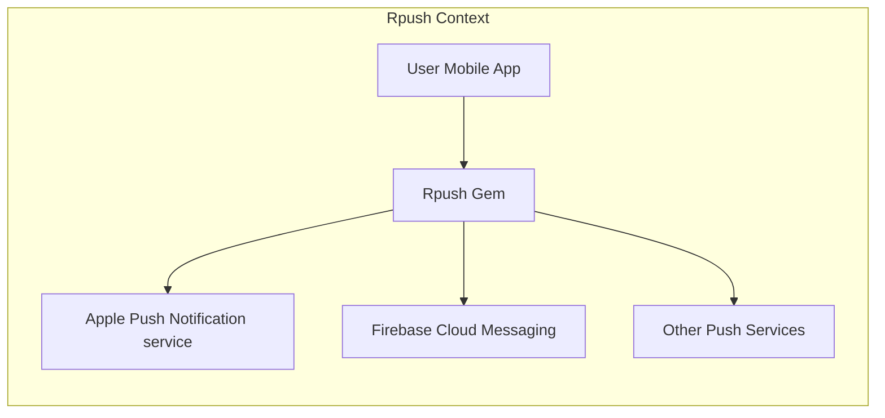
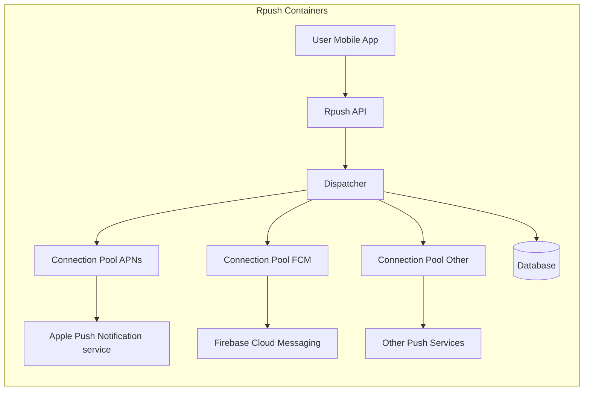
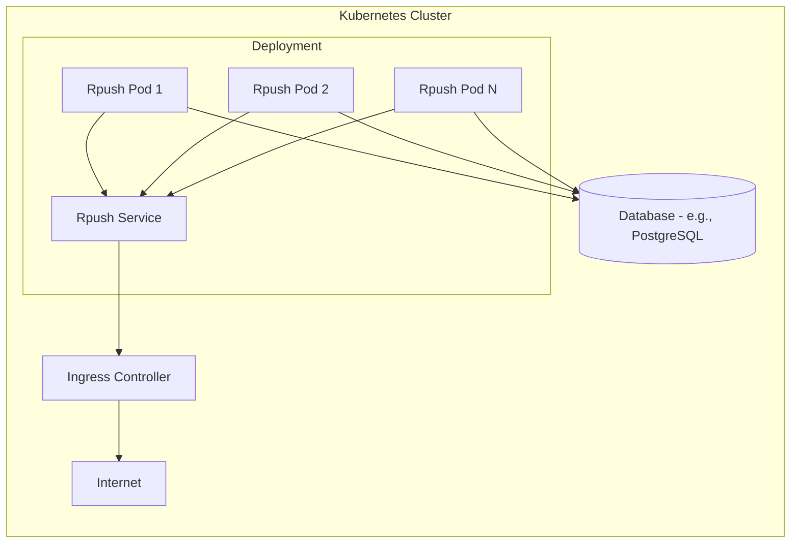

Okay, let's create a design document for the Rpush project.

# BUSINESS POSTURE

Rpush is a Ruby gem designed to send push notifications to various mobile platforms (Apple Push Notification service (APNs), Firebase Cloud Messaging (FCM), etc.). It's positioned as a critical piece of infrastructure for applications that rely on real-time communication with their users.

Business Priorities:

*   Reliability:  Notifications must be delivered consistently and without significant delays.  Failure to deliver notifications can directly impact user engagement and the core functionality of client applications.
*   Scalability:  The system must be able to handle a large volume of notifications, potentially spiking during peak hours or events.
*   Maintainability:  As a gem, Rpush needs to be easily maintainable and extensible to support new push notification services and features.
*   Security:  Protecting sensitive data (API keys, device tokens, notification payloads) is paramount.
*   Ease of Use:  The gem should be straightforward to integrate and configure within Ruby applications.

Business Goals:

*   Provide a unified interface for sending push notifications to multiple platforms.
*   Abstract away the complexities of interacting with different push notification services.
*   Offer a robust and reliable solution for delivering notifications at scale.
*   Minimize the operational overhead for developers using the gem.

Most Important Business Risks:

*   Service Outage:  If Rpush fails, client applications will be unable to send push notifications, impacting user experience and potentially causing business disruption.
*   Data Breach:  Compromise of API keys or device tokens could lead to unauthorized access to push notification services and potential abuse.
*   Performance Bottlenecks:  Inability to handle peak loads could result in delayed or dropped notifications, degrading user experience.
*   Platform Incompatibility:  Failure to keep up with changes in push notification service APIs could render Rpush unusable.
*   Dependency Issues: Vulnerabilities in Rpush's dependencies could expose users to security risks.

# SECURITY POSTURE

Existing Security Controls:

*   security control: Input Validation: Rpush likely performs some input validation on notification payloads and parameters to prevent common injection vulnerabilities. (Needs verification in code).
*   security control: Dependency Management: Rpush uses Bundler to manage its dependencies, allowing for version pinning and auditing. (Visible in Gemfile).
*   security control: Configuration Management: Rpush relies on configuration files (e.g., `config/initializers/rpush.rb`) to store sensitive information like API keys. This separates configuration from code. (Documented in Rpush wiki).
*   security control: Error Handling: Rpush includes error handling and logging to help diagnose issues and potentially detect malicious activity. (Needs verification in code).
*   security control: Testing: Rpush has a test suite that helps ensure the correctness and security of the code. (Visible in the `spec` directory).

Accepted Risks:

*   accepted risk:  Configuration Security:  The security of API keys and other sensitive configuration data ultimately relies on the user properly securing their configuration files and environment variables. Rpush cannot directly control this.
*   accepted risk:  Dependency Vulnerabilities: While Bundler helps manage dependencies, Rpush is still susceptible to vulnerabilities in its dependencies. Regular updates are required.
*   accepted risk:  Denial of Service: Rpush itself might be vulnerable to denial-of-service attacks if overwhelmed with requests. Mitigation strategies at the infrastructure level (e.g., rate limiting) are likely needed.
*   accepted risk:  Platform API Changes: Rpush depends on the stability and security of external push notification services (APNs, FCM, etc.). Changes to these services could impact Rpush's functionality.

Recommended Security Controls:

*   security control:  Regular Security Audits: Conduct periodic security audits of the Rpush codebase and its dependencies.
*   security control:  Implement Rate Limiting: Add rate limiting within Rpush to protect against abuse and denial-of-service attacks.
*   security control:  Enhanced Input Validation:  Strengthen input validation to specifically address potential injection vulnerabilities related to each push notification service's payload format.
*   security control:  Secret Scanning: Integrate secret scanning into the build process to detect accidental commits of API keys or other sensitive data.
*   security control:  Content Security Policy (CSP): If Rpush includes any web-based interfaces (e.g., for monitoring), implement CSP to mitigate XSS vulnerabilities.

Security Requirements:

*   Authentication:
    *   Rpush itself does not handle user authentication directly. It relies on API keys provided by the push notification services.
    *   Requirement: API keys must be stored securely and protected from unauthorized access.
*   Authorization:
    *   Rpush authorizes requests to push notification services using the provided API keys.
    *   Requirement: Ensure that API keys have the minimum necessary permissions to send notifications.
*   Input Validation:
    *   Requirement: All input data (notification payloads, device tokens, etc.) must be validated to prevent injection attacks and ensure data integrity.  Validation rules should be specific to each push notification service's requirements.
*   Cryptography:
    *   Rpush uses HTTPS to communicate with push notification services, ensuring data is encrypted in transit.
    *   Requirement:  Use strong cryptographic protocols and ciphers (e.g., TLS 1.2 or higher).
    *   Requirement:  If storing any sensitive data locally (e.g., in a database), encrypt it at rest.

# DESIGN

## C4 CONTEXT



Element Descriptions:

*   Element:
    *   Name: User Mobile App
    *   Type: Mobile Application
    *   Description: The application that uses Rpush to send push notifications.
    *   Responsibilities: Initiates push notification requests.
    *   Security controls: Implements secure coding practices, protects user data.
*   Element:
    *   Name: Rpush Gem
    *   Type: Software Library (Gem)
    *   Description: The core Rpush library, responsible for handling push notification delivery.
    *   Responsibilities: Manages connections to push notification services, handles notification queuing and delivery, provides a unified API for sending notifications.
    *   Security controls: Input validation, secure communication with push services, error handling.
*   Element:
    *   Name: Apple Push Notification service
    *   Type: External Service
    *   Description: Apple's service for delivering push notifications to iOS devices.
    *   Responsibilities: Delivers notifications to iOS devices.
    *   Security controls: Authentication and authorization via API keys, encrypted communication.
*   Element:
    *   Name: Firebase Cloud Messaging
    *   Type: External Service
    *   Description: Google's service for delivering push notifications to Android and other platforms.
    *   Responsibilities: Delivers notifications to Android and other supported devices.
    *   Security controls: Authentication and authorization via API keys, encrypted communication.
*   Element:
    *   Name: Other Push Services
    *   Type: External Service
    *   Description: Other push notification services that Rpush might support.
    *   Responsibilities: Delivers notifications to their respective platforms.
    *   Security controls: Varies depending on the specific service.

## C4 CONTAINER



Element Descriptions:

*   Element:
    *   Name: User Mobile App
    *   Type: Mobile Application
    *   Description: The application that uses Rpush to send push notifications.
    *   Responsibilities: Initiates push notification requests.
    *   Security controls: Implements secure coding practices, protects user data.
*   Element:
    *   Name: Rpush API
    *   Type: API
    *   Description: The public interface of the Rpush gem.
    *   Responsibilities: Receives notification requests from the user application, validates input, and passes requests to the Dispatcher.
    *   Security controls: Input validation, rate limiting.
*   Element:
    *   Name: Dispatcher
    *   Type: Component
    *   Description: The core component responsible for routing notifications to the appropriate connection pool.
    *   Responsibilities: Determines the correct push notification service based on the notification type, manages notification queuing, and dispatches notifications to the appropriate connection pool.
    *   Security controls: Input validation, error handling.
*   Element:
    *   Name: Connection Pool APNs
    *   Type: Component
    *   Description: Manages connections to the Apple Push Notification service.
    *   Responsibilities: Maintains a pool of persistent connections to APNs, sends notifications to APNs.
    *   Security controls: Secure communication (TLS), connection management, error handling.
*   Element:
    *   Name: Connection Pool FCM
    *   Type: Component
    *   Description: Manages connections to Firebase Cloud Messaging.
    *   Responsibilities: Maintains a pool of persistent connections to FCM, sends notifications to FCM.
    *   Security controls: Secure communication (TLS), connection management, error handling.
*   Element:
    *   Name: Connection Pool Other
    *   Type: Component
    *   Description: Manages connections to other supported push notification services.
    *   Responsibilities: Maintains connections to other services, sends notifications.
    *   Security controls: Secure communication (TLS), connection management, error handling (specific to each service).
*   Element:
    *   Name: Database
    *   Type: Database
    *   Description: Stores persistent data, such as notification delivery status and device tokens.
    *   Responsibilities: Provides persistent storage for Rpush data.
    *   Security controls: Access control, data encryption (at rest and in transit), regular backups.
*   Element:
    *   Name: Apple Push Notification service
    *   Type: External Service
    *   Description: Apple's service for delivering push notifications to iOS devices.
    *   Responsibilities: Delivers notifications to iOS devices.
    *   Security controls: Authentication and authorization via API keys, encrypted communication.
*   Element:
    *   Name: Firebase Cloud Messaging
    *   Type: External Service
    *   Description: Google's service for delivering push notifications to Android and other platforms.
    *   Responsibilities: Delivers notifications to Android and other supported devices.
    *   Security controls: Authentication and authorization via API keys, encrypted communication.
*   Element:
    *   Name: Other Push Services
    *   Type: External Service
    *   Description: Other push notification services that Rpush might support.
    *   Responsibilities: Delivers notifications to their respective platforms.
    *   Security controls: Varies depending on the specific service.

## DEPLOYMENT

Rpush, being a Ruby gem, can be deployed in various ways:

Possible Deployment Solutions:

1.  **Bundled with a Rails Application:**  The most common scenario. Rpush is included as a dependency in a Rails application's Gemfile and deployed as part of the application.
2.  **Standalone Daemon:** Rpush can be run as a standalone daemon process, separate from the main application. This is useful for scaling Rpush independently.
3.  **Containerized (Docker):** Rpush can be containerized using Docker, allowing for easy deployment and scaling in various environments (e.g., Kubernetes, AWS ECS).
4.  **Serverless (AWS Lambda, etc.):**  While less common, it's theoretically possible to use Rpush within a serverless function, though this would require careful consideration of connection management and cold starts.

Chosen Deployment Solution (Detailed):  **Containerized (Docker) with Kubernetes**

This approach offers excellent scalability, portability, and manageability.



Element Descriptions:

*   Element:
    *   Name: Rpush Pod 1, Pod 2, Pod N
    *   Type: Kubernetes Pod
    *   Description: Instances of the Rpush container running within the Kubernetes cluster.
    *   Responsibilities: Handles push notification delivery.
    *   Security controls: Container security best practices (e.g., minimal base image, non-root user), network policies.
*   Element:
    *   Name: Rpush Service
    *   Type: Kubernetes Service
    *   Description: Provides a stable endpoint for accessing the Rpush pods.
    *   Responsibilities: Load balances traffic across the Rpush pods.
    *   Security controls: Network policies.
*   Element:
    *   Name: Ingress Controller
    *   Type: Kubernetes Ingress Controller
    *   Description: Manages external access to the Rpush service.
    *   Responsibilities: Routes traffic from the internet to the Rpush service.
    *   Security controls: TLS termination, request filtering, rate limiting.
*   Element:
    *   Name: Internet
    *   Type: External Network
    *   Description: The public internet.
    *   Responsibilities: N/A
    *   Security controls: N/A
*   Element:
    *   Name: Database (e.g., PostgreSQL)
    *   Type: Database
    *   Description: Stores persistent data for Rpush.
    *   Responsibilities: Provides persistent storage.
    *   Security controls: Access control, data encryption (at rest and in transit), regular backups, firewall rules.

## BUILD

The Rpush build process involves packaging the gem and running tests.

```mermaid
graph LR
    Developer[Developer] --> Git[Git Repository (GitHub)]
    Git --> CI[CI Server (e.g., GitHub Actions)]
    CI --> Test[Run Tests]
    Test --> Build[Build Gem]
    Build --> Gem[Rpush Gem File]
    Gem --> RubyGems[RubyGems.org]
```

Build Process Description:

1.  **Developer:**  Developers write code and commit changes to the Git repository (GitHub).
2.  **Git Repository (GitHub):**  The source code repository for Rpush.
3.  **CI Server (e.g., GitHub Actions):**  A continuous integration server (like GitHub Actions, Travis CI, or CircleCI) is triggered by commits to the repository.
4.  **Run Tests:** The CI server runs the Rpush test suite to ensure code quality and prevent regressions.
5.  **Build Gem:** If the tests pass, the CI server builds the Rpush gem file (`.gem`).
6.  **Rpush Gem File:** The packaged gem file, ready for distribution.
7.  **RubyGems.org:** The gem file is published to RubyGems.org, the central repository for Ruby gems, making it available for installation by users.

Security Controls in Build Process:

*   security control:  Automated Testing: The test suite helps ensure code quality and prevent security vulnerabilities.
*   security control:  Dependency Management: Bundler ensures that dependencies are tracked and can be audited for vulnerabilities.
*   security control:  CI/CD Pipeline:  Using a CI/CD pipeline (like GitHub Actions) automates the build and testing process, reducing the risk of manual errors.
*   security control:  Static Analysis (Potential):  Integrate static analysis tools (e.g., RuboCop, Brakeman) into the CI pipeline to detect potential security issues in the code.
*   security control:  Software Composition Analysis (SCA) (Potential): Use SCA tools to identify known vulnerabilities in Rpush's dependencies.
*   security control:  Secret Scanning (Potential): Integrate secret scanning into the CI pipeline to detect accidental commits of sensitive data.

# RISK ASSESSMENT

Critical Business Processes:

*   Sending push notifications to users. This is the core function of Rpush and is critical for applications that rely on real-time communication.

Data to Protect:

*   API Keys (Sensitivity: High):  API keys for push notification services (APNs, FCM, etc.) are highly sensitive and must be protected from unauthorized access. Compromise of these keys could allow attackers to send arbitrary notifications to users.
*   Device Tokens (Sensitivity: Medium): Device tokens identify specific devices for receiving notifications. While not as sensitive as API keys, they should still be protected to prevent misuse.
*   Notification Payloads (Sensitivity: Variable): The sensitivity of notification payloads depends on the content. Some payloads may contain sensitive user data, while others may be purely informational.
*   Rpush Configuration Data (Sensitivity: Medium): Configuration data, such as database connection strings, should be protected.

# QUESTIONS & ASSUMPTIONS

Questions:

*   What specific database is used by Rpush in production deployments? (Assumption: PostgreSQL)
*   What are the expected peak load requirements for Rpush instances? (Assumption: Highly variable depending on the user application)
*   Are there any existing monitoring and alerting systems in place for Rpush? (Assumption: Users are responsible for monitoring their own Rpush deployments)
*   What is the process for handling failed notifications (retries, dead-letter queues)? (Assumption: Rpush has built-in retry mechanisms, but users may need to implement additional error handling)
*   Are there any specific compliance requirements (e.g., GDPR, HIPAA) that need to be considered? (Assumption: Users are responsible for ensuring compliance with relevant regulations)

Assumptions:

*   BUSINESS POSTURE:  Rpush is a critical component for applications that rely on push notifications. Reliability and security are paramount.
*   SECURITY POSTURE:  Users are responsible for securing their configuration data and the environment in which Rpush is deployed.
*   DESIGN:  Rpush is typically deployed as part of a larger application or as a standalone daemon, often containerized using Docker and orchestrated with Kubernetes. The build process utilizes a CI/CD pipeline and publishes the gem to RubyGems.org.