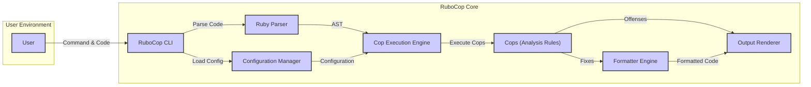
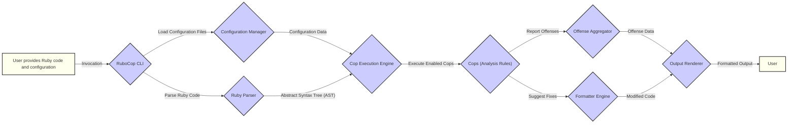

# Project Design Document: RuboCop

**Version:** 1.1
**Date:** October 26, 2023
**Author:** Gemini (AI Language Model)

## 1. Introduction

This document provides a detailed design overview of the RuboCop project, a widely used static code analyzer (linter) and formatter for the Ruby programming language. RuboCop enforces adherence to the Ruby Style Guide and other configurable rules, aiming to enhance code quality, consistency, and maintainability. This document is intended to serve as a comprehensive resource for understanding RuboCop's architecture and will be used as the basis for subsequent threat modeling activities.

## 2. Goals

*   Enforce a configurable set of Ruby style guidelines and best practices.
*   Identify potential code smells, stylistic inconsistencies, and simple errors.
*   Offer automated code formatting capabilities to resolve detected issues.
*   Provide a highly customizable and extensible framework for defining and applying code analysis rules.
*   Integrate smoothly into various development workflows, including local development, CI/CD pipelines, and code editors.

## 3. Non-Goals

*   Performing dynamic analysis or runtime security vulnerability detection beyond identifying potential code patterns that might lead to vulnerabilities.
*   Directly managing code deployment, version control, or other aspects of the software development lifecycle beyond code analysis and formatting.
*   Serving as a comprehensive security vulnerability scanner or penetration testing tool.

## 4. High-Level Architecture

RuboCop functions as a command-line tool that processes Ruby source code files. It leverages a Ruby parser to construct an Abstract Syntax Tree (AST) representing the code's structure. This AST is then traversed and analyzed by a collection of configurable "cops" (rules) to identify deviations from defined standards and potential issues.

## 5. Key Components

*   **RuboCop CLI:**
    *   The primary interface for users to interact with RuboCop.
    *   Handles parsing command-line arguments, such as specifying target files, configuration files, and output formats.
    *   Initiates and orchestrates the core RuboCop workflow.
*   **Configuration Manager:**
    *   Responsible for loading and managing configuration settings from `.rubocop.yml` files and potentially other configuration sources.
    *   Supports hierarchical configuration, allowing project-specific settings to override global defaults.
    *   Determines which cops are enabled, their severity levels, and any cop-specific configurations.
*   **Ruby Parser:**
    *   Utilizes a Ruby parser library (typically the `parser` gem) to transform the input Ruby source code into an Abstract Syntax Tree (AST).
    *   The AST provides a structured, programmatic representation of the code's syntax and semantics, enabling analysis by the cops.
*   **Cop Execution Engine:**
    *   Manages the execution lifecycle of individual cops.
    *   Iterates through the AST, providing relevant nodes to registered cops for analysis.
    *   Collects and aggregates the offenses (violations) reported by the cops.
*   **Cops (Analysis Rules):**
    *   Independent modules or classes that implement specific code analysis rules.
    *   Examine specific patterns or structures within the AST to identify deviations from style guidelines or potential code quality issues.
    *   Report "offenses" when a violation is detected, including details about the location (file, line number) and nature of the issue.
    *   Examples of built-in cops include `Style/Indentation`, `Metrics/MethodLength`, and `Security/Eval`.
    *   RuboCop's architecture allows for the creation and integration of custom cops, either within a project or as external gems.
*   **Formatter Engine:**
    *   Responsible for automatically correcting certain types of offenses, as determined by the cops.
    *   Modifies the source code based on the "corrections" suggested by fixable cops.
    *   Provides options for different formatting styles and levels of automation.
*   **Output Renderer:**
    *   Formats the results of the code analysis (offenses, corrections) into various output formats, such as plain text, JSON, or HTML.
    *   Presents the information to the user in a clear and actionable manner.

## 6. Data Flow

The typical flow of data through RuboCop during an analysis is as follows:

*   The user initiates RuboCop execution, providing Ruby code files and potentially configuration files as input.
*   The RuboCop CLI loads configuration settings from `.rubocop.yml` files, determining which cops will be active and their specific configurations.
*   The Ruby Parser parses the input Ruby code into an Abstract Syntax Tree (AST).
*   The Cop Execution Engine utilizes the loaded configuration to determine which cops to run against the generated AST.
*   Each enabled cop analyzes the AST, looking for patterns that violate defined rules.
*   Cops report any identified offenses, including details about the violation.
*   If auto-correction is enabled, the Formatter Engine applies fixes suggested by fixable cops, modifying the source code.
*   Finally, the Output Renderer formats the collected offenses and any applied corrections into a user-friendly output format, which is presented to the user.

## 7. Deployment Model

RuboCop is typically deployed and executed in the following contexts:

*   **Local Development Environments:** Developers run RuboCop on their workstations to analyze code during development, often integrated with code editors for real-time feedback.
*   **Continuous Integration/Continuous Deployment (CI/CD) Pipelines:** RuboCop is commonly integrated into CI/CD workflows to automatically analyze code changes and enforce quality standards before merging or deploying code.
*   **Code Editors/Integrated Development Environments (IDEs):** Plugins and extensions are available for various code editors and IDEs, providing seamless RuboCop integration and on-the-fly code analysis.
*   **As a Gem Dependency:** RuboCop can be included as a development dependency in Ruby projects, making it easily accessible and configurable within the project context.

## 8. Security Considerations (Detailed)

While primarily a code quality tool, RuboCop's operation involves processing and potentially modifying source code, which introduces several security considerations:

*   **Configuration File Manipulation:**
    *   The `.rubocop.yml` file dictates RuboCop's behavior. A maliciously crafted configuration file could:
        *   **Disable Security Cops:**  Prevent the detection of potential security vulnerabilities by disabling relevant cops (e.g., `Security/Eval`).
        *   **Introduce Performance Issues:** Configure cops in a way that leads to excessive resource consumption and denial of service during analysis.
        *   **Suppress Important Warnings:**  Hide critical code quality issues by adjusting severity levels or excluding specific files/directories.
    *   It's crucial to control access to and maintain the integrity of `.rubocop.yml` files, especially in shared repositories.
*   **Risks Associated with Custom Cops:**
    *   RuboCop's extensibility allows for the creation of custom cops. Malicious or poorly written custom cops could:
        *   **Execute Arbitrary Code:**  If a custom cop contains vulnerabilities or is intentionally malicious, it could execute arbitrary code within the context of the RuboCop process, potentially compromising the system.
        *   **Introduce Backdoors:**  A malicious custom cop could introduce subtle changes or backdoors into the codebase during auto-correction.
        *   **Leak Sensitive Information:**  A poorly written custom cop might inadvertently log or expose sensitive information from the codebase or the environment.
    *   Careful review and vetting of custom cops are essential, especially those from untrusted sources. Sandboxing or isolation mechanisms for custom cops could be considered.
*   **Input Code as a Potential Attack Vector:**
    *   While RuboCop analyzes code, it's important to understand its limitations regarding security vulnerability detection. It primarily focuses on style and code quality.
    *   Maliciously crafted input code could potentially exploit vulnerabilities in the Ruby parser used by RuboCop, although this is less likely in modern, well-maintained parsers.
    *   RuboCop's analysis itself could be computationally expensive for extremely large or complex codebases, potentially leading to denial-of-service scenarios in resource-constrained environments.
*   **Denial of Service through Configuration or Code:**
    *   As mentioned, specific configurations or exceptionally complex code structures could lead to RuboCop consuming excessive CPU or memory, causing performance degradation or denial of service, particularly in CI/CD pipelines where analysis is automated.
    *   Cops with high computational complexity or those that perform deep analysis on large codebases could exacerbate this issue.
*   **Information Disclosure through Output:**
    *   Error messages or detailed output from RuboCop could potentially reveal sensitive information about the codebase's structure, file paths, or internal logic if not handled carefully, especially in public CI/CD logs.
    *   Consider carefully the verbosity of RuboCop's output in different environments.
*   **Supply Chain Security of Dependencies:**
    *   RuboCop relies on various Ruby gems, including the parser. Vulnerabilities in these dependencies could indirectly affect RuboCop's security. Regularly updating dependencies and being aware of potential vulnerabilities in the supply chain is important.

## 9. Future Considerations

*   Explore potential mechanisms for sandboxing or isolating the execution of custom cops to mitigate the risk of arbitrary code execution.
*   Investigate methods for verifying the integrity and authenticity of RuboCop configurations.
*   Enhance documentation and guidance on best practices for writing secure custom cops.
*   Consider incorporating more security-focused cops or integrating with dedicated security analysis tools.
*   Continuously monitor and update dependencies to address potential security vulnerabilities in the supply chain.

This improved design document provides a more detailed and security-focused overview of the RuboCop project. It will serve as a valuable resource for identifying and mitigating potential security risks during the threat modeling process.
