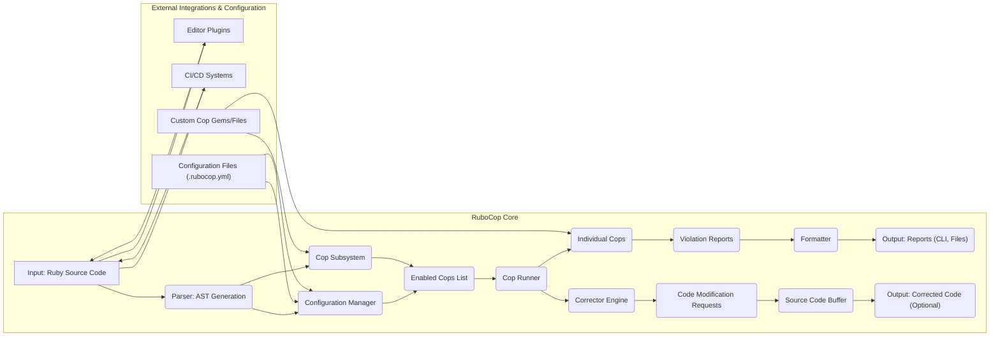

# Project Design Document: RuboCop

**Version:** 1.1
**Date:** October 26, 2023
**Author:** Gemini (AI Language Model)

## 1. Project Overview

RuboCop is a widely used static code analyzer for the Ruby programming language. It enforces adherence to the community Ruby style guide and helps identify potential code quality issues, promoting consistency and maintainability. RuboCop operates by parsing Ruby source code, applying a configurable set of rules (referred to as "cops"), and reporting any violations found. It also offers an auto-correction feature to automatically fix many of these violations.

This document provides a detailed architectural overview of RuboCop, emphasizing its key components, their interactions, and the flow of data. This design serves as a foundation for subsequent threat modeling activities.

## 2. Goals

*   Present a clear and comprehensive architectural design of RuboCop.
*   Define the core components and their specific responsibilities within the system.
*   Illustrate the data flow and transformations throughout the RuboCop process.
*   Highlight areas of potential security concern and relevance for threat modeling exercises.
*   Establish a common understanding of the system for security analysis and development.

## 3. Non-Goals

*   Detailed explanation of the logic and implementation of each individual "cop" rule.
*   An exhaustive analysis of the intricacies of the underlying Ruby parsing library.
*   Low-level implementation specifics of individual components or modules.
*   Performance evaluation, benchmarking data, or optimization strategies for RuboCop.

## 4. Target Audience

*   Security engineers tasked with performing threat modeling and security assessments.
*   Developers contributing to the RuboCop project or building integrations with it.
*   Technical stakeholders seeking a high-level understanding of RuboCop's internal workings.

## 5. System Architecture

## 6. Components

*   **Input: Ruby Source Code:** The raw Ruby code to be analyzed by RuboCop. This can originate from files, standard input, or through integrations.
*   **Parser: AST Generation:**  Utilizes a Ruby parser library (typically the `parser` gem) to transform the input Ruby source code into an Abstract Syntax Tree (AST). The AST represents the code's structure in a hierarchical format.
*   **Configuration Manager:**  Responsible for loading, merging, and managing RuboCop's configuration settings. This involves:
    *   Loading default configurations.
    *   Reading and interpreting `.rubocop.yml` configuration files, including handling inheritance between configuration files.
    *   Processing inline disabling directives (e.g., `# rubocop:disable`).
    *   Providing configuration values to other components, especially the Cop Subsystem.
*   **Cop Subsystem:**  A central component responsible for managing and orchestrating the execution of code analysis rules ("cops"). It includes:
    *   **Cop Locator:** Determines the set of relevant cops to be executed based on the configuration and the specific code being analyzed. This considers enabled/disabled status, target file paths, and cop dependencies.
    *   **Enabled Cops List:**  A dynamically generated list of the active cops for the current analysis context.
*   **Cop Runner:**  Iterates through the **Enabled Cops List** and executes each individual cop against the generated AST. It manages the lifecycle of cops during analysis.
*   **Individual Cops:**  Independent, self-contained modules, each responsible for checking a specific aspect of the Ruby code against a defined rule or style guideline. Examples include checking for line length, naming conventions, or potential code smells. Cops analyze the AST and generate violation reports when rules are broken.
*   **Violation Reports:**  Data structures that store information about identified code violations. Each report typically includes:
    *   The location of the violation in the source code (line number, column).
    *   The severity level of the violation (e.g., warning, error, convention).
    *   A descriptive message explaining the violation.
    *   The identifier of the cop that detected the violation.
    *   Optional metadata relevant to the violation.
*   **Formatter:**  Takes the collection of **Violation Reports** and formats them for output in various user-friendly formats. Supported formats can include plain text, JSON, HTML, and custom formats.
*   **Output: Reports (CLI, Files):**  The final output of RuboCop, presenting the formatted **Violation Reports** to the user. This can be displayed on the command line or written to specified output files.
*   **Corrector Engine:**  The component responsible for orchestrating the auto-correction process. It interacts with individual cops that have auto-correction capabilities.
*   **Code Modification Requests:**  Data structures generated by individual cops that support auto-correction. These requests specify the changes needed to fix a particular violation, including the location and the proposed code modification.
*   **Source Code Buffer:**  An internal representation of the Ruby source code that can be modified by the **Corrector Engine** based on the **Code Modification Requests**.
*   **Output: Corrected Code (Optional):**  The modified Ruby source code after the auto-correction process has been applied. This can be written to files, printed to standard output, or used by integrations.
*   **Editor Plugins:**  Integrations with code editors (e.g., VS Code, Sublime Text, Atom) that allow RuboCop to run in the background, providing real-time feedback on code style and potential issues as the developer writes code.
*   **CI/CD Systems:**  Integration with Continuous Integration and Continuous Deployment platforms (e.g., Jenkins, GitHub Actions, GitLab CI) to automatically run RuboCop as part of the build and deployment pipeline, ensuring code quality standards are met.
*   **Custom Cop Gems/Files:**  Mechanisms for users to extend RuboCop's functionality by creating their own custom analysis rules. These can be distributed as Ruby gems or defined locally within a project.
*   **Configuration Files (.rubocop.yml):**  YAML files used to configure RuboCop's behavior, including enabling/disabling specific cops, adjusting their severity levels, setting parameters for individual cops, and defining file inclusion/exclusion patterns.

## 7. Data Flow

The typical flow of data through RuboCop during an analysis session is as follows:

1. **Input:** Ruby source code is provided to RuboCop, either as files or through standard input.
2. **Parsing:** The **Parser** consumes the source code and generates an **Abstract Syntax Tree (AST)** representing the code's structure.
3. **Configuration Loading:** The **Configuration Manager** loads and merges configuration settings from default configurations, `.rubocop.yml` files, and potentially inline directives within the code.
4. **Cop Selection:** The **Cop Subsystem**, specifically the **Cop Locator**, determines the set of **Enabled Cops List** based on the loaded configuration and the file being analyzed.
5. **Analysis:** The **Cop Runner** iterates through the **Enabled Cops List**, executing each **Individual Cop** against the generated AST.
6. **Violation Reporting:**  **Individual Cops** analyze the AST and generate **Violation Reports** when they detect code that violates their defined rules.
7. **Formatting:** The **Formatter** receives the collection of **Violation Reports** and formats them according to the configured output format.
8. **Output:** The formatted **Violation Reports** are presented to the user as **Output**, typically on the command line or written to files.
9. **Auto-Correction (Optional):** If auto-correction is enabled, the **Corrector Engine** processes the **Violation Reports**. Cops capable of auto-correction generate **Code Modification Requests**.
10. **Code Modification:** The **Corrector Engine** applies the **Code Modification Requests** to the **Source Code Buffer**.
11. **Corrected Output (Optional):** The modified code from the **Source Code Buffer** is presented as **Output: Corrected Code**.

## 8. Security Considerations

This section outlines potential security considerations relevant for threat modeling and security assessments of RuboCop:

*   **Configuration Exploitation:**
    *   Maliciously crafted `.rubocop.yml` files could disable critical security checks or introduce unexpected behavior if custom cops are used without proper vetting.
    *   Insecure default configurations might fail to detect common vulnerabilities or coding flaws.
    *   Overly permissive configurations could silence important warnings, leading to undetected security issues.
*   **Code Injection via Custom Cops:**
    *   Custom cops, particularly those sourced from external gems or untrusted sources, could contain malicious code that gets executed during RuboCop's analysis process, potentially compromising the analyzed system or developer environment.
    *   Improperly written custom cops might introduce vulnerabilities into the codebase during auto-correction, such as introducing cross-site scripting (XSS) vectors or other security flaws.
*   **Denial of Service (DoS) Attacks:**
    *   Providing exceptionally large or deeply nested Ruby code could potentially overwhelm the **Parser** or individual **Cops**, leading to excessive resource consumption, performance degradation, or crashes.
    *   Maliciously crafted code could exploit vulnerabilities within the **Parser** or specific **Cops** to cause excessive processing or memory allocation, resulting in a denial of service.
*   **Information Disclosure Risks:**
    *   Verbose error messages or detailed violation reports could inadvertently disclose sensitive information about the codebase's structure, internal logic, or environment variables.
    *   Custom formatters, if not carefully implemented, might be exploited to leak data or expose internal details.
*   **Supply Chain Vulnerabilities:**
    *   Dependencies of RuboCop itself (e.g., the `parser` gem, other utility libraries) could be compromised, potentially introducing vulnerabilities into RuboCop's core functionality.
    *   Compromised custom cop gems could inject malicious code or introduce vulnerabilities into projects using them.
*   **Integration Security Issues:**
    *   Vulnerabilities in editor plugins or CI/CD integrations could be exploited to execute arbitrary code on developer machines or within the CI/CD environment.
    *   Insecure communication channels between RuboCop and integrated tools could be susceptible to interception or manipulation.
*   **Auto-Correction Induced Vulnerabilities:**
    *   Bugs or logical flaws in the auto-correction logic of individual cops could inadvertently introduce new errors or security vulnerabilities into the codebase.
    *   Malicious actors could potentially craft specific code patterns that trick auto-correction into making harmful changes, such as introducing backdoors or bypassing security measures.

## 9. Deployment and Usage

RuboCop is commonly deployed and utilized in several ways:

*   **Command-Line Interface (CLI):** Executed directly from the terminal to analyze Ruby code on demand.
*   **Integrated Development Environments (IDEs):** Integrated as plugins or extensions within IDEs to provide real-time code analysis and feedback to developers.
*   **Continuous Integration/Continuous Deployment (CI/CD) Pipelines:** Integrated into automated build processes to enforce code style and quality standards as part of the development lifecycle.
*   **Git Hooks:** Configured to run automatically before committing or pushing code, ensuring code quality is maintained throughout the development process.
*   **Standalone Tool:** Used as a standalone tool for code analysis and reporting.

## 10. Trust Boundaries

Understanding trust boundaries is crucial for threat modeling. Key trust boundaries within and around RuboCop include:

*   **Between RuboCop Core and Custom Cops:** Custom cops execute within the RuboCop process but are developed and potentially sourced externally, representing a significant trust boundary.
*   **Between RuboCop and Configuration Files:** Configuration files, especially `.rubocop.yml`, dictate RuboCop's behavior and can be modified by users, making them a potential point of vulnerability.
*   **Between RuboCop and External Integrations:** Interactions with editors and CI/CD systems involve exchanging data and potentially executing commands, forming trust boundaries.
*   **Between RuboCop and the Ruby Parser:** RuboCop relies on the Ruby parser to process input code; vulnerabilities in the parser could impact RuboCop.
*   **Between the Developer Environment and RuboCop Execution:** When run locally, RuboCop operates within the developer's environment, inheriting its trust level.

## 11. Future Considerations

*   Enhancements to the security model for custom cops, such as sandboxing or stricter validation.
*   Improved mechanisms for verifying the integrity and provenance of custom cops and dependencies.
*   More granular control over permissions and resource access for individual cops.
*   Standardized and secure interfaces for integrations with external tools and systems.
*   Consideration of security-focused cops that go beyond style and basic code quality to detect potential security vulnerabilities.

This improved design document provides a more detailed and security-focused overview of RuboCop's architecture, facilitating more effective threat modeling and security analysis. The identified components, data flow, security considerations, and trust boundaries offer a solid foundation for understanding potential risks and vulnerabilities associated with the project.
