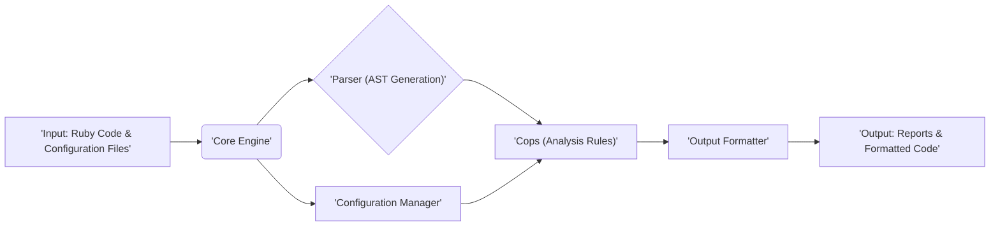
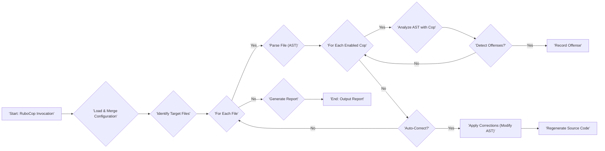

# Project Design Document: RuboCop

**Version:** 1.1
**Date:** October 26, 2023
**Author:** AI Software Architect

## 1. Introduction

This document provides an enhanced design overview of RuboCop, a widely used Ruby static code analyzer and formatter. The purpose of this document is to clearly articulate the system's architecture, components, and data flow with a specific focus on providing the necessary information for effective threat modeling.

## 2. Goals and Objectives

The primary goals of RuboCop are to:

*   Enforce adherence to the official Ruby Style Guide and community best practices.
*   Proactively identify potential code quality issues, bugs, and security vulnerabilities (indirectly through code quality).
*   Promote consistent coding styles and patterns across Ruby projects, improving maintainability.
*   Offer automated code formatting capabilities to streamline development workflows.
*   Provide a flexible and extensible framework through custom rules (cops) and configurations.

## 3. High-Level Architecture

RuboCop functions as a command-line interface (CLI) tool that processes Ruby source code files and directories. Its architecture is modular, comprising distinct components responsible for parsing, analyzing, and reporting on the code.

## 4. Detailed Design

### 4.1. Core Components

*   **Core Engine:** This is the central orchestrator of the analysis process. It manages the lifecycle of a RuboCop run, including:
    *   Loading and merging configuration settings.
    *   Identifying and iterating through target files.
    *   Invoking the parser to generate the Abstract Syntax Tree (AST).
    *   Dispatching the AST to relevant cops for analysis.
    *   Collecting and organizing detected offenses.
    *   Invoking the output formatter to generate reports.
    *   Handling auto-correction requests.
*   **Parser (Utilizing the `parser` gem):** This component is responsible for transforming raw Ruby source code into a structured Abstract Syntax Tree (AST). The AST represents the code's structure and is the primary data structure used by the cops for static analysis. The `parser` gem handles the complexities of Ruby's syntax.
*   **Cops (Analysis Rules):** These are individual, self-contained modules that implement specific code analysis rules. Each cop focuses on a particular aspect of code style, potential bugs, or code complexity.
    *   Cops are organized into logical departments (e.g., `Style`, `Lint`, `Metrics`, `Security`).
    *   Users can selectively enable, disable, and configure individual cops through the configuration system.
    *   The extensibility of RuboCop is largely based on the ability to develop and integrate custom cops.
*   **Configuration Manager:** This component handles the loading, merging, and management of configuration settings that govern RuboCop's behavior. It considers configuration from multiple sources:
    *   **Default Configurations:** Built-in default settings for all cops.
    *   **`.rubocop.yml` Files:** Configuration files located in the project directory or its parent directories, allowing for project-specific customizations.
    *   **Command-Line Options:** Options passed directly to the RuboCop CLI, overriding configuration file settings.
    *   The Configuration Manager resolves conflicts and provides the final configuration to the Core Engine and Cops.
*   **Output Formatter:** This component is responsible for generating reports of detected offenses and, optionally, applying automatic code formatting. Different formatters are available, allowing users to customize the output format:
    *   **Plain Text:** The default human-readable format.
    *   **JSON:** A structured format suitable for machine processing and integration with other tools.
    *   **YAML:** Another structured format option.
    *   Custom formatters can be implemented to meet specific reporting needs.
*   **CLI Interface:** This is the entry point for interacting with RuboCop. It provides the command-line interface for users to:
    *   Specify target files and directories for analysis.
    *   Pass configuration options.
    *   Trigger auto-correction.
    *   Select output formats.
    *   View help information.

### 4.2. Data Flow

The typical data flow within RuboCop during an analysis run is as follows:

1. **Input:** The user invokes the RuboCop CLI, providing paths to Ruby code files or directories and optional configuration parameters.
2. **Configuration Loading and Merging:** The Configuration Manager loads and merges configuration settings from default values, `.rubocop.yml` files (traversing up the directory tree), and command-line options. The order of precedence is typically command-line options > project-level `.rubocop.yml` > parent directory `.rubocop.yml` > default configurations.
3. **Target File Identification:** The Core Engine identifies the Ruby files to be analyzed based on the provided input paths and any exclusions specified in the configuration.
4. **File Processing Loop:** The Core Engine iterates through each identified Ruby file.
5. **Parsing (AST Generation):** For the current Ruby file, the Parser utilizes the `parser` gem to generate an Abstract Syntax Tree (AST) representing the code's structure.
6. **Cop Execution Loop:** The Core Engine iterates through the enabled cops. Each cop receives the AST of the current file as input.
7. **Static Analysis by Cops:** Each cop analyzes the AST according to its specific rules and the current configuration. This involves traversing the AST and checking for patterns that violate the cop's defined criteria.
8. **Offense Detection and Recording:** If a cop detects a code violation (an offense), it creates an offense object containing information about the location, severity, and message of the violation. These offenses are collected by the Core Engine.
9. **Auto-Correction (Optional):** If the `--autocorrect` option is used, the Core Engine instructs the relevant cops to apply their automatic corrections to the source code. This involves modifying the AST and then regenerating the source code from the corrected AST.
10. **Reporting:** Once all files have been processed, the Output Formatter receives the collected offenses and generates a report in the specified format.
11. **Output:** The generated report, containing details of any detected offenses or the modified code (if auto-correction was applied), is presented to the user.

### 4.3. Key Technologies

*   **Ruby:** The primary programming language for both RuboCop itself and the code it analyzes.
*   **`parser` gem:** A crucial Ruby gem that provides the functionality to parse Ruby code into an Abstract Syntax Tree (AST).
*   **YAML:** Used for defining configuration settings in `.rubocop.yml` files.
*   **Rake:** Often used in Ruby projects for defining and managing build and development tasks, including running RuboCop.

### 4.4. Extensibility Model

RuboCop's extensibility is a key design principle, primarily facilitated through the cop system and configuration:

*   **Custom Cops:** Developers can create new cops by defining Ruby classes that inherit from base cop classes provided by RuboCop. This allows for the implementation of project-specific or organization-wide coding standards and checks.
*   **Configuration:** The flexible configuration system allows users to tailor RuboCop's behavior extensively:
    *   Enabling or disabling individual cops.
    *   Adjusting the severity level of offenses reported by cops.
    *   Customizing parameters and thresholds for individual cops.
    *   Defining file and directory exclusions.
*   **Custom Formatters:** Developers can implement custom output formatters to generate reports in specific formats required for integration with other tools or reporting systems.

## 5. Deployment Model

RuboCop is typically deployed and utilized in various development workflows:

*   **Command-Line Tool:** Installed as a Ruby gem using `gem install rubocop` and executed directly from the command line. This is the most fundamental way to use RuboCop.
*   **Integrated into Code Editors:** Plugins and extensions are available for popular code editors (e.g., VS Code, Sublime Text, Atom, RubyMine) to provide real-time code analysis and feedback as developers write code.
*   **Continuous Integration/Continuous Deployment (CI/CD) Pipelines:** Integrated into CI/CD pipelines (e.g., GitHub Actions, GitLab CI, Jenkins) to automatically analyze code on every commit, pull request, or merge, ensuring code quality and consistency.
*   **Pre-commit Hooks:** Used as pre-commit hooks (e.g., with tools like `overcommit` or `pre-commit`) to automatically run RuboCop and prevent code with style violations from being committed to the version control system.

## 6. Security Considerations (Detailed for Threat Modeling)

This section expands on the initial security considerations, providing more detail relevant for threat modeling.

*   **Malicious Code Input:**
    *   **Threat:** Processing maliciously crafted Ruby code could potentially exploit vulnerabilities in the `parser` gem or the RuboCop core engine, leading to unexpected behavior, resource exhaustion, or even remote code execution in the context where RuboCop is running.
    *   **Mitigation:** While RuboCop itself doesn't directly execute the analyzed code, ensuring the `parser` gem is up-to-date and monitoring for any reported vulnerabilities is crucial. Sandboxing the RuboCop process could also limit the impact of potential exploits.
*   **Malicious Cops:**
    *   **Threat:** If custom cops from untrusted sources are used, they could contain malicious code that gets executed during the analysis process. This could lead to data exfiltration, system compromise, or other malicious activities within the environment where RuboCop is running.
    *   **Mitigation:**  Implement strict policies regarding the sourcing and review of custom cops. Code signing or verification mechanisms for cops could be considered. Running RuboCop in a restricted environment with limited permissions can mitigate the impact of malicious cops.
*   **Configuration Vulnerabilities:**
    *   **Threat:** While less direct, misconfigurations in `.rubocop.yml` could lead to security-sensitive code patterns being ignored or bypassed. For example, disabling security-related cops could allow vulnerable code to pass unnoticed.
    *   **Mitigation:**  Establish clear guidelines and reviews for `.rubocop.yml` configurations. Utilize linters or other tools to validate the configuration files themselves.
*   **Output Vulnerabilities:**
    *   **Threat:** Custom output formatters, if not carefully implemented, could potentially mishandle or expose sensitive information present in the analyzed code or the RuboCop environment.
    *   **Mitigation:**  Exercise caution when using custom formatters from untrusted sources. Review the code of custom formatters for potential vulnerabilities. Ensure that output logs and reports are stored securely.
*   **Denial of Service (DoS):**
    *   **Threat:** Processing extremely large or complex codebases, or code with intentionally crafted structures, could potentially lead to excessive resource consumption (CPU, memory) and cause RuboCop to become unresponsive, effectively leading to a denial of service.
    *   **Mitigation:** Implement timeouts or resource limits for RuboCop runs, especially in automated environments. Optimize the performance of RuboCop and its core components.
*   **Information Disclosure:**
    *   **Threat:** Error messages or verbose output from RuboCop could potentially reveal sensitive information about the codebase, file paths, or the environment where it's running.
    *   **Mitigation:**  Configure RuboCop to minimize verbose output in production or CI/CD environments. Ensure that error messages are handled gracefully and do not expose sensitive details.

## 7. Future Considerations

*   **Performance Optimization:** Continuously improving the performance and efficiency of the analysis process, particularly for large and complex codebases. This includes optimizing cop execution and AST traversal.
*   **Enhanced Auto-Correction Capabilities:** Expanding the ability of cops to automatically fix a wider range of offenses, reducing manual intervention.
*   **Improved Configuration Management:** Exploring more advanced configuration options, such as conditional configurations or configuration inheritance across projects.
*   **Deeper Integration with Static Analysis Security Testing (SAST) Tools:**  Potentially integrating RuboCop with dedicated SAST tools to provide a more comprehensive security analysis.
*   **Community Cop Ecosystem Growth:**  Supporting and fostering the growth of the community cop ecosystem to address a wider range of code quality and security concerns.

## 8. Conclusion

This enhanced design document provides a detailed overview of RuboCop's architecture, components, and data flow, with a specific focus on providing the necessary information for effective threat modeling. By understanding the system's inner workings and potential vulnerabilities, developers and security professionals can better assess and mitigate risks associated with its use.