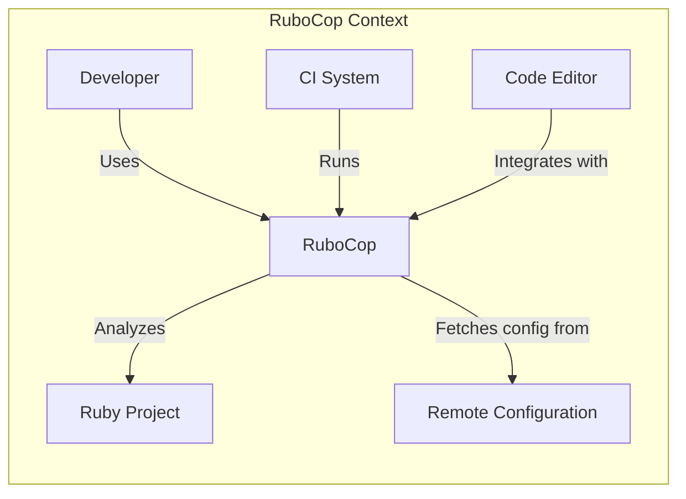
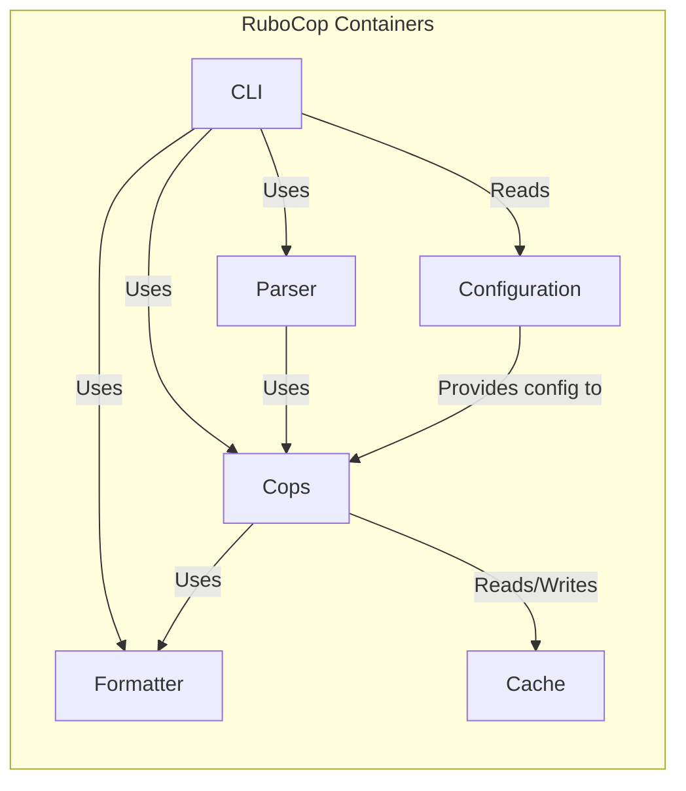
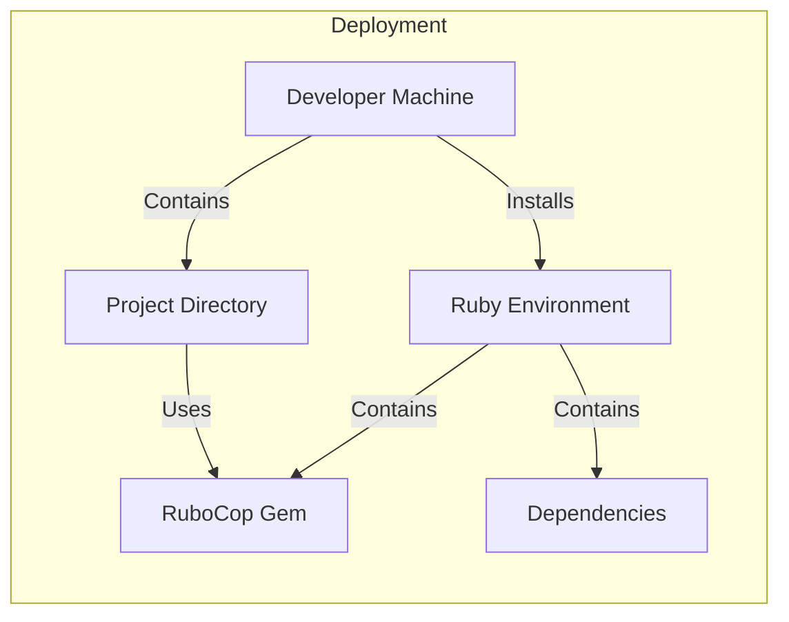
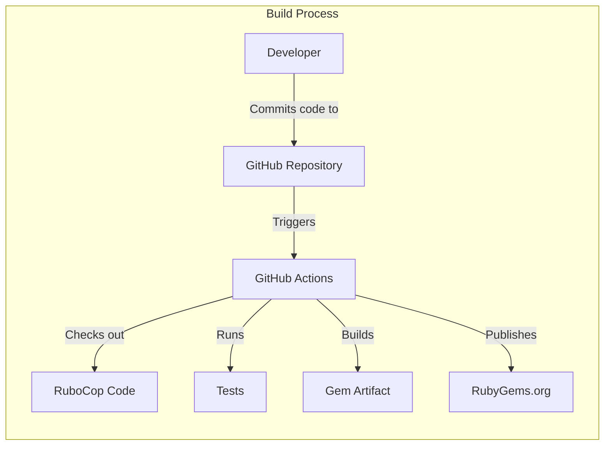

Okay, let's create a design document for the RuboCop project, keeping in mind its purpose and potential security considerations.

# BUSINESS POSTURE

RuboCop is a static code analyzer (linter) and formatter for Ruby.  Its primary business goals are:

*   Improve Code Quality:  Help developers write cleaner, more consistent, and maintainable Ruby code by enforcing style guidelines and identifying potential bugs.
*   Reduce Technical Debt: Prevent the accumulation of code style violations and potential errors that can lead to increased maintenance costs and bugs in the long run.
*   Increase Development Velocity: By automating code style enforcement and catching errors early, RuboCop helps developers focus on building features rather than fixing style issues.
*   Promote Community Standards: Encourage the use of widely accepted Ruby coding conventions, making it easier for developers to collaborate and understand each other's code.
*   Enhance Code Security: While primarily a style tool, RuboCop can detect some potentially insecure coding patterns (though it's not a comprehensive security scanner).

Business Priorities:

1.  Accuracy: Minimize false positives (reporting issues that aren't real problems) and false negatives (failing to report real problems).
2.  Performance: Analyze code quickly and efficiently, without significantly slowing down the development workflow.
3.  Customizability: Allow users to configure RuboCop to match their specific style preferences and project requirements.
4.  Extensibility:  Make it easy for users to create and share custom cops (rules) to enforce project-specific or company-specific guidelines.
5.  Maintainability:  Keep the RuboCop codebase itself clean, well-documented, and easy to contribute to.

Most Important Business Risks:

1.  Inaccurate Analysis:  False positives or negatives can erode trust in the tool and lead developers to ignore its warnings, defeating its purpose.
2.  Performance Bottlenecks:  Slow analysis can disrupt development workflows and make developers less likely to use the tool.
3.  Supply Chain Attacks:  Compromised dependencies or malicious code injected into RuboCop itself could affect a large number of users.
4.  Lack of Adoption: If RuboCop is too difficult to use, configure, or extend, it may not be widely adopted, limiting its impact.

# SECURITY POSTURE

Existing Security Controls:

*   security control: Dependency Management: RuboCop uses Bundler to manage its dependencies, and `Gemfile.lock` ensures consistent versions are used. (Described in `Gemfile` and `Gemfile.lock`)
*   security control: Automated Testing: RuboCop has an extensive test suite (RSpec) that helps prevent regressions and ensure code quality. (Described in the `.github/workflows` directory and the `spec` directory)
*   security control: Continuous Integration: GitHub Actions are used to automatically run tests and checks on every pull request and push. (Described in the `.github/workflows` directory)
*   security control: Code Review: All changes to RuboCop go through a code review process by maintainers. (Implicit in the GitHub pull request workflow)
*   security control: Static Analysis: RuboCop itself is used to analyze its own codebase, ensuring consistent style and identifying potential issues. (Implicit in the project's configuration and CI setup)
*   security control: Security Policy: RuboCop has a security policy that describes how to report vulnerabilities. (Described in `SECURITY.md`)

Accepted Risks:

*   accepted risk: Limited Scope of Security Checks: RuboCop is primarily a style linter, not a dedicated security tool. It can detect some insecure patterns, but it's not designed to catch all possible vulnerabilities.
*   accepted risk: Reliance on User Configuration: RuboCop's effectiveness depends on how users configure it.  Incorrect or overly permissive configurations can reduce its ability to detect problems.
*   accepted risk: Potential for Denial of Service: A crafted Ruby file could potentially cause RuboCop to consume excessive resources (CPU or memory), leading to a denial-of-service condition. This is a common risk for any code analysis tool.

Recommended Security Controls:

*   security control: Regular Dependency Audits: Implement automated dependency vulnerability scanning (e.g., using tools like Dependabot or Snyk) to identify and address known vulnerabilities in RuboCop's dependencies.
*   security control: Fuzz Testing: Introduce fuzz testing to identify potential crashes or unexpected behavior when RuboCop processes malformed or malicious input.
*   security control: Content Security Policy (CSP): If RuboCop were to be integrated into a web-based environment (e.g., a code editor plugin), a Content Security Policy could help mitigate XSS vulnerabilities. (Not directly applicable to the core RuboCop project, but relevant for integrations).

Security Requirements:

*   Authentication: Not directly applicable to RuboCop itself, as it's a command-line tool. However, any integrations (e.g., with CI systems or web services) should use appropriate authentication mechanisms.
*   Authorization: Not directly applicable to RuboCop itself. Integrations should follow the principle of least privilege.
*   Input Validation: RuboCop must handle potentially malformed or malicious Ruby code gracefully, without crashing or exposing vulnerabilities. This includes handling large files, deeply nested structures, and unexpected characters.
*   Cryptography: Not directly applicable to RuboCop's core functionality. If RuboCop were to handle sensitive data (e.g., API keys in configuration files), it should use appropriate cryptographic practices to protect that data.

# DESIGN

## C4 CONTEXT

Element Descriptions:

*   Element:
    *   Name: Developer
    *   Type: Person
    *   Description: A software developer who writes and maintains Ruby code.
    *   Responsibilities: Writes code, runs RuboCop locally, configures RuboCop.
    *   Security controls: Uses secure coding practices, manages their own credentials.

*   Element:
    *   Name: RuboCop
    *   Type: Software System
    *   Description: The RuboCop static code analyzer and formatter.
    *   Responsibilities: Analyzes Ruby code, reports style violations and potential errors, formats code.
    *   Security controls: Input validation, dependency management, automated testing, code review.

*   Element:
    *   Name: Ruby Project
    *   Type: Software System
    *   Description: The Ruby code being analyzed by RuboCop.
    *   Responsibilities: Contains the application logic.
    *   Security controls: Depends on the specific project; RuboCop helps enforce some security-related coding practices.

*   Element:
    *   Name: CI System
    *   Type: Software System
    *   Description: A continuous integration system (e.g., GitHub Actions, Jenkins) that runs RuboCop automatically.
    *   Responsibilities: Executes RuboCop as part of the build process, reports results.
    *   Security controls: Secure access controls, secure execution environment.

*   Element:
    *   Name: Code Editor
    *   Type: Software System
    *   Description: A code editor or IDE (e.g., VS Code, RubyMine) that integrates with RuboCop.
    *   Responsibilities: Provides real-time feedback to the developer, allows running RuboCop within the editor.
    *   Security controls: Secure communication with RuboCop, secure handling of user input.

*   Element:
    *   Name: Remote Configuration
    *   Type: Software System
    *   Description: Remote location to store RuboCop configuration.
    *   Responsibilities: Provides configuration file.
    *   Security controls: Secure access controls, secure execution environment.

## C4 CONTAINER

Element Descriptions:

*   Element:
    *   Name: CLI
    *   Type: Component
    *   Description: The command-line interface for RuboCop.
    *   Responsibilities: Parses command-line arguments, loads configuration, runs the analysis, outputs results.
    *   Security controls: Input validation (of command-line arguments).

*   Element:
    *   Name: Parser
    *   Type: Component
    *   Description: The component that parses Ruby code into an abstract syntax tree (AST).
    *   Responsibilities: Parses Ruby code, handles syntax errors.
    *   Security controls: Robust parsing logic to handle malformed input.

*   Element:
    *   Name: Cops
    *   Type: Component
    *   Description: A collection of individual rules (cops) that check for specific style violations or potential errors.
    *   Responsibilities: Analyzes the AST, reports offenses.
    *   Security controls: Each cop should be designed to avoid vulnerabilities (e.g., regular expression denial of service).

*   Element:
    *   Name: Formatter
    *   Type: Component
    *   Description: The component that automatically formats code according to the configured style.
    *   Responsibilities: Modifies the code to fix style violations.
    *   Security controls: Should not introduce new vulnerabilities during formatting.

*   Element:
    *   Name: Configuration
    *   Type: Component
    *   Description: The configuration file(s) that specify which cops to enable, their settings, and other options.
    *   Responsibilities: Stores RuboCop's configuration.
    *   Security controls: If the configuration file contains sensitive data (e.g., API keys), it should be protected appropriately.

*   Element:
    *   Name: Cache
    *   Type: Component
    *   Description: Cache to store previous results.
    *   Responsibilities: Stores and provide cached data.
    *   Security controls: Should not store sensitive data.

## DEPLOYMENT

Possible Deployment Solutions:

1.  Gem Installation: The standard way to install RuboCop is as a Ruby gem using `gem install rubocop`. This is suitable for local development and CI environments.
2.  Bundler:  RuboCop is often included as a development dependency in a project's `Gemfile` and installed using Bundler.
3.  Docker:  A Docker image could be created to provide a consistent and isolated environment for running RuboCop. This is useful for CI/CD pipelines and avoiding dependency conflicts.
4.  Code Editor/IDE Plugins:  Many code editors and IDEs have plugins that integrate with RuboCop, allowing it to run within the editor.

Chosen Solution (Gem Installation with Bundler):

Element Descriptions:

*   Element:
    *   Name: Developer Machine
    *   Type: Infrastructure Node
    *   Description: The developer's local workstation.
    *   Responsibilities: Runs the development environment.
    *   Security controls: Operating system security, user account security.

*   Element:
    *   Name: Ruby Environment
    *   Type: Runtime Environment
    *   Description: The Ruby environment (e.g., managed by rbenv, rvm, or asdf).
    *   Responsibilities: Provides the Ruby interpreter and manages gems.
    *   Security controls: Secure installation of Ruby, secure gem sources.

*   Element:
    *   Name: RuboCop Gem
    *   Type: Software Component
    *   Description: The installed RuboCop gem.
    *   Responsibilities: Provides the RuboCop executable and libraries.
    *   Security controls: Gem signing (if used), dependency verification.

*   Element:
    *   Name: Dependencies
    *   Type: Software Component
    *   Description: RuboCop's dependencies (other gems).
    *   Responsibilities: Provide functionality used by RuboCop.
    *   Security controls: Dependency vulnerability scanning, secure gem sources.

*   Element:
    *   Name: Project Directory
    *   Type: Directory
    *   Description: The directory containing the Ruby project being analyzed.
    *   Responsibilities: Contains the project's code and configuration.
    *   Security controls: File system permissions.

## BUILD

Build Process Description:

1.  Developer commits code changes to the RuboCop repository on GitHub.
2.  GitHub Actions are triggered by the commit (or pull request).
3.  The GitHub Actions workflow checks out the RuboCop code.
4.  The workflow runs the test suite (RSpec) to ensure code quality and prevent regressions.
5.  If the tests pass, the workflow builds the RuboCop gem.
6.  The built gem is published to RubyGems.org, making it available for installation.

Security Controls in Build Process:

*   security control: Continuous Integration (GitHub Actions): Automates the build and testing process, ensuring that all changes are tested before being merged.
*   security control: Automated Testing (RSpec):  Helps prevent regressions and ensure code quality.
*   security control: Dependency Management (Bundler):  Ensures consistent dependencies during the build process.
*   security control: Code Review: All changes are reviewed by maintainers before being merged.
*   security control: Static Analysis (RuboCop): RuboCop analyzes its own codebase as part of the build process.
*   security control: Signed Commits: Maintainers should use signed commits to verify the authenticity of code changes.

# RISK ASSESSMENT

Critical Business Processes:

*   Code Analysis: The core process of analyzing Ruby code for style violations and potential errors.
*   Code Formatting: The process of automatically fixing style violations.
*   Configuration Management: The process of managing RuboCop's configuration.
*   Dependency Management: The process of managing RuboCop's dependencies.
*   Release Management: The process of building and publishing new versions of RuboCop.

Data and Sensitivity:

*   Source Code (Input): RuboCop processes Ruby source code, which may contain proprietary logic or sensitive information. Sensitivity varies depending on the project being analyzed.
*   Configuration Files (Input): RuboCop configuration files may contain project-specific settings, potentially including API keys or other credentials (though this is discouraged). Sensitivity varies.
*   Analysis Results (Output): RuboCop's output (reports of violations) may reveal information about the codebase, but generally does not contain highly sensitive data.
*   Cached data (temporary): RuboCop's cache may contain temporary data.

# QUESTIONS & ASSUMPTIONS

Questions:

*   Are there any specific compliance requirements (e.g., industry standards or regulations) that RuboCop needs to adhere to?
*   What is the expected scale of use (e.g., number of users, size of codebases)? This can impact performance considerations.
*   Are there any plans to integrate RuboCop with other tools or services beyond the existing integrations (e.g., CI systems, code editors)?
*   What level of support is provided for older Ruby versions?
*   What is the process for handling user-reported bugs and feature requests?

Assumptions:

*   BUSINESS POSTURE: Users are primarily concerned with code quality, consistency, and maintainability. Security is a secondary concern, but still important.
*   SECURITY POSTURE: Users will follow best practices for securing their development environments and CI/CD pipelines. RuboCop is not expected to be a primary security tool, but it should not introduce new vulnerabilities.
*   DESIGN: The design should prioritize accuracy, performance, customizability, and extensibility. The build and deployment processes should be reliable and secure.