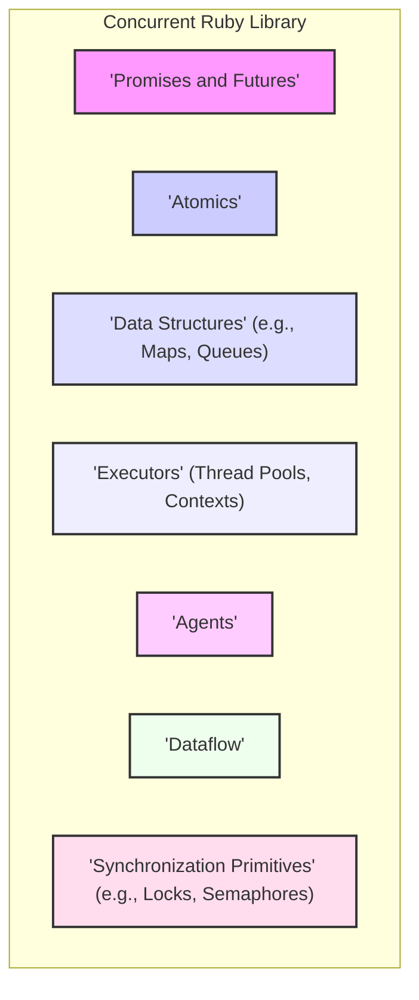
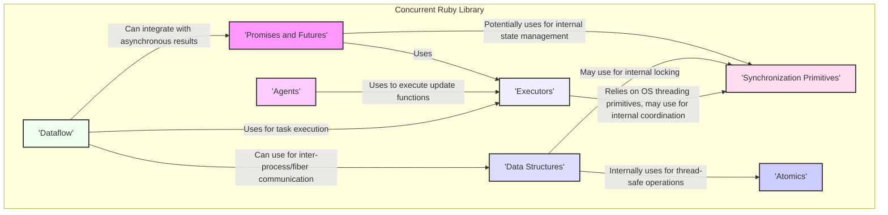
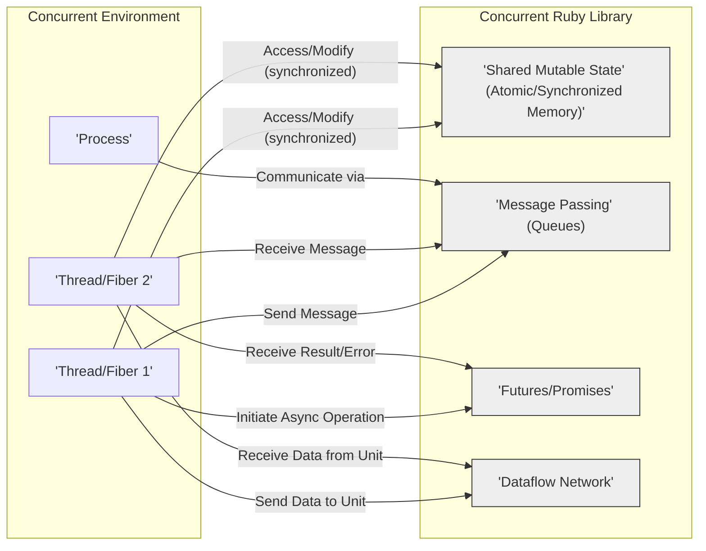

# Project Design Document: Concurrent Ruby Library

**Project Name:** Concurrent Ruby

**Project Repository:** [https://github.com/ruby-concurrency/concurrent-ruby](https://github.com/ruby-concurrency/concurrent-ruby)

**Document Version:** 1.1

**Date:** October 26, 2023

**Author:** AI Software Architect

## 1. Introduction

This document provides a detailed architectural design of the Concurrent Ruby library. This design is intended to be used as a basis for threat modeling and security analysis. It outlines the key components, their interactions, and potential areas of concern from a security perspective. This version aims to provide more specific details and enhance the clarity for security professionals.

## 2. Project Overview

Concurrent Ruby is a collection of useful, well-tested, and well-documented concurrency abstractions for Ruby. It provides a rich set of tools for building concurrent and parallel applications in Ruby, addressing the limitations of Ruby's Global Interpreter Lock (GIL) for CPU-bound tasks by leveraging threads, fibers, and processes.

## 3. Goals

*   Provide a comprehensive and robust set of concurrency primitives for Ruby developers.
*   Offer efficient and performant implementations of these primitives across various Ruby implementations (MRI, JRuby, TruffleRuby).
*   Maintain a well-documented, thoroughly tested, and actively maintained codebase.
*   Provide abstractions that simplify complex concurrent programming patterns.

## 4. Non-Goals

*   Replacing the Ruby Global Interpreter Lock (GIL) or fundamentally altering Ruby's concurrency model.
*   Providing concurrency solutions that deviate significantly from standard threading, fiber, or process-based concurrency.
*   Offering domain-specific concurrency solutions tailored to specific application types (e.g., web frameworks, game engines).

## 5. Architectural Design

The Concurrent Ruby library is structured around several core, independent components, each addressing a specific aspect of concurrency. This modular design allows developers to selectively use the parts of the library they need.

### 5.1. High-Level Architecture Diagram

### 5.2. Key Components

*   **Promises and Futures:** Represent the eventual result of an asynchronous computation, allowing for non-blocking operations.
    *   Enable composition of asynchronous tasks and handling of potential errors (rejections).
    *   State transitions (pending, fulfilled, rejected) are crucial for understanding the lifecycle and potential points of failure.
*   **Atomics:** Provide low-level, atomic operations on individual variables, ensuring thread-safe updates without explicit locking overhead for simple operations.
    *   Support for atomic integers, references, and boolean values.
    *   Underlying implementation often relies on CPU-level atomic instructions, which are platform-specific.
*   **Concurrent Data Structures:** Thread-safe implementations of common data structures designed for concurrent access and modification.
    *   Examples: `Concurrent::HashMap`, `Concurrent::Array`, `Concurrent::Queue`.
    *   Implementations often use fine-grained locking or lock-free algorithms for high concurrency.
*   **Executors:** Manage the execution of tasks, typically using thread pools, but also supporting other execution contexts like fibers.
    *   Offer various strategies: fixed thread pool, cached thread pool, single-threaded executor.
    *   Control the number of concurrent tasks and manage thread lifecycle, impacting resource consumption.
*   **Agents:** Encapsulate mutable state and provide a mechanism for safe, asynchronous updates to that state.
    *   State updates are performed by sending functions to the agent, which are processed sequentially.
    *   This serializes access to the agent's state, preventing race conditions.
*   **Dataflow:** A programming model for building concurrent applications based on the flow of data through interconnected processing units.
    *   Allows defining networks of actors or processes that communicate asynchronously.
    *   Data automatically flows between units as it becomes available, enabling parallel processing.
*   **Synchronization Primitives:** Low-level tools for managing access to shared resources and coordinating the execution of concurrent entities.
    *   Examples: `Mutex`, `Semaphore`, `ReadWriteLock`, `CountDownLatch`, `CyclicBarrier`.
    *   Used internally by other components and directly by developers for fine-grained control over concurrency.

### 5.3. Component Interactions

*   **Promises and Futures** often rely on **Executors** to execute the asynchronous tasks they represent. They might also internally use **Synchronization Primitives** for managing their state transitions and notifications.
*   **Atomics** are fundamental building blocks and don't typically depend on other high-level components within the library, but they are heavily utilized by **Concurrent Data Structures** for ensuring thread safety at a low level.
*   **Concurrent Data Structures** leverage **Atomics** for fine-grained, lock-free operations and may also utilize **Synchronization Primitives** like locks for more complex operations or to manage contention.
*   **Executors** directly interact with the underlying operating system or Ruby implementation's threading mechanisms. They may use **Synchronization Primitives** internally to manage the pool of threads and coordinate task execution.
*   **Agents** typically use **Executors** to process state update functions asynchronously, ensuring that updates are performed in a thread-safe manner without blocking the caller.
*   **Dataflow** components can utilize **Executors** to run processing units concurrently. They may employ **Concurrent Data Structures** for managing data buffers and communication channels between processing units. They can also integrate with **Promises and Futures** for handling asynchronous results and dependencies.
*   **Synchronization Primitives** are the foundational tools used by many other components to ensure thread safety, manage access to shared resources, and coordinate the execution of concurrent operations.

## 6. Data Flow

The primary data flow within Concurrent Ruby involves the movement and manipulation of data across different concurrent execution units (threads, fibers, processes). This can occur through various mechanisms:

*   **Shared Mutable State:** Data residing in memory that is accessed and modified by multiple concurrent entities. This access is often controlled and synchronized using **Atomics** or **Synchronization Primitives** to prevent race conditions and ensure data integrity.
*   **Message Passing:** Explicitly sending data between concurrent entities using constructs like concurrent queues (provided by **Concurrent Data Structures**) or channels. This approach promotes decoupling and can simplify reasoning about concurrency.
*   **Futures and Promises:** Data represents the eventual result of an asynchronous operation. The data flows from the producer of the result to the consumer when the promise is fulfilled. Error information also flows through promise rejections.
*   **Dataflow Networks:** Data flows through a predefined network of processing units. Each unit receives data, performs some transformation, and then passes the data to the next unit in the network.

## 7. Security Considerations

While Concurrent Ruby focuses on providing concurrency abstractions, security implications arise from how these abstractions are used in applications. Incorrect or insecure usage can lead to various vulnerabilities.

*   **Race Conditions:** Occur when the outcome of a program depends on the uncontrolled order of execution of concurrent operations on shared mutable state. This can lead to data corruption, inconsistent state, and potentially exploitable vulnerabilities.
    *   **Relevant Components:** All components that involve shared mutable state and synchronization, especially **Atomics**, **Concurrent Data Structures**, and direct use of **Synchronization Primitives**.
*   **Deadlocks:** A situation where two or more concurrent entities are blocked indefinitely, waiting for each other to release resources. While not always a direct security vulnerability, it can cause denial of service.
    *   **Relevant Components:** Primarily related to the use of **Synchronization Primitives** like mutexes and semaphores.
*   **Resource Exhaustion:**  Uncontrolled creation of threads, tasks, or other resources can exhaust system resources, leading to denial of service.
    *   **Relevant Components:** **Executors** are a key area to consider, as improper configuration or usage can lead to unbounded thread creation.
*   **Data Corruption:** Race conditions or incorrect atomic operations can lead to the corruption of data stored in shared memory or concurrent data structures.
    *   **Relevant Components:** **Atomics** and **Concurrent Data Structures** are critical here.
*   **Information Disclosure:** If concurrent data structures or shared state are not managed carefully, sensitive information might be unintentionally exposed to other concurrent entities.
    *   **Relevant Components:** **Concurrent Data Structures** require careful consideration of access control and visibility.
*   **Denial of Service (DoS):**  Exploiting concurrency mechanisms to overwhelm the system with requests or tasks, consuming excessive resources.
    *   **Relevant Components:** **Executors** and the overall design of concurrent workflows are relevant.
*   **Unintended Interactions:** Complex interactions between concurrent components might lead to unexpected states or behaviors that could be exploited.
    *   **Relevant Components:**  The interplay between **Promises and Futures**, **Dataflow**, and **Agents** needs careful consideration.
*   **Error Handling in Concurrent Contexts:**  Errors occurring in one concurrent task might not be properly propagated or handled, potentially leading to inconsistent state or security vulnerabilities.
    *   **Relevant Components:** **Promises and Futures** provide mechanisms for error handling (rejections), which need to be used correctly.

## 8. External Dependencies

Concurrent Ruby has minimal external dependencies beyond the Ruby standard library. However, its behavior and performance characteristics are influenced by the specific Ruby implementation being used (MRI, JRuby, TruffleRuby) due to differences in threading models and underlying system calls. No external gems are strictly required for core functionality.

## 9. Deployment Considerations

Concurrent Ruby is typically deployed as a gem within a Ruby application. Security considerations during deployment include:

*   **Resource Limits:**  Setting appropriate limits on thread pool sizes and other resource usage to prevent resource exhaustion.
*   **Monitoring:**  Monitoring the application for signs of deadlocks, race conditions, or excessive resource consumption.
*   **Secure Configuration:**  Configuring executors and other components with security best practices in mind.
*   **Dependency Management:** Ensuring the Ruby runtime and any other dependencies are up-to-date with security patches.

## 10. Threat Modeling Focus Areas

When performing threat modeling on applications using Concurrent Ruby, focus on the following areas to identify potential vulnerabilities:

*   **Analysis of Shared Mutable State:**
    *   Identify all locations where shared mutable state exists.
    *   Examine the synchronization mechanisms used (e.g., mutexes, atomic operations).
    *   Assess the potential for race conditions and data corruption.
    *   Consider the visibility and access control of this shared state.
*   **Concurrency Control Mechanisms:**
    *   Evaluate the configuration and usage of **Executors**.
    *   Analyze the potential for resource exhaustion due to uncontrolled thread creation.
    *   Examine the use of **Synchronization Primitives** and the risk of deadlocks.
*   **Data Flow Security:**
    *   Trace the flow of sensitive data between concurrent entities.
    *   Assess the security of message passing mechanisms (if used).
    *   Consider the potential for information leakage during data transfer.
*   **Asynchronous Operations and Error Handling:**
    *   Analyze how **Promises and Futures** are used and how errors (rejections) are handled.
    *   Ensure that unhandled errors do not lead to insecure states.
*   **Input Validation in Concurrent Tasks:**
    *   Verify that data processed by concurrent tasks is properly validated and sanitized to prevent injection attacks or other input-related vulnerabilities.
*   **Dependency Chain Security:**
    *   Assess the security of the underlying Ruby runtime.
    *   Consider any potential vulnerabilities in transitive dependencies.
*   **Complex Interactions:**
    *   Carefully analyze the interactions between different concurrent components (**Agents**, **Dataflow**, **Promises**) to identify potential unexpected behaviors or vulnerabilities arising from their combined use.

This design document provides a comprehensive architectural overview of the Concurrent Ruby library, emphasizing aspects relevant to security analysis and threat modeling. By focusing on the identified components, interactions, and data flows, security professionals can effectively assess the potential risks associated with using this library in their applications.
