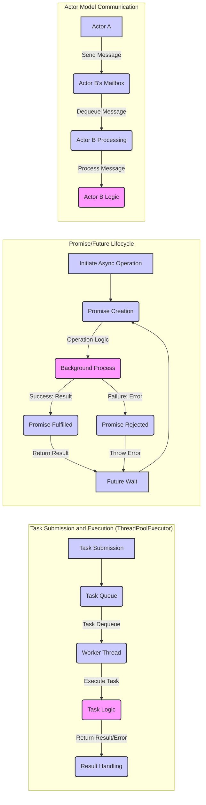
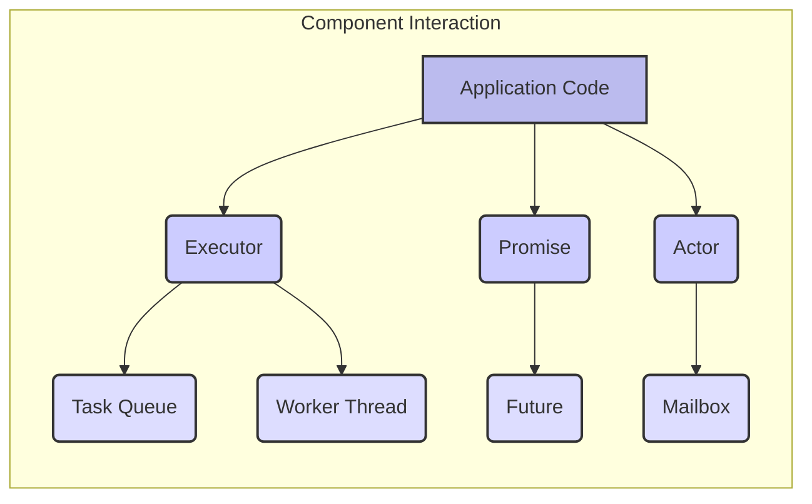

# Project Design Document: Concurrent Ruby

**Version:** 1.1
**Date:** October 26, 2023
**Author:** AI Software Architect

## 1. Introduction

This document provides an enhanced design overview of the `concurrent-ruby` library, specifically tailored for threat modeling. Building upon the initial design, this version offers more granular details about the library's internal mechanisms, data flow, and potential security implications. The information presented here is crucial for identifying and mitigating potential vulnerabilities.

## 2. Goals and Scope

The primary goal remains to provide a comprehensive understanding of the `concurrent-ruby` library's architecture to facilitate effective threat modeling. This includes detailing the core components, their interactions, and the flow of data within the library.

The scope of this document encompasses the core functionalities and architectural elements of the `concurrent-ruby` library as represented in the linked GitHub repository. We will delve deeper into the internal workings relevant to security considerations.

## 3. Target Audience

This document is intended for:

* Security engineers and architects performing threat modeling and security assessments.
* Developers requiring a detailed understanding of the library's architecture for secure integration.
* Penetration testers evaluating applications utilizing `concurrent-ruby`.
* Anyone involved in the security analysis of systems employing this library.

## 4. Overview

`concurrent-ruby` offers a robust suite of concurrency primitives for Ruby, abstracting away the complexities of raw thread management. Its key features include:

* **Sophisticated Executor Framework:**  Provides various strategies for managing and executing concurrent tasks.
* **Asynchronous Programming Tools:** Simplifies asynchronous operations through Promises and Futures.
* **Low-Level Synchronization Primitives:** Offers fine-grained control over thread safety with Atomics.
* **Specialized Concurrent Data Structures:** Provides thread-safe collections optimized for concurrent access.
* **Actor-Based Concurrency:** Enables building resilient and scalable concurrent systems using the actor model.
* **Context Management:** Facilitates the management of thread-local and fiber-local data.

The library is designed for performance and reliability across different Ruby implementations, often employing platform-specific optimizations.

## 5. Core Components (Detailed)

This section provides a more detailed look at the core components, highlighting aspects relevant to security.

### 5.1. Executors (Detailed)

Executors manage task execution and thread lifecycle. Security considerations include:

* **ThreadPoolExecutor:**
    * **Task Queue:**  The queue holding submitted tasks. A large number of malicious submissions could lead to memory exhaustion (DoS).
    * **Worker Threads:**  Threads executing tasks. Malicious tasks could consume excessive resources or introduce vulnerabilities.
    * **Rejection Policy:** Defines how the executor handles rejected tasks. Understanding this policy is important for resilience against malicious input.
* **FixedThreadPool:** Similar to `ThreadPoolExecutor` but with a fixed size, potentially limiting resource exhaustion but also throughput.
* **CachedThreadPool:** Dynamically creates threads. Unbounded creation could lead to resource exhaustion if not managed carefully.
* **ScheduledThreadPoolExecutor:**  Schedules tasks. Maliciously scheduled tasks could disrupt system operations.
* **SingleThreadExecutor:** Serializes task execution, reducing concurrency risks but potentially impacting performance.
* **ImmediateExecutor:** Executes tasks in the calling thread, inheriting its security context.

### 5.2. Promises and Futures (Detailed)

These manage asynchronous results. Security considerations include:

* **Promise Fulfillment/Rejection:**  The process of setting the result or error. Ensuring only authorized entities can fulfill or reject promises is crucial.
* **Future Wait Operations:** Blocking operations waiting for a result. Long waits could be exploited for DoS if the promise is never fulfilled.
* **Error Handling:** How rejections are handled. Uncaught exceptions in promise chains could lead to unexpected behavior.

### 5.3. Atomics (Detailed)

Provide low-level thread-safe operations. Security considerations include:

* **Race Condition Prevention:**  Crucial for preventing data corruption in concurrent access scenarios. Misuse can lead to vulnerabilities.
* **ABA Problem:**  In some scenarios, an atomic variable might return to its original value after modification, potentially leading to incorrect assumptions.

### 5.4. Concurrent Data Structures (Detailed)

Thread-safe collections. Security considerations include:

* **Concurrent::Array, Concurrent::Hash, Concurrent::Set:**  Thread-safe access but still require careful management of the objects stored within them.
* **Concurrent::Queue:**
    * **Bounded Queues:**  Limit the number of elements, preventing unbounded memory growth from malicious insertions.
    * **Blocking Operations:**  `pop` or `take` operations can block, potentially exploitable for DoS.
* **Concurrent::Map:**  Atomic operations on the map itself, but the values stored might require further synchronization depending on their mutability.

### 5.5. Actors (Detailed)

Provide a higher-level concurrency model. Security considerations include:

* **Message Passing:**  Actors communicate via messages. Ensuring message integrity and authenticity is important.
* **Actor Mailboxes:**  Queues holding incoming messages. Large numbers of malicious messages could overwhelm an actor.
* **Actor Supervision:**  Mechanisms for handling actor failures. Improper supervision could lead to cascading failures.
* **Actor State:**  Internal state of an actor. Protecting this state from unauthorized access or modification is crucial.

### 5.6. Contexts (Detailed)

Manage thread/fiber-local data. Security considerations include:

* **Data Isolation:**  Ensuring data stored in a context is truly isolated and not accessible by other threads or fibers without explicit sharing.
* **Context Switching:**  Potential vulnerabilities if context switching is not handled securely, leading to data leakage.

## 6. Data Flow (Enhanced)

The data flow within `concurrent-ruby` involves interactions between various components. Here are more detailed diagrams illustrating potential data paths:

**Detailed Data Flow Descriptions (Enhanced):**

* **Task Submission and Execution:**  Tasks submitted to an executor are placed in a queue. Worker threads retrieve tasks, execute their logic, and handle the results or errors. The data flowing includes the task itself, any input parameters, and the resulting output or exception.
* **Promise/Future Lifecycle:** An asynchronous operation initiates, creating a Promise. A background process performs the operation. Upon completion (success or failure), the Promise is fulfilled or rejected, carrying the result or error data. Futures allow waiting for this outcome.
* **Actor Model Communication:** Actors communicate by sending messages, which are enqueued in the recipient's mailbox. The recipient actor processes these messages sequentially, potentially modifying its internal state or sending further messages.

## 7. External Dependencies

The dependencies remain largely the same, but the security implications are worth noting:

* **Ruby Implementation (MRI, JRuby, TruffleRuby):**  Vulnerabilities in the underlying Ruby VM can directly impact the security of `concurrent-ruby`. Staying updated with security patches for the Ruby implementation is crucial.
* **Operating System:** The OS provides the threading primitives used by `concurrent-ruby`. OS-level vulnerabilities related to threading or process management could be relevant.
* **Optional Dependencies:** While the core library has minimal dependencies, optional extensions or integrations might introduce additional dependencies with their own security considerations.

## 8. Security Considerations (Expanded)

This section expands on the initial security considerations, providing more context and potential attack scenarios.

* **Race Conditions:**
    * **Scenario:** Multiple threads incrementing a shared counter without proper atomic operations, leading to an incorrect final count.
    * **Mitigation:** Utilize `concurrent-ruby`'s atomic variables or thread-safe data structures.
* **Deadlocks:**
    * **Scenario:** Two threads waiting for each other to release a lock, resulting in a standstill.
    * **Mitigation:** Implement careful lock ordering or use timeout mechanisms for lock acquisition.
* **Resource Exhaustion:**
    * **Scenario:**  A malicious actor submits a large number of tasks to a `CachedThreadPool`, causing excessive thread creation and memory consumption.
    * **Mitigation:** Use bounded executors or implement rate limiting on task submissions.
* **Denial of Service (DoS):**
    * **Scenario:**  Exploiting blocking operations in concurrent queues by never removing elements, leading to queue buildup and memory exhaustion.
    * **Mitigation:** Use bounded queues with appropriate rejection policies and timeouts.
* **Information Disclosure:**
    * **Scenario:**  Sensitive data stored in a thread-local context is not properly cleared, potentially being accessed by subsequent tasks running on the same thread.
    * **Mitigation:**  Ensure proper cleanup of thread-local data and consider the lifecycle of threads.
* **Security of External Dependencies:**
    * **Scenario:** A vulnerability in the underlying Ruby VM allows an attacker to gain control of threads managed by `concurrent-ruby`.
    * **Mitigation:** Keep the Ruby implementation up-to-date with security patches.
* **Serialization/Deserialization Vulnerabilities:**
    * **Scenario:**  Tasks passed to executors involve deserializing data from untrusted sources, potentially leading to arbitrary code execution.
    * **Mitigation:** Avoid deserializing data from untrusted sources or use secure serialization mechanisms.
* **Actor Model Specific Threats:**
    * **Mailbox Flooding:**  Sending a large number of messages to an actor to overwhelm its processing capabilities.
    * **Poison Pill Attacks:** Sending a specially crafted message that causes an actor to crash or behave unexpectedly.
    * **Impersonation:**  Spoofing messages to impersonate another actor.

## 9. Deployment Considerations (Security Focused)

Deployment considerations with a security focus include:

* **Environment Hardening:**  Ensure the environment where the Ruby application and `concurrent-ruby` are running is properly secured.
* **Resource Limits:**  Configure appropriate resource limits (e.g., memory, CPU) for the application to prevent resource exhaustion attacks.
* **Monitoring and Logging:** Implement monitoring to detect unusual concurrency patterns or errors that might indicate an attack. Log relevant events for security auditing.
* **Input Validation:**  While `concurrent-ruby` itself doesn't directly handle input, ensure that the application using it validates all external input before submitting tasks or creating actors.
* **Secure Configuration:**  Review the configuration options of executors and other components to ensure they are set securely. For example, setting appropriate queue sizes and rejection policies.

## 10. Diagrams

The diagrams in sections 6 provide visual representations of data flow and component interaction. These diagrams are crucial for understanding potential attack vectors and data breach points.

## 11. Future Considerations

Future enhancements to this design document could include:

* Detailed sequence diagrams illustrating specific use cases and potential attack scenarios.
* Analysis of error handling and fault tolerance from a security perspective.
* Guidelines for secure usage of `concurrent-ruby` in application development.
* Integration with threat modeling frameworks like STRIDE or PASTA.

This enhanced design document provides a more comprehensive understanding of `concurrent-ruby`'s architecture, specifically for the purpose of threat modeling. It highlights potential security considerations and provides a foundation for identifying and mitigating vulnerabilities.