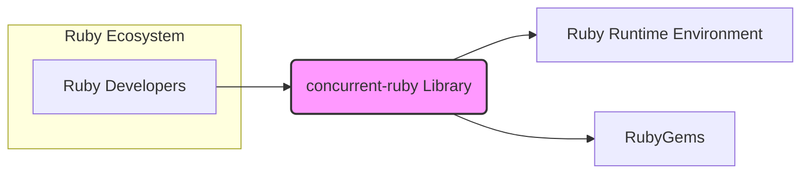
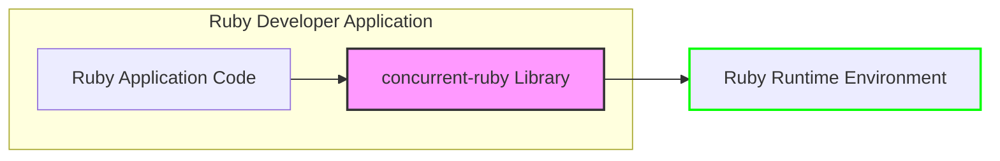
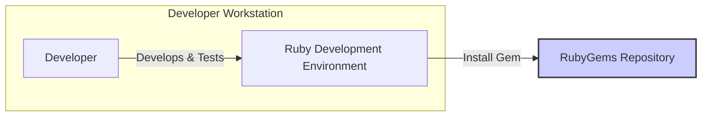
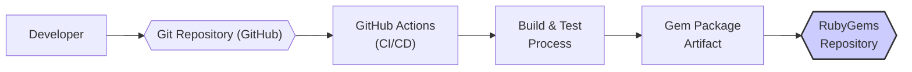

# BUSINESS POSTURE

This project, `concurrent-ruby`, provides a comprehensive and efficient concurrency library for the Ruby programming language. It aims to empower Ruby developers to build high-performance, responsive, and scalable applications by offering a rich set of concurrency abstractions and tools.

Business Priorities and Goals:
- Primary goal is to provide a robust, reliable, and performant concurrency library for the Ruby ecosystem.
- Enable Ruby developers to easily implement concurrent and parallel patterns in their applications.
- Improve the overall performance and responsiveness of Ruby applications.
- Foster a strong community around concurrent programming in Ruby.
- Ensure long-term maintainability and evolution of the library to meet the changing needs of the Ruby community.

Business Risks:
- Risk of introducing vulnerabilities in the library that could be exploited by malicious actors in applications using `concurrent-ruby`.
- Risk of performance regressions or bugs that could negatively impact the performance and stability of applications relying on the library.
- Risk of insufficient community support or maintainership leading to stagnation or abandonment of the project, making it unreliable for long-term use.
- Risk of incompatibility with future versions of the Ruby runtime environment, requiring significant rework or migration efforts for users.

# SECURITY POSTURE

Existing Security Controls:
- security control: Open Source Development Model - The project is hosted on GitHub, allowing for public scrutiny of the codebase and contributions from the community. This facilitates community-driven security reviews and vulnerability identification. (Implemented: GitHub Repository)
- security control: Code Review Process - All code changes are submitted via pull requests and are subject to review by project maintainers before being merged into the main branch. This helps to catch potential security flaws and coding errors. (Implemented: GitHub Pull Requests)
- security control: Unit and Integration Testing - The project includes a suite of unit and integration tests to ensure the correctness and stability of the library's functionality. These tests can help detect regressions and unexpected behavior that might have security implications. (Implemented: Project's Test Suite)

Accepted Risks:
- accepted risk: Reliance on Community for Security Vulnerability Reporting - The project depends on the community to report security vulnerabilities. There is a risk that vulnerabilities might not be reported promptly or at all.
- accepted risk: Limited Dedicated Security Expertise - The project maintainers are primarily focused on functionality and performance. Dedicated security expertise might be limited, potentially leading to oversight of subtle security issues.

Recommended Security Controls:
- security control: Automated Dependency Scanning - Implement automated scanning of dependencies to identify and address known vulnerabilities in third-party libraries used by `concurrent-ruby`.
- security control: Static Application Security Testing (SAST) - Integrate SAST tools into the CI/CD pipeline to automatically analyze the codebase for potential security vulnerabilities during development.
- security control: Regular Security Audits - Conduct periodic security audits by external security experts to identify and address potential security weaknesses in the library's design and implementation.
- security control: Security Vulnerability Disclosure Policy - Establish a clear and public security vulnerability disclosure policy to guide security researchers and users on how to report vulnerabilities responsibly.

Security Requirements:
- Authentication: Not applicable for a library. `concurrent-ruby` is a library and does not handle user authentication directly. Applications using `concurrent-ruby` are responsible for their own authentication mechanisms.
- Authorization: Not applicable for a library. `concurrent-ruby` does not enforce authorization. Authorization is the responsibility of the applications that utilize this library.
- Input Validation: Input validation is crucial for the APIs exposed by `concurrent-ruby`. The library should validate all inputs to its public methods to prevent unexpected behavior, crashes, or potential security vulnerabilities arising from malformed input. This includes validating data types, ranges, and formats.
- Cryptography: While `concurrent-ruby` itself is not primarily focused on cryptography, it might be used in concurrent applications that handle sensitive data and require cryptographic operations. If `concurrent-ruby` provides any utilities or helpers related to cryptography, they must be implemented securely, following best practices and using well-vetted cryptographic libraries. If not, applications using `concurrent-ruby` will need to ensure they are using secure cryptographic practices independently.

# DESIGN

## C4 CONTEXT

Context Diagram Elements:

- Name: Ruby Developers
  - Type: Person
  - Description: Software developers who use the Ruby programming language and want to build concurrent applications. They are the primary users of the `concurrent-ruby` library.
  - Responsibilities: Utilize `concurrent-ruby` to implement concurrency in their Ruby applications, report issues and contribute to the library.
  - Security controls: Responsible for securely using the library in their applications, including proper input validation and secure handling of data within concurrent contexts.

- Name: concurrent-ruby Library
  - Type: Software System
  - Description: A Ruby library providing a rich set of concurrency abstractions and utilities, such as futures, promises, actors, thread pools, and more. It is designed to simplify concurrent programming in Ruby and improve application performance.
  - Responsibilities: Provide robust and efficient concurrency primitives, ensure thread safety and data consistency, and offer a well-documented and easy-to-use API.
  - Security controls: Input validation within library APIs, protection against internal vulnerabilities (e.g., memory safety, race conditions), and adherence to secure coding practices.

- Name: Ruby Runtime Environment
  - Type: Software System
  - Description: The Ruby interpreter (e.g., MRI, JRuby, TruffleRuby) that executes Ruby code. `concurrent-ruby` relies on the underlying capabilities of the Ruby runtime environment for thread management, process management, and other system-level operations.
  - Responsibilities: Execute Ruby code, manage threads and processes, provide system-level resources to Ruby applications.
  - Security controls: Security features of the Ruby runtime environment itself, such as memory management, sandboxing (if applicable), and security updates provided by the Ruby runtime maintainers.

- Name: RubyGems
  - Type: Software System
  - Description: The package manager for the Ruby programming language. `concurrent-ruby` is distributed as a gem package through RubyGems, allowing developers to easily install and manage the library.
  - Responsibilities: Host and distribute Ruby gem packages, provide a platform for developers to discover and install libraries.
  - Security controls: RubyGems platform security measures to prevent malicious packages, package signing and verification mechanisms, and vulnerability scanning of hosted gems.

## C4 CONTAINER

Container Diagram Elements:

- Name: Ruby Application Code
  - Type: Application
  - Description: The Ruby application developed by Ruby developers. This application utilizes the `concurrent-ruby` library to implement concurrent functionalities.
  - Responsibilities: Implement application-specific logic, manage application data, and utilize `concurrent-ruby` APIs for concurrency.
  - Security controls: Application-level security controls, including authentication, authorization, input validation, secure data handling, and secure configuration.

- Name: concurrent-ruby Library
  - Type: Library
  - Description:  As described in the Context Diagram, this is the concurrency library providing abstractions and utilities. In the container context, it is shown as a component within a Ruby application.
  - Responsibilities: Provide robust and efficient concurrency primitives to the Ruby application, ensure thread safety and data consistency within the library's scope.
  - Security controls: Input validation within library APIs, protection against internal vulnerabilities (e.g., memory safety, race conditions), and adherence to secure coding practices.

- Name: Ruby Runtime Environment
  - Type: Runtime Environment
  - Description: The Ruby interpreter that executes both the Ruby Application Code and the `concurrent-ruby` Library. It provides the underlying execution environment and system resources.
  - Responsibilities: Execute Ruby code, manage threads and processes, provide system-level resources to the Ruby application and libraries.
  - Security controls: Security features of the Ruby runtime environment itself, such as memory management, sandboxing (if applicable), and security updates provided by the Ruby runtime maintainers.

## DEPLOYMENT

Deployment Diagram:

Deployment Description:

The `concurrent-ruby` library is deployed as a RubyGem package to the RubyGems repository. Ruby developers then install this gem into their Ruby development and deployment environments using standard RubyGems tooling (e.g., `gem install concurrent-ruby`). The library becomes part of the application's dependencies and is loaded at runtime by the Ruby interpreter.

Deployment Diagram Elements:

- Name: Developer Workstation
  - Type: Environment
  - Description: The local machine used by a Ruby developer for writing, testing, and developing Ruby applications. It includes a Ruby development environment with necessary tools and libraries.
  - Responsibilities: Development, testing, and local execution of Ruby applications that use `concurrent-ruby`.
  - Security controls: Security of the developer's workstation, including operating system security, endpoint protection, and secure development practices.

- Name: Ruby Development Environment
  - Type: Software
  - Description: The set of tools and libraries installed on the developer workstation, including the Ruby interpreter, RubyGems, and other development dependencies.
  - Responsibilities: Provide the environment for developing and testing Ruby applications.
  - Security controls: Secure configuration of the development environment, keeping development tools and dependencies up-to-date, and using secure development practices.

- Name: RubyGems Repository
  - Type: Infrastructure
  - Description: The central repository (rubygems.org) where Ruby gem packages, including `concurrent-ruby`, are hosted and distributed.
  - Responsibilities: Host and distribute Ruby gem packages, ensure availability and integrity of packages.
  - Security controls: RubyGems platform security measures, including infrastructure security, access controls, vulnerability scanning, and package integrity verification.

## BUILD

Build Process Diagram:

Build Process Description:

1. Developer: Ruby developers contribute code changes to the `concurrent-ruby` project by pushing commits to the Git repository hosted on GitHub.
2. Git Repository (GitHub): The GitHub repository stores the source code, commit history, and pull requests for the `concurrent-ruby` project. It acts as the central version control system.
3. GitHub Actions (CI/CD): GitHub Actions is used as the CI/CD platform to automate the build, test, and release process. Upon code changes (e.g., pull requests, merges to main branch), GitHub Actions workflows are triggered.
4. Build & Test Process: The CI/CD pipeline executes a series of steps, including:
    - Fetching the latest code from the repository.
    - Setting up the Ruby build environment.
    - Running linters and static analysis tools to check code quality and identify potential issues.
    - Executing unit and integration tests to ensure code correctness and prevent regressions.
    - Building the RubyGem package artifact.
5. Gem Package Artifact: If the build and tests are successful, a RubyGem package (`.gem` file) is created. This artifact contains the compiled library and necessary metadata for distribution.
6. RubyGems Repository: The generated Gem Package Artifact is published to the RubyGems repository, making it available for Ruby developers to download and use in their applications.

Build Process Security Controls:
- security control: Secure Code Repository (GitHub) - GitHub provides security features like access controls, audit logs, and vulnerability scanning to protect the source code repository.
- security control: CI/CD Pipeline Security (GitHub Actions) - Secure configuration of GitHub Actions workflows, including secrets management, least privilege access for actions, and secure runner environments.
- security control: Automated Security Checks - Integration of SAST tools and linters in the CI/CD pipeline to automatically detect potential security vulnerabilities and code quality issues.
- security control: Dependency Scanning - Automated scanning of dependencies during the build process to identify and address known vulnerabilities in third-party libraries.
- security control: Test Automation - Comprehensive suite of unit and integration tests to ensure code correctness and prevent regressions that could introduce security vulnerabilities.
- security control: Code Signing (potentially) - Consider signing the Gem package to ensure its integrity and authenticity, allowing users to verify that the package has not been tampered with.

# RISK ASSESSMENT

Critical Business Processes:
- Applications that rely on `concurrent-ruby` for core functionalities, especially those requiring high performance, responsiveness, or concurrent processing of critical tasks. Examples include:
    - High-traffic web applications and APIs.
    - Real-time data processing systems.
    - Background job processing frameworks.
    - Event-driven architectures.

Data Sensitivity:
- The `concurrent-ruby` library itself does not directly handle or store application data. However, it is used in applications that process and manage various types of data, which can include sensitive information such as:
    - Personally Identifiable Information (PII).
    - Financial data.
    - Healthcare records.
    - Intellectual property.
    - Business-critical operational data.

The sensitivity of data depends on the specific applications using `concurrent-ruby`. A vulnerability in `concurrent-ruby` could potentially impact the confidentiality, integrity, and availability of data processed by these applications. The impact would vary based on the nature of the vulnerability and how it is exploited within the context of a specific application.

# QUESTIONS & ASSUMPTIONS

Questions:
- What is the intended scope of applications that `concurrent-ruby` is designed to support (e.g., web applications, background processing, etc.)?
- Are there any specific performance benchmarks or scalability targets for `concurrent-ruby`?
- What is the expected level of community involvement and contribution to the project's development and maintenance?
- Are there any plans for formal security audits or penetration testing of `concurrent-ruby`?
- What is the process for handling and responding to security vulnerability reports?

Assumptions:
- BUSINESS POSTURE:
    - The primary business goal is to provide a high-quality, reliable, and performant concurrency library for the Ruby community.
    - Long-term maintainability and community support are important for the project's success.
- SECURITY POSTURE:
    - Security is a significant concern for applications using concurrency libraries.
    - The open-source nature of the project is seen as a security benefit through community review, but also requires proactive security measures.
    - Security vulnerabilities in `concurrent-ruby` could have a wide impact on Ruby applications.
- DESIGN:
    - `concurrent-ruby` is designed as a general-purpose concurrency library, intended to be used in a variety of Ruby application types.
    - The library is designed to be modular and extensible to accommodate different concurrency patterns and use cases.
    - The build and deployment process relies on standard Ruby and RubyGems tooling and infrastructure.