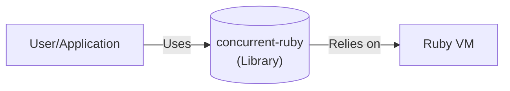
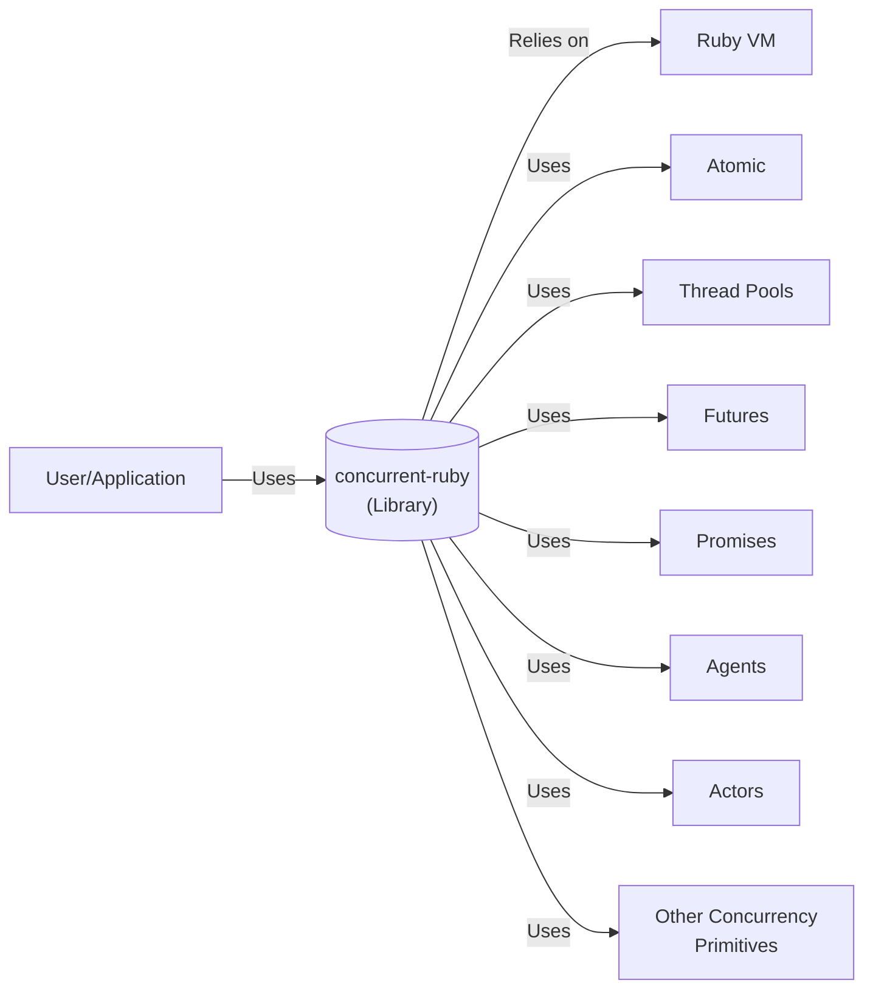
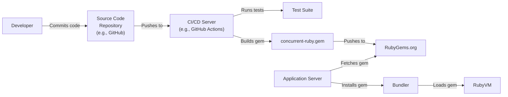
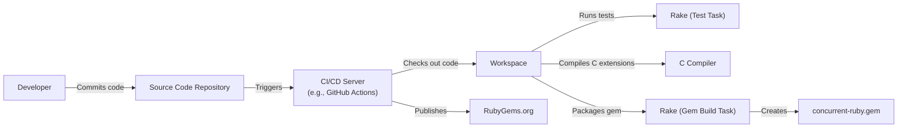

# Project Design Document: concurrent-ruby

## BUSINESS POSTURE

*   Priorities and Goals:
    *   Provide a comprehensive set of concurrency abstractions for the Ruby programming language.
    *   Improve the performance and responsiveness of Ruby applications by enabling parallel execution.
    *   Offer a variety of tools to manage shared data and avoid race conditions.
    *   Maintain backward compatibility and ease of integration with existing Ruby code.
    *   Provide well-documented and easy-to-understand APIs.
    *   Ensure thread safety and prevent common concurrency-related bugs.

*   Business Risks:
    *   Incorrect implementation of concurrency abstractions leading to data corruption or application crashes.
    *   Performance bottlenecks due to inefficient use of concurrency primitives.
    *   Difficulty in debugging and troubleshooting concurrency-related issues.
    *   Incompatibility with specific Ruby implementations or versions.
    *   Security vulnerabilities arising from improper handling of shared resources.
    *   Steep learning curve for developers unfamiliar with concurrency concepts.

## SECURITY POSTURE

*   Existing Security Controls:
    *   security control: The library itself is designed to provide safe concurrency abstractions, mitigating many common concurrency risks.
    *   security control: Extensive use of automated tests, including stress tests, to ensure the correctness and stability of the library. (Described in the project's README and test suite.)
    *   security control: Community review and contributions from experienced developers. (Visible through the GitHub repository's issue tracker and pull requests.)
    *   security control: Use of mutexes and other synchronization primitives to protect shared resources. (Implemented within the library's code.)

*   Accepted Risks:
    *   accepted risk: The library relies on the underlying Ruby implementation's threading model, which may have limitations or platform-specific behaviors.
    *   accepted risk: Developers are ultimately responsible for using the library correctly and avoiding race conditions in their application code.
    *   accepted risk: Potential for denial-of-service (DoS) if a large number of threads or processes are created without proper resource management.

*   Recommended Security Controls:
    *   security control: Integrate static analysis tools (e.g., RuboCop with concurrency-related cops) into the development workflow to detect potential issues.
    *   security control: Provide clear guidelines and best practices for using the library securely in the documentation.
    *   security control: Consider adding runtime checks or assertions to detect unexpected behavior or misuse of the library.

*   Security Requirements:

    *   Authentication: Not directly applicable, as this is a library, not a service. Authentication would be handled by the application using the library.
    *   Authorization: Not directly applicable. Authorization would be handled by the application using the library.
    *   Input Validation: Not directly applicable, as the library primarily deals with concurrency primitives, not user input. Input validation should be handled by the application using the library.
    *   Cryptography: Not directly applicable, as the library does not handle cryptographic operations. Cryptography should be handled by dedicated libraries within the application.
    *   Data Protection: The library should ensure the integrity and consistency of shared data accessed concurrently. This is achieved through the use of appropriate synchronization mechanisms like mutexes, locks, and atomic variables.
    *   Error Handling: The library should handle errors and exceptions gracefully, preventing crashes and providing informative error messages.

## DESIGN

### C4 CONTEXT

*   Elements:

    *   User/Application:
        *   Name: User/Application
        *   Type: Person/System
        *   Description: A Ruby application or user that utilizes the concurrent-ruby library.
        *   Responsibilities: Implements the application logic and utilizes concurrent-ruby for concurrency management.
        *   Security controls: Implements application-level security controls, such as authentication, authorization, and input validation.

    *   concurrent-ruby (Library):
        *   Name: concurrent-ruby
        *   Type: Library
        *   Description: The concurrent-ruby library, providing concurrency abstractions.
        *   Responsibilities: Provides concurrency primitives and tools for managing shared data.
        *   Security controls: Implements internal synchronization mechanisms to ensure thread safety.

    *   Ruby VM:
        *   Name: Ruby VM
        *   Type: System
        *   Description: The Ruby Virtual Machine (e.g., MRI, JRuby, TruffleRuby).
        *   Responsibilities: Executes Ruby code, manages threads, and provides the underlying concurrency mechanisms.
        *   Security controls: Relies on the security features of the underlying operating system and the Ruby VM implementation.

### C4 CONTAINER

Since `concurrent-ruby` is a library, the container diagram is essentially the same as the context diagram. The library's components are modules and classes within the Ruby application's runtime environment.

*   Elements:

    *   User/Application: (Same as in C4 Context)

    *   concurrent-ruby (Library): (Same as in C4 Context)

    *   Ruby VM: (Same as in C4 Context)

    *   Atomic:
        *   Name: Atomic
        *   Type: Library Component
        *   Description: Provides atomic operations for thread-safe access to shared variables.
        *   Responsibilities: Ensures atomic updates to variables, preventing race conditions.
        *   Security controls: Uses low-level atomic instructions provided by the Ruby VM or operating system.

    *   Thread Pools:
        *   Name: Thread Pools
        *   Type: Library Component
        *   Description: Manages a pool of threads for executing tasks concurrently.
        *   Responsibilities: Creates, manages, and reuses threads to improve performance and resource utilization.
        *   Security controls: Limits the number of threads to prevent resource exhaustion.

    *   Futures:
        *   Name: Futures
        *   Type: Library Component
        *   Description: Represents the result of an asynchronous operation that will be available at some point in the future.
        *   Responsibilities: Allows asynchronous execution of tasks and retrieval of results.
        *   Security controls: Ensures thread-safe access to the future's result.

    *   Promises:
        *   Name: Promises
        *   Type: Library Component
        *   Description: A more advanced form of futures, allowing chaining of asynchronous operations.
        *   Responsibilities: Provides a fluent interface for composing asynchronous workflows.
        *   Security controls: Ensures thread-safe execution and propagation of results and errors.

    *   Agents:
        *   Name: Agents
        *   Type: Library Component
        *   Description: Provides a mechanism for managing shared state in a thread-safe manner.
        *   Responsibilities: Encapsulates mutable state and provides methods for updating it safely.
        *   Security controls: Uses internal synchronization to prevent concurrent access conflicts.

    *   Actors:
        *   Name: Actors
        *   Type: Library Component
        *   Description: Implements the actor model of concurrency, where independent actors communicate through message passing.
        *   Responsibilities: Processes messages sequentially, avoiding shared state and race conditions.
        *   Security controls: Enforces message passing as the only means of communication between actors.

    *   Other Concurrency Primitives:
        *   Name: Other Concurrency Primitives
        *   Type: Library Component
        *   Description: Includes various other concurrency tools, such as timers, locks, and semaphores.
        *   Responsibilities: Provides additional building blocks for concurrent programming.
        *   Security controls: Implements appropriate synchronization mechanisms for each primitive.

### DEPLOYMENT

`concurrent-ruby` is a Ruby gem, and its deployment is typically managed by Ruby's package manager, Bundler.

*   Possible Deployment Solutions:
    1.  Bundler (Gemfile/Gemfile.lock): Standard Ruby dependency management.
    2.  Manual Installation: `gem install concurrent-ruby`.
    3.  Included as part of a larger application deployment.

*   Chosen Solution: Bundler (Gemfile/Gemfile.lock)

*   Elements:

    *   Developer:
        *   Name: Developer
        *   Type: Person
        *   Description: The developer writing and maintaining the code.
        *   Responsibilities: Writes code, tests, and documentation.
        *   Security controls: Follows secure coding practices.

    *   Source Code Repository:
        *   Name: Source Code Repository
        *   Type: System
        *   Description: Stores the source code (e.g., GitHub).
        *   Responsibilities: Version control, collaboration, and code review.
        *   Security controls: Access control, branch protection, and code review policies.

    *   CI/CD Server:
        *   Name: CI/CD Server
        *   Type: System
        *   Description: Automates the build, test, and deployment process (e.g., GitHub Actions, Jenkins).
        *   Responsibilities: Runs tests, builds the gem, and potentially deploys it.
        *   Security controls: Secure configuration, access control, and secrets management.

    *   Test Suite:
        *   Name: Test Suite
        *   Type: System
        *   Description: A collection of automated tests.
        *   Responsibilities: Verifies the correctness and stability of the code.
        *   Security controls: Includes tests for concurrency-related issues.

    *   concurrent-ruby.gem:
        *   Name: concurrent-ruby.gem
        *   Type: Artifact
        *   Description: The packaged Ruby gem.
        *   Responsibilities: Contains the compiled code and metadata.
        *   Security controls: Gem signing (optional).

    *   RubyGems.org:
        *   Name: RubyGems.org
        *   Type: System
        *   Description: The public repository for Ruby gems.
        *   Responsibilities: Hosts and distributes Ruby gems.
        *   Security controls: Access control, malware scanning (potentially).

    *   Application Server:
        *   Name: Application Server
        *   Type: System
        *   Description: The server where the Ruby application is deployed.
        *   Responsibilities: Runs the Ruby application.
        *   Security controls: Operating system security, network security, and application-level security.

    *   Bundler:
        *   Name: Bundler
        *   Type: System
        *   Description: Ruby's dependency manager.
        *   Responsibilities: Installs and manages gem dependencies.
        *   Security controls: Verifies gem checksums (if available).

    *   Ruby VM: (Same as in C4 Context)

### BUILD

The build process for `concurrent-ruby` involves compiling the C extensions (if any), running tests, and packaging the gem.

*   Security Controls in Build Process:

    *   Automated Testing: The test suite (run via Rake) includes comprehensive tests for concurrency-related behavior, helping to prevent regressions and identify potential vulnerabilities.
    *   Static Analysis (Recommended): Integrating a static analysis tool like RuboCop (with concurrency-related cops) would further enhance code quality and security.
    *   Dependency Management: Bundler ensures that the correct versions of dependencies are used, reducing the risk of vulnerabilities in external libraries.
    *   CI/CD Pipeline: Using a CI/CD server (like GitHub Actions) automates the build and test process, ensuring consistency and reducing the risk of manual errors.
    *   Limited Build Environment: The CI/CD environment should have limited access and permissions, minimizing the potential impact of a compromised build process.

## RISK ASSESSMENT

*   Critical Business Processes:
    *   Reliable and efficient execution of concurrent tasks in Ruby applications.
    *   Maintaining the integrity and consistency of shared data in multi-threaded environments.
    *   Providing a stable and well-tested library for developers to build upon.

*   Data Sensitivity:
    *   The library itself does not handle sensitive data directly. However, it is used to manage shared data within applications, which *could* be sensitive. The sensitivity of the data depends entirely on the application using the library.  If the application using `concurrent-ruby` handles Personally Identifiable Information (PII), financial data, or other sensitive information, then the library's correct functioning is critical to protecting that data.

## QUESTIONS & ASSUMPTIONS

*   Questions:
    *   Are there any specific performance benchmarks or targets that the library should meet?
    *   Are there any specific Ruby implementations (MRI, JRuby, TruffleRuby) that need to be prioritized for compatibility?
    *   Are there any known limitations or edge cases in the underlying Ruby threading model that should be considered?
    *   What is the expected level of support and maintenance for the library?
    *   What is the process for reporting and addressing security vulnerabilities?

*   Assumptions:
    *   BUSINESS POSTURE: The primary goal is to provide a robust and reliable concurrency library for Ruby. Performance is important, but correctness and stability are paramount.
    *   SECURITY POSTURE: Developers using the library are responsible for understanding and mitigating concurrency risks in their own code. The library provides tools, but it cannot guarantee complete safety.
    *   DESIGN: The library will continue to evolve and add new features, but backward compatibility will be maintained whenever possible. The build process will remain automated and integrated with a CI/CD system. The deployment will be managed through RubyGems and Bundler.