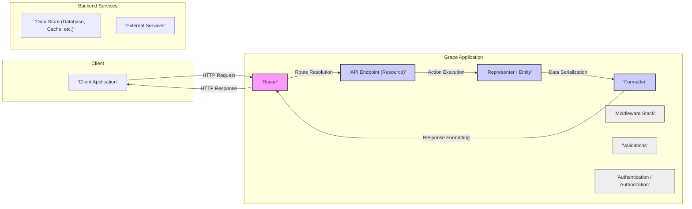
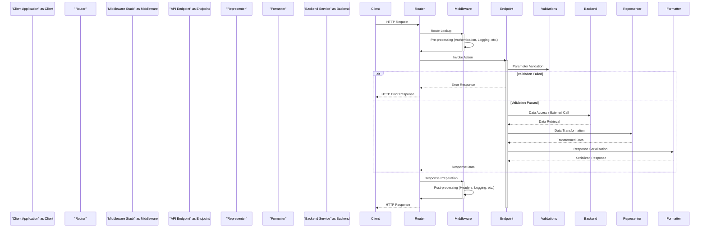

# Project Design Document: Grape API Framework

**Version:** 1.1
**Date:** October 26, 2023
**Prepared By:** AI Software Architect

## 1. Project Overview

This document provides an enhanced architectural design of the Grape API framework (as represented by the GitHub repository: https://github.com/ruby-grape/grape). This design will serve as the foundation for subsequent threat modeling activities. Grape is a lightweight, REST-like API micro-framework for Ruby, emphasizing convention over configuration to facilitate rapid API development.

## 2. Goals

*   Provide a clear and comprehensive architectural overview of the Grape framework, suitable for security analysis.
*   Precisely identify key components within the framework and detail their interactions and responsibilities.
*   Illustrate the end-to-end request/response lifecycle within a typical Grape application.
*   Highlight potential security vulnerabilities and attack surfaces based on the architectural design.
*   Serve as a robust and detailed basis for conducting thorough threat modeling exercises.

## 3. Target Audience

*   Security engineers and architects tasked with performing threat modeling on Grape-based applications.
*   Software developers utilizing the Grape framework who require a deeper understanding of its internal workings.
*   DevOps and operations teams responsible for deploying, managing, and securing Grape applications in production environments.

## 4. Scope

This document focuses on the intrinsic architectural components and the standard request lifecycle of the Grape framework. It specifically covers how Grape handles incoming requests and generates responses. The scope explicitly excludes:

*   Specific implementations of APIs built using the Grape framework.
*   Detailed functionality of external Ruby gems or libraries commonly integrated with Grape.
*   Specific deployment environments, infrastructure configurations, or platform-as-a-service (PaaS) details.
*   Granular, line-by-line code-level implementation details within the Grape framework's source code.

## 5. Architecture Overview

Grape employs a modular, layered architecture to process API requests. Key components collaborate to handle routing, request parsing, business logic execution, data transformation, and response generation.

## 6. Key Components

*   **Client Application:**  Any software application (e.g., web browser, mobile application, command-line tool, or another service) that initiates HTTP requests to interact with the Grape API.
*   **Router:** The core component responsible for receiving incoming HTTP requests and mapping them to the appropriate API endpoint based on the request's HTTP method (GET, POST, PUT, DELETE, etc.) and URL path.
*   **API Endpoint (Resource):** A specific, addressable unit of functionality within the API. It encapsulates the business logic required to handle requests for a particular resource or perform a specific action. Endpoints define the allowed HTTP methods and the code to be executed.
*   **Representer / Entity:**  A component that defines the structure and format of the data exchanged between the API and the client. It acts as a data transfer object (DTO), controlling how data is serialized for output and potentially deserialized for input. This helps in decoupling the internal data model from the API's public interface.
*   **Formatter:**  Responsible for converting the internal representation of the API's response data into a specific output format that the client can understand. Common formats include JSON, XML, and others. Grape allows for custom formatters.
*   **Middleware Stack:** An ordered collection of interceptors that process incoming HTTP requests before they reach the API endpoint and outgoing responses before they are sent to the client. Middleware components handle cross-cutting concerns such as logging, authentication, authorization, request/response modification, and error handling.
*   **Validations:** Defines rules and mechanisms for verifying the integrity and correctness of incoming request parameters. This ensures that the API receives valid data and helps prevent errors and security vulnerabilities.
*   **Authentication / Authorization:**  Mechanisms implemented to verify the identity of the client making the request (authentication) and to determine if the authenticated client has the necessary permissions to access the requested resource or perform the requested action (authorization). This can be implemented through various strategies within Grape or via middleware.
*   **Data Store:** The persistent storage mechanism used by the API to store and retrieve data. This could be a relational database, a NoSQL database, a caching layer, or other data storage solutions.
*   **External Services:**  Other independent services or APIs that the Grape application might need to interact with to fulfill a request.

## 7. Data Flow

The following sequence diagram illustrates the typical flow of an HTTP request through a Grape application:

**Detailed Steps:**

1. **Client Sends Request:** The client application initiates an HTTP request targeting a specific resource or action exposed by the Grape API.
2. **Router Receives Request:** The Grape router is the first point of contact within the application, receiving the incoming HTTP request.
3. **Route Lookup:** The router analyzes the request's HTTP method and path to determine the matching API endpoint definition.
4. **Middleware Pre-processing:** The request is passed through the configured middleware stack. Each middleware component in the stack can perform actions such as authentication, request logging, request modification, and setting up the environment.
5. **Endpoint Invocation:** Once the middleware stack has processed the request, the router invokes the corresponding action method within the identified API endpoint.
6. **Parameter Validation:** The API endpoint may perform validation on the request parameters to ensure data integrity and adherence to defined rules.
7. **Backend Interaction:** If the request requires data access or interaction with external systems, the endpoint logic interacts with the appropriate backend services (e.g., databases, other APIs).
8. **Data Transformation:** The data retrieved from the backend is often transformed using a representer or entity to shape the response data according to the API's contract.
9. **Response Serialization:** The transformed data is then serialized into the desired output format (e.g., JSON, XML) using the configured formatter.
10. **Middleware Post-processing:** The generated response is passed back through the middleware stack. Middleware components can perform actions like adding response headers, logging the response, and handling errors.
11. **Response Sent to Client:** Finally, the Grape application sends the formatted HTTP response back to the client application.

## 8. Security Considerations

Based on the architectural components and data flow, several potential security considerations arise:

*   **Input Validation Vulnerabilities:**
    *   Insufficient or improper validation of request parameters can lead to injection attacks (e.g., SQL injection, command injection, cross-site scripting).
    *   Lack of sanitization can allow malicious data to be processed by the application.
*   **Authentication and Authorization Flaws:**
    *   Weak or missing authentication mechanisms can allow unauthorized users to access the API.
    *   Improperly implemented authorization can lead to privilege escalation, where users can access resources they shouldn't.
    *   Insecure storage or transmission of authentication credentials.
*   **Middleware Security Risks:**
    *   Vulnerabilities in custom or third-party middleware components can introduce security flaws.
    *   Misconfigured middleware can expose sensitive information or bypass security controls.
*   **Output Encoding Issues:**
    *   Failure to properly encode output data can lead to cross-site scripting (XSS) vulnerabilities, allowing attackers to inject malicious scripts into the client's browser.
*   **Rate Limiting and Denial of Service:**
    *   Absence of rate limiting can make the API susceptible to denial-of-service (DoS) or distributed denial-of-service (DDoS) attacks.
*   **Logging and Monitoring Deficiencies:**
    *   Insufficient logging can hinder incident response, making it difficult to detect and analyze security breaches.
    *   Lack of monitoring can prevent the timely detection of malicious activity.
*   **Dependency Management Vulnerabilities:**
    *   Using outdated or vulnerable dependencies (including Grape itself and its dependencies) can introduce known security flaws.
*   **Error Handling and Information Disclosure:**
    *   Verbose error messages can leak sensitive information about the application's internal workings, aiding attackers.
*   **CORS Misconfiguration:**
    *   Incorrectly configured Cross-Origin Resource Sharing (CORS) policies can allow unauthorized websites to access the API, potentially leading to data breaches.
*   **Mass Assignment Exploits:**
    *   If not carefully controlled, allowing clients to set arbitrary model attributes can lead to unintended data modification or security vulnerabilities.

## 9. Deployment Considerations

Grape applications, being Rack-based, can be deployed in various Ruby web server environments and infrastructure setups. Security considerations during deployment include:

*   **Secure Web Server Configuration:** Ensuring the underlying web server (e.g., Puma, Unicorn) is configured securely, including appropriate security headers and resource limits.
*   **Network Security Measures:** Implementing firewalls, network segmentation, and intrusion detection/prevention systems to protect the API infrastructure.
*   **TLS/SSL Encryption:** Enforcing HTTPS for all API traffic to protect data in transit. Proper certificate management is crucial.
*   **Secrets Management:** Securely storing and managing sensitive credentials such as API keys, database passwords, and encryption keys, avoiding hardcoding them in the application. Consider using vault solutions or environment variables.
*   **Regular Security Audits and Penetration Testing:** Periodically assessing the deployed application and infrastructure for vulnerabilities.
*   **Container Security:** If deployed in containers (e.g., Docker), ensuring the container images are secure and regularly updated.
*   **Infrastructure as Code (IaC) Security:** If using IaC, ensuring the configurations are secure and follow security best practices.

## 10. Assumptions

*   The design assumes standard HTTP communication protocols are used.
*   The focus is on the core functionalities provided by the Grape framework itself.
*   Specific authentication and authorization implementations (e.g., OAuth 2.0, JWT) are considered within the scope of the "Authentication / Authorization" component, but their detailed implementation is not covered.
*   The document assumes a stateless API design where each request contains all the necessary information for processing.

## 11. Out of Scope

*   Specific code-level details within the Grape framework's implementation.
*   Comprehensive configuration options available within Grape.
*   Detailed performance tuning and optimization strategies for Grape applications.
*   Specific error handling logic implemented within user-defined API endpoints.
*   In-depth analysis of specific third-party Ruby gems commonly used in conjunction with Grape.
*   Detailed discussion of API versioning strategies within Grape.

This enhanced design document provides a more detailed and refined understanding of the Grape API framework's architecture, crucial for effective threat modeling. The identified components, data flow, and security considerations will serve as a solid foundation for analyzing potential attack vectors and security weaknesses in subsequent threat modeling sessions.