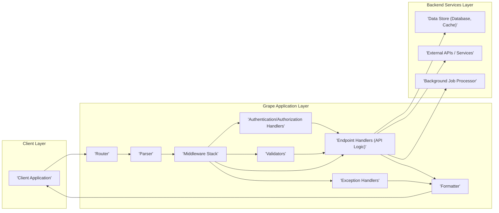
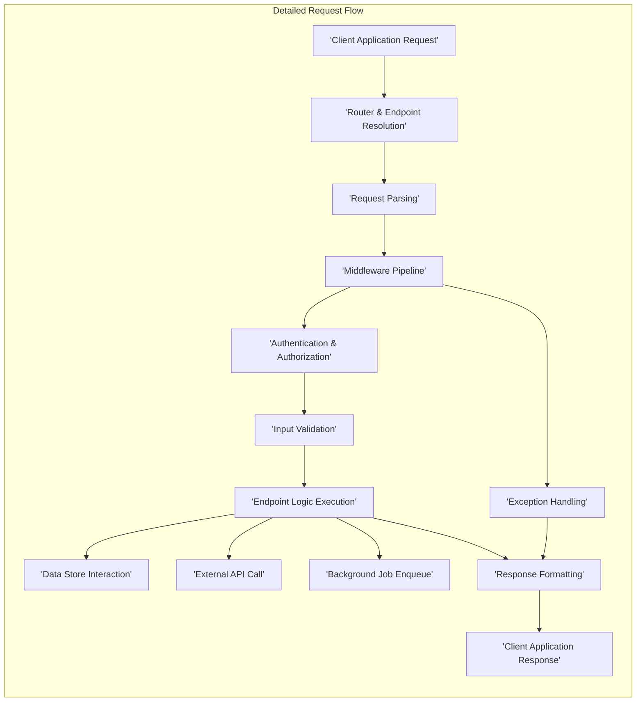

## Project Design Document: Ruby Grape Framework (Improved)

**1. Introduction**

This document provides an enhanced architectural design of a system leveraging the Ruby Grape framework (https://github.com/ruby-grape/grape). This detailed design serves as the foundation for subsequent threat modeling activities, offering a comprehensive view of the system's structure and interactions. Grape is a Ruby micro-framework designed for building REST-like APIs. Its focus on speed, convention, and ease of use makes it suitable for creating robust and well-defined API endpoints. This document outlines the typical architecture of an application built using Grape, emphasizing key components, data flows, and security-relevant aspects crucial for effective threat analysis.

**2. Goals and Objectives**

*   Provide a more granular and detailed definition of the architecture of a typical Grape-based application.
*   Clearly identify and describe the function of each key component and their interactions within the system.
*   Illustrate the complete data flow within the application, highlighting potential points of interest for security analysis.
*   Serve as a comprehensive and actionable resource for threat modeling exercises.
*   Specifically highlight potential security vulnerabilities and attack vectors within the described architecture.

**3. Target Audience**

*   Security engineers and architects responsible for conducting thorough threat modeling and security assessments.
*   Development teams involved in building, maintaining, and extending Grape-based applications.
*   Operations teams responsible for deploying, managing, and monitoring Grape application infrastructure.

**4. System Architecture**

A typical Grape application is structured in a layered manner, often deployed as a standalone service or integrated within a larger Ruby application ecosystem. The architecture emphasizes modularity and separation of concerns.

**5. Data Flow (Detailed Request Lifecycle)**

The journey of a request through a Grape application involves a series of well-defined steps, each presenting potential areas for security consideration.

*   **Request Origination:** A `'Client Application'` initiates an HTTP request (e.g., GET, POST, PUT, DELETE) targeting a specific endpoint of the Grape application.
*   **Routing and Endpoint Resolution:** The `'Router'` component receives the incoming request and analyzes the HTTP method and path to determine the appropriate `'Endpoint Handler'` responsible for processing the request.
*   **Request Parsing:** The `'Parser'` component examines the `Content-Type` header of the request and deserializes the request body into a usable data structure (e.g., JSON, XML, form data). This step is crucial for preventing injection attacks.
*   **Middleware Pipeline:** The request enters the `'Middleware Stack'`, a series of Rack middleware components executed in a defined order. Each middleware can inspect, modify, or short-circuit the request or response. Examples include:
    *   Logging middleware for auditing.
    *   Authentication middleware to verify the requester's identity.
    *   Authorization middleware to check if the requester has permission to access the resource.
    *   Request modification middleware to transform request data.
    *   Error handling middleware to catch and process exceptions.
*   **Authentication and Authorization Handling:**  Dedicated `'Authentication/Authorization Handlers'` (often implemented as middleware or within endpoint handlers) verify the requester's identity and permissions. This might involve checking API keys, validating JWTs, or interacting with an identity provider.
*   **Input Validation:** `'Validators'` are invoked to ensure that the request parameters and body conform to the expected format, data types, and constraints defined for the endpoint. This is essential for preventing data integrity issues and certain types of attacks.
*   **Endpoint Logic Execution:** The designated `'Endpoint Handler'` executes the core business logic associated with the requested API endpoint. This may involve:
    *   Interacting with the `'Data Store'` to retrieve or persist data.
    *   Making calls to `'External APIs / Services'` to integrate with other systems.
    *   Enqueueing tasks to the `'Background Job Processor'` for asynchronous processing.
*   **Response Formatting:** The `'Formatter'` component takes the data returned by the endpoint handler and serializes it into the format specified by the client's `Accept` header or a default format.
*   **Exception Handling:** If any errors or exceptions occur during the request processing, the `'Exception Handlers'` are invoked to gracefully handle the error and return an appropriate error response to the client.
*   **Response Delivery:** The formatted response is sent back to the `'Client Application'`.

**6. Components (Detailed Descriptions)**

*   **Router:**  The entry point for incoming requests. It matches the request path and HTTP method against defined routes to select the appropriate endpoint handler. Security considerations include route definition vulnerabilities (e.g., overly broad matching).
*   **Parser:** Responsible for deserializing the request body. Supports various formats (JSON, XML, etc.). Vulnerabilities can arise from insecure deserialization practices.
*   **Formatter:**  Serializes the response data into the desired format. Care must be taken to avoid leaking sensitive information during serialization.
*   **Middleware Stack:** A powerful mechanism for implementing cross-cutting concerns. Security-related middleware is crucial for authentication, authorization, logging, and request manipulation. Vulnerabilities can exist in custom or third-party middleware.
*   **Endpoint Handlers (API Logic):**  Contain the core business logic for each API endpoint. These handlers interact with data stores and external services. Security vulnerabilities within the application logic are a primary concern.
*   **Authentication/Authorization Handlers:** Responsible for verifying user identity and permissions. Common implementations involve API keys, OAuth 2.0, JWT, or session-based authentication. Secure implementation is critical.
*   **Validators:** Enforce constraints on incoming request data. Proper validation prevents data corruption and mitigates injection attacks.
*   **Exception Handlers:**  Provide a mechanism for gracefully handling errors and exceptions. Care should be taken to avoid leaking sensitive information in error responses.
*   **Data Store (Database, Cache):**  Persistent storage for application data. Security considerations include access control, encryption at rest and in transit, and protection against injection attacks.
*   **External APIs / Services:**  Third-party APIs or internal services that the Grape application interacts with. Secure communication and proper authentication/authorization are essential.
*   **Background Job Processor:** Handles asynchronous tasks. Security implications arise if sensitive data is processed or if job processing logic is vulnerable.

**7. Security Considerations (Specific and Actionable)**

This architecture presents several potential areas of security concern that should be addressed during threat modeling:

*   **Authentication and Authorization Vulnerabilities:**
    *   Weak or default credentials.
    *   Insecure storage or transmission of authentication tokens (e.g., API keys, JWTs).
    *   Bypassable authorization checks.
    *   Lack of proper session management or token revocation mechanisms.
*   **Input Validation and Injection Attacks:**
    *   Insufficient or missing input validation leading to SQL injection, NoSQL injection, command injection, and cross-site scripting (XSS).
    *   Failure to sanitize user-provided data before rendering in responses.
    *   Vulnerabilities in parsers leading to denial-of-service or code execution.
*   **Middleware Security Risks:**
    *   Vulnerabilities in custom or third-party middleware components.
    *   Misconfigured middleware that exposes sensitive information or introduces security flaws.
    *   Bypassing critical security middleware due to incorrect ordering.
*   **Data Handling and Storage Security:**
    *   Exposure of sensitive data in logs, error messages, or API responses.
    *   Insecure storage of sensitive data in databases or caches without encryption.
    *   Lack of encryption for data in transit (HTTPS).
    *   Insufficient access controls on data stores.
*   **API Abuse and Rate Limiting:**
    *   Absence of rate limiting mechanisms leading to denial-of-service attacks.
    *   Lack of protection against brute-force attacks on authentication endpoints.
    *   Vulnerability to API abuse through parameter manipulation or excessive requests.
*   **Dependency Management:**
    *   Using vulnerable versions of Grape or its dependencies.
    *   Lack of regular dependency updates and security patching.
*   **Error Handling and Information Disclosure:**
    *   Verbose error messages revealing sensitive information about the application's internal workings.
    *   Stack traces or debugging information exposed in production environments.
*   **Cross-Origin Resource Sharing (CORS):**
    *   Misconfigured CORS policies allowing unauthorized domains to access API resources.

**8. Technologies Used**

*   **Core Language:** Ruby
*   **API Framework:** Grape (version specific for threat modeling)
*   **Web Server Interface:** Rack
*   **Web Servers (Examples):** Puma, Unicorn, Thin
*   **Data Storage (Examples):** PostgreSQL, MySQL, MongoDB, Redis, Memcached (specific versions if relevant)
*   **Authentication/Authorization Libraries (Examples):** Devise, Doorkeeper, Warden, OmniAuth, JWT
*   **Validation Libraries (Examples):**  ActiveModel::Validations (if used outside Grape's built-in), dry-validation
*   **Testing Frameworks:** RSpec, Minitest

**9. Deployment Model**

Grape applications can be deployed in various configurations, each with its own security implications:

*   **Standalone Containerized Application:** Deployed as a Docker container or similar, offering isolation and portability. Security considerations include container image security and orchestration security.
*   **Mounted within a Larger Rack Application (e.g., Rails):** Integrated into an existing application. Security considerations include potential interactions and vulnerabilities within the larger application.
*   **Serverless Deployment (e.g., AWS Lambda, Google Cloud Functions):** Deployed as serverless functions. Security considerations include the security of the serverless platform and function configurations.
*   **Platform as a Service (PaaS):** Deployed on platforms like Heroku or AWS Elastic Beanstalk. Security considerations include the security of the PaaS environment.

**10. Assumptions and Constraints**

*   This design document represents a generalized architecture. Specific implementations may have variations.
*   The application is assumed to be accessible over a network, potentially the public internet.
*   Security best practices are intended to be followed throughout the development lifecycle, but this needs to be validated during threat modeling.
*   Specific security controls and configurations will vary depending on the application's requirements and deployment environment.

**11. Future Considerations**

*   Detailed diagrams illustrating component interactions and data flow for specific use cases.
*   In-depth analysis of authentication and authorization flows.
*   Specific security controls implemented at each layer of the architecture.
*   Logging, monitoring, and alerting mechanisms for security events.
*   Disaster recovery and business continuity planning.

This improved design document provides a more detailed and security-focused view of a typical Grape application architecture, offering a strong foundation for conducting thorough and effective threat modeling. By understanding the intricacies of the components, data flow, and potential vulnerabilities, security professionals can better identify and mitigate risks, ensuring the security and resilience of the application.
