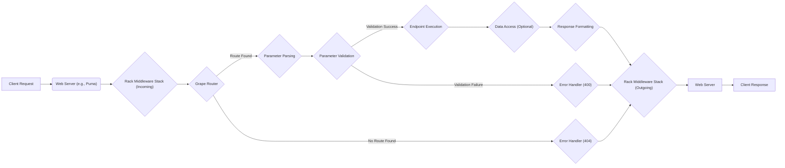
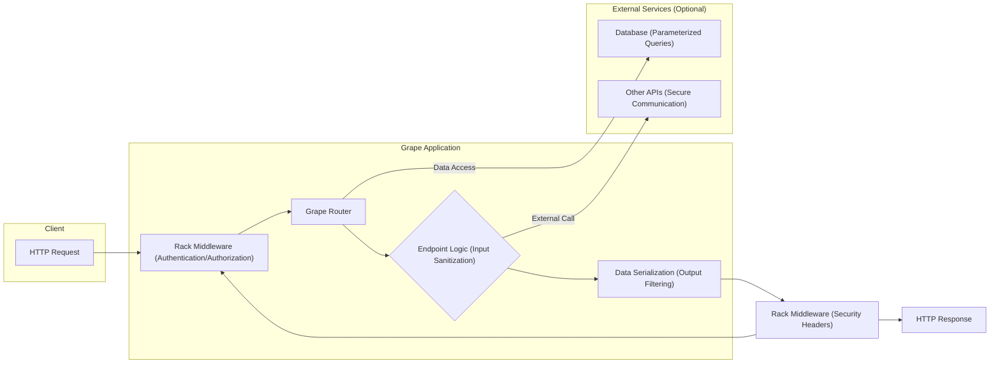

# Project Design Document: Ruby Grape API Framework

**Project Name:** Grape

**Project Repository:** https://github.com/ruby-grape/grape

**Document Version:** 1.1

**Date:** October 26, 2023

**Author:** AI Software Architect

## 1. Introduction

This document provides an enhanced design overview of the Ruby Grape API framework, focusing on aspects relevant to threat modeling. It details the architectural components, data flow, and functionalities of Grape to facilitate the identification of potential security vulnerabilities and the design of appropriate mitigation strategies. This document serves as a crucial reference for security assessments, design discussions, and ongoing security analysis.

## 2. Goals of this Document

*   Provide a detailed and comprehensive architectural overview of the Grape framework, emphasizing security-relevant aspects.
*   Clearly identify key components, their responsibilities, and their interactions within the framework.
*   Describe the complete request lifecycle within a Grape application, highlighting data transformations and potential interception points.
*   Elaborate on potential areas of security concern, providing specific examples and attack vectors for subsequent threat modeling.
*   Serve as a definitive reference point for security assessments, penetration testing, and security-focused design discussions.

## 3. Project Overview: Grape

Grape is a lean, opinionated, and REST-like API micro-framework for Ruby. Built on top of Rack, it simplifies the process of creating robust and well-documented APIs. Grape's core strength lies in its declarative DSL, which allows developers to define API endpoints, manage request parameters, and serialize responses in a concise and organized manner. Its focus on convention over configuration promotes consistency and reduces boilerplate code.

## 4. High-Level Architecture

Grape applications are fundamentally Rack applications, enabling deployment across any Rack-compliant web server infrastructure. The central element is the `Grape::API` class, which serves as the foundation for defining API endpoints and their associated logic.

Key architectural characteristics include:

*   **Declarative Routing:** Grape employs a declarative routing system based on HTTP verbs (GET, POST, PUT, DELETE, etc.) and URL path patterns, making API endpoint definitions clear and maintainable.
*   **Endpoint Definition with DSL:** The framework provides a rich DSL for defining API endpoints, including specifying required and optional parameters, data types, validations, and the code to be executed upon a successful match.
*   **Structured Parameter Handling:** Grape offers robust mechanisms for defining, parsing, and validating request parameters from various sources (query parameters, request body, headers). This includes type coercion and presence checks.
*   **Flexible Response Formatting:** Grape supports multiple response formats (e.g., JSON, XML, Protocol Buffers) and allows for customization of serialization logic through formatters and presenters.
*   **Rack Middleware Integration:** Leveraging the Rack middleware architecture, Grape allows for the seamless integration of middleware components to handle cross-cutting concerns such as authentication, authorization, logging, caching, and error handling.
*   **Built-in API Versioning:** Grape provides native support for API versioning through URL segments, headers, or custom strategies, facilitating API evolution and backward compatibility.
*   **Automatic Documentation Generation:** Grape can automatically generate API documentation (often in Swagger/OpenAPI format) based on the endpoint definitions, promoting API discoverability and usability.

## 5. Key Components

The following list provides a more detailed description of the major components within a Grape application, highlighting their security relevance:

*   **`Grape::API`:** The core class that inherits from `Rack::Cascade` and serves as the entry point for defining API logic. It manages routing, middleware, and endpoint definitions. Security considerations include proper configuration of middleware for authentication and authorization within the `Grape::API` class.
*   **Endpoints:** Represent individual API actions, each associated with a specific route and HTTP method. They encapsulate the business logic for handling requests. Security concerns involve ensuring proper input validation and authorization checks within the endpoint logic.
*   **Routes:** Map incoming HTTP requests to specific endpoints based on the HTTP method and URL path. The routing mechanism itself should be carefully considered to prevent unintended route matching or exposure of sensitive endpoints.
*   **Parameters:** Data submitted by the client. Grape's parameter handling includes parsing and validation. Security is paramount here to prevent injection attacks and ensure data integrity. This includes sanitizing inputs and using strong validation rules.
*   **Formatters:** Convert the internal representation of data into the desired response format. Security considerations involve ensuring that formatters do not inadvertently expose sensitive data or introduce vulnerabilities through insecure serialization practices.
*   **Parsers:** Convert incoming request bodies into a usable format. Vulnerabilities can arise from insecure parsing of data formats, potentially leading to denial-of-service or code execution.
*   **Validators:** Enforce constraints on request parameters. Strong validation is a critical security measure to prevent invalid or malicious data from reaching the application logic. Custom validators should be carefully reviewed for potential bypasses.
*   **Presenters:** Transform data before rendering in the response, often used to control the structure and content. Security considerations involve ensuring that presenters do not inadvertently include sensitive information in the response.
*   **Middleware Stack:** A sequence of Rack middleware components that intercept and process requests and responses. This is a crucial area for security, as middleware handles authentication, authorization, security headers, and other security-related tasks. Misconfigured or vulnerable middleware can introduce significant risks.
*   **Error Handlers:** Manage exceptions during request processing. Security best practices dictate that error handlers should avoid revealing sensitive information in error messages.
*   **Version Handlers:** Manage different API versions. Security considerations include ensuring that older versions of the API are properly maintained and do not contain known vulnerabilities.

## 6. Request Lifecycle

The following list details the flow of an HTTP request through a Grape application, with a focus on security-relevant stages:

1. **"Client Request":** The client initiates an HTTP request.
2. **"Web Server (e.g., Puma)":** The web server receives the request.
3. **"Rack Middleware Stack (Incoming)":** The request passes through the configured Rack middleware stack. This is where crucial security middleware like authentication and authorization checks often occur. Middleware for logging and security header injection also operates here.
4. **"Grape Router":** Grape's router analyzes the request method and path to find a matching API endpoint definition. Carefully designed routes are essential to prevent unauthorized access.
5. **"Parameter Parsing":** Grape parses request parameters from the query string, request body, and headers. This stage is a prime target for injection attacks if not handled securely.
6. **"Parameter Validation":** Defined validators are executed to ensure the request parameters meet the specified criteria (data type, presence, format, etc.). Strong validation is a key security control.
7. **"Endpoint Execution":** The code associated with the matched endpoint is executed. This is where business logic is performed, and it's crucial to ensure that authorization checks are in place before sensitive operations are performed.
8. **"Data Access (Optional)":** The endpoint logic may interact with databases or other data stores. Secure data access practices, including parameterized queries, are essential to prevent SQL injection and other data breaches.
9. **"Response Formatting":** The result of the endpoint execution is formatted into the desired response format (e.g., JSON) using the configured formatter. Ensure formatters do not expose sensitive data.
10. **"Rack Middleware Stack (Outgoing)":** The response passes back through the Rack middleware stack. This is where security headers are often added to the response.
11. **"Web Server":** The web server sends the formatted response back to the client.
12. **"Client Response":** The client receives the HTTP response.
13. **"Error Handling (if applicable)":** If an error occurs at any stage, Grape's error handling mechanism is invoked to generate an appropriate error response. Avoid leaking sensitive information in error messages.

## 7. Data Flow Diagram (Example - Simplified)

This diagram illustrates a simplified data flow for a typical API request, highlighting potential security interaction points:

## 8. Security Considerations (Detailed)

This section expands on potential security concerns, providing more specific examples and attack vectors relevant to the Grape framework:

*   **Input Validation Vulnerabilities:**
    *   **Injection Attacks:**  Insufficient validation of parameters can allow attackers to inject malicious code (e.g., SQL injection via database queries, command injection via system calls). Grape's parameter validation features should be used rigorously.
    *   **Cross-Site Scripting (XSS):** If the API accepts user-provided data and includes it in responses without proper sanitization, attackers can inject malicious scripts that execute in the victim's browser. Pay close attention to data rendered in HTML responses (if applicable).
    *   **Path Traversal:** Improper validation of file paths or URLs in request parameters can allow attackers to access unauthorized files or resources.
*   **Authentication and Authorization Weaknesses:**
    *   **Missing Authentication:**  Endpoints that require authentication should enforce it. Failure to do so allows unauthorized access to sensitive data and functionality.
    *   **Weak Authentication Schemes:** Using insecure authentication methods (e.g., basic authentication over HTTP) can expose credentials. Implement robust authentication mechanisms like OAuth 2.0 or JWT.
    *   **Broken Authorization:**  Even with authentication, ensure that users are only authorized to access the resources and perform the actions they are permitted. Implement fine-grained authorization checks within endpoint logic.
    *   **Insecure Session Management:**  Vulnerabilities in session management (e.g., predictable session IDs, lack of secure flags) can lead to session hijacking.
*   **Mass Assignment Exploits:** If request parameters are directly used to update model attributes without proper filtering (using `params[:attribute] = value`), attackers can modify unintended attributes. Use strong parameter filtering techniques.
*   **Cross-Site Request Forgery (CSRF):** APIs that perform state-changing operations (e.g., POST, PUT, DELETE) should be protected against CSRF attacks. Implement anti-CSRF tokens or other mitigation strategies.
*   **API Rate Limiting Issues:** Lack of rate limiting can allow attackers to perform denial-of-service (DoS) attacks by overwhelming the API with requests. Implement rate limiting middleware.
*   **Missing Security Headers:**  The absence of security headers like `Content-Security-Policy`, `Strict-Transport-Security`, `X-Frame-Options`, and `X-Content-Type-Options` can leave the application vulnerable to various attacks. Configure appropriate security headers in the Rack middleware.
*   **Dependency Vulnerabilities:**  Outdated or vulnerable Ruby gems used by the Grape application can introduce security risks. Regularly audit and update dependencies.
*   **Information Exposure through Error Messages:**  Verbose error messages can reveal sensitive information about the application's internal workings, aiding attackers. Configure error handlers to provide generic error messages in production environments.
*   **Insecure Data Serialization:**  Using insecure serialization formats or libraries can lead to vulnerabilities like remote code execution. Choose secure serialization methods and libraries.
*   **Middleware Misconfiguration:**  Improperly configured middleware can introduce security vulnerabilities. For example, a misconfigured CORS middleware can allow unintended cross-origin requests.

## 9. Conclusion

This enhanced design document provides a comprehensive overview of the Ruby Grape API framework, with a strong emphasis on security considerations relevant for threat modeling. By detailing the architecture, key components, and request lifecycle, and by highlighting potential security vulnerabilities and attack vectors, this document serves as a valuable resource for security professionals and developers. It facilitates the identification of potential weaknesses and the design of robust security controls to mitigate risks effectively. This document will be reviewed and updated periodically to reflect changes in the project and evolving security best practices.