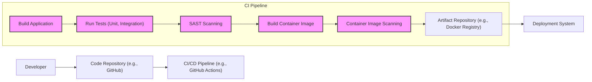

# BUSINESS POSTURE

The primary business priority for adopting Grape is to efficiently and effectively develop and maintain robust RESTful APIs. This framework aims to streamline API creation in Ruby, promoting developer productivity and API consistency. Businesses choose Grape to quickly deliver API-driven products and services, enabling integration with other systems and providing interfaces for clients (web, mobile, partners).

Key business goals include:
- Rapid API development and deployment.
- Consistent and well-structured API design.
- Simplified API maintenance and evolution.
- Integration with existing Ruby-based systems.
- Support for various API functionalities (versioning, documentation, authentication, etc.).

Most important business risks to address:
- Security vulnerabilities in APIs leading to data breaches or service disruption.
- Performance bottlenecks in APIs affecting user experience and system scalability.
- API design flaws causing integration issues and developer friction.
- Lack of API documentation hindering adoption and external integration.
- Dependency on the Grape framework and its community support.

# SECURITY POSTURE

Existing security controls:
- security control: Rack middleware for handling common web application security tasks (e.g., request forgery protection, session management). Implemented via Rack ecosystem and potentially custom middleware in Grape applications.
- security control: Ruby on Rails security features if Grape is used within a Rails application (e.g., parameter sanitization, content security policy). Implemented by Rails framework.
- security control: HTTPS for transport layer security. Typically configured at the web server or load balancer level.
- security control: Input validation within application logic. Implemented by developers in Grape API endpoints.
- security control: Authentication and authorization mechanisms implemented within Grape applications using gems like Warden, Devise, or custom solutions. Implemented by developers in Grape API endpoints and potentially Rack middleware.

Accepted risks:
- accepted risk: Reliance on developer expertise for secure coding practices within Grape applications.
- accepted risk: Potential vulnerabilities in Grape framework or its dependencies.
- accepted risk: Misconfiguration of underlying infrastructure (web servers, databases) leading to security weaknesses.
- accepted risk: Incomplete or inconsistent implementation of security controls across different APIs built with Grape.

Recommended security controls:
- security control: Implement automated security scanning (SAST/DAST) in the CI/CD pipeline for Grape applications.
- security control: Introduce API gateway for centralized security controls (authentication, authorization, rate limiting, threat detection).
- security control: Implement robust logging and monitoring for security events and anomalies in Grape APIs.
- security control: Conduct regular security audits and penetration testing of Grape-based APIs.
- security control: Enforce secure coding guidelines and training for developers working with Grape.

Security requirements:
- Authentication:
    - requirement: APIs must authenticate all incoming requests to verify the identity of the caller.
    - requirement: Support for industry-standard authentication protocols like OAuth 2.0 or JWT.
    - requirement: Secure storage of API keys or credentials if used.
- Authorization:
    - requirement: APIs must authorize access to resources based on the authenticated user's roles and permissions.
    - requirement: Implement fine-grained access control to restrict access to specific API endpoints and data.
    - requirement: Principle of least privilege should be applied to API access.
- Input Validation:
    - requirement: APIs must validate all incoming data to prevent injection attacks (SQL injection, XSS, command injection).
    - requirement: Use input validation libraries and frameworks to sanitize and validate user inputs.
    - requirement: Implement proper error handling for invalid inputs without revealing sensitive information.
- Cryptography:
    - requirement: Sensitive data at rest and in transit must be encrypted.
    - requirement: Use strong encryption algorithms and key management practices.
    - requirement: Protect cryptographic keys from unauthorized access.
    - requirement: Enforce HTTPS for all API communication.

# DESIGN

## C4 CONTEXT

```mermaid
flowchart LR
  subgraph "Company System"
    center["Grape API Framework"]
  end
  Consumer["API Consumer Application"]
  Developer["API Developer"]
  Database["Database System"]
  AuthService["Authentication Service"]

  Consumer -->> center : Uses API
  Developer -->> center : Develops and Maintains API
  center -->> Database : Persists and Retrieves Data
  center -->> AuthService : Authenticates API Requests

  style center fill:#f9f,stroke:#333,stroke-width:2px
```

Context Diagram Elements:

- Element:
    - Name: Grape API Framework
    - Type: Software System
    - Description: The Grape framework itself, used to build RESTful APIs. In the context diagram, it represents any API built using the Grape framework within the company system.
    - Responsibilities:
        - Define API endpoints and logic.
        - Handle API requests and responses.
        - Interact with backend systems (databases, services).
        - Enforce security controls (authentication, authorization, input validation).
    - Security controls:
        - Input validation implemented in API endpoints.
        - Authentication and authorization logic implemented in API endpoints or middleware.
        - HTTPS termination at the web server or load balancer level.

- Element:
    - Name: API Consumer Application
    - Type: Software System
    - Description: External or internal applications that consume the APIs built with the Grape framework.
    - Responsibilities:
        - Send requests to Grape APIs.
        - Process responses from Grape APIs.
        - Authenticate with Grape APIs if required.
    - Security controls:
        - Secure storage of API keys or credentials.
        - Proper handling of API responses and error codes.
        - Following API usage guidelines and rate limits.

- Element:
    - Name: API Developer
    - Type: Person
    - Description: Developers who use the Grape framework to build, maintain, and deploy APIs.
    - Responsibilities:
        - Design and implement API endpoints using Grape.
        - Write unit and integration tests.
        - Deploy and monitor APIs.
        - Implement security controls in APIs.
    - Security controls:
        - Secure coding practices.
        - Code reviews.
        - Adherence to security guidelines.

- Element:
    - Name: Database System
    - Type: Software System
    - Description: Backend database system used by the Grape API to store and retrieve data. Could be relational (PostgreSQL, MySQL) or NoSQL (MongoDB, Redis).
    - Responsibilities:
        - Persist data for the API.
        - Provide data access to the API.
        - Ensure data integrity and availability.
    - Security controls:
        - Database access controls (user permissions).
        - Database encryption at rest and in transit.
        - Regular database backups.
        - Database vulnerability scanning and patching.

- Element:
    - Name: Authentication Service
    - Type: Software System
    - Description: External or internal service responsible for authenticating API requests. Could be an OAuth 2.0 provider, JWT issuer, or a custom authentication service.
    - Responsibilities:
        - Verify user credentials.
        - Issue access tokens or credentials.
        - Manage user identities and roles.
    - Security controls:
        - Secure authentication protocols (OAuth 2.0, OpenID Connect).
        - Secure storage of user credentials.
        - Multi-factor authentication.
        - Rate limiting and brute-force protection.

## C4 CONTAINER

```mermaid
flowchart LR
  subgraph "Grape API Framework"
    RackApp["Rack Application (Grape API)"]
    WebServer["Web Server (e.g., Puma, Unicorn)"]
  end
  DatabaseClient["Database Client Library"]
  Logger["Logging Library"]
  AuthClient["Authentication Client Library"]

  WebServer -->> RackApp : Handles Requests
  RackApp -->> DatabaseClient : Data Access
  RackApp -->> Logger : Logging
  RackApp -->> AuthClient : Authentication

  style RackApp fill:#f9f,stroke:#333,stroke-width:2px
```

Container Diagram Elements:

- Element:
    - Name: Rack Application (Grape API)
    - Type: Application
    - Description: The core Grape application built using the framework. It handles API routing, request processing, business logic, and response generation. It's a Rack application, meaning it conforms to the Rack interface for Ruby web applications.
    - Responsibilities:
        - API endpoint routing and request handling.
        - Business logic execution.
        - Data validation and processing.
        - Interaction with backend services and databases.
        - Response generation.
        - Implementing API specific security logic (authorization, input validation).
    - Security controls:
        - Input validation logic within API endpoints.
        - Authorization logic within API endpoints or middleware.
        - Secure coding practices in application code.
        - Dependency vulnerability scanning.

- Element:
    - Name: Web Server (e.g., Puma, Unicorn)
    - Type: Web Server
    - Description: The web server that hosts and runs the Rack application. Common choices for Ruby applications include Puma, Unicorn, and Passenger. It handles incoming HTTP requests and passes them to the Rack application.
    - Responsibilities:
        - Accept incoming HTTP requests.
        - Route requests to the Rack application.
        - Manage application processes.
        - Serve static files (if any).
        - HTTPS termination.
    - Security controls:
        - HTTPS configuration and certificate management.
        - Web server hardening (disabling unnecessary features, security headers).
        - Rate limiting and connection limits.
        - Web server access logs.

- Element:
    - Name: Database Client Library
    - Type: Library
    - Description: A Ruby library used by the Grape application to interact with the database system. Examples include `pg` for PostgreSQL, `mysql2` for MySQL, `mongo` for MongoDB.
    - Responsibilities:
        - Establish connections to the database.
        - Execute database queries.
        - Handle database transactions.
        - Data serialization and deserialization.
    - Security controls:
        - Secure database connection configuration (credentials management).
        - Using parameterized queries to prevent SQL injection.
        - Keeping the client library up-to-date with security patches.

- Element:
    - Name: Logging Library
    - Type: Library
    - Description: A Ruby logging library used by the Grape application for logging events, errors, and security-related information. Examples include standard Ruby `Logger`, `lograge`, or specialized logging libraries.
    - Responsibilities:
        - Record application events and errors.
        - Log security-related events (authentication attempts, authorization failures).
        - Format logs for analysis.
        - Potentially send logs to a centralized logging system.
    - Security controls:
        - Secure logging configuration (preventing sensitive data in logs).
        - Log rotation and retention policies.
        - Integration with security monitoring systems.

- Element:
    - Name: Authentication Client Library
    - Type: Library
    - Description: A Ruby library used by the Grape application to interact with the Authentication Service. This could be an OAuth 2.0 client library, JWT library, or a custom client for a specific authentication service.
    - Responsibilities:
        - Communicate with the Authentication Service.
        - Handle authentication requests and responses.
        - Verify access tokens or credentials.
        - Manage authentication sessions (if applicable).
    - Security controls:
        - Secure storage and handling of authentication credentials.
        - Secure communication with the Authentication Service (HTTPS).
        - Proper validation of authentication responses.

## DEPLOYMENT

Deployment Solution: Cloud-based Containerized Deployment (e.g., AWS ECS, Google Kubernetes Engine, Azure Kubernetes Service)

```mermaid
flowchart LR
  subgraph "Cloud Environment (e.g., AWS)"
    subgraph "Container Orchestration Service (e.g., ECS)"
      subgraph "Cluster"
        subgraph "Availability Zone 1"
          ContainerInstance1["Container Instance"]
          Container1["Container: Grape API + Web Server"]
        end
        subgraph "Availability Zone 2"
          ContainerInstance2["Container Instance"]
          Container2["Container: Grape API + Web Server"]
        end
      end
      LoadBalancer["Load Balancer"]
    end
    DatabaseService["Managed Database Service (e.g., RDS)"]
    LoggingService["Centralized Logging Service (e.g., CloudWatch)"]
    AuthServiceManaged["Managed Authentication Service (e.g., Cognito)"]
  end
  Internet["Internet"]

  Internet -->> LoadBalancer : HTTPS Requests
  LoadBalancer -->> Container1 & Container2 : Distributes Requests
  Container1 & Container2 -->> DatabaseService : Data Access
  Container1 & Container2 -->> LoggingService : Logs
  Container1 & Container2 -->> AuthServiceManaged : Authentication

  ContainerInstance1 -->> Container1
  ContainerInstance2 -->> Container2

  style Container1 fill:#f9f,stroke:#333,stroke-width:2px
  style Container2 fill:#f9f,stroke:#333,stroke-width:2px
```

Deployment Diagram Elements:

- Element:
    - Name: Container Instance
    - Type: Infrastructure (Compute Instance)
    - Description: Virtual machines or physical servers within the cloud environment that run containers. Managed by the container orchestration service.
    - Responsibilities:
        - Provide compute resources for containers.
        - Run and manage containers.
        - Network connectivity for containers.
    - Security controls:
        - Operating system hardening.
        - Security patching.
        - Instance-level firewalls.
        - Access control to instances.

- Element:
    - Name: Container: Grape API + Web Server
    - Type: Container
    - Description: Docker container packaging the Grape API application and a web server (e.g., Puma). Multiple instances of this container are deployed for scalability and availability.
    - Responsibilities:
        - Run the Grape API application.
        - Serve API requests.
        - Application-level logging.
    - Security controls:
        - Container image vulnerability scanning.
        - Principle of least privilege for container processes.
        - Resource limits for containers.
        - Network policies to restrict container communication.

- Element:
    - Name: Load Balancer
    - Type: Network Service
    - Description: Distributes incoming API requests across multiple container instances. Provides high availability and scalability. Also handles HTTPS termination.
    - Responsibilities:
        - Distribute traffic to backend containers.
        - HTTPS termination and certificate management.
        - Health checks for backend containers.
        - Rate limiting and DDoS protection (potentially).
    - Security controls:
        - HTTPS configuration and certificate management.
        - Load balancer access logs.
        - Web Application Firewall (WAF) integration (optional).

- Element:
    - Name: Managed Database Service (e.g., RDS)
    - Type: Data Service
    - Description: Cloud provider's managed database service, simplifying database administration and providing scalability and high availability.
    - Responsibilities:
        - Data persistence and management.
        - Database backups and recovery.
        - Database scaling and performance.
    - Security controls:
        - Database access controls (IAM roles, security groups).
        - Database encryption at rest and in transit.
        - Database audit logging.
        - Database vulnerability scanning and patching managed by the cloud provider.

- Element:
    - Name: Centralized Logging Service (e.g., CloudWatch)
    - Type: Logging Service
    - Description: Cloud provider's centralized logging service for collecting, storing, and analyzing logs from containers and other services.
    - Responsibilities:
        - Aggregate logs from different sources.
        - Log storage and retention.
        - Log analysis and monitoring.
    - Security controls:
        - Access control to logs.
        - Secure log storage.
        - Log integrity and audit trails.

- Element:
    - Name: Managed Authentication Service (e.g., Cognito)
    - Type: Authentication Service
    - Description: Cloud provider's managed authentication service for user authentication and authorization.
    - Responsibilities:
        - User identity management.
        - Authentication and authorization.
        - Token issuance and management.
    - Security controls:
        - Secure authentication protocols (OAuth 2.0, OpenID Connect).
        - Multi-factor authentication.
        - Compliance certifications (e.g., SOC 2, GDPR).

## BUILD



Build Process Description:

1. Developer: Developers write code for the Grape API and commit changes to a code repository.
2. Code Repository (e.g., GitHub): Source code is stored and version controlled in a repository like GitHub.
3. CI/CD Pipeline (e.g., GitHub Actions): Automated CI/CD pipeline is triggered on code changes (e.g., push, pull request).
4. Build Application: The pipeline starts by building the Grape application, resolving dependencies, and compiling code if necessary.
5. Run Tests (Unit, Integration): Automated tests (unit and integration tests) are executed to ensure code quality and functionality.
6. SAST Scanning: Static Application Security Testing (SAST) tools are used to scan the source code for potential security vulnerabilities.
7. Build Container Image: A Docker container image is built, packaging the Grape application, web server, and necessary dependencies.
8. Container Image Scanning: The container image is scanned for vulnerabilities using container image scanning tools.
9. Artifact Repository (e.g., Docker Registry): The built and scanned container image is pushed to an artifact repository (like Docker Registry or a cloud provider's container registry).
10. Deployment System: The deployment system pulls the container image from the artifact repository and deploys it to the target environment (e.g., container orchestration service).

Security Controls in Build Process:

- security control: Code Repository Access Control: Restrict access to the code repository to authorized developers.
- security control: Code Reviews: Implement mandatory code reviews to identify potential security flaws before code is merged.
- security control: Automated Testing: Comprehensive automated tests to catch functional and security regressions early.
- security control: SAST Scanning: Static Application Security Testing to identify vulnerabilities in source code.
- security control: Dependency Scanning: Scan dependencies for known vulnerabilities.
- security control: Container Image Scanning: Scan container images for vulnerabilities in base images and application dependencies.
- security control: Artifact Repository Access Control: Secure access to the artifact repository to prevent unauthorized image access or modification.
- security control: Immutable Infrastructure: Build immutable container images to ensure consistency and prevent runtime modifications.
- security control: CI/CD Pipeline Security: Secure the CI/CD pipeline infrastructure and access controls.

# RISK ASSESSMENT

Critical business processes we are trying to protect:
- API Availability: Ensuring the API is available to consumers for business operations.
- Data Integrity: Protecting the integrity of data accessed and manipulated through the API.
- Data Confidentiality: Protecting sensitive data from unauthorized access through the API.
- Authentication and Authorization: Ensuring only authorized users and applications can access specific API resources and functionalities.

Data we are trying to protect and their sensitivity:
- User Data: Personally identifiable information (PII), user credentials. Sensitivity: High. Requires strong confidentiality and integrity protection due to privacy regulations and potential harm from breaches.
- Transaction Data: Financial transactions, order details, payment information. Sensitivity: High. Requires strong confidentiality, integrity, and availability due to financial and legal implications.
- Application Data: Business-specific data managed by the API. Sensitivity: Medium to High (depending on the nature of the data). Requires confidentiality and integrity protection to maintain business operations and competitive advantage.
- API Keys/Secrets: Credentials used for authentication and authorization. Sensitivity: Critical. Requires extreme confidentiality protection as compromise can lead to unauthorized access to the entire API.
- Logs: Application and security logs. Sensitivity: Medium. Requires integrity and confidentiality protection to ensure auditability and prevent tampering.

# QUESTIONS & ASSUMPTIONS

Questions:
- What type of data will be handled by APIs built with Grape? (e.g., PII, financial data, application-specific data).
- What are the specific authentication and authorization requirements for these APIs?
- Are there any compliance requirements (e.g., GDPR, HIPAA, PCI DSS) that need to be considered?
- What is the expected scale and performance requirements for the APIs?
- Are there any existing security policies or standards within the organization that need to be followed?

Assumptions:
- BUSINESS POSTURE: The primary goal is to build and deploy APIs quickly and efficiently to support business needs. Security is important but should not significantly hinder development speed.
- SECURITY POSTURE: Basic security controls like HTTPS and input validation are expected to be in place. However, more advanced security measures like API gateways, automated security scanning, and centralized logging might be lacking and are recommended.
- DESIGN: APIs will be deployed in a cloud environment using containers for scalability and resilience. A managed database service and authentication service will be utilized to reduce operational overhead. The build process will be automated using CI/CD pipelines with basic security checks.