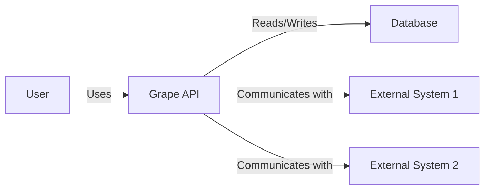
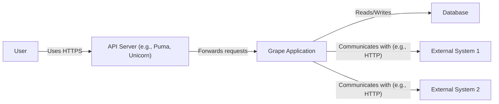
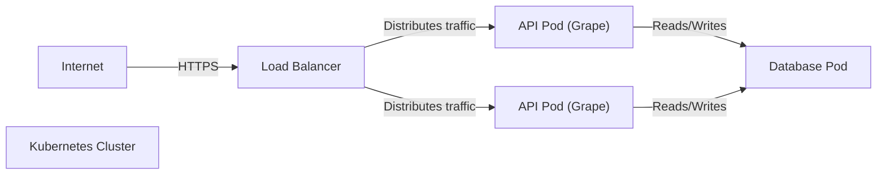
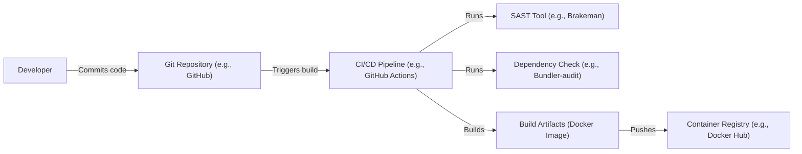

Okay, let's create a design document for the Grape framework, suitable for later threat modeling.

# BUSINESS POSTURE

Grape is a REST-like API framework for Ruby. It's designed to be a lightweight and opinionated way to create APIs, either on top of existing Ruby web frameworks (like Rails or Sinatra) or standalone.

Business Priorities:

*   Enable rapid API development: Grape's primary goal is to allow developers to quickly build and deploy APIs, reducing development time and cost.
*   Maintainability and Readability: Grape emphasizes clean, well-structured API code that is easy to understand and maintain.
*   Flexibility: Grape should be adaptable to various use cases, from simple microservices to more complex API integrations.
*   Performance: APIs built with Grape should be performant enough to handle expected traffic loads.
*   Integration: Grape should integrate well with existing Ruby ecosystems and tools.

Business Goals:

*   Provide a stable and reliable framework for building APIs.
*   Attract and retain a community of users and contributors.
*   Be a preferred choice for Ruby developers creating APIs.

Most Important Business Risks:

*   Security vulnerabilities in the framework could lead to data breaches or service disruptions for applications using Grape.
*   Lack of maintainability or poor performance could lead to increased development costs and user dissatisfaction.
*   Inability to adapt to evolving API standards or technologies could make Grape obsolete.
*   Lack of community support could hinder the framework's growth and long-term viability.
*   Compatibility issues with other Ruby libraries or frameworks could limit Grape's adoption.

# SECURITY POSTURE

Existing Security Controls:

*   security control: Grape provides built-in support for common API security features, such as parameter validation, type coercion, and authentication helpers. (Described in Grape documentation and source code).
*   security control: Grape encourages the use of secure coding practices by design, such as separating API logic from presentation and data access. (Described in Grape documentation and examples).
*   security control: Grape's modular design allows developers to easily integrate with existing security libraries and tools, such as authentication gems (e.g., Devise, OAuth) and authorization libraries (e.g., CanCanCan, Pundit). (Described in Grape documentation and community resources).
*   security control: Grape's documentation includes sections on security best practices, such as input validation, authentication, and authorization. (Described in Grape documentation).

Accepted Risks:

*   accepted risk: Grape relies on the underlying Ruby web framework (e.g., Rails, Sinatra) for some security features, such as session management and CSRF protection.  The security of these features is dependent on the configuration and maintenance of the underlying framework.
*   accepted risk: Grape's flexibility means that developers can choose to implement security features in various ways.  Incorrect or incomplete implementations could lead to vulnerabilities.
*   accepted risk: Grape's reliance on external gems and libraries for some security features introduces a dependency on the security of those third-party components.

Recommended Security Controls:

*   security control: Implement robust input validation and sanitization for all API endpoints, using Grape's built-in features and potentially additional validation libraries.
*   security control: Enforce strong authentication and authorization mechanisms for all API endpoints, using appropriate authentication protocols (e.g., OAuth 2.0, JWT) and authorization libraries.
*   security control: Implement rate limiting and throttling to protect against denial-of-service attacks.
*   security control: Regularly update Grape and all its dependencies to patch security vulnerabilities.
*   security control: Conduct regular security audits and penetration testing of applications built with Grape.
*   security control: Implement logging and monitoring to detect and respond to security incidents.
*   security control: Use HTTPS for all API communication.
*   security control: Implement Content Security Policy (CSP) headers to mitigate cross-site scripting (XSS) attacks.
*   security control: Implement appropriate CORS (Cross-Origin Resource Sharing) configuration to restrict access to the API from unauthorized origins.

Security Requirements:

*   Authentication:
    *   All API endpoints must require authentication, except for explicitly designated public endpoints.
    *   Support for standard authentication protocols (e.g., OAuth 2.0, JWT) should be provided.
    *   Authentication tokens should have a limited lifespan and be securely stored.
*   Authorization:
    *   Access to API resources must be controlled based on user roles and permissions.
    *   An authorization mechanism (e.g., role-based access control) should be implemented.
    *   Authorization rules should be clearly defined and enforced.
*   Input Validation:
    *   All API inputs must be validated against a predefined schema.
    *   Input validation should check for data type, format, length, and allowed values.
    *   Invalid inputs should be rejected with appropriate error messages.
*   Cryptography:
    *   Sensitive data (e.g., passwords, API keys) must be stored securely using strong encryption algorithms.
    *   All API communication must be encrypted using HTTPS.
    *   Cryptographic keys must be managed securely.

# DESIGN

## C4 CONTEXT

Element Descriptions:

*   Element:
    *   Name: User
    *   Type: Person
    *   Description: A user of the API, which could be a human user interacting through a web or mobile application, or another system.
    *   Responsibilities: Sends requests to the Grape API and receives responses.
    *   Security controls: Authentication and authorization mechanisms (e.g., OAuth 2.0, JWT) are used to verify the user's identity and permissions.

*   Element:
    *   Name: Grape API
    *   Type: Software System
    *   Description: The API built using the Grape framework.
    *   Responsibilities: Handles incoming requests, processes data, interacts with other systems, and returns responses.
    *   Security controls: Input validation, authentication, authorization, rate limiting, logging, and monitoring.

*   Element:
    *   Name: External System 1
    *   Type: Software System
    *   Description: An external system that the Grape API interacts with, such as a third-party service or another internal system.
    *   Responsibilities: Provides specific functionality or data to the Grape API.
    *   Security controls: Secure communication channels (e.g., HTTPS), API keys, or other authentication mechanisms.

*   Element:
    *   Name: External System 2
    *   Type: Software System
    *   Description: Another external system that the Grape API interacts with.
    *   Responsibilities: Provides specific functionality or data to the Grape API.
    *   Security controls: Secure communication channels (e.g., HTTPS), API keys, or other authentication mechanisms.

*   Element:
    *   Name: Database
    *   Type: Software System
    *   Description: A database used by the Grape API to store and retrieve data.
    *   Responsibilities: Stores and manages data for the API.
    *   Security controls: Database access controls, encryption of sensitive data, regular backups, and security audits.

## C4 CONTAINER

Element Descriptions:

*   Element:
    *   Name: User
    *   Type: Person
    *   Description: A user of the API.
    *   Responsibilities: Sends requests to the API and receives responses.
    *   Security controls: Authentication and authorization mechanisms.

*   Element:
    *   Name: API Server (e.g., Puma, Unicorn)
    *   Type: Container (Web Server)
    *   Description: A web server that hosts the Grape application.
    *   Responsibilities: Receives incoming requests and forwards them to the Grape application.
    *   Security controls: HTTPS configuration, request filtering, and potentially a web application firewall (WAF).

*   Element:
    *   Name: Grape Application
    *   Type: Container (Ruby Application)
    *   Description: The core API application built using the Grape framework.
    *   Responsibilities: Handles API requests, processes data, interacts with other systems, and returns responses.
    *   Security controls: Input validation, authentication, authorization, rate limiting, logging, and monitoring.

*   Element:
    *   Name: External System 1
    *   Type: Software System
    *   Description: An external system that the Grape API interacts with.
    *   Responsibilities: Provides specific functionality or data to the Grape API.
    *   Security controls: Secure communication channels, API keys, or other authentication mechanisms.

*   Element:
    *   Name: External System 2
    *   Type: Software System
    *   Description: Another external system that the Grape API interacts with.
    *   Responsibilities: Provides specific functionality or data to the Grape API.
    *   Security controls: Secure communication channels, API keys, or other authentication mechanisms.

*   Element:
    *   Name: Database
    *   Type: Container (Database)
    *   Description: A database used by the Grape API.
    *   Responsibilities: Stores and manages data for the API.
    *   Security controls: Database access controls, encryption of sensitive data, regular backups, and security audits.

## DEPLOYMENT

Possible Deployment Solutions:

1.  Traditional Server Deployment (e.g., using Capistrano, Mina, or similar tools)
2.  Containerized Deployment (e.g., using Docker and Kubernetes)
3.  Platform-as-a-Service (PaaS) Deployment (e.g., using Heroku, AWS Elastic Beanstalk)
4.  Serverless Deployment (e.g., using AWS Lambda, Google Cloud Functions)

Chosen Solution: Containerized Deployment (Docker and Kubernetes)

Element Descriptions:

*    Element:
    *   Name: Internet
    *   Type: External
    *   Description: The public internet.
    *   Responsibilities: Source of incoming requests.
    *   Security controls: Firewall, intrusion detection/prevention systems.

*    Element:
    *   Name: Load Balancer
    *   Type: Infrastructure Node
    *   Description: Distributes incoming traffic across multiple API pods.
    *   Responsibilities: Load balancing, SSL termination.
    *   Security controls: HTTPS configuration, DDoS protection.

*    Element:
    *   Name: Kubernetes Cluster
    *   Type: Infrastructure Node
    *   Description: A cluster of nodes managed by Kubernetes.
    *   Responsibilities: Orchestrates containers, manages resources, and ensures high availability.
    *   Security controls: Kubernetes network policies, role-based access control (RBAC), pod security policies.

*    Element:
    *   Name: API Pod (Grape)
    *   Type: Container Instance
    *   Description: A pod running the Grape API application within a Docker container.
    *   Responsibilities: Handles API requests.
    *   Security controls: Container image security scanning, resource limits, and network isolation.

*    Element:
    *   Name: Database Pod
    *   Type: Container Instance
    *   Description: A pod running the database within a Docker container.
    *   Responsibilities: Stores and manages data.
    *   Security controls: Database access controls, encryption, and regular backups.

## BUILD

Build Process Description:

1.  Developer commits code to the Git repository.
2.  The commit triggers a build in the CI/CD pipeline (e.g., GitHub Actions, Jenkins).
3.  The CI/CD pipeline runs a SAST (Static Application Security Testing) tool (e.g., Brakeman for Ruby) to analyze the code for security vulnerabilities.
4.  The CI/CD pipeline runs a dependency check tool (e.g., Bundler-audit) to identify known vulnerabilities in project dependencies.
5.  If the SAST and dependency checks pass, the CI/CD pipeline builds the application and creates a Docker image.
6.  The Docker image is pushed to a container registry (e.g., Docker Hub, AWS ECR).

Security Controls:

*   security control: SAST tool (e.g., Brakeman) is used to identify security vulnerabilities in the code during the build process.
*   security control: Dependency check tool (e.g., Bundler-audit) is used to identify known vulnerabilities in project dependencies.
*   security control: The CI/CD pipeline is configured to fail the build if any security vulnerabilities are detected.
*   security control: The Docker image is built using a secure base image and follows best practices for container security.
*   security control: Access to the container registry is restricted using authentication and authorization.
*   security control: Build process is automated using CI/CD pipeline.

# RISK ASSESSMENT

Critical Business Processes:

*   API request handling: The core process of receiving, processing, and responding to API requests.
*   Data storage and retrieval: The process of storing and retrieving data from the database.
*   Integration with external systems: The process of communicating with external services and systems.

Data to Protect and Sensitivity:

*   User data (e.g., usernames, email addresses, passwords): Highly sensitive. Requires strong encryption and access controls.
*   API keys and authentication tokens: Highly sensitive. Requires secure storage and management.
*   Application data (depending on the specific application): Varies in sensitivity. Requires appropriate protection based on the data's classification.
*   Configuration data (e.g., database credentials): Highly sensitive. Requires secure storage and access controls.

# QUESTIONS & ASSUMPTIONS

Questions:

*   What are the specific external systems that Grape APIs built by the company will integrate with?
*   What is the expected traffic volume and load for Grape APIs?
*   What are the specific regulatory compliance requirements (e.g., GDPR, HIPAA, PCI DSS) that apply to Grape APIs?
*   What is the company's existing infrastructure and deployment environment?
*   What is the company's existing security tooling and processes?
*   What level of access will developers have to production environments?
*   What are the specific data retention policies for the data handled by the API?

Assumptions:

*   BUSINESS POSTURE: The company prioritizes rapid development and deployment of APIs, but also recognizes the importance of security.
*   SECURITY POSTURE: The company has some basic security controls in place, but there is room for improvement. The company is willing to invest in additional security measures.
*   DESIGN: The Grape API will be deployed in a containerized environment using Docker and Kubernetes. The API will interact with a database and potentially other external systems. The build process will be automated using a CI/CD pipeline.