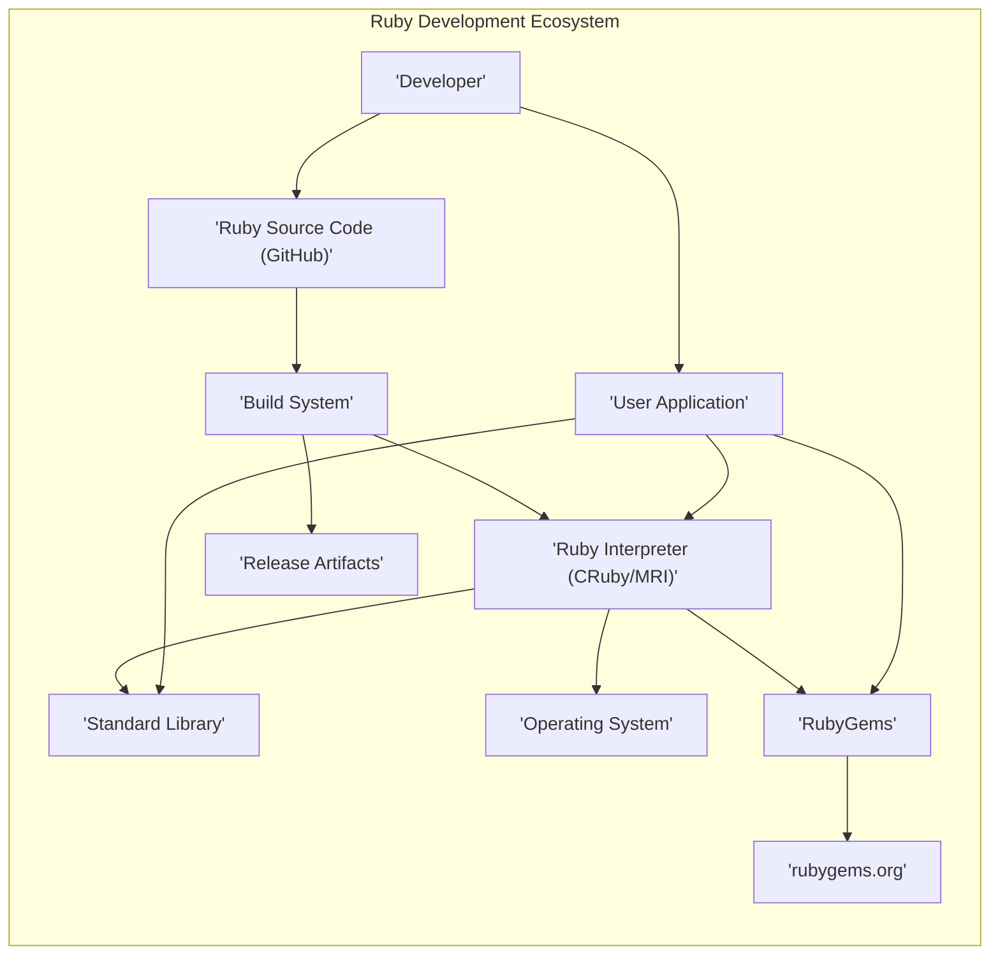
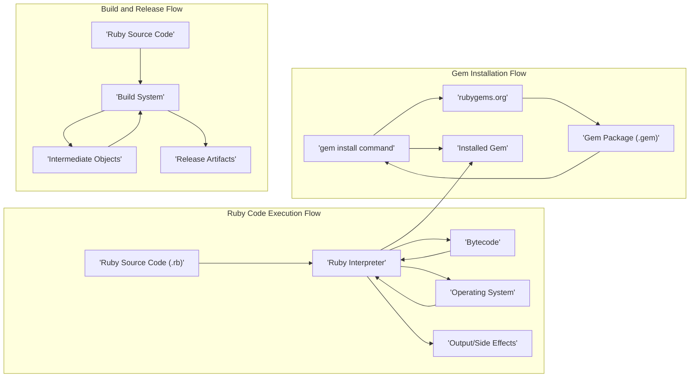

# Project Design Document: Ruby Programming Language

**Version:** 1.1
**Date:** October 26, 2023
**Prepared By:** Gemini (AI Language Model)

## 1. Introduction

This document provides a detailed architectural design of the Ruby programming language project, specifically tailored for threat modeling activities. It focuses on the codebase hosted at [https://github.com/ruby/ruby](https://github.com/ruby/ruby) and aims to provide a comprehensive understanding of the system's components, interactions, and data flows from a security perspective. This document will serve as the foundation for identifying potential security vulnerabilities and attack vectors within the Ruby ecosystem.

## 2. Goals

*   Provide a clear, detailed, and security-focused overview of the Ruby project's architecture.
*   Identify the major components and their specific responsibilities relevant to security.
*   Describe the key data flows within the system, highlighting potential security implications.
*   Elaborate on initial security considerations and potential attack surfaces for each component.
*   Establish a robust and shared understanding of the system's architecture to facilitate effective threat modeling exercises.

## 3. Scope

This document focuses on the core components of the Ruby programming language as represented in the `ruby/ruby` repository. This includes:

*   The Ruby interpreter (CRuby/MRI), encompassing its core execution engine and virtual machine.
*   The standard library, including its modules and their interactions with the interpreter and the operating system.
*   The core language features and syntax, with an emphasis on features that might introduce security vulnerabilities if misused.
*   The build and release process, from source code to distributable artifacts.
*   The interaction with the underlying operating system, including system calls and resource management.
*   The RubyGems package manager and its integration with the Ruby ecosystem.
*   The infrastructure hosting the repository and related development services.

This document does *not* cover:

*   Third-party Ruby libraries and frameworks beyond the standard library.
*   Specific applications built using Ruby (the focus is on the language itself).
*   In-depth implementation details of individual functions or modules (the focus is on architectural components).
*   The historical evolution of the Ruby language beyond its current architecture.
*   Performance benchmarking or optimization aspects, unless directly related to security vulnerabilities (e.g., denial of service).

## 4. System Overview

The Ruby project centers around the development and maintenance of the Ruby programming language. The core is the CRuby/MRI interpreter, responsible for executing Ruby code. The standard library extends the interpreter's capabilities with essential modules. The build system transforms the source code into usable binaries. RubyGems facilitates the distribution and management of external libraries. The project's development is managed through the `ruby/ruby` GitHub repository.

## 5. Component Breakdown

This section provides a detailed breakdown of the major components of the Ruby project, with a focus on their security implications.

*   **Ruby Interpreter (CRuby/MRI):**
    *   **Description:** The central execution engine for Ruby code. It handles parsing, compilation to bytecode (YARV), and execution.
    *   **Responsibilities:**
        *   Lexical analysis and parsing of Ruby source code.
        *   Compilation of Ruby code into bytecode instructions.
        *   Execution of bytecode within the Ruby Virtual Machine.
        *   Management of memory allocation and garbage collection.
        *   Interface with the underlying operating system through system calls.
        *   Handling of exceptions and error conditions during execution.
        *   Implementation of core language features like objects, classes, and methods.
    *   **Security Considerations:**
        *   **Memory Corruption Vulnerabilities:** Buffer overflows, use-after-free errors, and other memory management issues in the C codebase can lead to arbitrary code execution.
        *   **Integer Overflows/Underflows:**  Potential for arithmetic errors leading to unexpected behavior or vulnerabilities.
        *   **Denial of Service (DoS):**  Bugs or resource exhaustion issues that can crash the interpreter or make it unresponsive.
        *   **Security Bypass:**  Flaws in the interpreter's logic that could allow bypassing security restrictions.
        *   **Information Disclosure:**  Bugs that could expose sensitive information from memory or the environment.

*   **Standard Library:**
    *   **Description:** A collection of modules and classes providing essential functionalities for Ruby programs.
    *   **Responsibilities:**
        *   Providing reusable modules for common tasks (e.g., networking, file I/O, data manipulation).
        *   Abstracting operating system functionalities for cross-platform compatibility.
        *   Implementing common programming patterns and utilities.
    *   **Security Considerations:**
        *   **Path Traversal Vulnerabilities:**  Flaws in file I/O modules allowing access to unauthorized files or directories.
        *   **Command Injection:**  Improper sanitization of input passed to system commands.
        *   **Cross-Site Scripting (XSS) Vulnerabilities:**  In modules that generate web content.
        *   **SQL Injection Vulnerabilities:** In database interaction modules.
        *   **Denial of Service (DoS):**  Vulnerabilities in network or resource-intensive modules.
        *   **Insecure Deserialization:**  Flaws in modules handling object serialization.
        *   **Vulnerabilities in Cryptographic Implementations:**  Weak or incorrect usage of cryptographic primitives.

*   **Core Language Features:**
    *   **Description:** The fundamental syntax and semantics of the Ruby language.
    *   **Responsibilities:** Defining how Ruby code is structured, interpreted, and executed.
    *   **Security Considerations:**
        *   **Metaprogramming Abuse:**  Powerful metaprogramming features, if misused, can bypass security mechanisms or introduce unexpected behavior.
        *   **Object Model Vulnerabilities:**  Potential flaws in how objects and their interactions are handled.
        *   **Code Injection through `eval` and similar methods:**  Unsafe use of dynamic code execution can introduce significant risks.
        *   **Inheritance and Polymorphism Issues:**  Unexpected behavior or security flaws arising from complex inheritance structures.

*   **RubyGems:**
    *   **Description:** The package manager for Ruby, enabling the discovery, installation, and management of third-party libraries (gems).
    *   **Responsibilities:**
        *   Fetching and installing gem packages from configured sources (primarily rubygems.org).
        *   Managing gem dependencies and resolving conflicts.
        *   Providing a platform for distributing and sharing Ruby libraries.
    *   **Security Considerations:**
        *   **Dependency Confusion/Substitution Attacks:**  Attackers publishing malicious gems with names similar to legitimate ones.
        *   **Supply Chain Attacks:**  Compromised gems containing malicious code that is then incorporated into user applications.
        *   **Vulnerabilities in the `gem` client:**  Exploits in the command-line tool used to manage gems.
        *   **rubygems.org Infrastructure Vulnerabilities:**  Compromise of the central gem repository, potentially leading to widespread distribution of malicious packages.
        *   **Lack of Integrity Verification:**  Insufficient mechanisms to verify the authenticity and integrity of gem packages.

*   **Build System:**
    *   **Description:** The scripts, tools, and infrastructure used to compile the Ruby interpreter and standard library from source code into distributable binaries.
    *   **Responsibilities:**
        *   Compiling C code using compilers like GCC or Clang.
        *   Generating bytecode for the standard library.
        *   Packaging the interpreter, standard library, and related files into distribution archives.
        *   Running automated tests to ensure functionality and stability.
    *   **Security Considerations:**
        *   **Compromised Build Servers:**  Attackers gaining access to build infrastructure and injecting malicious code into the build process.
        *   **Vulnerabilities in Build Tools:**  Exploiting weaknesses in compilers, linkers, or other build utilities.
        *   **Supply Chain Attacks on Build Dependencies:**  Compromised libraries or tools used during the build process.
        *   **Insecure Configuration of Build Environment:**  Weaknesses in the build environment that could be exploited.

*   **Operating System Interaction:**
    *   **Description:** How Ruby programs interact with the underlying operating system through system calls and APIs.
    *   **Responsibilities:**
        *   Accessing the file system for reading and writing files.
        *   Establishing network connections and communicating over the network.
        *   Managing processes and threads.
        *   Allocating and managing memory.
        *   Interacting with hardware resources.
    *   **Security Considerations:**
        *   **Command Injection:**  Improperly sanitizing input passed to operating system commands.
        *   **Path Traversal:**  Accessing files or directories outside of intended boundaries.
        *   **Resource Exhaustion:**  Consuming excessive system resources (CPU, memory, disk space) leading to denial of service.
        *   **Privilege Escalation:**  Exploiting vulnerabilities to gain higher privileges on the system.
        *   **Insecure File Permissions:**  Creating or accessing files with overly permissive permissions.

*   **GitHub Repository (`ruby/ruby`):**
    *   **Description:** The central repository hosting the source code for the Ruby language, used for version control, collaboration, and issue tracking.
    *   **Responsibilities:**
        *   Maintaining the history of the codebase through Git.
        *   Facilitating collaboration among developers through pull requests and code reviews.
        *   Tracking bugs and feature requests through the issue tracker.
        *   Managing releases and versioning.
    *   **Security Considerations:**
        *   **Compromised Developer Accounts:**  Attackers gaining access to developer accounts and pushing malicious code.
        *   **Vulnerabilities in the GitHub Platform:**  Exploits in the hosting infrastructure that could compromise the repository.
        *   **Accidental Exposure of Sensitive Information:**  Secrets, credentials, or API keys inadvertently committed to the repository.
        *   **Malicious Contributions:**  Intentional introduction of vulnerabilities or backdoors through seemingly benign contributions.

## 6. Data Flow

This section describes the key data flows within the Ruby project, highlighting potential security implications at each stage.

*   **Ruby Code Execution Flow:**
    *   A developer writes Ruby source code (`.rb` files) (A).
    *   The Ruby interpreter (B) reads and parses the source code. Potential vulnerabilities here include parsing errors leading to crashes or exploits.
    *   The interpreter compiles the code into bytecode (C). Vulnerabilities in the compilation process could lead to the generation of insecure bytecode.
    *   The interpreter executes the bytecode (B), interacting with the operating system (D) as needed. This is a critical point for many security vulnerabilities, such as command injection or path traversal.
    *   The program produces output or side effects (E). Improper handling of output can lead to information disclosure.

*   **Gem Installation Flow:**
    *   A user executes the `gem install` command (F). Maliciously crafted `gem` commands could exploit vulnerabilities in the `gem` client.
    *   The `gem` command-line tool communicates with `rubygems.org` (or a configured gem source) (G). Man-in-the-middle attacks or compromised gem sources are potential threats.
    *   `rubygems.org` provides the requested gem package (`.gem` file) (H). Compromised gem packages are a major supply chain risk.
    *   The `gem` tool downloads and installs the gem package (F). Vulnerabilities in the installation process could be exploited.
    *   The installed gem (I) can then be used by Ruby programs (B). Malicious code within the gem can then be executed by the interpreter.

*   **Build and Release Flow:**
    *   Ruby source code (J) is the input to the build system (K). Compromised source code is a fundamental risk.
    *   The build system (K) compiles the code, generating intermediate objects (L). Vulnerabilities in build tools can be exploited at this stage.
    *   The build system (K) links the objects and packages the release artifacts (M). Malicious code can be injected during this process.
    *   Release artifacts (M) are distributed to users. Compromised artifacts will lead to compromised installations.

## 7. Security Considerations (Detailed)

This section expands on the initial security considerations, providing a more comprehensive overview of potential security concerns.

*   **Input Validation and Sanitization:**
    *   Strictly validate all external inputs to prevent injection attacks (SQL injection, command injection, etc.).
    *   Sanitize user-provided data before using it in sensitive operations.

*   **Memory Safety:**
    *   Employ memory-safe programming practices in the C codebase of the interpreter.
    *   Utilize tools and techniques to detect and prevent memory corruption vulnerabilities.

*   **Secure Defaults:**
    *   Configure default settings and behaviors to be secure by default, minimizing the attack surface.

*   **Principle of Least Privilege:**
    *   Ensure the interpreter and Ruby programs operate with the minimum necessary privileges.

*   **Dependency Management Security:**
    *   Implement robust mechanisms to mitigate risks associated with third-party dependencies (e.g., vulnerability scanning, signature verification for gems, dependency pinning).

*   **Secure Development Practices:**
    *   Adhere to secure coding guidelines and conduct regular security code reviews.
    *   Implement static and dynamic analysis tools in the development pipeline.

*   **Regular Security Updates and Patching:**
    *   Provide timely security updates and patches for identified vulnerabilities.
    *   Establish a clear process for reporting and addressing security issues.

*   **Sandboxing and Isolation:**
    *   Explore and implement mechanisms to isolate Ruby code execution to limit the impact of potential vulnerabilities (e.g., using containers or virtual machines).

*   **Cryptography:**
    *   Ensure proper and secure use of cryptographic libraries and primitives within the standard library.
    *   Avoid implementing custom cryptography where possible.

*   **Error Handling and Logging:**
    *   Implement robust error handling to prevent sensitive information leakage through error messages.
    *   Maintain comprehensive and secure logging practices for auditing and incident response.

*   **Authentication and Authorization:**
    *   Implement secure authentication and authorization mechanisms where applicable within the standard library (e.g., for network services).

*   **Protection Against Denial of Service (DoS):**
    *   Implement measures to prevent resource exhaustion and other DoS attacks.

*   **Secure Configuration Management:**
    *   Ensure secure configuration of the interpreter and related tools.

## 8. Assumptions and Constraints

*   The primary focus is on the CRuby/MRI implementation as the reference implementation of Ruby.
*   The analysis assumes the ongoing maintenance and security efforts of the Ruby core team.
*   The document assumes a general understanding of software development, security principles, and the Ruby programming language.
*   The scope is limited to the components within the `ruby/ruby` repository and closely related infrastructure like rubygems.org.

## 9. Out of Scope

*   Security vulnerabilities in specific applications built using Ruby.
*   Detailed security analysis of individual gem packages beyond their potential impact as dependencies.
*   Performance optimization unless directly related to security vulnerabilities (e.g., algorithmic DoS).
*   Legal and licensing aspects of the Ruby project.
*   Detailed infrastructure security of systems running Ruby applications (focus is on the language itself).

## 10. Future Considerations

*   Conduct detailed threat modeling workshops for each major component identified in this document.
*   Perform penetration testing and vulnerability assessments of the Ruby interpreter and standard library.
*   Develop and maintain a comprehensive security testing suite for the Ruby project.
*   Investigate and implement stronger security measures for RubyGems, such as enhanced code signing and vulnerability scanning.
*   Analyze the security implications of proposed new language features and standard library additions proactively.
*   Document and promote security best practices for Ruby developers to encourage the development of secure applications.
*   Establish a formal security incident response plan for the Ruby project.
