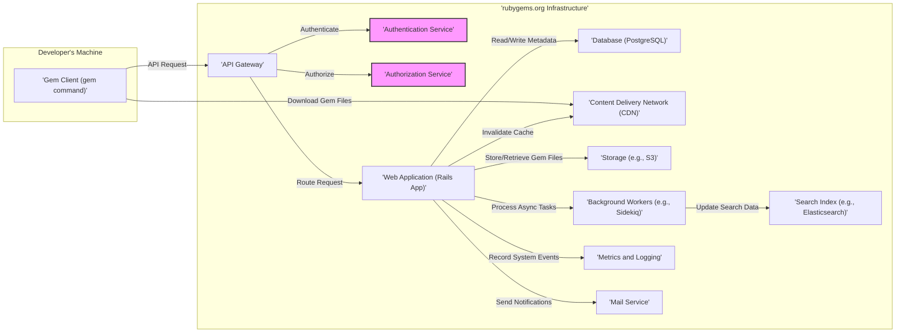
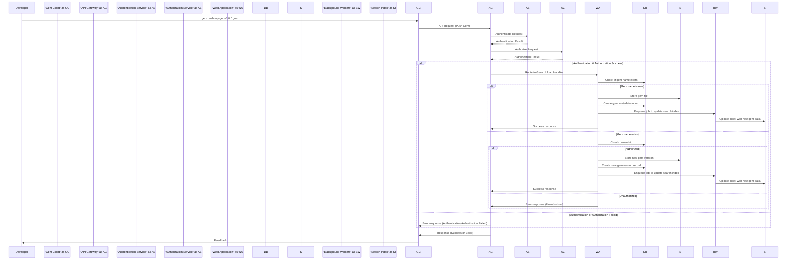
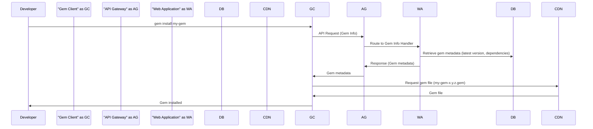
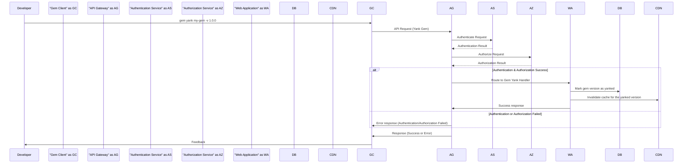
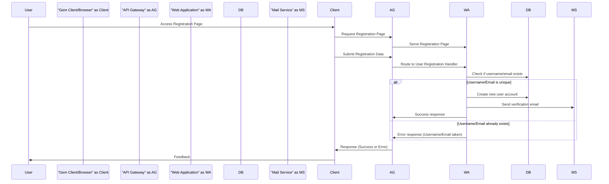

# Project Design Document: RubyGems (Improved)

**Version:** 2.0
**Date:** October 26, 2023
**Author:** AI Software Architect

## 1. Project Overview

This document provides an enhanced architectural overview of the RubyGems system, the package manager for the Ruby programming language. RubyGems enables developers to discover, install, and manage third-party libraries ("gems"). This improved design document is specifically tailored for subsequent threat modeling activities, providing a detailed understanding of the system's components and interactions to facilitate the identification of potential security vulnerabilities. The primary source of information remains the official RubyGems repository: [https://github.com/rubygems/rubygems](https://github.com/rubygems/rubygems).

## 2. Goals

* Deliver a more detailed and refined architectural overview of the RubyGems system.
* Provide clearer descriptions of component interactions, especially concerning security aspects.
* Explicitly highlight potential vulnerability areas within each key component to aid threat modeling.
* Serve as a comprehensive and actionable reference for security analysis and risk assessment.

## 3. System Architecture

The RubyGems ecosystem is a complex system with several interacting parts. The central element is the `rubygems.org` web application and its supporting infrastructure.

### 3.1. High-Level Architecture Diagram (Mermaid)

### 3.2. Key Components

* **Gem Client (`gem` command):**
    * The command-line interface used by developers to interact with RubyGems.
    * Facilitates actions like installing, uninstalling, building, and publishing gems.
    * Communicates with the `rubygems.org` API via HTTP/HTTPS.

* **API Gateway:**
    * The single entry point for all API requests to `rubygems.org`.
    * Performs crucial functions like routing requests to the appropriate services, authentication, authorization, and rate limiting.
    * Provides a layer of abstraction and security for the backend services.

* **Authentication Service:**
    * Responsible for verifying the identity of users and applications attempting to access protected resources.
    * Handles user login, registration, password management (including resets), and potentially API key management.
    * May support various authentication mechanisms (e.g., username/password, OAuth).

* **Authorization Service:**
    * Determines if an authenticated user or application has the necessary permissions to perform a specific action on a resource.
    * Enforces access control policies based on user roles, gem ownership, and other factors.

* **Web Application (`rubygems.org`):**
    * The core application, likely built using Ruby on Rails.
    * Manages gem metadata, user accounts, and the overall functionality of the platform.
    * Implements the business logic for gem management, search, and user interactions.
    * Interacts with the database, storage, search index, and other backend services.

* **Database (PostgreSQL):**
    * Stores persistent data, including gem metadata (name, version, dependencies, description), user account information, API keys, ownership details, and potentially security-related information.

* **Content Delivery Network (CDN):**
    * Caches and serves gem files to improve download speeds and reduce latency for users.
    * Distributes gem files geographically, enhancing availability and performance.

* **Storage (e.g., S3):**
    * Stores the actual gem files (`.gem` files).
    * Provides durable and scalable storage for the gem artifacts.

* **Background Workers (e.g., Sidekiq):**
    * Executes asynchronous tasks that don't need to be handled in real-time.
    * Examples include updating the search index, sending emails, processing gem uploads (virus scanning, metadata extraction), and performing maintenance tasks.

* **Search Index (e.g., Elasticsearch):**
    * Provides a fast and efficient way for users to search for gems based on keywords, names, and descriptions.
    * Improves the discoverability of gems within the ecosystem.

* **Metrics and Logging:**
    * Collects and stores system metrics (performance, resource usage) and application logs (events, errors).
    * Crucial for monitoring system health, identifying issues, and security auditing.

* **Mail Service:**
    * Used for sending transactional emails to users, such as account verification emails, password reset requests, and notifications about gem updates or security issues.

## 4. Data Flow

Understanding the movement of data through the system is essential for identifying potential attack vectors and vulnerabilities.

### 4.1. Gem Upload

### 4.2. Gem Installation

### 4.3. Gem Yank (Unpublish)

### 4.4. User Registration

## 5. Key Components - Detailed Description with Potential Vulnerabilities

This section provides a more detailed look at critical components, specifically highlighting potential security vulnerabilities that should be considered during threat modeling.

### 5.1. API Gateway

* **Responsibilities:** Request routing, authentication, authorization, rate limiting, input validation (to some extent), and potentially SSL termination.
* **Potential Vulnerabilities:**
    * **Bypass vulnerabilities:** If authentication or authorization checks are not consistently applied to all routes.
    * **Rate limiting bypass:** If rate limiting is not correctly configured or can be circumvented.
    * **Denial of Service (DoS):** If the gateway itself is vulnerable to resource exhaustion.
    * **Improper input validation:** Leading to attacks on backend services.
    * **Insecure configuration:** Weak TLS settings or exposed management interfaces.

### 5.2. Authentication Service

* **Responsibilities:** User authentication, session management, password management, API key generation and management.
* **Potential Vulnerabilities:**
    * **Weak password policies:** Allowing easily guessable passwords.
    * **Brute-force attacks:** Lack of account lockout mechanisms.
    * **Credential stuffing:** Exploiting leaked credentials.
    * **Insecure session management:** Session fixation, session hijacking.
    * **Insecure password storage:** Not using strong hashing algorithms with salt.
    * **Vulnerabilities in authentication protocols:** Exploiting weaknesses in OAuth or other methods.
    * **API key leakage or compromise:** If API keys are not securely generated, stored, or transmitted.

### 5.3. Authorization Service

* **Responsibilities:** Enforcing access control policies, determining user permissions for specific actions.
* **Potential Vulnerabilities:**
    * **Broken access control:** Allowing users to perform actions they are not authorized for (e.g., accessing other users' gems, yanking gems they don't own).
    * **Privilege escalation:** Allowing users to gain higher levels of access than intended.
    * **Inconsistent authorization checks:** Discrepancies in how authorization is enforced across different parts of the application.
    * **IDOR (Insecure Direct Object References):** Allowing users to access resources by manipulating IDs without proper authorization.

### 5.4. Web Application (Rails App)

* **Responsibilities:** Core application logic, handling user requests, interacting with backend services, rendering the user interface.
* **Potential Vulnerabilities:**
    * **Cross-Site Scripting (XSS):** Injecting malicious scripts into web pages viewed by other users.
    * **SQL Injection:** Exploiting vulnerabilities in database queries to gain unauthorized access or modify data.
    * **Cross-Site Request Forgery (CSRF):** Tricking authenticated users into performing unintended actions.
    * **Insecure Deserialization:** Exploiting vulnerabilities in how the application handles serialized data.
    * **Mass Assignment Vulnerabilities:** Allowing users to modify unintended data fields.
    * **Server-Side Request Forgery (SSRF):** Tricking the server into making requests to unintended internal or external resources.
    * **Dependency vulnerabilities:** Using vulnerable third-party libraries.

### 5.5. Database (PostgreSQL)

* **Responsibilities:** Persistent data storage, ensuring data integrity and availability.
* **Potential Vulnerabilities:**
    * **SQL Injection (as mentioned above).**
    * **Data breaches:** Unauthorized access to sensitive data due to weak access controls or compromised credentials.
    * **Insufficient access controls:** Allowing the web application or other services excessive database privileges.
    * **Backup vulnerabilities:** Insecure storage or access to database backups.

### 5.6. Content Delivery Network (CDN)

* **Responsibilities:** Caching and serving static content (gem files).
* **Potential Vulnerabilities:**
    * **Cache poisoning:** Attacker injecting malicious content into the CDN cache, which is then served to users.
    * **Stale content:** Serving outdated or vulnerable gem versions if cache invalidation is not properly managed.
    * **Unauthorized access to CDN management interfaces:** Allowing attackers to manipulate the CDN configuration.

### 5.7. Background Workers

* **Responsibilities:** Executing asynchronous tasks.
* **Potential Vulnerabilities:**
    * **Command Injection:** If worker processes execute external commands based on untrusted data.
    * **Information disclosure:** If worker logs contain sensitive information.
    * **Resource exhaustion:** If workers can be abused to consume excessive resources.
    * **Failure to properly sanitize data:** Leading to vulnerabilities in downstream systems they interact with.

## 6. Security Considerations

This section outlines key security considerations based on the system architecture.

* **Confidentiality:** Protecting sensitive information such as user credentials, API keys, and gem metadata from unauthorized access.
    * Encryption at rest and in transit (TLS/SSL).
    * Secure storage of secrets.
    * Access control mechanisms.
* **Integrity:** Ensuring the accuracy and completeness of data, preventing unauthorized modification or deletion.
    * Input validation and output encoding.
    * Digital signatures for gems.
    * Audit logging.
* **Availability:** Ensuring the system remains operational and accessible to legitimate users.
    * Redundancy and failover mechanisms.
    * Rate limiting and abuse prevention.
    * Monitoring and alerting.
* **Authentication and Authorization:** Robust mechanisms to verify user identity and enforce access control.
    * Multi-factor authentication (MFA).
    * Strong password policies.
    * Principle of least privilege.
* **Secure Development Practices:** Following secure coding guidelines and conducting regular security reviews.
* **Vulnerability Management:** Regularly scanning for and patching known vulnerabilities in the application and its dependencies.

## 7. Deployment Model

The `rubygems.org` infrastructure is likely deployed on a cloud platform, leveraging various services for scalability, reliability, and security. Key aspects likely include:

* **Cloud Provider:** (e.g., AWS, Google Cloud, Azure) providing infrastructure and managed services.
* **Load Balancers:** Distributing traffic across multiple web application instances.
* **Web Application Firewall (WAF):** Protecting against common web attacks.
* **Containerization (e.g., Docker, Kubernetes):** For application deployment and management.
* **Managed Database Services:** Providing scalability and reliability for the database.
* **Managed CDN Services:** For efficient content delivery.
* **Intrusion Detection/Prevention Systems (IDS/IPS):** Monitoring for malicious activity.
* **Security Information and Event Management (SIEM):** For centralized logging and security analysis.

## 8. Assumptions and Constraints

* This design is based on publicly available information and common web application architectures. Specific implementation details may vary.
* The focus is primarily on the `rubygems.org` platform and its core functionalities. Related tooling and services are not covered in detail.
* It is assumed that standard security best practices are followed in the development and operation of the system.

## 9. Future Considerations

* Detailed threat modeling workshops for each component and data flow.
* Security testing (penetration testing, vulnerability scanning) to identify specific weaknesses.
* Development of security requirements and controls based on the identified threats.
* Implementation of a security incident response plan.
* Ongoing security monitoring and improvement.

This improved design document provides a more comprehensive and security-focused overview of the RubyGems system, serving as a strong foundation for effective threat modeling and security analysis.