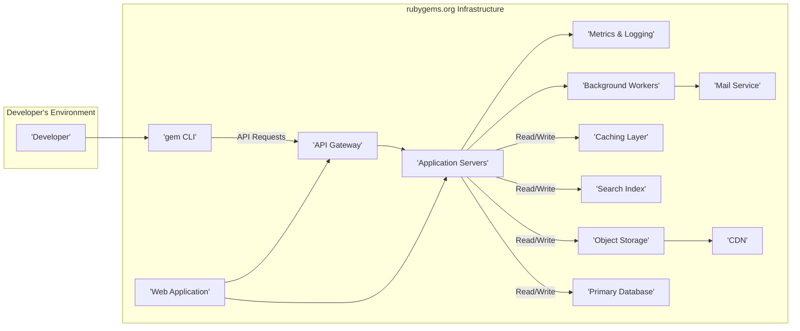
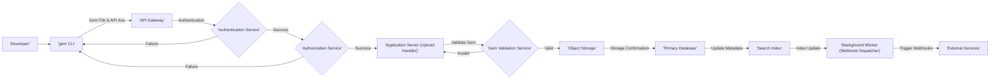
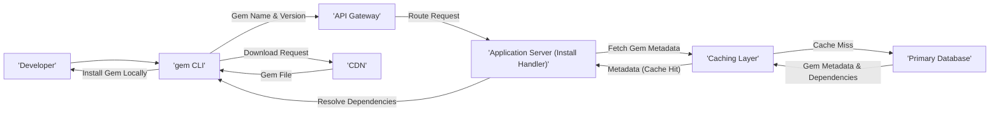
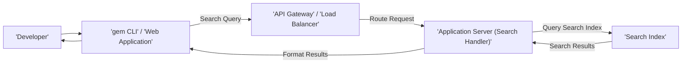

# Project Design Document: RubyGems

**Version:** 1.1
**Date:** October 26, 2023
**Author:** AI Software Architect

## 1. Introduction

This document provides an enhanced design overview of the RubyGems system, the package manager for the Ruby programming language. Building upon the initial design, this version offers more granular details regarding the system's architecture, component interactions, and data flows. This document serves as a refined foundation for subsequent threat modeling exercises, enabling a more comprehensive security analysis. This design is based on publicly available information from the RubyGems GitHub repository ([https://github.com/rubygems/rubygems](https://github.com/rubygems/rubygems)) and established knowledge of package management systems and cloud architectures.

## 2. Goals and Objectives

The core goals of the RubyGems system are:

* **Authoritative Gem Repository:**  Serving as the primary and trusted source for Ruby libraries (gems).
* **Simplified Gem Management:**  Providing Ruby developers with intuitive tools to install, update, and remove gems and their dependencies.
* **Automated Dependency Resolution:**  Intelligently resolving and installing all necessary dependencies for a specified gem, minimizing manual intervention.
* **Efficient Gem Discovery:**  Enabling developers to easily find and explore relevant gems through search and metadata.
* **Ensured Security and Integrity:**  Maintaining the security and integrity of all hosted gems to protect users from malicious or compromised packages.
* **Scalable and Reliable Service:** Providing a highly available and performant service to support the Ruby community.

## 3. System Architecture

The RubyGems system comprises the following key components, working in concert:

* **Client (`gem` command-line interface):** The primary tool developers use to interact with RubyGems.
* **Web Application (rubygems.org):**  Provides a user-friendly web interface for browsing, searching, and managing gems and user accounts.
* **API (RESTful):**  Exposes programmatic access to RubyGems functionalities for the client and other services.
* **Primary Database (Relational):** The central repository for structured data about gems, users, and metadata.
* **Object Storage (Cloud-based):** Stores the binary gem files (`.gem` files).
* **Search Index (Specialized):** An optimized index for rapid and efficient gem searching.
* **Content Delivery Network (Global):**  Distributes gem files globally for faster downloads and reduced latency.
* **Background Job Processor:** Executes asynchronous tasks and deferred operations.
* **Metrics and Logging System:** Collects and analyzes system performance and operational data.
* **Caching Layer:** Improves performance by caching frequently accessed data.

### 3.1. High-Level Architecture Diagram

### 3.2. Detailed Component Descriptions

* **Client (`gem` command-line interface):**
    * Implemented in Ruby.
    * Supports authentication using API keys stored locally or through interactive login.
    * Provides commands for gem installation (`install`), uninstallation (`uninstall`), updating (`update`), building (`build`), pushing (`push`), and searching (`search`).
    * Communicates with the RubyGems API using HTTPS.
    * Manages local gem installations, dependency resolution, and gem activation.

* **Web Application (rubygems.org):**
    * Likely built using a Ruby on Rails framework.
    * Offers a graphical interface for browsing gems, viewing gem details, managing user profiles, and generating API keys.
    * Implements user authentication and authorization using session-based or token-based mechanisms.
    * Interacts with the API for data retrieval and modification.

* **API (RESTful):**
    * Provides a well-defined interface for programmatic interaction with RubyGems.
    * Uses standard HTTP methods (GET, POST, PUT, DELETE).
    * Accepts and returns data in formats like JSON.
    * Enforces authentication and authorization for all sensitive operations.
    * Includes endpoints for gem management, user management, and searching.

* **Primary Database (Relational):**
    * Likely a robust and scalable relational database such as PostgreSQL or MySQL.
    * Stores:
        * Detailed gem metadata (name, versions, authors, descriptions, dependencies, licenses, release dates).
        * User account information (usernames, hashed passwords, email addresses, roles).
        * API keys and their associated permissions (e.g., push access for specific gems).
        * Gem ownership records.
        * Download statistics and other metrics.
        * Webhook configurations for gem events.

* **Object Storage (Cloud-based):**
    * Stores the immutable `.gem` files.
    * Provides high availability and durability.
    * Examples include Amazon S3, Google Cloud Storage, or Azure Blob Storage.
    * Often integrated with a CDN for efficient delivery.

* **Search Index (Specialized):**
    * Enables fast and relevant searching of gems based on various criteria.
    * Technologies like Elasticsearch or Solr are commonly used for their indexing and search capabilities.
    * Data is kept synchronized with the primary database through indexing processes.

* **Content Delivery Network (Global):**
    * Caches gem files at edge locations worldwide.
    * Significantly reduces download times for users.
    * Offloads traffic from the origin object storage.
    * Provides security features like DDoS protection.

* **Background Job Processor:**
    * Manages asynchronous tasks that don't require immediate user feedback.
    * Examples of tasks:
        * Indexing newly uploaded gems for search.
        * Sending webhook notifications to registered services upon gem events (push, yank).
        * Performing security vulnerability scans on gem contents.
        * Generating aggregate statistics and reports.
        * Processing email notifications.
    * Likely utilizes a message queue system like Redis or RabbitMQ with a worker framework like Sidekiq or Resque.

* **Metrics and Logging System:**
    * Collects and aggregates metrics on system performance, API usage, and errors.
    * Provides insights into system health and potential issues.
    * Uses tools like Prometheus, Grafana, and logging aggregators like Elasticsearch, Fluentd, and Kibana (EFK stack) or the equivalent from other cloud providers.

* **Caching Layer:**
    * Improves performance by storing frequently accessed data in memory.
    * Can be implemented at various levels (e.g., application-level caching, CDN caching, database caching).
    * Technologies like Redis or Memcached are commonly used.

* **Mail Service:**
    * Handles sending transactional emails to users.
    * Examples include account verification emails, password reset requests, and notifications related to gem updates or ownership changes.
    * Often uses a third-party email service provider like SendGrid or Mailgun.

## 4. Data Flow

This section details the flow of data for critical operations within the RubyGems ecosystem.

### 4.1. Gem Upload Process

**Steps:**

1. A developer initiates a gem upload using the `gem push` command, providing the gem file and their API key.
2. The `gem` CLI sends the gem file and API key to the API Gateway.
3. The API Gateway routes the request to the Authentication Service for verification.
4. Upon successful authentication, the Authorization Service checks if the user has permission to push this gem.
5. The request is then handled by an Application Server responsible for uploads.
6. The uploaded gem file undergoes validation (format, metadata consistency, potential security checks).
7. If valid, the gem file is stored in Object Storage.
8. The Primary Database is updated with the new gem's metadata.
9. The Search Index is updated to include the newly uploaded gem.
10. A Background Worker dispatches webhook notifications to registered external services.
11. If validation or authorization fails, an error is returned to the developer.

### 4.2. Gem Installation Process

**Steps:**

1. A developer initiates gem installation using `gem install <gem_name>`.
2. The `gem` CLI sends a request to the API Gateway to retrieve metadata for the specified gem and version.
3. The API Gateway routes the request to an Application Server responsible for handling install requests.
4. The Application Server first checks the Caching Layer for the gem's metadata.
5. If found in the cache (cache hit), the metadata is returned.
6. If not found (cache miss), the Application Server queries the Primary Database.
7. The Primary Database returns the gem's metadata, including its dependencies, which is then stored in the Caching Layer.
8. The `gem` CLI resolves the dependencies based on the retrieved metadata.
9. The `gem` CLI requests the gem file from the CDN.
10. The CDN delivers the gem file to the developer's machine.
11. The `gem` CLI installs the gem and its dependencies locally.

### 4.3. Gem Search Process

**Steps:**

1. A developer initiates a gem search via the `gem search` command or the web interface.
2. The search query is sent to the API Gateway (for CLI) or a Load Balancer (for web).
3. The request is routed to an Application Server responsible for handling search requests.
4. The Application Server queries the Search Index with the search terms.
5. The Search Index returns a list of matching gems.
6. The Application Server formats the search results.
7. The results are displayed to the developer.

## 5. Security Considerations

This section expands on the security considerations for the RubyGems system:

* **Strong Authentication and Authorization:**
    * Multi-factor authentication (MFA) for user accounts.
    * Secure storage of hashed passwords using strong hashing algorithms (e.g., bcrypt).
    * API keys with scoped permissions to limit potential damage from compromised keys.
    * Regular rotation of API keys.
* **Gem Content Integrity and Verification:**
    * Verification of gem signatures to ensure authenticity and prevent tampering.
    * Checksums (SHA256 or similar) to verify the integrity of downloaded gem files.
    * Content Security Policy (CSP) to mitigate XSS attacks on the web application.
* **Dependency Vulnerability Management:**
    * Integration with vulnerability databases (e.g., CVE databases) to identify vulnerable dependencies.
    * Mechanisms for reporting and flagging gems with known vulnerabilities.
    * Tools and processes to encourage developers to update vulnerable dependencies.
* **Input Validation and Sanitization:**
    * Strict validation of all user inputs on both the client and server-side to prevent injection attacks (SQL injection, command injection, XSS).
    * Proper sanitization of user-generated content displayed on the platform.
* **Secure Data Storage and Transmission:**
    * Encryption at rest for sensitive data in the database and object storage.
    * Mandatory use of HTTPS for all communication to ensure encryption in transit.
    * Protection of sensitive configuration data (e.g., database credentials).
* **Rate Limiting and Abuse Prevention:**
    * Implementing rate limits on API endpoints to prevent abuse and denial-of-service attacks.
    * CAPTCHA or similar mechanisms to prevent automated abuse.
    * Monitoring for suspicious activity and implementing blocking mechanisms.
* **Denial of Service (DoS) Mitigation:**
    * Use of CDNs with DDoS protection capabilities.
    * Infrastructure designed for scalability and resilience.
    * Implementing request filtering and traffic shaping.
* **Regular Security Audits and Penetration Testing:**
    * Periodic security assessments to identify and address potential vulnerabilities.
    * Engaging external security experts for penetration testing.
* **Supply Chain Security Measures:**
    * Verification of gem publisher identities.
    * Encouraging the use of signed commits and other provenance information.
    * Monitoring for malicious gem uploads and takedowns.
* **Web Application Security Best Practices:**
    * Adherence to OWASP guidelines.
    * Regular security updates for frameworks and libraries.
    * Secure session management.

## 6. Assumptions and Constraints

* The underlying cloud infrastructure (provided by AWS, Google Cloud, or Azure) provides a secure and reliable foundation.
* Standard security best practices are followed throughout the software development lifecycle.
* Third-party services (CDN, email providers) have their own security measures in place.
* The database and object storage services offer built-in security features that are utilized.
* This design document is based on publicly available information and general knowledge of similar systems and may not reflect the exact internal implementation details.

## 7. Future Considerations

* **Enhanced Gem Signing and Verification:** Implementing more robust and widely adopted gem signing standards.
* **Integration with Software Bills of Materials (SBOMs):**  Supporting the generation and consumption of SBOMs for gems.
* **Improved Vulnerability Scanning and Reporting:**  Providing more detailed and actionable vulnerability information to gem authors and users.
* **Fine-grained Access Control for Gem Management:**  Allowing for more granular control over who can manage specific aspects of a gem.
* **Support for Alternative Package Formats:**  Exploring support for other packaging formats beyond the traditional `.gem` file.
* **Federated Identity Management:**  Allowing users to authenticate using existing identity providers.
* **Blockchain for Gem Provenance:**  Investigating the use of blockchain technology to enhance the transparency and immutability of gem provenance information.

This enhanced design document provides a more detailed and comprehensive understanding of the RubyGems system, serving as a valuable resource for in-depth threat modeling and security analysis. The added granularity in component descriptions, data flows, and security considerations will facilitate a more thorough assessment of potential risks and the development of effective mitigation strategies.