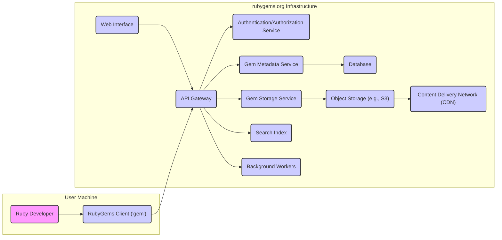

# Project Design Document: RubyGems

**Version:** 1.1
**Date:** October 26, 2023
**Author:** AI Software Architect

## 1. Project Overview

This document details the design of the RubyGems project, the official package manager for the Ruby programming language. RubyGems standardizes the distribution of Ruby libraries and applications (gems), providing both a command-line tool (`gem`) for managing these packages and a central repository (rubygems.org) for hosting and discovering them. This document aims to provide a comprehensive understanding of the system's architecture, serving as a crucial input for subsequent threat modeling activities.

## 2. Goals and Objectives

* To maintain a reliable and highly available platform for hosting and distributing Ruby gems.
* To empower Ruby developers to efficiently package, share, and install reusable code components.
* To rigorously protect the integrity and security of the entire Ruby gem ecosystem.
* To offer an intuitive and efficient user interface for interacting with the gem repository.
* To foster a thriving and collaborative community of gem developers and users.

## 3. Target Audience

This document is primarily intended for:

* Security engineers responsible for conducting threat modeling and security assessments.
* Software developers actively contributing to the development and maintenance of the RubyGems project.
* Operations engineers managing the infrastructure that supports the RubyGems ecosystem.
* Anyone seeking a deep and structured understanding of the RubyGems architecture and its components.

## 4. Scope

This design document comprehensively covers the following key aspects of the RubyGems project:

* The fundamental components of the system, including the client-side tool (`gem`), the central repository (rubygems.org), and the underlying infrastructure.
* The core functionalities of the system, such as the processes for publishing, installing, searching, and managing dependencies of gems.
* The critical data flows within the system, illustrating how information is exchanged between components.
* The primary technologies and frameworks employed in the development and operation of the project.

This document explicitly excludes:

* In-depth implementation details of specific code modules or algorithms within the components.
* A detailed explanation of the intricacies of the Ruby programming language itself.
* Specific configurations of the underlying operating systems or hardware infrastructure.

## 5. High-Level Architecture

The RubyGems ecosystem is architected around the following key components:

* **RubyGems Client (`gem`):** The command-line tool installed on developer machines for interacting with the repository.
* **RubyGems Repository (rubygems.org):** The central server responsible for hosting gem packages and their associated metadata.
* **Web Interface (rubygems.org):** A web application providing a graphical user interface for browsing and managing gems.
* **API Gateway:**  A service that acts as a single entry point for all API requests to the backend services.
* **Authentication/Authorization Service:**  Handles user authentication and authorization for accessing protected resources.
* **Gem Metadata Service:**  Manages and provides access to metadata about gems.
* **Gem Storage Service:**  Manages the storage and retrieval of actual gem files.
* **Search Index:**  Provides indexing and search capabilities for gems.
* **Background Workers:**  Processes asynchronous tasks.
* **Database:**  Stores persistent data, including gem metadata, user information, and API keys.
* **Object Storage:**  Stores the binary gem files.
* **Content Delivery Network (CDN):**  Distributes gem files globally for faster downloads.

## 6. Component Design

This section provides a more detailed breakdown of the key components and their responsibilities:

* **RubyGems Client (`gem`):**
    * A command-line tool written primarily in Ruby.
    * Key responsibilities include:
        * Packaging Ruby code and assets into distributable gem files.
        * Facilitating the process of publishing gems to the central repository.
        * Enabling the installation of gems and their dependencies from the repository.
        * Providing mechanisms for managing gem dependencies within Ruby projects.
        * Offering search functionality to discover gems within the repository.
        * Allowing users to update installed gems to newer versions.
        * Handling user authentication with the repository.
    * Communicates with the RubyGems Repository via its API.

* **RubyGems Repository (rubygems.org):**
    * The authoritative source for managing and distributing Ruby gems.
    * Implemented as a web application, likely using a framework like Ruby on Rails.
    * Core responsibilities encompass:
        * Accepting and securely storing uploaded gem packages.
        * Maintaining comprehensive metadata for each gem, including name, version, dependencies, authors, and descriptions.
        * Implementing robust authentication and authorization mechanisms for users and API clients.
        * Providing a well-defined API for interaction with the `gem` client and other services.
        * Serving gem files for download to users.
        * Offering a user-friendly web interface for browsing, searching, and managing gems.
        * Managing user accounts, API keys, and gem ownership.

* **Web Interface (rubygems.org):**
    * A user-facing web application built on top of the repository's API.
    * Enables users to:
        * Effortlessly browse and search for available gems.
        * View detailed information about specific gems, including documentation and dependencies.
        * Manage their user profiles and settings.
        * Generate and manage API keys for programmatic access.
        * Report issues or concerns related to specific gems.

* **API Gateway:**
    * Acts as a reverse proxy and single entry point for all API requests.
    * Responsible for:
        * Request routing to the appropriate backend services.
        * Implementing rate limiting to prevent abuse.
        * Handling authentication and authorization checks (potentially offloading to the dedicated service).
        * Potentially performing request transformation or aggregation.

* **Authentication/Authorization Service:**
    * A dedicated service responsible for verifying user credentials and managing access permissions.
    * Handles:
        * User registration and login.
        * API key generation and management.
        * Session management.
        * Authorization checks for actions like publishing gems.

* **Gem Metadata Service:**
    * Manages the storage, retrieval, and indexing of gem metadata.
    * Provides APIs for accessing gem information, dependencies, and version history.

* **Gem Storage Service:**
    * Responsible for managing the storage and retrieval of the actual gem binary files.
    * Interacts with the object storage backend.

* **Search Index:**
    * Provides efficient search capabilities for discovering gems based on keywords, names, and other criteria.
    * Likely implemented using a dedicated search engine like Elasticsearch or Solr.

* **Background Workers:**
    * Executes asynchronous tasks that don't need to be performed in real-time.
    * Examples include:
        * Indexing newly published gems for search.
        * Sending email notifications (e.g., for new gem releases or account activity).
        * Processing gem download statistics.
        * Performing periodic maintenance and cleanup tasks.

* **Database:**
    * A persistent data store, likely a relational database such as PostgreSQL.
    * Stores:
        * Comprehensive metadata about each gem.
        * User account details and credentials.
        * API keys and their associated permissions.
        * Information about gem ownership and maintainers.
        * Various statistics and analytics data related to gem usage.

* **Object Storage:**
    * A scalable and durable storage solution, such as Amazon S3 or Google Cloud Storage.
    * Stores the actual binary files of the gem packages.

* **Content Delivery Network (CDN):**
    * A geographically distributed network of servers that cache gem files.
    * Significantly improves download speeds for users by serving gems from the closest edge location.
    * Reduces load on the origin object storage.

## 7. Data Flow

The following describes the primary data flows within the RubyGems system:

* **Gem Push (Publishing a Gem):**
    1. A Ruby developer uses the `gem` client to package their code.
    2. The developer authenticates with the RubyGems Repository via the API Gateway, providing credentials or an API key.
    3. The `gem` client sends the gem file and its associated metadata to the API Gateway.
    4. The API Gateway routes the request to the Authentication/Authorization Service for verification.
    5. Upon successful authentication and authorization, the API Gateway forwards the metadata to the Gem Metadata Service and the gem file to the Gem Storage Service.
    6. The Gem Metadata Service stores the metadata in the Database.
    7. The Gem Storage Service stores the gem file in the Object Storage.
    8. Background Workers are notified to index the new gem in the Search Index.
    9. The gem becomes available for download via the CDN.

* **Gem Install:**
    1. A user executes the `gem install <gem_name>` command on their machine.
    2. The `gem` client queries the API Gateway for the metadata of the specified gem.
    3. The API Gateway routes the request to the Gem Metadata Service.
    4. The Gem Metadata Service retrieves the metadata from the Database and returns it to the API Gateway.
    5. The API Gateway responds to the `gem` client with the gem's metadata, including available versions and dependencies.
    6. The `gem` client resolves dependencies.
    7. The `gem` client requests the gem file from the CDN.
    8. The CDN retrieves the gem file from its cache or the Object Storage and delivers it to the `gem` client.
    9. The `gem` client installs the gem and its dependencies.

* **Browsing Gems (via Web Interface):**
    1. A user accesses the rubygems.org website in their browser.
    2. The web interface makes requests to the API Gateway to fetch gem data for display.
    3. The API Gateway routes these requests to the appropriate backend services (e.g., Gem Metadata Service, Search Index).
    4. The backend services retrieve the requested data from the Database or Search Index.
    5. The data is returned to the API Gateway and then to the web interface.
    6. The web interface renders the gem information for the user.

## 8. Key Technologies

* **Programming Languages:** Primarily Ruby, with potential use of other languages for specific services.
* **Web Framework:** Ruby on Rails is the likely framework for the main web application.
* **Database:** PostgreSQL is a strong candidate for the primary data store.
* **Object Storage:** Services like Amazon S3 or Google Cloud Storage are likely used.
* **CDN:** Providers such as Fastly or Cloudflare are commonly used.
* **Search Index:** Elasticsearch or Apache Solr are probable choices.
* **Background Processing:** Libraries like Sidekiq or Resque are likely used for managing background tasks.
* **API Communication:** RESTful APIs are the standard for communication between components.
* **Authentication/Authorization:**  Libraries like Devise or custom solutions might be employed.

## 9. Security Considerations (Detailed)

This section outlines key security considerations for the RubyGems project, providing a foundation for threat modeling:

* **Authentication and Authorization:**
    * **Weak Password Policies:**  Susceptible to brute-force attacks if password requirements are lax.
    * **Insecure Credential Storage:**  Compromised credentials could lead to unauthorized access.
    * **Missing or Weak Multi-Factor Authentication (MFA):**  Increases the risk of account takeover.
    * **Insufficient API Key Security:**  Leaked or compromised API keys can grant unauthorized access.
    * **Lack of Granular Permissions:**  Overly permissive access controls can lead to privilege escalation.

* **Data Integrity:**
    * **Gem Tampering:**  Malicious actors could try to modify gem files after publication.
    * **Metadata Manipulation:**  Altering gem metadata could mislead users or compromise dependency resolution.
    * **Lack of Content Verification:**  Insufficient checks on uploaded gem content could allow malicious code.

* **Availability:**
    * **Denial of Service (DoS) Attacks:**  Overwhelming the system with requests, making it unavailable.
    * **Infrastructure Failures:**  Failures in servers, databases, or network components.
    * **Rate Limiting Evasion:**  Attackers might try to bypass rate limits to perform malicious actions.

* **Confidentiality:**
    * **Exposure of User Data:**  Vulnerabilities could lead to the disclosure of user credentials or personal information.
    * **Leaking of API Keys:**  Unauthorized access to API keys could compromise the system.
    * **Insecure Logging Practices:**  Sensitive information might be inadvertently logged.

* **Dependency Security:**
    * **Vulnerable Dependencies:**  Gems might rely on other gems with known security vulnerabilities.
    * **Dependency Confusion:**  Attackers could publish malicious gems with names similar to internal dependencies.

* **Code Injection:**
    * **Cross-Site Scripting (XSS):**  Attackers could inject malicious scripts into the web interface.
    * **Command Injection:**  Vulnerabilities could allow attackers to execute arbitrary commands on the server.

* **Supply Chain Attacks:**
    * **Compromised Gem Authors:**  Attackers could gain control of legitimate gem author accounts.
    * **Malicious Gem Publication:**  Attackers could publish gems containing malware.

* **Infrastructure Security:**
    * **Unpatched Systems:**  Outdated software and operating systems can have known vulnerabilities.
    * **Misconfigured Firewalls:**  Incorrect firewall rules could allow unauthorized access.
    * **Insecure Network Segmentation:**  Lack of proper network isolation can increase the impact of breaches.

## 10. Future Considerations

* **Enhanced Security Measures:** Implementing more robust security features like mandatory MFA for gem publishing, improved content scanning, and stricter validation rules.
* **Improved Gem Verification:** Exploring stronger mechanisms for verifying the authenticity and integrity of published gems.
* **Support for Signed Gems:** Implementing support for cryptographic signing of gems to ensure provenance.
* **Advanced Search Capabilities:**  Developing more sophisticated search functionalities, including semantic search and vulnerability filtering.
* **Plugin System:**  Allowing developers to extend the functionality of the `gem` client and the repository through plugins.
* **Containerization and Orchestration:**  Further leveraging technologies like Docker and Kubernetes for improved scalability and resilience.
* **Enhanced Monitoring and Logging:**  Implementing more comprehensive monitoring and logging systems for proactive issue detection and incident response.
* **Community-Driven Security Audits:**  Encouraging and facilitating community involvement in security assessments.

This improved design document provides a more detailed and structured understanding of the RubyGems project, specifically focusing on aspects relevant to threat modeling. The expanded security considerations section offers a more comprehensive overview of potential vulnerabilities and attack vectors.