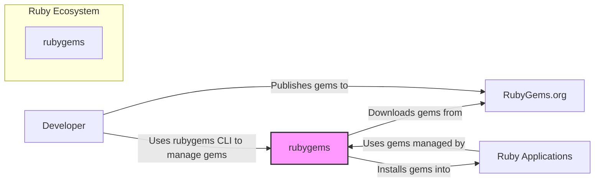
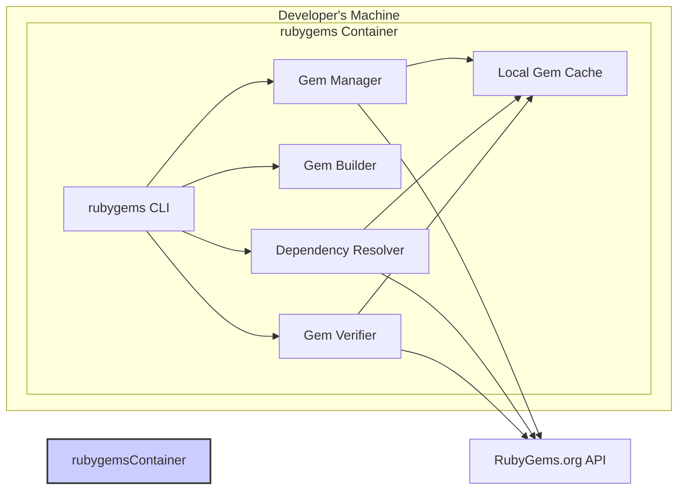
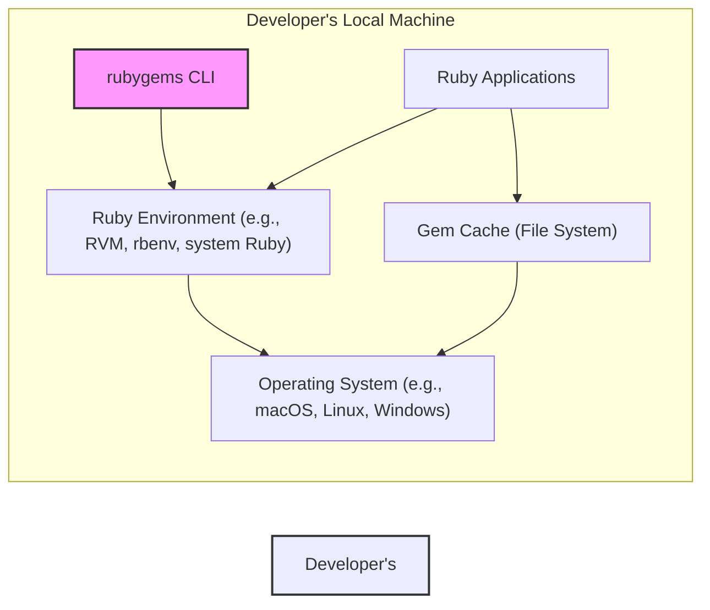

# BUSINESS POSTURE

The rubygems project aims to provide a reliable and secure package management system for the Ruby programming language. It facilitates the discovery, distribution, and installation of Ruby libraries and applications (gems).

- Business priorities:
  - Ensure the availability and stability of the gem ecosystem for Ruby developers.
  - Maintain the security and integrity of gems to protect users from malicious software.
  - Support the Ruby community by providing a robust and user-friendly package management tool.
  - Promote the adoption of Ruby by simplifying dependency management.

- Business goals:
  - Provide a command-line tool for gem management.
  - Offer a standard format for packaging Ruby libraries and applications.
  - Enable developers to easily publish and share their gems.
  - Allow users to securely install and manage gems and their dependencies.
  - Maintain compatibility with various Ruby versions and platforms.

- Business risks:
  - Supply chain attacks through compromised gems.
  - Availability issues impacting Ruby development workflows.
  - Security vulnerabilities in the rubygems tool itself.
  - Lack of trust in the gem ecosystem due to security incidents.
  - Compatibility problems hindering adoption and usability.

# SECURITY POSTURE

- Security controls:
  - security control: Code review process for contributions (described in GitHub repository contribution guidelines).
  - security control: Automated testing suite (present in GitHub repository, using tools like `rake test`).
  - security control: Gem signing and verification (partially implemented, allows gem authors to sign gems, and users to verify signatures).
  - security control: RubyGems.org (related service, not part of this repository directly, but crucial for the ecosystem) implements security measures like HTTPS, authentication for publishing, and malware scanning.

- Accepted risks:
  - accepted risk: Potential vulnerabilities in dependencies used by rubygems.
  - accepted risk: Risk of compromised developer accounts on RubyGems.org (mitigated by RubyGems.org security measures, but still a residual risk).
  - accepted risk: Social engineering attacks targeting gem authors.

- Recommended security controls:
  - security control: Implement static application security testing (SAST) in the CI/CD pipeline to automatically detect potential vulnerabilities in the code.
  - security control: Implement dependency scanning to identify and manage vulnerable dependencies.
  - security control: Enhance gem signature verification to be mandatory or more prominently enforced.
  - security control: Security audits of the rubygems codebase and processes.
  - security control: Implement rate limiting and input validation on command-line interface to prevent abuse.

- Security requirements:
  - Authentication:
    - Requirement: For publishing gems to RubyGems.org, authors must authenticate with RubyGems.org (handled by RubyGems.org service, interaction from rubygems CLI).
    - Requirement: For accessing private gem repositories (if supported in future), authentication mechanisms should be in place.
  - Authorization:
    - Requirement: Ensure that only authorized users (gem authors) can publish new gems or update existing ones on RubyGems.org.
    - Requirement: When accessing private gem repositories (if supported in future), authorization should control access based on user roles and permissions.
  - Input validation:
    - Requirement: Validate all inputs to the rubygems command-line tool to prevent command injection and other input-based vulnerabilities.
    - Requirement: Validate gem specifications and metadata to prevent malicious or malformed gems from being processed.
  - Cryptography:
    - Requirement: Use strong cryptography for gem signing and verification processes.
    - Requirement: Ensure secure communication channels (HTTPS) when interacting with RubyGems.org and other gem repositories.
    - Requirement: Securely store and handle any cryptographic keys used for gem signing or encryption.

# DESIGN

## C4 CONTEXT

- C4 Context Elements:
  - - Name: rubygems
    - Type: Software System
    - Description: The rubygems command-line tool and core library for managing Ruby packages (gems). It allows developers to install, build, and manage gems.
    - Responsibilities:
      - Provides a command-line interface for gem management.
      - Handles gem installation, uninstallation, and updates.
      - Manages gem dependencies.
      - Builds gem packages.
      - Interacts with gem repositories like RubyGems.org.
    - Security controls:
      - Input validation on CLI commands.
      - Gem signature verification.
      - Secure communication (HTTPS) when interacting with repositories.

  - - Name: Developer
    - Type: Person
    - Description: Ruby software developers who use rubygems to manage dependencies, install libraries, and publish their own gems.
    - Responsibilities:
      - Uses rubygems to install and manage gems for their projects.
      - Creates and publishes gems to share with the Ruby community.
      - Configures rubygems for their development environment.
    - Security controls:
      - Responsible for using rubygems securely.
      - Should verify gem signatures when possible.
      - Needs to protect their RubyGems.org credentials.

  - - Name: RubyGems.org
    - Type: Software System
    - Description: The central public gem repository and service for the Ruby community. It hosts a vast collection of gems and provides an API for rubygems to download and publish gems.
    - Responsibilities:
      - Hosts and serves gems to users.
      - Provides an API for gem download and publishing.
      - Manages gem metadata and search functionality.
      - Implements security measures to protect the gem ecosystem.
    - Security controls:
      - HTTPS for all communication.
      - Authentication and authorization for gem publishing.
      - Malware scanning of uploaded gems.
      - Rate limiting and DDoS protection.

  - - Name: Ruby Applications
    - Type: Software System
    - Description: Ruby applications and libraries that depend on gems managed by rubygems. These applications are the consumers of gems.
    - Responsibilities:
      - Utilize gems installed by rubygems to provide functionality.
      - Rely on rubygems for dependency resolution and management.
    - Security controls:
      - Security depends on the integrity of installed gems.
      - Vulnerabilities in gems can impact Ruby applications.

## C4 CONTAINER

- C4 Container Elements:
  - - Name: rubygems CLI
    - Type: Application
    - Description: The command-line interface of rubygems, providing commands for gem management (install, uninstall, build, etc.). It's the primary user interface for developers interacting with rubygems.
    - Responsibilities:
      - Parses user commands.
      - Orchestrates gem management operations.
      - Displays output to the user.
      - Interacts with other rubygems components.
    - Security controls:
      - Input validation of command-line arguments.
      - Secure handling of user credentials (if any, though mostly delegated to RubyGems.org).

  - - Name: Gem Manager
    - Type: Library/Module
    - Description: Core component responsible for managing gems. Handles gem installation, uninstallation, updates, and querying gem information.
    - Responsibilities:
      - Manages gem lifecycle operations.
      - Interacts with local gem cache and remote repositories.
      - Handles gem metadata and specifications.
    - Security controls:
      - Gem signature verification.
      - Secure interaction with gem repositories (HTTPS).
      - Input validation of gem specifications.

  - - Name: Gem Builder
    - Type: Library/Module
    - Description: Component responsible for building gem packages from gemspec files. Used by gem authors to create distributable gem files.
    - Responsibilities:
      - Reads gemspec files.
      - Packages gem files and metadata into a gem archive.
      - Potentially signs gems.
    - Security controls:
      - Secure handling of private keys for gem signing.
      - Input validation of gemspec files.

  - - Name: Dependency Resolver
    - Type: Library/Module
    - Description: Component that resolves gem dependencies. Analyzes gem requirements and finds compatible versions of dependent gems.
    - Responsibilities:
      - Reads gem dependencies.
      - Queries local cache and remote repositories for dependency information.
      - Resolves dependency conflicts.
    - Security controls:
      - Securely retrieves dependency information from repositories.
      - Prevents dependency confusion attacks (to some extent, relies on repository security).

  - - Name: Gem Verifier
    - Type: Library/Module
    - Description: Component that verifies the integrity and authenticity of gems, primarily through signature verification.
    - Responsibilities:
      - Verifies gem signatures against trusted keys.
      - Checks gem checksums.
      - Ensures gem integrity.
    - Security controls:
      - Secure key management for signature verification.
      - Robust verification algorithms.

  - - Name: Local Gem Cache
    - Type: Data Store (File System)
    - Description: Local directory on the user's machine where downloaded and installed gems are stored. Acts as a cache to speed up gem operations.
    - Responsibilities:
      - Stores downloaded gem files.
      - Provides local access to installed gems.
    - Security controls:
      - File system permissions to protect gem files.
      - Integrity checks of cached gems.

  - - Name: RubyGems.org API
    - Type: API
    - Description: The API provided by RubyGems.org for rubygems to interact with the gem repository. Used for downloading gems, publishing gems, and retrieving gem metadata.
    - Responsibilities:
      - Provides access to gem data.
      - Handles gem download requests.
      - Handles gem publishing requests (authentication required).
    - Security controls:
      - HTTPS for API communication.
      - Authentication and authorization for publishing.
      - Rate limiting.

## DEPLOYMENT

For the rubygems project (specifically the CLI tool), deployment primarily refers to how developers install and use the rubygems CLI on their local machines. Rubygems is typically distributed as part of Ruby installations or can be installed as a gem itself.

Deployment Architecture: Local Machine Deployment

- Deployment Elements:
  - - Name: Developer's Local Machine
    - Type: Environment
    - Description: The developer's personal computer where they develop Ruby applications and use the rubygems CLI.
    - Responsibilities:
      - Provides the environment for running rubygems and Ruby applications.
      - Hosts the gem cache and installed gems.
    - Security controls:
      - Operating system security controls (firewall, user permissions).
      - Antivirus/antimalware software.
      - Physical security of the machine.

  - - Name: Operating System (e.g., macOS, Linux, Windows)
    - Type: Infrastructure
    - Description: The underlying operating system on the developer's machine.
    - Responsibilities:
      - Provides core system functionalities.
      - Manages file system and user permissions.
      - Provides network connectivity.
    - Security controls:
      - OS-level security patches and updates.
      - User access control.
      - Firewall.

  - - Name: Ruby Environment (e.g., RVM, rbenv, system Ruby)
    - Type: Software Runtime
    - Description: The Ruby runtime environment installed on the developer's machine. It includes the Ruby interpreter and standard libraries.
    - Responsibilities:
      - Executes Ruby code, including rubygems CLI.
      - Provides Ruby libraries and dependencies.
    - Security controls:
      - Keeping the Ruby environment updated with security patches.
      - Secure configuration of the Ruby environment.

  - - Name: rubygems CLI
    - Type: Application
    - Description: The rubygems command-line tool, deployed as part of the Ruby environment.
    - Responsibilities:
      - Provides gem management functionalities on the local machine.
    - Security controls:
      - Security controls are implemented within the rubygems CLI application itself (as described in Container diagram).

  - - Name: Gem Cache (File System)
    - Type: Data Store
    - Description: The local file system directory used to cache downloaded gems.
    - Responsibilities:
      - Stores gem files locally.
      - Provides fast access to gems.
    - Security controls:
      - File system permissions to protect cached gems.
      - Disk encryption (if enabled on the OS).

  - - Name: Ruby Applications
    - Type: Application
    - Description: Ruby applications developed by the developer, which utilize gems managed by rubygems.
    - Responsibilities:
      - Utilize installed gems.
      - Execute application logic.
    - Security controls:
      - Application-level security controls.
      - Security of dependencies (gems).

## BUILD

The build process for rubygems involves compiling Ruby code, running tests, and packaging the rubygems library and CLI into a gem. The build process is automated using tools like `rake` and likely CI/CD systems for official releases.

Build Process Diagram:

```mermaid
flowchart LR
    Developer["Developer"] -->|"Code Changes, Commits"| GitHub["GitHub Repository"]
    GitHub -->|"Webhook, Scheduled Build"| CI["CI/CD System (e.g., GitHub Actions)"]
    CI -->|"Checkout Code, Build"| BuildEnvironment["Build Environment"]
    BuildEnvironment -->|"Run Tests, Linters, SAST"| SecurityChecks["Security Checks"]
    SecurityChecks -->|"Package, Sign"| ArtifactStorage["Artifact Storage (e.g., Gemfury, GitHub Releases)"]
    ArtifactStorage -->|"Publish to"| RubyGemsORG["RubyGems.org (for releases)"]
    style CI fill:#ccf,stroke:#333,stroke-width:2px
    style BuildEnvironment fill:#eef,stroke:#333,stroke-width:2px
    style SecurityChecks fill:#eef,stroke:#333,stroke-width:2px
    style ArtifactStorage fill:#eef,stroke:#333,stroke-width:2px
```

- Build Elements:
  - - Name: Developer
    - Type: Person
    - Description: Ruby developers contributing to the rubygems project.
    - Responsibilities:
      - Writes code and submits contributions.
      - Participates in code reviews.
    - Security controls:
      - Secure development practices.
      - Code review process.
      - Access control to the repository.

  - - Name: GitHub Repository
    - Type: Code Repository
    - Description: The GitHub repository hosting the rubygems source code.
    - Responsibilities:
      - Stores source code and version history.
      - Manages contributions through pull requests.
      - Triggers CI/CD pipelines.
    - Security controls:
      - Access control (authentication and authorization).
      - Audit logs.
      - Branch protection rules.

  - - Name: CI/CD System (e.g., GitHub Actions)
    - Type: Automation System
    - Description: Automated system for building, testing, and deploying rubygems. Likely GitHub Actions based on repository presence.
    - Responsibilities:
      - Automates the build process.
      - Runs tests and security checks.
      - Packages and publishes artifacts.
    - Security controls:
      - Secure configuration of CI/CD pipelines.
      - Secrets management for credentials.
      - Audit logs of CI/CD activities.

  - - Name: Build Environment
    - Type: Environment
    - Description: Isolated environment where the rubygems build process is executed.
    - Responsibilities:
      - Provides dependencies and tools for building rubygems.
      - Executes build scripts.
    - Security controls:
      - Securely configured build environment.
      - Minimal necessary tools and dependencies.
      - Ephemeral build environments (recreated for each build).

  - - Name: Security Checks
    - Type: Automated Checks
    - Description: Automated security checks integrated into the build process, such as linters, SAST scanners, and dependency vulnerability scanning.
    - Responsibilities:
      - Detects potential security vulnerabilities in the code and dependencies.
      - Enforces code quality standards.
    - Security controls:
      - Regularly updated security scanning tools.
      - Defined security policies and thresholds for checks.
      - Fail-fast mechanism on security check failures.

  - - Name: Artifact Storage (e.g., Gemfury, GitHub Releases)
    - Type: Artifact Repository
    - Description: Storage location for built artifacts, such as gem files and release notes. Could be Gemfury for internal staging or GitHub Releases for public releases.
    - Responsibilities:
      - Stores build artifacts securely.
      - Provides access to artifacts for distribution.
    - Security controls:
      - Access control to artifact storage.
      - Integrity checks of stored artifacts.

  - - Name: RubyGems.org (for releases)
    - Type: Gem Repository
    - Description: The public RubyGems.org repository where official rubygems releases are published.
    - Responsibilities:
      - Hosts and distributes rubygems releases.
      - Makes rubygems available to Ruby developers.
    - Security controls:
      - RubyGems.org security controls (as described in Context diagram).
      - Secure publishing process from CI/CD.

# RISK ASSESSMENT

- Critical business processes:
  - Gem installation and dependency resolution: Ensuring developers can reliably install and manage gems is crucial for Ruby development productivity.
  - Gem publishing: Allowing gem authors to publish new gems and updates is essential for the growth and health of the Ruby ecosystem.
  - Gem signature verification: Maintaining the integrity and authenticity of gems to protect users from malicious packages.

- Data being protected and sensitivity:
  - Gem code: Publicly available, but integrity is critical to prevent supply chain attacks. Sensitivity: Public, Integrity critical.
  - Gem metadata (gemspecs, descriptions): Publicly available, but integrity is important for accurate information. Sensitivity: Public, Integrity important.
  - Gem signatures and signing keys: Private keys used for signing are highly sensitive and must be protected. Public keys for verification are public. Sensitivity: Private keys - Confidential, Integrity critical; Public keys - Public, Integrity critical.
  - RubyGems.org API credentials: Credentials used by rubygems CLI to interact with RubyGems.org are sensitive. Sensitivity: Confidential, Integrity critical.

# QUESTIONS & ASSUMPTIONS

- Questions:
  - What is the current process for security vulnerability management in rubygems?
  - Are there any existing SAST or dependency scanning tools used in the build process?
  - What is the key management strategy for gem signing?
  - Are there any plans to enforce or promote gem signature verification more strongly?
  - What is the incident response plan in case of a security breach or vulnerability in rubygems?

- Assumptions:
  - BUSINESS POSTURE: Assumed that the primary business goal is to provide a secure and reliable package manager for the Ruby community.
  - SECURITY POSTURE: Assumed that security is a high priority, but there are areas for improvement, particularly in automated security checks and stronger enforcement of gem signing.
  - DESIGN: Assumed that the rubygems repository primarily focuses on the CLI tool and core library, and that RubyGems.org is a separate but tightly related service. Assumed a standard local machine deployment model for the CLI tool and a typical CI/CD pipeline for building and releasing rubygems.