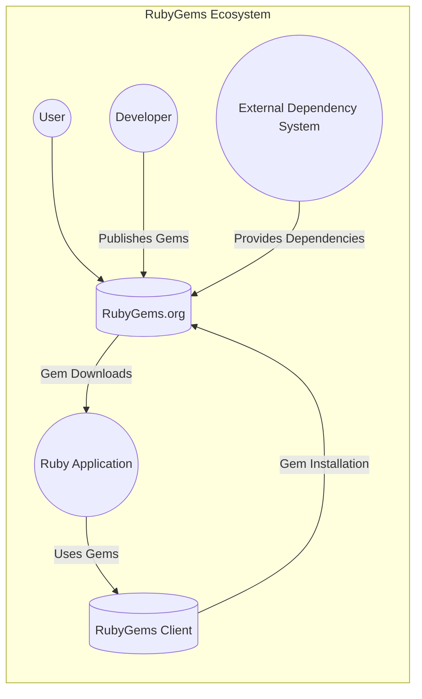
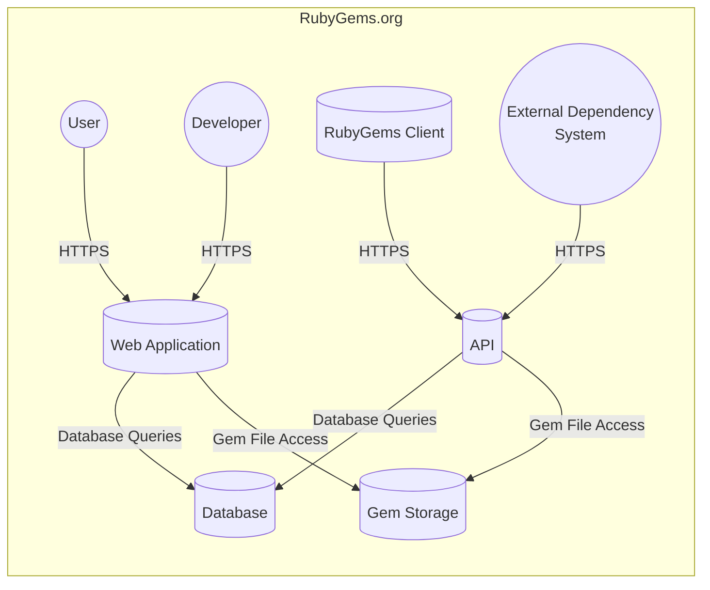
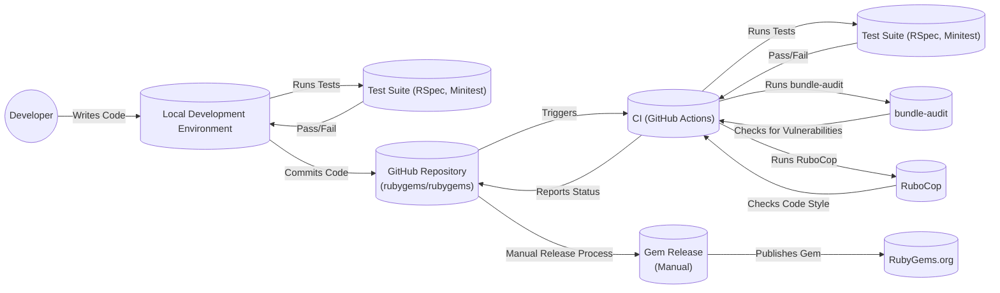

Okay, let's create a design document for the RubyGems project, focusing on aspects relevant to threat modeling.

# BUSINESS POSTURE

RubyGems is the official package manager for the Ruby programming language. It's a critical piece of infrastructure for the Ruby ecosystem.

Priorities:

*   Availability: RubyGems must be highly available. Developers rely on it to download and install gems (libraries) needed for their projects. Downtime directly impacts developer productivity and application deployments.
*   Integrity: The integrity of the gem repository is paramount. Tampering with gems could lead to widespread distribution of malicious code.
*   Usability: The system should be easy to use for both gem publishers and gem consumers.
*   Maintainability: The codebase should be maintainable and evolvable to adapt to the changing needs of the Ruby community.
*   Security: Protecting against unauthorized access, modification, and distribution of malicious code is crucial.

Goals:

*   Provide a reliable and efficient way to distribute Ruby software packages.
*   Ensure the authenticity and integrity of distributed packages.
*   Facilitate the discovery and management of dependencies.
*   Support a vibrant and growing ecosystem of Ruby libraries.

Business Risks:

*   Compromise of the gem repository, leading to the distribution of malicious code. This is the highest risk.
*   Denial-of-service attacks, making RubyGems unavailable to developers.
*   Data breaches, exposing user information (e.g., API keys) or gem metadata.
*   Supply chain attacks, where vulnerabilities in dependencies of RubyGems itself are exploited.
*   Reputational damage due to security incidents or prolonged outages.
*   Loss of community trust if security is not perceived as a top priority.

# SECURITY POSTURE

Existing Security Controls:

*   security control: HTTPS is used for all communication with the RubyGems.org API and gem downloads. (Implemented in the RubyGems client and server).
*   security control: Gem signing is supported, allowing gem publishers to cryptographically sign their gems, and consumers to verify those signatures. (Implemented in the RubyGems client and server).
*   security control: API keys are used to authenticate gem publishers. (Implemented in the RubyGems.org server and managed through the web interface).
*   security control: Two-factor authentication (2FA) is supported (and encouraged) for RubyGems.org accounts. (Implemented in the RubyGems.org server).
*   security control: Checksums (e.g., SHA256) are used to verify the integrity of downloaded gem files. (Implemented in the RubyGems client).
*   security control: Regular security audits and penetration tests are conducted (mentioned in security policies and blog posts, but details are not fully public).
*   security control: Rate limiting is likely implemented to mitigate abuse and denial-of-service attacks (common practice, but not explicitly documented in the repository).
*   security control: Input validation is performed on user-supplied data (e.g., gem names, versions, metadata) to prevent injection attacks. (Implemented in the RubyGems.org server).
*   security control: The RubyGems.org website and API use a Content Security Policy (CSP) to mitigate cross-site scripting (XSS) attacks. (Visible in HTTP response headers).
*   security control: The project uses Bundler to manage its own dependencies, and `bundle-audit` to check for known vulnerabilities in those dependencies. (Visible in the Gemfile and CI configuration).
*   security control: Web application firewalls and intrusion detection/prevention systems are likely in place (common practice for a service of this scale, but not explicitly documented in the repository).

Accepted Risks:

*   accepted risk: Older versions of RubyGems may not support all security features (e.g., gem signing verification).
*   accepted risk: Users may choose not to enable 2FA, increasing their risk of account compromise.
*   accepted risk: Users may not verify gem signatures, even when available.
*   accepted risk: The security of the system depends on the security of the underlying infrastructure (e.g., operating system, network).
*   accepted risk: Zero-day vulnerabilities in RubyGems or its dependencies may exist.

Recommended Security Controls:

*   Implement Subresource Integrity (SRI) for JavaScript and CSS assets served by RubyGems.org.
*   Implement a robust vulnerability disclosure program (VDP) with clear guidelines and response times.
*   Consider implementing a bug bounty program to incentivize security researchers to find and report vulnerabilities.
*   Provide more detailed documentation on security best practices for gem publishers and consumers.
*   Implement automated security scanning of gem content for known malware patterns.
*   Enforce 2FA for all RubyGems.org accounts, or at least for accounts with publish access to popular gems.

Security Requirements:

*   Authentication:
    *   All users publishing gems must be authenticated.
    *   Support for strong authentication mechanisms (e.g., 2FA) is required.
    *   API keys should be managed securely and have appropriate permissions.
    *   Session management should be secure, preventing session hijacking and fixation.

*   Authorization:
    *   Access control mechanisms must prevent unauthorized users from publishing or modifying gems.
    *   Fine-grained permissions should be implemented to control access to different features and resources.
    *   The principle of least privilege should be followed.

*   Input Validation:
    *   All user-supplied input must be validated to prevent injection attacks (e.g., SQL injection, XSS, command injection).
    *   Input validation should be performed on both the client-side and server-side.
    *   A whitelist approach to input validation is preferred.

*   Cryptography:
    *   HTTPS must be used for all communication.
    *   Strong cryptographic algorithms and protocols should be used (e.g., TLS 1.3).
    *   Gem signing should use strong cryptographic algorithms (e.g., RSA, ECDSA).
    *   Secrets (e.g., API keys, database credentials) must be stored securely.

# DESIGN

## C4 CONTEXT



Elements Description:

*   Element:
    *   Name: User
    *   Type: Person
    *   Description: A user who interacts with RubyGems.org to search for and download gems.
    *   Responsibilities: Searching for gems, browsing gem documentation, managing their RubyGems.org account.
    *   Security controls: 2FA (optional), strong password requirements.

*   Element:
    *   Name: RubyGems.org
    *   Type: Software System
    *   Description: The central repository for Ruby gems. Provides an API and web interface for interacting with the repository.
    *   Responsibilities: Hosting gem files, providing metadata about gems, managing user accounts, handling API requests.
    *   Security controls: HTTPS, API keys, input validation, rate limiting, WAF, IDS/IPS, CSP.

*   Element:
    *   Name: Ruby Application
    *   Type: Software System
    *   Description: A Ruby application that depends on gems from RubyGems.org.
    *   Responsibilities: Running the application logic, using gems to provide functionality.
    *   Security controls: Depends on the specific application and the gems it uses.

*   Element:
    *   Name: RubyGems Client
    *   Type: Software System
    *   Description: The command-line tool used to interact with RubyGems.org (e.g., `gem install`).
    *   Responsibilities: Downloading gems, verifying gem signatures, managing local gem installations.
    *   Security controls: HTTPS, checksum verification, gem signature verification (optional).

*   Element:
    *   Name: Developer
    *   Type: Person
    *   Description: A developer who creates and publishes gems to RubyGems.org.
    *   Responsibilities: Writing gem code, publishing gems, maintaining gems.
    *   Security controls: 2FA (optional), strong password requirements, API key management.

*   Element:
    *   Name: External Dependency System
    *   Type: Software System
    *   Description: External systems that RubyGems.org might depend on (e.g., Fastly CDN, AWS services).
    *   Responsibilities: Providing services to RubyGems.org (e.g., content delivery, infrastructure).
    *   Security controls: Depends on the specific system and its security posture.

## C4 CONTAINER



Elements Description:

*   Element:
    *   Name: Web Application
    *   Type: Web Application
    *   Description: The RubyGems.org web application, providing a user interface for browsing and searching gems.
    *   Responsibilities: Handling user requests, displaying gem information, managing user accounts.
    *   Security controls: HTTPS, input validation, CSP, session management, authentication, authorization.

*   Element:
    *   Name: API
    *   Type: Web API
    *   Description: The RubyGems.org API, providing programmatic access to gem data and functionality.
    *   Responsibilities: Handling API requests, authenticating users, providing gem metadata, managing gem uploads.
    *   Security controls: HTTPS, API keys, input validation, rate limiting, authentication, authorization.

*   Element:
    *   Name: Database
    *   Type: Database
    *   Description: The database storing gem metadata, user information, and other data.
    *   Responsibilities: Storing and retrieving data, ensuring data integrity.
    *   Security controls: Access control, encryption at rest (likely), regular backups, auditing.

*   Element:
    *   Name: Gem Storage
    *   Type: Blob Storage
    *   Description: Storage for the actual gem files.
    *   Responsibilities: Storing and serving gem files.
    *   Security controls: Access control, encryption at rest (likely), regular backups.

*   Element:
    *   Name: User
    *   Type: Person
    *   Description: A user who interacts with the RubyGems.org web application.
    *   Responsibilities: Browsing gems, managing their account.
    *   Security controls: 2FA (optional), strong password requirements.

*   Element:
    *   Name: Developer
    *   Type: Person
    *   Description: A developer who publishes gems to RubyGems.org.
    *   Responsibilities: Uploading gems, managing gem versions.
    *   Security controls: 2FA (optional), strong password requirements, API key management.

*   Element:
    *   Name: RubyGems Client
    *   Type: Software System
    *   Description: The command-line tool used to interact with the RubyGems.org API.
    *   Responsibilities: Downloading gems, installing gems, verifying gem signatures.
    *   Security controls: HTTPS, checksum verification, gem signature verification (optional).

*   Element:
    *   Name: External Dependency System
    *   Type: Software System
    *   Description: External systems that RubyGems.org might depend on (e.g., Fastly CDN, AWS services).
    *   Responsibilities: Providing services to RubyGems.org (e.g., content delivery, infrastructure).
    *   Security controls: Depends on the specific system and its security posture.

## DEPLOYMENT

Possible deployment solutions:

1.  Traditional server deployment (e.g., using virtual machines).
2.  Containerized deployment (e.g., using Docker and Kubernetes).
3.  Serverless deployment (e.g., using AWS Lambda).

Chosen solution: Containerized deployment using Kubernetes. This is a common and modern approach for deploying web applications and APIs, and it aligns well with the scale and complexity of RubyGems.org.

```mermaid
graph LR
    subgraph Deployment Environment (Kubernetes Cluster)
        Internet((Internet)) -- "HTTPS" --> LoadBalancer[("Load Balancer")]
        LoadBalancer -- "HTTPS" --> IngressController[("Ingress Controller")]
        IngressController -- "HTTP" --> WebAppPod1[("Web App Pod 1")]
        IngressController -- "HTTP" --> WebAppPod2[("Web App Pod 2")]
        IngressController -- "HTTP" --> APIPod1[("API Pod 1")]
        IngressController -- "HTTP" --> APIPod2[("API Pod 2")]
        WebAppPod1 -- "Database Queries" --> DatabaseNode1[("Database Node 1\n(Primary)")]
        WebAppPod2 -- "Database Queries" --> DatabaseNode2[("Database Node 2\n(Replica)")]
        APIPod1 -- "Database Queries" --> DatabaseNode1
        APIPod2 -- "Database Queries" --> DatabaseNode2
        APIPod1 -- "Gem File Access" --> GemStorageNode[("Gem Storage Node")]
        APIPod2 -- "Gem File Access" --> GemStorageNode
        WebAppPod1 -- "Gem File Access" --> GemStorageNode
        WebAppPod2 -- "Gem File Access" --> GemStorageNode
        DatabaseNode1 -- "Replication" --> DatabaseNode2
    end
```

Elements Description:

*   Element:
    *   Name: Internet
    *   Type: External
    *   Description: The public internet.
    *   Responsibilities: Routing traffic to the load balancer.
    *   Security controls: N/A

*   Element:
    *   Name: Load Balancer
    *   Type: Infrastructure
    *   Description: Distributes incoming traffic across multiple instances of the application.
    *   Responsibilities: Load balancing, SSL termination (likely).
    *   Security controls: DDoS protection (likely), WAF (likely).

*   Element:
    *   Name: Ingress Controller
    *   Type: Infrastructure
    *   Description: Manages external access to the services within the Kubernetes cluster.
    *   Responsibilities: Routing traffic to the correct pods based on rules.
    *   Security controls: TLS termination, access control rules.

*   Element:
    *   Name: Web App Pod 1, Web App Pod 2
    *   Type: Container
    *   Description: Instances of the RubyGems.org web application running in Kubernetes pods.
    *   Responsibilities: Handling web requests, displaying gem information.
    *   Security controls: Container security best practices (e.g., minimal base image, non-root user).

*   Element:
    *   Name: API Pod 1, API Pod 2
    *   Type: Container
    *   Description: Instances of the RubyGems.org API running in Kubernetes pods.
    *   Responsibilities: Handling API requests, providing gem metadata.
    *   Security controls: Container security best practices (e.g., minimal base image, non-root user).

*   Element:
    *   Name: Database Node 1 (Primary), Database Node 2 (Replica)
    *   Type: Database
    *   Description: The primary and replica database nodes, providing data persistence.
    *   Responsibilities: Storing and retrieving data, ensuring data consistency.
    *   Security controls: Access control, encryption at rest, regular backups, firewall rules.

*   Element:
    *   Name: Gem Storage Node
    *   Type: Blob Storage
    *   Description: Storage for the actual gem files (likely a distributed object storage service).
    *   Responsibilities: Storing and serving gem files.
    *   Security controls: Access control, encryption at rest, regular backups.

## BUILD

The RubyGems project uses a combination of manual and automated build processes.  While there isn't a single, fully automated CI/CD pipeline in the traditional sense (like a Jenkinsfile or GitHub Actions workflow that builds and deploys *everything*), there are automated checks and processes.



Build Process Description:

1.  **Development:** Developers write code and run tests locally.
2.  **Commit:** Code is committed to the GitHub repository.
3.  **Continuous Integration (GitHub Actions):** GitHub Actions are triggered on pull requests and pushes to the main branch. These actions perform:
    *   **Testing:** Runs the test suite (RSpec and Minitest).
    *   **Vulnerability Scanning:** Uses `bundle-audit` to check for known vulnerabilities in dependencies.
    *   **Code Style Checking:** Uses RuboCop to enforce code style guidelines.
4.  **Manual Release:** The release process is largely manual.  A maintainer creates a new gem release by:
    *   Updating the version number.
    *   Building the gem file (`.gem`).
    *   Pushing the gem to RubyGems.org using `gem push`.

Security Controls in Build Process:

*   security control: Automated testing (RSpec, Minitest) to catch bugs and regressions.
*   security control: Dependency vulnerability scanning (`bundle-audit`) to identify known vulnerabilities in dependencies.
*   security control: Code style checking (RuboCop) to enforce consistent coding standards and prevent some types of errors.
*   security control: Manual review of code changes before release.
*   security control: Use of API keys for authentication during gem publishing.

# RISK ASSESSMENT

Critical Business Processes:

*   Gem distribution: The ability for users to download and install gems.
*   Gem publishing: The ability for developers to publish new gems and updates.
*   User account management: The ability for users to create and manage their RubyGems.org accounts.

Data to Protect:

*   Gem files: Sensitivity: High (contains executable code).
*   Gem metadata: Sensitivity: Medium (contains information about gems, including dependencies).
*   User account information (email addresses, hashed passwords, API keys): Sensitivity: High.
*   Source code: Sensitivity: Medium (publicly available, but unauthorized modifications could be harmful).

# QUESTIONS & ASSUMPTIONS

Questions:

*   What specific threat model is currently used by the RubyGems team?
*   What are the details of the security audits and penetration tests that have been conducted?
*   What are the specific service-level agreements (SLAs) for RubyGems.org availability?
*   What is the disaster recovery plan for RubyGems.org?
*   What are the specific procedures for handling security incidents?
*   Are there any plans to implement more comprehensive automated security scanning of gem content?
*   What is the current process for managing and rotating secrets (e.g., database credentials, API keys)?
*   What monitoring and alerting systems are in place to detect and respond to security threats?

Assumptions:

*   BUSINESS POSTURE: The RubyGems team prioritizes security and is committed to protecting the Ruby ecosystem.
*   SECURITY POSTURE: The existing security controls are implemented correctly and are effective.
*   SECURITY POSTURE: Regular security reviews and updates are performed.
*   DESIGN: The deployment environment is properly configured and secured.
*   DESIGN: The database is properly secured and backed up.
*   DESIGN: The gem storage is properly secured and backed up.
*   DESIGN: The build process is secure and prevents the introduction of malicious code.
*   DESIGN: The RubyGems team has a process for responding to security vulnerabilities.
*   DESIGN: External dependencies (Fastly, AWS) are secure.