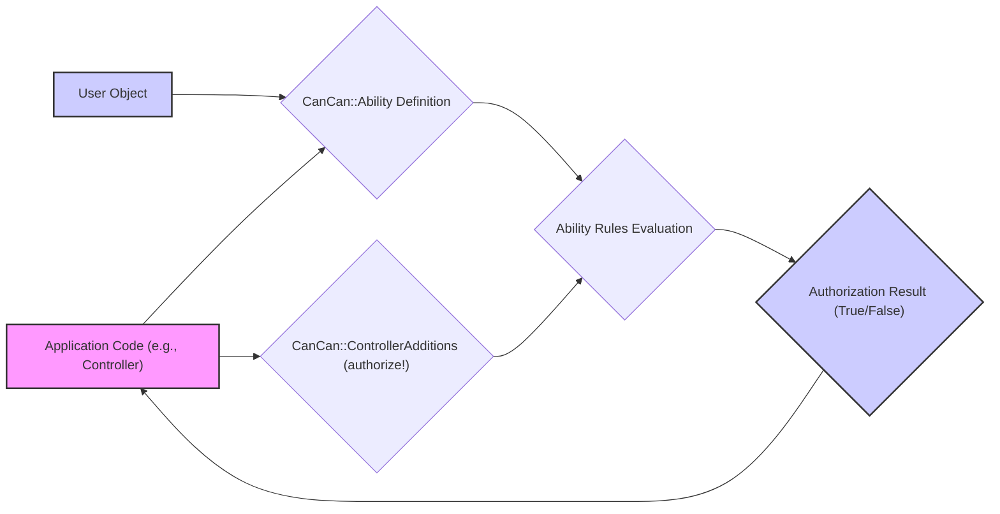

# Project Design Document: CanCan Authorization Library

**Version:** 1.1
**Date:** October 26, 2023
**Author:** AI Software Architect

## 1. Introduction

This document provides a detailed design overview of the CanCan authorization library (as found at [https://github.com/ryanb/cancan](https://github.com/ryanb/cancan)). This document is intended to serve as a foundation for subsequent threat modeling activities. It outlines the key components, data flow, and architectural considerations of CanCan.

### 1.1. Purpose

The primary purpose of this document is to provide a comprehensive architectural description of the CanCan library. This description will facilitate a thorough understanding of the system's functionality and potential security vulnerabilities, enabling effective threat modeling.

### 1.2. Scope

This document focuses specifically on the design and architecture of the CanCan library itself. It will cover:

*   Core concepts and components of CanCan.
*   The process of defining and checking abilities, including conditional logic.
*   The interaction of CanCan with the application's user model and controllers.
*   Key data structures and their relationships within the CanCan library.

This document will *not* cover:

*   Specific implementations of user authentication or role management that CanCan might integrate with (e.g., Devise, Authlogic).
*   Detailed code-level implementation specifics beyond illustrative examples.
*   Deployment configurations or infrastructure beyond general considerations for Ruby on Rails applications.

### 1.3. Goals

The goals of this design document are to:

*   Clearly articulate the architecture and functionality of CanCan.
*   Identify key components and their interactions with a focus on authorization logic.
*   Provide a solid basis for identifying potential security threats and vulnerabilities related to authorization.
*   Serve as a reference point for future development, security audits, and discussions about authorization within applications using CanCan.

## 2. System Overview

CanCan is an authorization library for Ruby on Rails applications. It provides a simple and declarative way to define and check user abilities (what actions a user is allowed to perform on which resources). The core principle is defining "abilities" within a central location, making authorization logic easier to understand and maintain.

### 2.1. Key Concepts

*   **Ability:** Represents a permission for a user to perform a specific action on a specific subject. Abilities are defined within an `Ability` class.
*   **Subject:** The resource or object that an action is being performed on (e.g., an instance of a `Post` model, or the `Post` class itself for actions like `create`).
*   **Action:** The operation being performed on the subject (e.g., `:read`, `:create`, `:update`, `:destroy`, or custom actions).
*   **User:** The entity attempting to perform an action. CanCan relies on the application to provide the current user object.
*   **Role (Conceptual):** While CanCan doesn't mandate a specific role system, abilities are often defined based on user roles or attributes managed by the application.
*   **Authorization Check:** The process of determining if a given user has the ability to perform a specific action on a specific subject, performed using methods like `can?` and `authorize!`.

### 2.2. High-Level Architecture



**Description of Flow:**

*   The "Application Code (e.g., Controller)" needs to authorize an action.
*   It interacts with "CanCan::ControllerAdditions (authorize!)" or uses the `can?` helper.
*   The `authorize!` method (or `can?`) uses the "User Object" and the "CanCan::Ability Definition" to perform "Ability Rules Evaluation".
*   The "Ability Rules Evaluation" determines the "Authorization Result".
*   The "Authorization Result" is returned to the "Application Code", which then decides whether to proceed with the action or handle the authorization failure.

## 3. Component Details

### 3.1. `Ability` Class

*   **Purpose:** The central component for defining and managing authorization rules for the application.
*   **Functionality:**
    *   Includes the `CanCan::Ability` module, providing the DSL for defining abilities.
    *   The `initialize(user)` method is where abilities are defined based on the provided `user` object.
    *   Uses the `can` method to grant abilities and the `cannot` method to restrict abilities.
    *   Supports conditional logic within ability definitions using blocks, allowing for fine-grained control based on subject attributes or other factors.
*   **Example:**
    ```ruby
    class Ability
      include CanCan::Ability

      def initialize(user)
        user ||= User.new # guest user (not logged in)

        if user.admin?
          can :manage, :all # Admins can do anything
        elsif user.editor?
          can :update, Article, published: false # Editors can update unpublished articles
          can :read, :all
        else
          can :read, Article, published: true # Regular users can read published articles
          can :create, Comment
          can :update, Comment, user_id: user.id # Users can update their own comments
        end
      end
    end
    ```
*   **Data Elements:**
    *   A collection of defined ability rules, each specifying an action, subject, and optional conditions.
    *   A reference to the current user object passed during initialization.

### 3.2. `authorize!` Method (Controller Additions)

*   **Purpose:** A convenient method included in controllers (via `CanCan::ControllerAdditions`) to enforce authorization checks and raise exceptions upon failure.
*   **Functionality:**
    *   Takes the action and the subject (optional) as arguments.
    *   Implicitly uses the current user (typically obtained from the authentication system).
    *   Instantiates the `Ability` class with the current user.
    *   Checks if the user has the specified ability on the subject using the defined rules.
    *   Raises a `CanCan::AccessDenied` exception if the authorization check fails. This exception can be rescued and handled appropriately in the application.
*   **Data Elements:**
    *   The action being authorized (e.g., `:read`, `:update`).
    *   The subject being acted upon (can be a class or an instance).

### 3.3. `can?` Method (Helper)

*   **Purpose:** A helper method available in views, controllers, and other parts of the application to check if a user has a specific ability without raising an exception.
*   **Functionality:**
    *   Takes the action and the subject (optional) as arguments.
    *   Instantiates the `Ability` class with the current user.
    *   Evaluates the ability rules to determine if the user is authorized.
    *   Returns `true` if the user has the ability, and `false` otherwise.
*   **Data Elements:**
    *   The action being checked.
    *   The subject being checked against.

### 3.4. User Object

*   **Purpose:** Represents the currently logged-in user or a guest user. This object is central to CanCan's authorization logic.
*   **Functionality:** Provides attributes and methods that CanCan uses to evaluate abilities. These attributes are defined by the application's user model.
*   **Data Elements:** User attributes relevant to authorization, such as:
    *   `id`: Unique identifier for the user.
    *   `role`:  A common attribute used to define different levels of access.
    *   Specific attributes of the user that might be used in conditional ability definitions (e.g., `is_premium`, `account_status`).

## 4. Data Flow

The following diagram illustrates the data flow during an authorization check initiated by the `authorize!` method in a controller:

```mermaid
sequenceDiagram
    participant "Application Controller" as AC
    participant "CanCan::ControllerAdditions" as CCA
    participant "Ability Instance" as AI
    participant "User Object" as UO
    participant "Ability Rules" as AR

    AC->CCA: authorize!("action", subject)
    activate CCA
    CCA->UO: Retrieve current user
    CCA->AI: Initialize Ability(UO)
    activate AI
    AI->AR: Evaluate rules for "action" on "subject"
    AR-->AI: Authorization result (true/false)
    deactivate AI
    alt Authorization successful
        CCA-->AC: Proceed with action
    else Authorization failed
        CCA-->AC: Raise CanCan::AccessDenied
    end
    deactivate CCA
```

**Description of Flow:**

1. The "Application Controller" calls `authorize!("action", subject)`.
2. "CanCan::ControllerAdditions" retrieves the current "User Object".
3. It initializes an "Ability Instance" with the "User Object".
4. The "Ability Instance" evaluates the "Ability Rules" defined in the `Ability` class for the given "action" and "subject".
5. The "Ability Rules" evaluation returns the authorization result (true or false).
6. If authorization is successful, "CanCan::ControllerAdditions" allows the controller action to proceed.
7. If authorization fails, "CanCan::ControllerAdditions" raises a `CanCan::AccessDenied` exception.

## 5. Security Considerations (Pre-Threat Modeling)

This section outlines potential areas of security concern that will be further explored during threat modeling.

*   **Insecure Ability Definitions:**
    *   **Overly Permissive Rules:** Defining rules that grant more access than intended (e.g., `can :update, Post`).
    *   **Incorrect Conditional Logic:** Flaws in the conditional blocks within ability definitions that allow unauthorized access under specific circumstances.
    *   **Mass Assignment Vulnerabilities:** If ability definitions rely on user-provided input without proper sanitization, it could lead to unintended privilege escalation.
*   **Bypass Vulnerabilities:**
    *   **Missing Authorization Checks:** Forgetting to include `authorize!` or `can?` checks in controller actions or views.
    *   **Logic Errors in Application Code:**  Flaws in the application logic that circumvent the intended authorization flow.
    *   **Inconsistent Authorization:** Applying different authorization logic in different parts of the application, leading to inconsistencies and potential bypasses.
*   **Information Disclosure:**
    *   **Leaking Existence of Resources:** Authorization checks might reveal whether a user has access to a resource, indirectly disclosing its existence even if the content is not accessible.
    *   **Revealing Attributes:** Conditional logic in ability definitions might inadvertently expose sensitive attributes of resources.
*   **Denial of Service (DoS):**
    *   **Complex Ability Logic:**  Overly complex or inefficient ability definitions that consume excessive resources during evaluation, potentially leading to performance degradation or DoS.
    *   **Excessive Authorization Checks:** Performing a large number of authorization checks in a short period, straining system resources.
*   **Dependency Vulnerabilities:**
    *   **Vulnerabilities in CanCan Library:**  Exploiting known security flaws within the CanCan gem itself.
    *   **Vulnerabilities in Dependencies:**  Security issues in gems that CanCan relies on.

## 6. Deployment Considerations

CanCan is a Ruby gem and is typically deployed as part of a Ruby on Rails application. Its security is intrinsically linked to the security practices applied to the overall application deployment.

*   **Environment Security:** The security of the underlying operating system, web server (e.g., Puma, Unicorn), and database system is paramount.
*   **Dependency Management:** Using tools like Bundler to manage dependencies and regularly updating gems, including CanCan, to patch known vulnerabilities is crucial.
*   **Configuration Management:** Securely managing application configurations and avoiding hardcoding sensitive information.
*   **Code Reviews:** Regularly reviewing the `Ability` class and controller authorization logic to identify potential security flaws.
*   **Testing:** Implementing comprehensive integration tests that specifically cover authorization scenarios to ensure that abilities are enforced as expected.

## 7. Future Considerations

*   **More Granular Permissions:** Exploring patterns for defining more fine-grained permissions beyond simple action/subject combinations, potentially using policy objects or more complex rule engines.
*   **Integration with External Authorization Services:** Considering integration with external authorization services (e.g., OAuth 2.0 providers, dedicated authorization servers) for more complex authorization requirements in distributed systems.
*   **Performance Optimization:** Continuously monitoring and optimizing the performance of ability checks, especially in applications with a large number of users, resources, and complex authorization rules. This might involve caching authorization results or optimizing database queries within ability conditions.
*   **Centralized Policy Management:** Investigating approaches for centralizing and managing authorization policies across multiple applications or services.

This document provides a more detailed and refined understanding of the CanCan authorization library's design and architecture. This enhanced information will be invaluable for conducting a thorough threat model to identify and mitigate potential security risks associated with authorization within applications using CanCan.