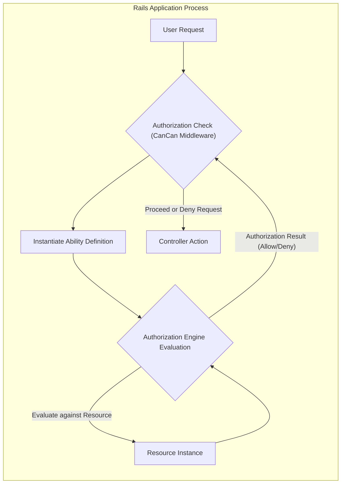

## Project Design Document: CanCan Authorization Library

**Version:** 1.1
**Date:** October 26, 2023
**Author:** AI Software Architect

### 1. Introduction

This document provides an enhanced architectural design of the CanCan authorization library for Ruby on Rails applications. This detailed design serves as a crucial foundation for thorough threat modeling, enabling the identification of potential security vulnerabilities. CanCan simplifies authorization by offering a declarative approach to define and manage access control rules within a Rails application, primarily focusing on defining user "abilities" concerning specific resources.

### 2. Goals

*   Provide a more granular and detailed breakdown of CanCan's architecture and its internal components.
*   Elaborate on the data flow during an authorization request, emphasizing potential security checkpoints.
*   Clearly identify critical interaction points within the Rails application where CanCan is involved.
*   Offer a more comprehensive list of security considerations, providing specific examples relevant to threat modeling.
*   Maintain a clear and well-structured document suitable for security reviews and threat modeling sessions.

### 3. Target Audience

This document is intended for:

*   Security engineers tasked with performing detailed threat modeling of applications using CanCan.
*   Software developers involved in the development, maintenance, or extension of CanCan or applications utilizing it.
*   Software architects responsible for the overall design and security posture of Rails applications incorporating CanCan.

### 4. System Overview

CanCan functions as an integral middleware component within a Ruby on Rails application's request lifecycle. It intercepts requests to determine if the currently authenticated user is authorized to perform a specific action on a particular resource. Authorization rules are centrally defined within an "Ability" class, promoting a consistent and maintainable approach to access control.

### 5. Architectural Design

The core principle of CanCan's architecture revolves around the concept of "abilities," which explicitly define the permitted actions a user can perform on designated resources. These abilities are often context-dependent, factoring in the user's role or specific attributes of the resource itself.

#### 5.1. Deployment Context

CanCan is tightly coupled with the Ruby on Rails application it serves. It operates within the same process and does not exist as a separate deployable unit or external service.

#### 5.2. Key Architectural Elements

*   **User (Subject):** Represents the entity attempting to perform an action within the application. This is typically an instance of a `User` model or a similar representation of an authenticated user.
*   **Ability Definition (Policy):** A dedicated Ruby class, conventionally named `Ability`, that encapsulates the application's authorization logic. This class uses CanCan's Domain Specific Language (DSL) to define rules based on users, actions, and resources.
*   **Resource (Object):** The specific entity or data the user is trying to interact with. This could be an instance of a model (e.g., `Post`, `Comment`) or a more abstract concept.
*   **Action (Verb):** The operation the user intends to perform on the resource. Standard CRUD actions (`read`, `create`, `update`, `destroy`) are common, but CanCan supports defining custom actions as well.
*   **Authorization Engine (Policy Enforcement Point):** The internal logic within CanCan that evaluates the defined abilities against the current user, the requested action, and the target resource. This engine determines whether the action is permitted.

#### 5.3. Architectural Diagram

### 6. Component Description

*   **`Ability` Class:**
    *   Serves as the central repository for defining authorization rules.
    *   Utilizes CanCan's DSL (e.g., `can :manage, :all` for admin, `can :read, Article`, `can :update, Article, user_id: user.id`).
    *   Is typically instantiated per user session or per request, ensuring up-to-date permissions.
    *   Can incorporate complex logic and conditions to determine user permissions based on various factors.

*   **`authorize!` Method (within Controllers):**
    *   A controller method provided by CanCan to enforce authorization before executing an action.
    *   Takes the intended action and the resource (or resource class) as arguments (e.g., `authorize! :update, @article`).
    *   If authorization fails, it raises a `CanCan::AccessDenied` exception, halting the request processing.

*   **`can?` and `cannot?` Methods (in Views, Controllers, and Models):**
    *   Helper methods to programmatically check if a user possesses a specific ability.
    *   Used for conditional rendering of UI elements in views (e.g., showing edit buttons only to authorized users).
    *   Can be used within controller logic for more fine-grained control or within model logic for data filtering.

*   **Model Integration (via `accessible_by`):**
    *   Provides methods to retrieve collections of resources that the current user is authorized to access.
    *   Useful for implementing index actions or displaying lists of permitted items.

*   **Configuration Options:**
    *   Allows customization of the `CanCan::AccessDenied` exception handling (e.g., redirecting to a specific error page).
    *   Provides options for integrating with different authentication systems.

### 7. Data Flow

The sequence of events during a typical authorization check in a Rails application using CanCan:

1. **User Interaction:** A user initiates an action (e.g., clicking a link, submitting a form) that generates an HTTP request to the Rails application.
2. **Request Routing:** The Rails router directs the request to the appropriate controller action.
3. **Authorization Invocation:** Within the controller action, typically at the beginning, the `authorize!` method is called, specifying the action and the resource being accessed.
4. **Ability Instantiation:** CanCan instantiates the `Ability` class, passing in the current user (obtained from the authentication system).
5. **Rule Evaluation:** The `Ability` class's defined rules are evaluated against the requested action and resource. This involves iterating through the defined `can` and `cannot` rules to find a matching rule.
6. **Authorization Decision:** The CanCan authorization engine determines whether the user is authorized based on the evaluation of the ability rules.
7. **Success Path:** If authorized, the `authorize!` method completes without raising an exception, and the controller action proceeds with its intended logic.
8. **Failure Path:** If not authorized, the `authorize!` method raises a `CanCan::AccessDenied` exception.
9. **Exception Handling:** The Rails application's exception handling mechanism catches the `CanCan::AccessDenied` exception. This typically results in rendering a 403 Forbidden error page or redirecting the user.
10. **Conditional Checks:** In views or other parts of the application, `can?` or `cannot?` methods can be used to proactively check abilities before attempting an action, influencing the UI or application flow.

### 8. Security Considerations (Detailed for Threat Modeling)

When threat modeling applications using CanCan, consider the following potential vulnerabilities:

*   **Overly Permissive Ability Definitions (Privilege Escalation):**
    *   Example: A rule like `can :manage, :all` granted to a role that should have limited access.
    *   Threat: Malicious users assigned this role could perform administrative actions they are not intended to have.

*   **Insufficiently Restrictive Ability Definitions (Authorization Bypass):**
    *   Example: Forgetting to add a condition to an `update` ability, allowing users to modify resources they shouldn't.
    *   Threat: Users could modify data belonging to other users or resources they are not authorized to change.

*   **Logic Errors in Ability Conditions (Authorization Bypass):**
    *   Example: A complex conditional rule with a logical flaw that allows unintended access.
    *   Threat: Attackers could craft requests that satisfy the flawed condition, bypassing intended restrictions.

*   **Missing Authorization Checks (Authorization Bypass):**
    *   Example: A controller action that performs sensitive operations but lacks an `authorize!` call.
    *   Threat: Any authenticated user, regardless of their intended permissions, could access and execute this action.

*   **Inconsistent Application of Authorization (Authorization Bypass, Information Disclosure):**
    *   Example: Enforcing authorization in controllers but not in background jobs or API endpoints that manipulate the same data.
    *   Threat: Users could bypass UI restrictions by interacting with the application through unprotected channels.

*   **Reliance on Client-Side `can?` Checks Alone (Authorization Bypass):**
    *   Example: Hiding edit buttons based on `can?` but not enforcing authorization in the corresponding controller action.
    *   Threat: Users could manipulate the UI or craft requests to perform actions they are not authorized for.

*   **Mass Assignment Vulnerabilities in Conjunction with Authorization (Data Integrity, Privilege Escalation):**
    *   Example: Allowing users to update attributes they shouldn't have access to through mass assignment, even if the action itself is authorized.
    *   Threat: Users could modify sensitive attributes, potentially escalating their privileges or corrupting data.

*   **Vulnerabilities in Custom Logic within Ability Definitions (Various Threats):**
    *   Example: Using external data sources or complex calculations within ability rules that contain security flaws.
    *   Threat:  Vulnerabilities in this custom logic could lead to authorization bypass, information disclosure, or other issues.

*   **Information Leakage through Error Messages (Information Disclosure):**
    *   Example: Detailed error messages from `CanCan::AccessDenied` revealing sensitive information about the system or other resources.
    *   Threat: Attackers could use these error messages to gain insights into the application's structure and potential vulnerabilities.

### 9. Assumptions

*   The application correctly authenticates users before any authorization checks are performed by CanCan.
*   The `User` model and any associated roles or permissions are managed securely and accurately reflect the intended access control policies.
*   The application's routing configuration is correctly set up, ensuring requests are directed to the intended controller actions for authorization enforcement.
*   Developers using CanCan have a good understanding of its principles and best practices for defining secure authorization rules.

### 10. Future Considerations

*   Exploring more fine-grained permission models beyond traditional role-based access control, such as attribute-based access control (ABAC).
*   Integration with external authorization services or policy engines for more complex authorization scenarios.
*   Implementing centralized management and auditing of CanCan ability definitions for improved security governance.
*   Developing tooling to automatically analyze CanCan ability definitions for potential security vulnerabilities.
*   Considering performance implications of complex ability definitions and exploring optimization strategies.

This enhanced design document provides a more in-depth understanding of the CanCan authorization library, offering valuable insights for comprehensive threat modeling and security analysis. The detailed component descriptions, data flow explanation, and expanded security considerations aim to equip security engineers and developers with the necessary information to identify and mitigate potential vulnerabilities in applications utilizing CanCan.
