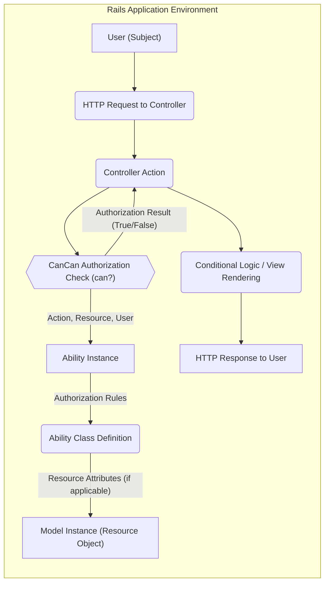
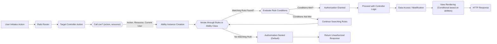

# Project Design Document: CanCan Authorization Library

**Version:** 1.1
**Date:** October 26, 2023
**Author:** Gemini (AI Language Model)

## 1. Introduction

This document provides an enhanced design overview of the CanCan authorization library for Ruby on Rails applications, specifically tailored for threat modeling. CanCan simplifies defining and checking user abilities within an application. This document details CanCan's architecture, components, and data flow with a focus on identifying potential security vulnerabilities and attack surfaces.

## 2. Goals and Objectives

The primary goal of CanCan is to provide a secure and maintainable way to manage authorization rules within a Ruby on Rails application. Key objectives include:

* **Secure Centralized Authorization Logic:** Define all authorization rules in a single, auditable location (the `Ability` class) to minimize inconsistencies and potential bypasses.
* **Flexible Access Control:** Support both role-based access control (RBAC) and attribute-based access control (ABAC) to accommodate diverse authorization needs and resource complexities.
* **Seamless Integration and Enforcement:** Integrate authorization checks directly within Rails controllers and views to ensure consistent enforcement across the application.
* **Testable and Verifiable Rules:** Provide a clear and testable DSL for defining authorization rules, enabling thorough verification and reducing the risk of errors.
* **Improved Code Readability and Maintainability:** Offer a domain-specific language (DSL) that enhances the readability and maintainability of authorization logic, reducing the likelihood of security flaws introduced through complex code.

## 3. System Architecture

CanCan operates as an integral library within a Ruby on Rails application. It doesn't require separate deployment or external services beyond the Rails framework. The following diagram illustrates the core components and their interactions during an authorization check:

**Detailed Component Descriptions:**

* **User (Subject):** The entity (human user, system process, etc.) attempting to perform an action. CanCan uses the current user object (often derived from authentication).
* **HTTP Request to Controller:** The user's action initiates an HTTP request that is routed to a specific Rails controller. This is a potential entry point for malicious requests.
* **Controller Action:** The specific method within the Rails controller responsible for handling the user's request. This is where authorization checks are typically initiated.
* **CanCan Authorization Check (`can?`):** The core function provided by CanCan. The controller calls `can?` (or `cannot?`) with the desired action (e.g., `:read`, `:update`), and the resource being accessed (either a class or an instance).
* **Ability Instance:** An instance of the `Ability` class, initialized with the current user. This object holds the defined authorization rules.
* **Ability Class Definition (`app/models/ability.rb`):** The central location where authorization rules are defined using CanCan's DSL (e.g., `can :manage, Article, user_id: user.id`). This is a critical component for security configuration.
* **Resource Attributes (if applicable):** When authorization rules are based on resource attributes (ABAC), CanCan accesses the attributes of the relevant model instance to evaluate the rule conditions.
* **Model Instance (Resource Object):** The specific data object (e.g., an instance of the `Article` model) that the user is attempting to interact with.
* **Authorization Result (True/False):** The outcome of the `can?` check, indicating whether the user is authorized to perform the action on the resource.
* **Conditional Logic / View Rendering:** Based on the authorization result, the controller executes conditional logic (e.g., allowing data modification) or the view rendering process adapts to show or hide elements.
* **HTTP Response to User:** The final response sent back to the user, which may vary depending on the authorization outcome (e.g., success, forbidden).

## 4. Data Flow

The sequence of operations during an authorization check with CanCan is as follows:

**Detailed Steps:**

1. **User Initiates Action:** A user attempts to access a resource or perform an action within the application.
2. **Rails Router:** The Rails router maps the incoming request to the appropriate controller and action.
3. **Target Controller Action:** The designated controller action begins execution.
4. **Call `can?` (action, resource):** The controller action invokes CanCan's `can?` method, passing the intended action and the resource (or resource class).
5. **Ability Instance Creation:** CanCan creates an instance of the `Ability` class, typically initialized with the current user object.
6. **Iterate through Rules in Ability Class:** The `can?` method iterates through the authorization rules defined within the `Ability` class.
7. **Matching Rule Found?:** CanCan checks if any defined rule matches the requested action and the type of resource.
8. **Evaluate Rule Conditions:** If a matching rule is found, CanCan evaluates any associated conditions (e.g., checking resource attributes).
9. **Conditions Met?:** The outcome of the condition evaluation determines if the rule applies.
10. **Authorization Granted:** If a matching rule with satisfied conditions is found, authorization is granted.
11. **Continue Searching Rules:** If the conditions are not met, CanCan continues searching for other matching rules.
12. **Authorization Denied (Default):** If no matching rule is found that grants permission, authorization is denied by default.
13. **Proceed with Controller Logic:** If authorized, the controller action proceeds with its intended operations (e.g., fetching data, updating the database).
14. **Return Unauthorized Response:** If authorization is denied, the controller typically returns an HTTP 403 (Forbidden) or 401 (Unauthorized) response.
15. **Data Access / Modification:** The controller interacts with the application's data layer based on the authorized action. This step is critical for ensuring data integrity and security.
16. **View Rendering (Conditional based on abilities):** The view rendering process may utilize CanCan's `can?` helper to dynamically display or hide UI elements based on the user's abilities, preventing unauthorized interactions through the UI.
17. **HTTP Response:** The application sends the final HTTP response back to the user.

## 5. Security Considerations

Implementing authorization correctly is crucial for application security. Here are potential security considerations related to CanCan:

**Vulnerabilities Related to Ability Definitions:**

* **Overly Permissive Rules:**
    * **Threat:** Unintentional granting of excessive privileges, allowing users to perform actions they shouldn't.
    * **Example:** `can :manage, :all` in production environments.
* **Logic Errors in Conditions:**
    * **Threat:** Flawed conditional logic leading to unintended authorization outcomes (either granting or denying access incorrectly).
    * **Example:** Incorrectly comparing user IDs or resource attributes.
* **Insecure Defaults:**
    * **Threat:** Failing to explicitly deny access, potentially allowing actions by default.
    * **Mitigation:** Ensure a "deny by default" approach in the `Ability` class.
* **Information Disclosure in Rules:**
    * **Threat:** Exposing sensitive information within the conditions of authorization rules that could be inferred by unauthorized users.
    * **Example:** Checking for the existence of specific sensitive data in a rule.

**Vulnerabilities Related to `can?` Usage:**

* **Missing Authorization Checks:**
    * **Threat:** Forgetting to implement `can?` checks in controllers or views, leading to unprotected actions.
    * **Mitigation:** Implement comprehensive authorization checks for all sensitive actions.
* **Incorrect `can?` Arguments:**
    * **Threat:** Passing incorrect action or resource arguments to `can?`, leading to bypassed authorization.
    * **Example:** Checking `can? :read, @other_resource` instead of the intended resource.
* **Bypass through Direct Database Access:**
    * **Threat:** Circumventing CanCan's checks by directly manipulating the database without going through the application logic.
    * **Mitigation:** Enforce authorization at the application level and restrict direct database access where possible.

**General Security Considerations:**

* **Mass Assignment Vulnerabilities:**
    * **Threat:** Allowing users to modify attributes they shouldn't have access to during resource creation or updates.
    * **Mitigation:** Use strong parameter filtering in conjunction with CanCan to control attribute access.
* **Performance Implications:**
    * **Threat:** Complex authorization rules with numerous conditions can impact application performance, potentially leading to denial-of-service.
    * **Mitigation:** Optimize authorization logic and consider caching strategies.
* **Dependency Vulnerabilities:**
    * **Threat:** Vulnerabilities in the `cancancan` gem itself or its dependencies.
    * **Mitigation:** Keep the gem updated to the latest secure version.
* **Error Handling and Information Disclosure:**
    * **Threat:** Revealing sensitive information in authorization error messages.
    * **Mitigation:** Provide generic error messages for authorization failures.

## 6. Deployment

CanCan is deployed as part of the Ruby on Rails application. The `cancancan` gem is added to the application's `Gemfile` and installed using `bundle install`.

Key deployment considerations for security:

* **Secure Configuration Management:** Ensure the `Ability` class is managed securely and changes are reviewed carefully.
* **Regular Audits:** Periodically review the authorization rules in the `Ability` class to identify and correct any overly permissive or incorrect rules.
* **Testing:** Implement comprehensive unit and integration tests to verify the correctness of authorization rules.

## 7. Future Considerations

Potential future enhancements or considerations for CanCan's design and security include:

* **More Granular Authorization Policies:** Exploring integration with more sophisticated policy engines for fine-grained access control.
* **Centralized Policy Management:** Investigating options for managing authorization policies outside of code, potentially through a dedicated service.
* **Enhanced Logging and Auditing:**  Improving logging capabilities for authorization decisions to facilitate security monitoring and incident response.
* **Formal Verification of Rules:** Researching techniques for formally verifying the correctness and security of authorization rules.
* **Integration with API Authorization Standards:**  Ensuring seamless integration with standards like OAuth 2.0 for API authorization.

This enhanced design document provides a more detailed and security-focused overview of the CanCan authorization library. It highlights potential vulnerabilities and areas of concern that should be considered during threat modeling and secure development practices.