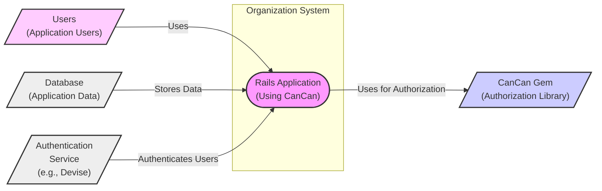

# BUSINESS POSTURE

This project, represented by the CanCan Github repository, addresses the critical business need for robust and flexible authorization in web applications built with Ruby on Rails. Authorization, the process of determining if a user is permitted to perform a specific action, is fundamental to securing applications and protecting sensitive data.

Business Priorities and Goals:
- Ensure only authorized users can access specific features and data within Rails applications.
- Implement a clear and maintainable authorization logic that is easy for developers to understand and modify.
- Reduce the risk of unauthorized data access and manipulation, protecting business-critical information.
- Support various authorization models, from simple role-based access control (RBAC) to more complex permission-based systems.
- Facilitate compliance with data privacy regulations by controlling access to personal and sensitive data.

Business Risks:
- Authorization bypass vulnerabilities could lead to unauthorized access to sensitive data, resulting in data breaches, financial loss, and reputational damage.
- Incorrectly configured or overly permissive authorization rules could expose data to unintended users.
- Complex or poorly documented authorization logic can be difficult to maintain and audit, increasing the risk of errors and security vulnerabilities.
- Performance bottlenecks in authorization checks could negatively impact application responsiveness and user experience.
- Lack of proper input validation in authorization logic could lead to injection attacks or other security exploits.

# SECURITY POSTURE

Existing Security Controls:
- security control: Ruby on Rails framework provides built-in security features, including protection against common web vulnerabilities like CSRF, SQL injection, and XSS. (Implemented by: Rails framework)
- security control: CanCan gem itself focuses on authorization logic, providing a structured way to define and enforce permissions within Rails applications. (Implemented by: CanCan gem)
- security control: Secure coding practices within the CanCan gem development, including code reviews and testing. (Implemented by: CanCan gem development process)
- accepted risk: Reliance on developers to correctly implement and integrate CanCan into their Rails applications. Misuse or misconfiguration of CanCan can lead to authorization vulnerabilities.
- accepted risk: Vulnerabilities in underlying Ruby and Rails dependencies.

Recommended Security Controls:
- security control: Implement comprehensive input validation and sanitization within the Rails application, especially in areas related to user input that influences authorization decisions.
- security control: Conduct regular security audits and penetration testing of applications using CanCan to identify and address potential authorization vulnerabilities.
- security control: Integrate static application security testing (SAST) tools into the development pipeline to automatically detect potential security flaws in the application code, including authorization logic.
- security control: Implement runtime application self-protection (RASP) or web application firewall (WAF) to detect and prevent attacks targeting authorization vulnerabilities in production environments.
- security control: Provide clear and comprehensive documentation and training for developers on secure usage of CanCan and best practices for authorization in Rails applications.

Security Requirements:
- Authentication:
    - Requirement: The Rails application must implement a robust authentication mechanism to verify user identities before authorization checks are performed.
    - Requirement: CanCan should integrate seamlessly with the application's authentication system to identify the current user for authorization purposes.
- Authorization:
    - Requirement: CanCan must provide a flexible and expressive way to define authorization rules based on user roles, permissions, and object attributes.
    - Requirement: Authorization rules should be centrally managed and easily auditable.
    - Requirement: CanCan should enforce the principle of least privilege, granting users only the necessary permissions to perform their tasks.
    - Requirement: Authorization checks should be performed consistently across the application, including controllers, views, and background jobs.
    - Requirement: CanCan should provide mechanisms to handle authorization failures gracefully, providing informative error messages to users without revealing sensitive information.
- Input Validation:
    - Requirement: All user inputs that influence authorization decisions (e.g., user roles, object IDs) must be thoroughly validated to prevent injection attacks and other security vulnerabilities.
    - Requirement: CanCan should not rely on user-provided input without proper validation.
- Cryptography:
    - Requirement: If sensitive data is used in authorization decisions or stored in relation to authorization rules, appropriate cryptographic measures (e.g., encryption at rest and in transit) should be implemented to protect confidentiality and integrity.
    - Requirement: Secure storage and handling of cryptographic keys used for encryption related to authorization.

# DESIGN

## C4 CONTEXT



Context Diagram Elements:
- Element:
    - Name: Rails Application (Using CanCan)
    - Type: Software System
    - Description: The main web application built using Ruby on Rails framework. It incorporates the CanCan gem for authorization. This application provides services and functionalities to users.
    - Responsibilities:
        - Provides application features and functionalities to users.
        - Manages user authentication and sessions (potentially delegates to Authentication Service).
        - Stores and retrieves application data from the Database.
        - Enforces authorization rules using CanCan to control user access to resources and actions.
    - Security controls:
        - security control: Rails framework security features (CSRF protection, etc.).
        - security control: Input validation and sanitization within the application code.
        - security control: Session management and authentication mechanisms.
        - security control: Authorization enforced by CanCan gem.

- Element:
    - Name: Users (Application Users)
    - Type: Person
    - Description: Individuals who interact with the Rails Application to access its features and data. Users are authenticated and authorized to perform specific actions based on their roles and permissions.
    - Responsibilities:
        - Access application features and data based on their authorized permissions.
        - Authenticate themselves to the application.
    - Security controls:
        - security control: Strong password policy enforced by the application.
        - security control: Multi-factor authentication (MFA) if implemented by the application.

- Element:
    - Name: Database (Application Data)
    - Type: Data Store
    - Description: Persistent storage for the application's data, including user information, application content, and other relevant data.
    - Responsibilities:
        - Stores application data securely and reliably.
        - Provides data access to the Rails Application.
    - Security controls:
        - security control: Database access controls (user permissions, network restrictions).
        - security control: Encryption at rest for sensitive data.
        - security control: Regular database backups.

- Element:
    - Name: Authentication Service (e.g., Devise)
    - Type: Software System
    - Description: An external or internal service responsible for handling user authentication. This could be a dedicated authentication service or a library like Devise integrated within the Rails application.
    - Responsibilities:
        - Verifies user credentials (username/password, etc.).
        - Issues authentication tokens or sessions upon successful authentication.
        - Potentially manages user accounts and password resets.
    - Security controls:
        - security control: Secure authentication protocols (e.g., OAuth 2.0, OpenID Connect).
        - security control: Secure storage of user credentials (hashed and salted passwords).
        - security control: Protection against brute-force attacks and account takeover.

- Element:
    - Name: CanCan Gem (Authorization Library)
    - Type: Software Library
    - Description: A Ruby gem that provides authorization functionality for Rails applications. It defines abilities and allows developers to check permissions within controllers and views.
    - Responsibilities:
        - Defines and manages authorization rules (abilities).
        - Provides methods to check user permissions against defined abilities.
        - Integrates with the Rails application to enforce authorization.
    - Security controls:
        - security control: Secure coding practices in gem development.
        - security control: Vulnerability scanning and patching of the gem.
        - security control: Clear documentation and examples for secure usage.

## C4 CONTAINER

```mermaid
flowchart LR
    subgraph "Rails Application\n(Using CanCan)"
        subgraph "Web Container"
            WC[/"Rails Web Application\n(Puma/Unicorn)"/]
        end
        subgraph "Application Logic Container"
            ALC[/"Rails Application Logic\n(Ruby on Rails)"/]
        end
        subgraph "Authorization Container"
            AC[/"CanCan Library\n(Ruby Gem)"/]
        end
        ALC --> AC: Uses for Authorization
        WC --> ALC: Handles Requests
    end
    U[/"Users\n(Web Browsers)"/] --> WC: HTTP Requests
    WC --> D[/"Database\n(PostgreSQL/MySQL)"/]: Database Queries
    A[/"Authentication\nService\n(e.g., Devise)"/] --> ALC: Authentication Checks

    style WC fill:#f9f,stroke:#333,stroke-width:2px
    style ALC fill:#f9f,stroke:#333,stroke-width:2px
    style AC fill:#ccf,stroke:#333,stroke-width:2px
    style U fill:#fcf,stroke:#333,stroke-width:2px
    style D fill:#eee,stroke:#333,stroke-width:2px
    style A fill:#eee,stroke:#333,stroke-width:2px
```

Container Diagram Elements:
- Element:
    - Name: Rails Web Application (Puma/Unicorn)
    - Type: Web Server Container
    - Description: The web server component of the Rails application, responsible for handling HTTP requests from users. Examples include Puma or Unicorn.
    - Responsibilities:
        - Receives and processes HTTP requests from users' web browsers.
        - Routes requests to the Rails Application Logic container.
        - Returns HTTP responses to users.
        - Manages web server security configurations (TLS, etc.).
    - Security controls:
        - security control: TLS/SSL encryption for communication.
        - security control: Web server security hardening (configuration best practices).
        - security control: Rate limiting and request filtering to prevent denial-of-service attacks.

- Element:
    - Name: Rails Application Logic (Ruby on Rails)
    - Type: Application Server Container
    - Description: The core application logic built using the Ruby on Rails framework. This container handles business logic, data processing, and interacts with the database and authorization library.
    - Responsibilities:
        - Implements application features and functionalities.
        - Handles user authentication and session management.
        - Performs authorization checks using the CanCan library.
        - Interacts with the Database to store and retrieve data.
        - Communicates with the Authentication Service for authentication.
    - Security controls:
        - security control: Input validation and sanitization within application code.
        - security control: Secure session management.
        - security control: Authorization logic implemented using CanCan.
        - security control: Protection against common web vulnerabilities (CSRF, XSS, SQL injection).

- Element:
    - Name: CanCan Library (Ruby Gem)
    - Type: Library Container
    - Description: The CanCan gem integrated into the Rails Application Logic container. It provides the authorization framework and logic for the application.
    - Responsibilities:
        - Defines and enforces authorization rules.
        - Provides APIs for checking user permissions within the application logic.
    - Security controls:
        - security control: Secure coding practices within the CanCan gem.
        - security control: Regular updates to the CanCan gem to address security vulnerabilities.

- Element:
    - Name: Database (PostgreSQL/MySQL)
    - Type: Database Container
    - Description: The database system used to store the application's persistent data. Examples include PostgreSQL or MySQL.
    - Responsibilities:
        - Stores and manages application data.
        - Provides data persistence and retrieval.
    - Security controls:
        - security control: Database access controls and user permissions.
        - security control: Network security to restrict database access.
        - security control: Encryption at rest and in transit for database connections.
        - security control: Regular database backups and disaster recovery plans.

- Element:
    - Name: Authentication Service (e.g., Devise)
    - Type: Service Container
    - Description: The authentication service responsible for verifying user identities. This could be a separate service or a library like Devise running within the application container.
    - Responsibilities:
        - Authenticates users based on provided credentials.
        - Manages user accounts and sessions.
    - Security controls:
        - security control: Secure authentication protocols.
        - security control: Secure storage of user credentials.
        - security control: Account lockout and brute-force protection mechanisms.

- Element:
    - Name: Users (Web Browsers)
    - Type: Client Container
    - Description: User's web browsers that interact with the Rails Web Application.
    - Responsibilities:
        - Send HTTP requests to the Rails Web Application.
        - Render web pages received from the application.
    - Security controls:
        - security control: Browser security features (e.g., Content Security Policy, XSS protection).
        - security control: User awareness of phishing and other web-based attacks.

## DEPLOYMENT

Deployment Architecture: Cloud Platform (e.g., Heroku, AWS)

```mermaid
flowchart LR
    subgraph "Cloud Platform (e.g., AWS, Heroku)"
        subgraph "Load Balancer"
            LB[/"Load Balancer\n(e.g., AWS ELB, Heroku Load Balancer)"/]
        end
        subgraph "Web Servers"
            WS1[/"Web Server Instance 1\n(Puma/Unicorn)"/]
            WS2[/"Web Server Instance 2\n(Puma/Unicorn)"/]
            WSN[/"Web Server Instance N\n(Puma/Unicorn)"/]
        end
        subgraph "Application Servers"
            AS1[/"Application Server Instance 1\n(Rails App Logic)"/]
            AS2[/"Application Server Instance 2\n(Rails App Logic)"/]
            ASN[/"Application Server Instance N\n(Rails App Logic)"/]
        end
        subgraph "Database Server"
            DS[/"Database Server\n(PostgreSQL/MySQL)"/]
        end
        subgraph "Authentication Service"
            AUS[/"Authentication Service\n(e.g., AWS Cognito, Auth0)"/]
        end
        LB --> WS1
        LB --> WS2
        LB --> WSN
        WS1 --> AS1
        WS2 --> AS2
        WSN --> ASN
        AS1 --> DS
        AS2 --> DS
        ASN --> DS
        AS1 --> AUS
        AS2 --> AUS
        ASN --> AUS
    end
    U[/"Users\n(Internet)"/] --> LB: HTTPS Requests

    style LB fill:#f9f,stroke:#333,stroke-width:2px
    style WS1 fill:#f9f,stroke:#333,stroke-width:2px
    style WS2 fill:#f9f,stroke:#333,stroke-width:2px
    style WSN fill:#f9f,stroke:#333,stroke-width:2px
    style AS1 fill:#f9f,stroke:#333,stroke-width:2px
    style AS2 fill:#f9f,stroke:#333,stroke-width:2px
    style ASN fill:#f9f,stroke:#333,stroke-width:2px
    style DS fill:#eee,stroke:#333,stroke-width:2px
    style AUS fill:#eee,stroke:#333,stroke-width:2px
    style U fill:#fcf,stroke:#333,stroke-width:2px
```

Deployment Diagram Elements:
- Element:
    - Name: Load Balancer (e.g., AWS ELB, Heroku Load Balancer)
    - Type: Infrastructure Component
    - Description: Distributes incoming user traffic across multiple Web Server instances to ensure high availability and scalability.
    - Responsibilities:
        - Load balancing of incoming HTTP/HTTPS requests.
        - SSL termination.
        - Health checks for Web Server instances.
    - Security controls:
        - security control: DDoS protection.
        - security control: Web application firewall (WAF) capabilities (if integrated).
        - security control: Access control lists (ACLs) to restrict access to the load balancer.

- Element:
    - Name: Web Server Instances (Puma/Unicorn)
    - Type: Compute Instance
    - Description: Multiple instances of Web Servers (e.g., Puma or Unicorn) running the Rails Web Application container.
    - Responsibilities:
        - Handle HTTP requests forwarded by the Load Balancer.
        - Serve static assets.
        - Forward requests to Application Server instances.
    - Security controls:
        - security control: Instance-level firewalls to restrict network access.
        - security control: Regular security patching of the operating system and web server software.
        - security control: Hardened operating system configurations.

- Element:
    - Name: Application Server Instances (Rails App Logic)
    - Type: Compute Instance
    - Description: Multiple instances of Application Servers running the Rails Application Logic container.
    - Responsibilities:
        - Execute the Rails application code.
        - Handle business logic and data processing.
        - Interact with the Database Server and Authentication Service.
    - Security controls:
        - security control: Instance-level firewalls.
        - security control: Regular security patching of the operating system and application runtime environment.
        - security control: Secure application configurations.

- Element:
    - Name: Database Server (PostgreSQL/MySQL)
    - Type: Database Instance
    - Description: A managed database service (e.g., AWS RDS, Heroku Postgres) or a dedicated database server instance.
    - Responsibilities:
        - Store and manage application data.
        - Provide data persistence and retrieval for Application Servers.
    - Security controls:
        - security control: Database access controls and encryption at rest.
        - security control: Network security groups to restrict database access.
        - security control: Automated backups and disaster recovery.

- Element:
    - Name: Authentication Service (e.g., AWS Cognito, Auth0)
    - Type: Managed Service
    - Description: A managed authentication service used for user authentication.
    - Responsibilities:
        - User authentication and identity management.
        - Token issuance and verification.
    - Security controls:
        - security control: Secure authentication protocols and standards.
        - security control: Compliance certifications (e.g., SOC 2, GDPR).
        - security control: Multi-factor authentication (MFA) support.

- Element:
    - Name: Users (Internet)
    - Type: External Network
    - Description: Users accessing the application from the public internet.
    - Responsibilities:
        - Initiate HTTPS requests to access the application.
    - Security controls:
        - security control: User-side security practices (strong passwords, avoiding phishing).

## BUILD

```mermaid
flowchart LR
    subgraph "Developer Workstation"
        DEV[/"Developer\nWorkstation"/]
    end
    subgraph "Version Control System\n(GitHub)"
        VCS[/"Version Control\n(Git Repository)"/]
    end
    subgraph "CI/CD Pipeline\n(GitHub Actions)"
        BC[/"Build Container\n(CI Environment)"/]
        SAST[/"SAST Scanner\n(Static Analysis)"/]
        TEST[/"Automated Tests\n(Unit, Integration)"/]
        PACKAGE[/"Package Build\n(Gem Packaging)"/]
        PUBLISH[/"Publish Artifact\n(RubyGems.org)"/]
    end
    DEV --> VCS: Code Commit
    VCS --> BC: Trigger Build
    BC --> SAST: Code Scan
    BC --> TEST: Run Tests
    BC --> PACKAGE: Create Package
    BC --> PUBLISH: Publish Gem

    style DEV fill:#fcf,stroke:#333,stroke-width:2px
    style VCS fill:#eee,stroke:#333,stroke-width:2px
    style BC fill:#f9f,stroke:#333,stroke-width:2px
    style SAST fill:#eee,stroke:#333,stroke-width:2px
    style TEST fill:#eee,stroke:#333,stroke-width:2px
    style PACKAGE fill:#eee,stroke:#333,stroke-width:2px
    style PUBLISH fill:#eee,stroke:#333,stroke-width:2px
```

Build Process Description:
The build process for the CanCan gem is typically automated using a CI/CD pipeline, such as GitHub Actions, triggered by code commits to the Git repository.

Build Process Elements:
- Element:
    - Name: Developer Workstation
    - Type: Development Environment
    - Description: Developer's local machine where code is written, tested locally, and committed to the version control system.
    - Responsibilities:
        - Code development and local testing.
        - Committing code changes to the Git repository.
    - Security controls:
        - security control: Developer workstation security best practices (OS hardening, antivirus).
        - security control: Code review process before committing code.

- Element:
    - Name: Version Control System (GitHub)
    - Type: Code Repository
    - Description: GitHub repository hosting the CanCan gem's source code.
    - Responsibilities:
        - Source code management and version control.
        - Triggering CI/CD pipeline on code changes.
    - Security controls:
        - security control: Access control to the repository (branch protection, permissions).
        - security control: Audit logging of repository activities.

- Element:
    - Name: CI/CD Pipeline (GitHub Actions)
    - Type: Automation System
    - Description: Automated pipeline for building, testing, and publishing the CanCan gem. Example: GitHub Actions workflows.
    - Responsibilities:
        - Automating the build, test, and release process.
        - Running security checks (SAST).
        - Executing automated tests.
        - Packaging the gem.
        - Publishing the gem to RubyGems.org.
    - Security controls:
        - security control: Secure CI/CD pipeline configuration (secrets management, access control).
        - security control: Static Application Security Testing (SAST) integration.
        - security control: Automated testing to verify code functionality and security.
        - security control: Code signing of published artifacts (if applicable).

- Element:
    - Name: Build Container (CI Environment)
    - Type: Execution Environment
    - Description: Containerized environment within the CI/CD pipeline where build and test steps are executed.
    - Responsibilities:
        - Providing a consistent and isolated environment for builds.
        - Executing build and test commands.
    - Security controls:
        - security control: Secure base images for build containers.
        - security control: Least privilege access for build processes.

- Element:
    - Name: SAST Scanner (Static Analysis)
    - Type: Security Tool
    - Description: Static Application Security Testing tool integrated into the CI/CD pipeline to automatically scan code for potential security vulnerabilities.
    - Responsibilities:
        - Static analysis of source code to identify security flaws.
        - Reporting potential vulnerabilities to developers.
    - Security controls:
        - security control: Regularly updated vulnerability rules and signatures.
        - security control: Configuration to scan for relevant vulnerability types.

- Element:
    - Name: Automated Tests (Unit, Integration)
    - Type: Testing Framework
    - Description: Automated tests (unit and integration tests) executed in the CI/CD pipeline to verify code functionality and catch regressions.
    - Responsibilities:
        - Verifying code correctness and functionality.
        - Detecting regressions and bugs.
    - Security controls:
        - security control: Security-focused test cases to cover authorization and other security aspects.

- Element:
    - Name: Package Build (Gem Packaging)
    - Type: Packaging Tool
    - Description: Process of packaging the Ruby code and related files into a gem package.
    - Responsibilities:
        - Creating a distributable gem package.
    - Security controls:
        - security control: Verification of package integrity.

- Element:
    - Name: Publish Artifact (RubyGems.org)
    - Type: Package Registry
    - Description: RubyGems.org, the public registry for Ruby gems, where the CanCan gem is published for consumption by developers.
    - Responsibilities:
        - Hosting and distributing the CanCan gem.
    - Security controls:
        - security control: Secure publishing process to RubyGems.org (API keys, authentication).
        - security control: RubyGems.org security measures to protect against malicious packages.

# RISK ASSESSMENT

Critical Business Processes:
- Access control to application features and data is the primary critical business process protected by CanCan. This includes:
    - Protecting sensitive user data (personal information, financial data, etc.).
    - Controlling access to administrative functionalities.
    - Ensuring data integrity by preventing unauthorized modifications.
    - Maintaining application availability by preventing unauthorized actions that could disrupt services.

Data Sensitivity:
- Data protected by CanCan varies depending on the application it is used in. It can include:
    - Highly Sensitive Data: User credentials, financial transactions, personal health information, confidential business data. Unauthorized access to this data can have severe consequences.
    - Sensitive Data: User profiles, order history, application settings. Unauthorized access can lead to privacy violations and reputational damage.
    - Public Data: Publicly accessible content, marketing materials. While less sensitive, unauthorized modification can still impact brand reputation.

The sensitivity of data depends heavily on the specific application using CanCan. However, given that CanCan is designed for authorization, it inherently deals with controlling access to potentially sensitive data. Therefore, the data being protected should be considered at least sensitive, and in many cases, highly sensitive.

# QUESTIONS & ASSUMPTIONS

Questions:
- What type of applications are intended to use CanCan? (e.g., SaaS, e-commerce, internal tools). This will help to refine the business and security posture.
- What is the expected scale and user base of applications using CanCan? This will influence scalability and performance considerations.
- Are there any specific compliance requirements (e.g., GDPR, HIPAA, PCI DSS) that applications using CanCan need to adhere to? This will impact security requirements.
- What authentication mechanisms are typically used with CanCan in target applications? (e.g., username/password, OAuth, SAML). This will affect integration considerations.
- What is the level of security expertise of developers who will be using CanCan? This will influence the need for documentation and ease of use.

Assumptions:
- BUSINESS POSTURE: The primary business goal is to build secure and reliable web applications using Ruby on Rails, where authorization is a critical component. Security and data protection are high priorities.
- SECURITY POSTURE: Applications using CanCan are expected to follow secure software development lifecycle practices. Deployment environments are assumed to be at least moderately secure, potentially cloud-based. Developers are assumed to have a basic understanding of web application security principles.
- DESIGN: The typical deployment architecture involves a cloud platform with load balancing, multiple application instances, and a managed database service. The build process is automated using a CI/CD pipeline with basic security checks.