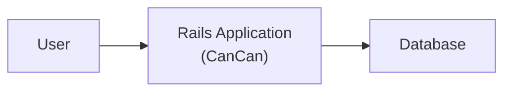
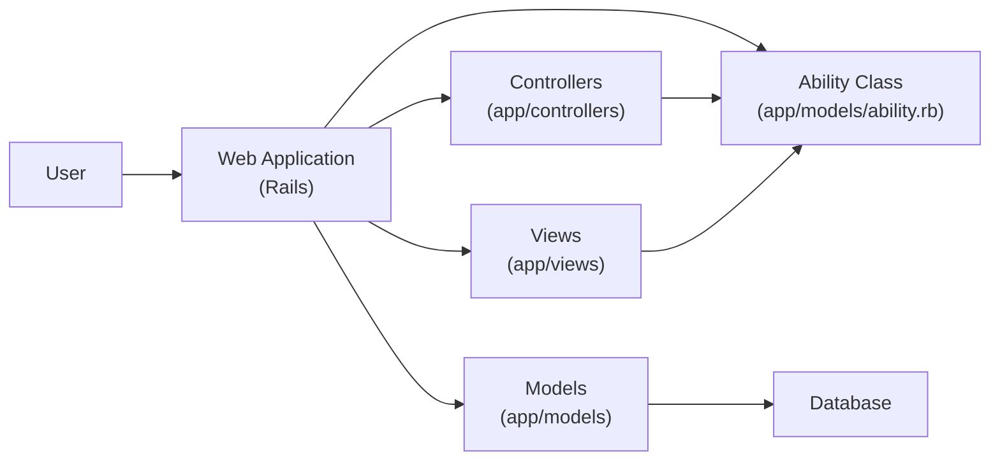
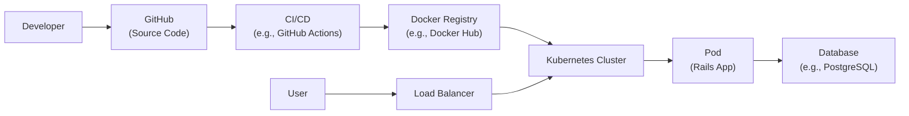
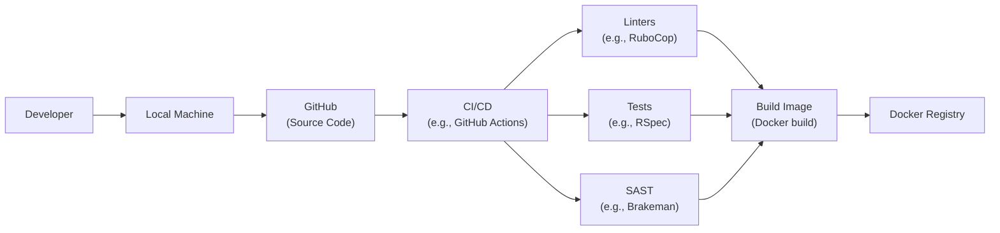

Okay, let's create a design document for the CanCan project based on the provided GitHub repository.

# BUSINESS POSTURE

CanCan is a Ruby library that simplifies authorization in Ruby on Rails applications. It allows developers to define user abilities and easily check those abilities within controllers and views.

Priorities and Goals:

-   Provide a simple and intuitive API for defining and checking user permissions.
-   Reduce code duplication related to authorization logic.
-   Improve the maintainability of Rails applications by centralizing authorization rules.
-   Enhance the security of Rails applications by providing a consistent authorization mechanism.

Business Risks:

-   Incorrectly configured permissions could lead to unauthorized access to sensitive data or functionality.
-   Overly complex permission rules could make the application difficult to understand and maintain.
-   Performance issues if permission checks are not optimized.
-   Vulnerabilities in the library itself could be exploited to bypass authorization checks.
-   Lack of proper documentation and community support could hinder adoption and troubleshooting.

# SECURITY POSTURE

Existing Security Controls:

-   security control: The core of CanCan is the `can?` and `cannot?` methods, which provide a centralized way to check user permissions. (Implemented within the library's core logic).
-   security control: Abilities are defined in a single location (typically `app/models/ability.rb`), promoting consistency and reducing the risk of scattered authorization logic. (Described in the documentation and examples).
-   security control: `load_and_authorize_resource` method in controllers automatically loads the resource and authorizes the current user based on the defined abilities. (Implemented within the library's controller extensions).
-   security control: Exception handling for unauthorized access (`CanCan::AccessDenied`). (Implemented within the library's core logic).

Accepted Risks:

-   accepted risk: Relies on the developer to correctly define and apply abilities. Incorrectly defined abilities can lead to security vulnerabilities.
-   accepted risk: Assumes that the underlying authentication mechanism is secure and correctly identifies the current user.
-   accepted risk: Does not provide built-in protection against common web vulnerabilities like XSS, CSRF, or SQL injection. These must be addressed separately.

Recommended Security Controls:

-   security control: Integrate with a static analysis tool to identify potential security issues in ability definitions.
-   security control: Implement comprehensive test coverage for all defined abilities, including edge cases and boundary conditions.
-   security control: Regularly review and update the library to address any reported security vulnerabilities.
-   security control: Provide clear and concise documentation on how to securely configure and use the library.
-   security control: Consider adding support for more granular permission checks, such as attribute-level authorization.

Security Requirements:

-   Authentication: CanCan does not handle authentication. It relies on an external authentication system (e.g., Devise) to identify the current user.
-   Authorization:
    -   The library must provide a clear and concise way to define user abilities.
    -   The library must provide a mechanism to check user abilities against specific resources and actions.
    -   The library must handle unauthorized access gracefully, typically by raising an exception.
    -   The library should support role-based access control (RBAC) and potentially attribute-based access control (ABAC).
-   Input Validation: CanCan does not directly handle input validation. Input validation should be performed separately in the application's models and controllers.
-   Cryptography: CanCan does not directly involve cryptographic operations.

# DESIGN

## C4 CONTEXT

Element Description:

-   User:
    -   Name: User
    -   Type: Person
    -   Description: A user interacting with the Rails application.
    -   Responsibilities: Accessing and interacting with the application's features.
    -   Security controls: Authentication handled by an external system (e.g., Devise).
-   Rails Application (CanCan):
    -   Name: Rails Application (CanCan)
    -   Type: Software System
    -   Description: The Ruby on Rails application using the CanCan library for authorization.
    -   Responsibilities: Handling user requests, enforcing authorization rules, and interacting with the database.
    -   Security controls: CanCan library for authorization, standard Rails security practices.
-   Database:
    -   Name: Database
    -   Type: Software System
    -   Description: The database used by the Rails application to store data.
    -   Responsibilities: Storing and retrieving application data.
    -   Security controls: Database access controls, encryption at rest (if applicable).

## C4 CONTAINER

Element Description:

-   Web Application (Rails):
    -   Name: Web Application (Rails)
    -   Type: Container
    -   Description: The main Rails application.
    -   Responsibilities: Handling user requests, routing, rendering views.
    -   Security controls: Standard Rails security practices, CanCan integration.
-   Ability Class (app/models/ability.rb):
    -   Name: Ability Class
    -   Type: Component
    -   Description: Defines user abilities and permissions.
    -   Responsibilities: Centralized authorization logic.
    -   Security controls: Code review, static analysis (recommended).
-   Controllers (app/controllers):
    -   Name: Controllers
    -   Type: Component
    -   Description: Handle user requests and interact with models and views.
    -   Responsibilities: Request processing, authorization checks using CanCan.
    -   Security controls: `load_and_authorize_resource`, `authorize!` methods.
-   Models (app/models):
    -   Name: Models
    -   Type: Component
    -   Description: Represent data and business logic.
    -   Responsibilities: Data access, validation.
    -   Security controls: Input validation, data sanitization.
-   Views (app/views):
    -   Name: Views
    -   Type: Component
    -   Description: Render user interfaces.
    -   Responsibilities: Displaying data, checking user abilities using CanCan helpers.
    -   Security controls: `can?` and `cannot?` helpers.
-   Database:
    -   Name: Database
    -   Type: Container
    -   Description: Stores application data.
    -   Responsibilities: Data persistence.
    -   Security controls: Database access controls, encryption.

## DEPLOYMENT

Possible deployment solutions:

1.  Traditional server deployment (e.g., using Capistrano to deploy to a VPS).
2.  Platform as a Service (PaaS) deployment (e.g., Heroku, AWS Elastic Beanstalk).
3.  Containerized deployment (e.g., Docker, Kubernetes).

Chosen solution: Containerized deployment using Docker and Kubernetes.

Element Description:

- Developer
    - Name: Developer
    - Type: Person
    - Description: Develops and maintains application code.
    - Responsibilities: Writing code, committing changes, managing deployments.
    - Security controls: Code review, secure coding practices.
- GitHub
    - Name: GitHub
    - Type: Software System
    - Description: Hosts the source code repository.
    - Responsibilities: Version control, code collaboration.
    - Security controls: Access controls, branch protection rules.
- CI/CD (e.g., GitHub Actions)
    - Name: CI/CD
    - Type: Software System
    - Description: Automates the build, test, and deployment process.
    - Responsibilities: Running tests, building Docker images, deploying to Kubernetes.
    - Security controls: Secure configuration, access controls.
- Docker Registry (e.g., Docker Hub)
    - Name: Docker Registry
    - Type: Software System
    - Description: Stores Docker images.
    - Responsibilities: Image storage, versioning.
    - Security controls: Access controls, image scanning.
- Kubernetes Cluster
    - Name: Kubernetes Cluster
    - Type: Infrastructure
    - Description: Orchestrates containerized applications.
    - Responsibilities: Managing deployments, scaling, networking.
    - Security controls: Network policies, RBAC, pod security policies.
- Pod (Rails App)
    - Name: Pod
    - Type: Container
    - Description: Runs the Rails application container.
    - Responsibilities: Handling user requests.
    - Security controls: CanCan authorization, Rails security practices.
- Database (e.g., PostgreSQL)
    - Name: Database
    - Type: Container/Software System
    - Description: Stores application data.
    - Responsibilities: Data persistence.
    - Security controls: Database access controls, encryption.
- User
    - Name: User
    - Type: Person
    - Description: End user of the application.
    - Responsibilities: Interacting with the application.
    - Security controls: Authentication (external to CanCan).
- Load Balancer
    - Name: Load Balancer
    - Type: Infrastructure
    - Description: Distributes traffic across multiple pods.
    - Responsibilities: Traffic management, high availability.
    - Security controls: SSL/TLS termination, DDoS protection.

## BUILD

Build Process Description:

1.  Developer commits code changes to the GitHub repository.
2.  A CI/CD pipeline (e.g., GitHub Actions) is triggered.
3.  Linters (e.g., RuboCop) are run to enforce code style and identify potential issues.
4.  Tests (e.g., RSpec) are run to ensure code functionality and prevent regressions.
5.  Static Application Security Testing (SAST) tools (e.g., Brakeman) are run to identify potential security vulnerabilities.
6.  If all checks pass, a Docker image is built.
7.  The Docker image is pushed to a Docker registry (e.g., Docker Hub).

Security Controls:

-   security control: Linters enforce code style and identify potential errors.
-   security control: Automated tests ensure code functionality and prevent regressions.
-   security control: SAST tools scan the codebase for potential security vulnerabilities.
-   security control: Docker image signing (recommended) to ensure image integrity.
-   security control: Dependency scanning (recommended) to identify vulnerable dependencies.

# RISK ASSESSMENT

Critical Business Processes:

-   User authentication and authorization.
-   Data access and manipulation.
-   Application availability and performance.

Data Sensitivity:

-   User data (depending on the application, this could range from low sensitivity to highly sensitive personal information).
-   Application data (depending on the application, this could include business-critical data).

# QUESTIONS & ASSUMPTIONS

Questions:

-   What specific types of user data will the application handle?
-   What are the regulatory compliance requirements (e.g., GDPR, CCPA)?
-   What is the expected user load and performance requirements?
-   What is the existing authentication mechanism?
-   Are there any specific security concerns or threats that have been identified?

Assumptions:

-   BUSINESS POSTURE: The organization has a moderate risk appetite.
-   SECURITY POSTURE: A secure authentication system is in place. Basic Rails security best practices are followed.
-   DESIGN: The application uses a relational database. The deployment environment is secure.