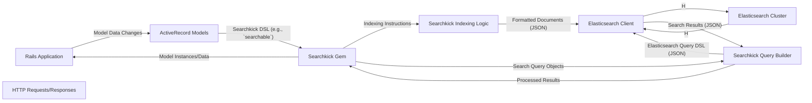

# Project Design Document: Searchkick Integration for Enhanced Search Functionality

**Version:** 1.1
**Date:** October 26, 2023
**Author:** Gemini (AI Language Model)

## 1. Introduction

This document outlines the design of a system leveraging the Searchkick gem (https://github.com/ankane/searchkick) to enhance search functionality within a Ruby on Rails application. This design will serve as the foundation for future threat modeling activities.

Searchkick provides a simple and powerful way to integrate Elasticsearch into Rails applications, enabling features like full-text search, suggestions, and more. This document details the key components, data flow, and interactions involved in using Searchkick within a typical Rails application context, with a stronger emphasis on security considerations.

## 2. Goals and Objectives

*   Provide a clear and detailed understanding of the system architecture involving Searchkick.
*   Identify key components and their interactions, including specific responsibilities.
*   Document the data flow during indexing and searching operations with more granularity.
*   Highlight potential areas of security concern with specific examples for future threat modeling.
*   Serve as a comprehensive reference point for development, security analysis, and maintenance activities.

## 3. System Architecture

The system architecture centers around a Ruby on Rails application interacting with an Elasticsearch cluster through the Searchkick gem.

### 3.1. High-Level Architecture

*   **Rails Application:** The core application responsible for user interaction, data management, and business logic. It initiates indexing and search requests.
*   **Searchkick Gem:** Acts as a middleware layer, abstracting the complexities of interacting directly with the Elasticsearch API. It provides a Ruby-friendly interface for indexing and searching.
*   **Elasticsearch Cluster:** The distributed backend responsible for storing, indexing, and searching large volumes of data. It provides the core search functionality.

### 3.2. Detailed Component Architecture

*   **Rails Application:**  Handles user requests, manages data through ActiveRecord models, and presents search results.
*   **ActiveRecord Models:**  Represent the application's data. Models marked with `searchable` are synchronized with Elasticsearch.
*   **Searchkick Gem:**  The central component facilitating interaction with Elasticsearch.
    *   **Searchkick Indexing Logic:**  Observes ActiveRecord model changes and translates them into indexing operations for Elasticsearch. This includes defining mappings (how model attributes are indexed in Elasticsearch).
    *   **Searchkick Query Builder:**  Provides a safe and convenient way to construct search queries, preventing direct exposure to raw Elasticsearch query syntax in most cases.
*   **Elasticsearch Client:**  A library (typically `elasticsearch-ruby`) used by Searchkick to communicate with the Elasticsearch cluster over HTTP(S). It handles the low-level details of sending requests and receiving responses.
*   **Elasticsearch Cluster:**  Stores and indexes the data, executes search queries, and returns matching results.
*   **HTTP Requests/Responses:** The communication channel between the Rails application (via Searchkick and the Elasticsearch client) and the Elasticsearch cluster. All data exchange happens over HTTP(S).

## 4. Data Flow

The data flow is described in two primary scenarios: indexing and searching.

### 4.1. Indexing Data

1. An event occurs within the Rails application that modifies data in an ActiveRecord model marked as `searchable` (e.g., record creation, update, or deletion).
2. Searchkick's ActiveRecord callbacks are triggered by these model lifecycle events.
3. The Searchkick indexing logic retrieves the relevant data from the modified model instance, based on the defined mappings in the model.
4. The data is transformed into a JSON document, adhering to the schema expected by the Elasticsearch index.
5. The Searchkick Elasticsearch client sends an indexing request (e.g., using the `_doc` API endpoint) over HTTP(S) to the Elasticsearch cluster. This request includes the JSON document.
6. The Elasticsearch cluster receives the indexing request, validates the document, and adds or updates it in the appropriate index.

### 4.2. Searching Data

1. The Rails application receives a search request, typically initiated by a user interaction (e.g., submitting a search form).
2. The application utilizes Searchkick's query builder to construct a search query object based on the user's input and desired search parameters.
3. The Searchkick Elasticsearch client translates the query object into the Elasticsearch Query DSL (expressed in JSON).
4. The Elasticsearch client sends a search request (using the `_search` API endpoint) over HTTP(S) to the Elasticsearch cluster, including the JSON query.
5. The Elasticsearch cluster receives the search request, executes the query against the indexed data, and identifies matching documents.
6. Elasticsearch returns a JSON response containing the search results, including matching documents, scores, and potentially aggregations or suggestions.
7. The Searchkick gem parses the JSON response from Elasticsearch.
8. Searchkick maps the results back to ActiveRecord model instances (or other specified data structures), making them easily accessible within the Rails application.
9. The Rails application processes and presents the search results to the user.

## 5. Security Considerations

This section details potential security considerations that will be crucial for future threat modeling.

*   **Data Exposure in Elasticsearch:**  Sensitive data indexed in Elasticsearch could be exposed if the cluster is not properly secured.
    *   **Access Control:** Implement robust authentication and authorization mechanisms for the Elasticsearch cluster. This includes using features like X-Pack Security (now part of the Elastic Stack) or similar security plugins to control access based on roles and permissions.
    *   **Data Masking/Anonymization:** For sensitive fields, consider masking, anonymizing, or tokenizing data before indexing it in Elasticsearch. This reduces the risk of exposing raw sensitive information.
    *   **Secure Communication (HTTPS):** Enforce HTTPS for all communication between the Rails application and the Elasticsearch cluster to protect data in transit.
*   **Elasticsearch Query Injection:**  Improperly sanitized user input used directly in raw Elasticsearch queries (if bypassing Searchkick's query builder) could lead to Elasticsearch query injection vulnerabilities, potentially allowing attackers to bypass security controls or access unauthorized data.
    *   **Input Sanitization:** Always sanitize and validate user input before incorporating it into search queries, even when using Searchkick's query builder. Be cautious with advanced query features that might allow raw input.
    *   **Principle of Least Privilege:** Ensure the Elasticsearch user or API key used by the Rails application has only the necessary permissions for indexing and searching, limiting the potential impact of a compromised connection.
*   **Unauthorized Access to Elasticsearch:**  If the Elasticsearch cluster is publicly accessible or has weak authentication, attackers could directly query or manipulate the indexed data.
    *   **Network Segmentation:** Isolate the Elasticsearch cluster within a private network segment, restricting access from the public internet.
    *   **Strong Authentication:** Enforce strong passwords or API keys for accessing the Elasticsearch cluster. Regularly rotate these credentials.
*   **Denial of Service (DoS) Attacks:**  Maliciously crafted or excessively broad search queries could overload the Elasticsearch cluster, leading to performance degradation or service disruption.
    *   **Query Complexity Limits:** Implement limits on the complexity and resource consumption of search queries.
    *   **Rate Limiting:** Implement rate limiting on search requests to prevent abuse.
    *   **Resource Monitoring:** Continuously monitor the Elasticsearch cluster's resource utilization (CPU, memory, disk I/O) to detect and respond to potential DoS attacks.
*   **Information Disclosure through Error Messages:**  Verbose error messages from Elasticsearch, if exposed to end-users or attackers, could reveal sensitive information about the data structure, index mappings, or internal workings of the system.
    *   **Error Handling:** Implement proper error handling in the Rails application to avoid exposing raw Elasticsearch error messages. Log detailed errors securely for debugging purposes.
*   **Data Integrity Issues:**  Discrepancies between the data in the primary database and the indexed data in Elasticsearch could lead to inconsistencies and incorrect search results.
    *   **Synchronization Mechanisms:** Ensure robust and reliable mechanisms for synchronizing data between the primary database and Elasticsearch. Consider using asynchronous indexing or change data capture patterns.
    *   **Monitoring and Auditing:** Implement monitoring to detect data synchronization issues and auditing to track changes to indexed data.
*   **Authentication and Authorization between Rails and Elasticsearch:** The method used to authenticate the Rails application with the Elasticsearch cluster is a critical security consideration.
    *   **API Keys:** Using dedicated API keys with restricted permissions is a recommended approach. Store these keys securely (e.g., using environment variables or a secrets management system).
    *   **Username/Password:** If using username/password authentication, ensure strong passwords and secure storage.
    *   **TLS/SSL Certificates:** Verify the TLS/SSL certificates of the Elasticsearch cluster to prevent man-in-the-middle attacks.

## 6. Deployment Considerations

*   The Rails application and Elasticsearch cluster should be deployed as separate, scalable services.
*   Secure and reliable network connectivity between the Rails application and the Elasticsearch cluster is paramount.
*   Utilize secure configuration management practices (e.g., environment variables, HashiCorp Vault) for storing Elasticsearch connection details and credentials. Avoid hardcoding sensitive information.
*   Implement comprehensive monitoring and logging for both the Rails application and the Elasticsearch cluster to track performance, identify errors, and detect security incidents.
*   Regularly back up the Elasticsearch cluster data to prevent data loss.

## 7. Technologies Used

*   **Programming Language:** Ruby
*   **Framework:** Ruby on Rails
*   **Search Engine:** Elasticsearch
*   **Search Library:** Searchkick
*   **Communication Protocol:** HTTP(S)
*   **Underlying Elasticsearch Client:**  `elasticsearch-ruby` (or a similar client library)

## 8. Future Considerations

*   Implementing more sophisticated search features such as personalized search, recommendation engines, and natural language processing.
*   Optimizing indexing and search performance for extremely large datasets and high query loads.
*   Integrating with centralized logging and security information and event management (SIEM) systems for enhanced security monitoring.
*   Exploring advanced Elasticsearch features like machine learning for anomaly detection in search patterns.

This revised design document provides a more detailed and security-focused overview of the system architecture involving Searchkick. It offers a stronger foundation for understanding the system's components, data flow, and potential security vulnerabilities, making it more suitable for comprehensive threat modeling activities.
